This document explains the flow of aggregating states and executing analyzers to compute data quality metrics. The process leverages previously computed states to efficiently measure data quality without reprocessing the entire dataset.

For instance, if the dataset has been previously analyzed and states have been saved, this flow will use those states to compute metrics such as completeness or uniqueness, ensuring efficient data quality measurement.


Here is a high level diagram of the flow, showing only the most important functions:

```mermaid
graph TD;
      subgraph srcmainscalacomamazondeequanalyzers[src/…/deequ/analyzers]
db8f3a16e1eb168b291289fc7c4d60779d4cdd5bce7eb2cddc136d1d45daea1e(runOnAggregatedStates) --> 3b4b73b181b3a3f8c0d7c66219ae6e63fe8b1a3e2b3299553f8604a6954cee33(runAnalyzersForParticularGrouping)
end

subgraph srcmainscalacomamazondeequanalyzers[src/…/deequ/analyzers]
3b4b73b181b3a3f8c0d7c66219ae6e63fe8b1a3e2b3299553f8604a6954cee33(runAnalyzersForParticularGrouping) --> 1f1c2b4c219a66cd628cf381ec2a237245ea826fdd17ff8fc151d6988e94062b(successOrFailureMetricFrom)
end

subgraph srcmainscalacomamazondeequanalyzers[src/…/deequ/analyzers]
1f1c2b4c219a66cd628cf381ec2a237245ea826fdd17ff8fc151d6988e94062b(successOrFailureMetricFrom) --> 45121cda4cf293170f79ab9e47e537de5b62406e05a3f9ba84769129370e5d3d(metricFromAggregationResult)
end


      classDef mainFlowStyle color:#000000,fill:#7CB9F4
classDef rootsStyle color:#000000,fill:#00FFF4
classDef Style1 color:#000000,fill:#00FFAA
classDef Style2 color:#000000,fill:#FFFF00
classDef Style3 color:#000000,fill:#AA7CB9

%% Swimm:
%% graph TD;
%%       subgraph srcmainscalacomamazondeequanalyzers[<SwmPath>[src/…/deequ/analyzers/](src/main/scala/com/amazon/deequ/analyzers/)</SwmPath>]
%% db8f3a16e1eb168b291289fc7c4d60779d4cdd5bce7eb2cddc136d1d45daea1e(<SwmToken path="src/main/scala/com/amazon/deequ/analyzers/runners/AnalysisRunner.scala" pos="397:3:3" line-data="    def runOnAggregatedStates(">`runOnAggregatedStates`</SwmToken>) --> 3b4b73b181b3a3f8c0d7c66219ae6e63fe8b1a3e2b3299553f8604a6954cee33(<SwmToken path="src/main/scala/com/amazon/deequ/analyzers/runners/AnalysisRunner.scala" pos="461:1:1" line-data="          runAnalyzersForParticularGrouping(state, analyzersForGrouping, saveStatesWith,">`runAnalyzersForParticularGrouping`</SwmToken>)
%% end
%% 
%% subgraph srcmainscalacomamazondeequanalyzers[<SwmPath>[src/…/deequ/analyzers/](src/main/scala/com/amazon/deequ/analyzers/)</SwmPath>]
%% 3b4b73b181b3a3f8c0d7c66219ae6e63fe8b1a3e2b3299553f8604a6954cee33(<SwmToken path="src/main/scala/com/amazon/deequ/analyzers/runners/AnalysisRunner.scala" pos="461:1:1" line-data="          runAnalyzersForParticularGrouping(state, analyzersForGrouping, saveStatesWith,">`runAnalyzersForParticularGrouping`</SwmToken>) --> 1f1c2b4c219a66cd628cf381ec2a237245ea826fdd17ff8fc151d6988e94062b(<SwmToken path="src/main/scala/com/amazon/deequ/analyzers/runners/AnalysisRunner.scala" pos="351:5:5" line-data="  private def successOrFailureMetricFrom(">`successOrFailureMetricFrom`</SwmToken>)
%% end
%% 
%% subgraph srcmainscalacomamazondeequanalyzers[<SwmPath>[src/…/deequ/analyzers/](src/main/scala/com/amazon/deequ/analyzers/)</SwmPath>]
%% 1f1c2b4c219a66cd628cf381ec2a237245ea826fdd17ff8fc151d6988e94062b(<SwmToken path="src/main/scala/com/amazon/deequ/analyzers/runners/AnalysisRunner.scala" pos="351:5:5" line-data="  private def successOrFailureMetricFrom(">`successOrFailureMetricFrom`</SwmToken>) --> 45121cda4cf293170f79ab9e47e537de5b62406e05a3f9ba84769129370e5d3d(<SwmToken path="src/main/scala/com/amazon/deequ/analyzers/runners/AnalysisRunner.scala" pos="360:3:3" line-data="      analyzer.metricFromAggregationResult(aggregationResult, offset, aggregateWith, saveStatesTo)">`metricFromAggregationResult`</SwmToken>)
%% end
%% 
%% 
%%       classDef mainFlowStyle color:#000000,fill:#7CB9F4
%% classDef rootsStyle color:#000000,fill:#00FFF4
%% classDef Style1 color:#000000,fill:#00FFAA
%% classDef Style2 color:#000000,fill:#FFFF00
%% classDef Style3 color:#000000,fill:#AA7CB9
```



# Aggregating States and Executing Analyzers


The <SwmToken path="src/main/scala/com/amazon/deequ/analyzers/runners/AnalysisRunner.scala" pos="397:3:3" line-data="    def runOnAggregatedStates(">`runOnAggregatedStates`</SwmToken> function is responsible for computing metrics from analyzers by leveraging and aggregating existing states previously computed on the data. This allows for efficient data quality measurement without reprocessing the entire dataset.

<SwmSnippet path="/src/main/scala/com/amazon/deequ/analyzers/runners/AnalysisRunner.scala" line="407">

---

First, the function checks if there are any analyzers or state loaders provided. If either is empty, it returns an empty <SwmToken path="src/main/scala/com/amazon/deequ/analyzers/runners/AnalysisRunner.scala" pos="408:3:3" line-data="      return AnalyzerContext.empty">`AnalyzerContext`</SwmToken>, ensuring that unnecessary processing is avoided.

```scala
    if (analysis.analyzers.isEmpty || stateLoaders.isEmpty) {
      return AnalyzerContext.empty
    }
```

---

</SwmSnippet>

<SwmSnippet path="/src/main/scala/com/amazon/deequ/analyzers/runners/AnalysisRunner.scala" line="414">

---

Next, the function filters out analyzers that violate their preconditions. This step ensures that only valid analyzers are processed, which helps in maintaining the integrity of the data quality measurements.

```scala
    val passedAnalyzers = analyzers
      .filter { analyzer =>
        Preconditions.findFirstFailing(schema, analyzer.preconditions).isEmpty
      }
```

---

</SwmSnippet>

<SwmSnippet path="/src/main/scala/com/amazon/deequ/analyzers/runners/AnalysisRunner.scala" line="427">

---

The function then aggregates all initial states by iterating over the passed analyzers and state loaders. This aggregation is crucial for combining previously computed states, which forms the basis for further analysis.

```scala
    passedAnalyzers.foreach { analyzer =>
      stateLoaders.foreach { stateLoader =>
        analyzer.aggregateStateTo(aggregatedStates, stateLoader, aggregatedStates)
      }
```

---

</SwmSnippet>

<SwmSnippet path="/src/main/scala/com/amazon/deequ/analyzers/runners/AnalysisRunner.scala" line="437">

---

Moving to the execution phase, the function processes non-grouped analyzers by loading their states and computing the corresponding metrics. This step directly contributes to the final data quality metrics.

```scala
    val nonGroupedResults = scanningAnalyzers
      .map { _.asInstanceOf[Analyzer[State[_], Metric[_]]] }
      .flatMap { analyzer =>
        val metrics = analyzer
          .loadStateAndComputeMetric(aggregatedStates)

        /* Store aggregated state if a 'saveStatesWith' has been provided */
        saveStatesWith.foreach { persister => analyzer.copyStateTo(aggregatedStates, persister) }

        metrics.map { metric => analyzer -> metric }
      }
```

---

</SwmSnippet>

<SwmSnippet path="/src/main/scala/com/amazon/deequ/analyzers/runners/AnalysisRunner.scala" line="451">

---

For grouped analyzers, the function identifies the necessary groupings and executes the analyzers for each grouping. This ensures that data quality measurements are accurately computed for each specific group.

```scala
    val groupedResults = if (groupingAnalyzers.isEmpty) {
      AnalyzerContext.empty
    } else {
      groupingAnalyzers
        .map { _.asInstanceOf[GroupingAnalyzer[State[_], Metric[_]]] }
        .groupBy { _.groupingColumns().sorted }
        .map { case (_, analyzersForGrouping) =>

          val state = findStateForParticularGrouping(analyzersForGrouping, aggregatedStates)

          runAnalyzersForParticularGrouping(state, analyzersForGrouping, saveStatesWith,
            storageLevelOfGroupedDataForMultiplePasses)
        }
```

---

</SwmSnippet>

<SwmSnippet path="/src/main/scala/com/amazon/deequ/analyzers/runners/AnalysisRunner.scala" line="467">

---

Finally, the function combines the results from precondition failures, non-grouped analyzers, and grouped analyzers. It then saves or appends the results if necessary, ensuring that the computed metrics are stored for future reference.

```scala
    val results = preconditionFailures ++ AnalyzerContext(nonGroupedResults) ++ groupedResults

    saveOrAppendResultsIfNecessary(results, metricsRepository, saveOrAppendResultsWithKey)

    results
```

---

</SwmSnippet>

# <SwmToken path="src/main/scala/com/amazon/deequ/analyzers/runners/AnalysisRunner.scala" pos="461:1:1" line-data="          runAnalyzersForParticularGrouping(state, analyzersForGrouping, saveStatesWith,">`runAnalyzersForParticularGrouping`</SwmToken>


<SwmSnippet path="/src/main/scala/com/amazon/deequ/analyzers/runners/AnalysisRunner.scala" line="502">

---

First, the function identifies all shareable analyzers by partitioning the analyzers into shareable and <SwmToken path="src/main/scala/com/amazon/deequ/analyzers/runners/AnalysisRunner.scala" pos="341:5:7" line-data="    /* Run non-shareable analyzers separately */">`non-shareable`</SwmToken> groups. Shareable analyzers are those that can benefit from <SwmToken path="src/main/scala/com/amazon/deequ/analyzers/runners/AnalysisRunner.scala" pos="491:5:7" line-data="    * applying scan-sharing where possible */">`scan-sharing`</SwmToken>, which optimizes the execution process by reducing redundant scans over the data.

```scala
    val (shareable, others) =
      analyzers.partition { _.isInstanceOf[ScanShareableFrequencyBasedAnalyzer] }
```

---

</SwmSnippet>

<SwmSnippet path="/src/main/scala/com/amazon/deequ/analyzers/runners/AnalysisRunner.scala" line="507">

---

Next, if there are any <SwmToken path="src/main/scala/com/amazon/deequ/analyzers/runners/AnalysisRunner.scala" pos="341:5:7" line-data="    /* Run non-shareable analyzers separately */">`non-shareable`</SwmToken> analyzers, the grouped data is potentially cached to optimize multiple passes over the data. This is controlled via the storage level parameter, ensuring efficient use of memory and disk resources.

```scala
    if (others.nonEmpty) {
      frequenciesAndNumRows.frequencies.persist(storageLevelOfGroupedDataForMultiplePasses)
    }
```

---

</SwmSnippet>

<SwmSnippet path="/src/main/scala/com/amazon/deequ/analyzers/runners/AnalysisRunner.scala" line="516">

---

Moving to the shareable analyzers, the function computes the necessary aggregation functions and offsets to correctly pick results from the aggregated data. This step ensures that each analyzer can retrieve its specific results efficiently.

```scala
        val aggregations = shareableAnalyzers.flatMap { _.aggregationFunctions(numRows) }
        /* Compute offsets so that the analyzers can correctly pick their results from the row */
        val offsets = shareableAnalyzers.scanLeft(0) { case (current, analyzer) =>
          current + analyzer.aggregationFunctions(numRows).length
        }
```

---

</SwmSnippet>

<SwmSnippet path="/src/main/scala/com/amazon/deequ/analyzers/runners/AnalysisRunner.scala" line="523">

---

Then, the function executes the aggregation on the grouped data and collects the results. This step is crucial as it performs the actual data aggregation, which is then used to compute the metrics for the analyzers.

```scala
        val results = frequenciesAndNumRows.frequencies
          .agg(aggregations.head, aggregations.tail: _*)
          .collect()
          .head
```

---

</SwmSnippet>

<SwmSnippet path="/src/main/scala/com/amazon/deequ/analyzers/runners/AnalysisRunner.scala" line="528">

---

Diving into the results, the function maps the computation results to success or failure metrics for each shareable analyzer. This mapping ensures that any exceptions encountered during the aggregation are properly handled and reflected in the metrics.

```scala
        shareableAnalyzers.zip(offsets)
          .map { case (analyzer, offset) =>
            analyzer -> successOrFailureMetricFrom(analyzer, results, offset, frequenciesAndNumRows.fullColumn)
          }
      } catch {
        case error: Exception =>
          shareableAnalyzers
            .map { analyzer => analyzer -> analyzer.toFailureMetric(error) }
      }
```

---

</SwmSnippet>

<SwmSnippet path="/src/main/scala/com/amazon/deequ/analyzers/runners/AnalysisRunner.scala" line="543">

---

Next, the function executes the remaining <SwmToken path="src/main/scala/com/amazon/deequ/analyzers/runners/AnalysisRunner.scala" pos="341:5:7" line-data="    /* Run non-shareable analyzers separately */">`non-shareable`</SwmToken> analyzers on the grouped data. This step ensures that all analyzers, regardless of their shareability, are executed and their metrics computed.

```scala
    val otherMetrics = try {
      others
        .map { _.asInstanceOf[FrequencyBasedAnalyzer] }
        .map { analyzer => analyzer ->
          analyzer.computeMetricFrom(Option(frequenciesAndNumRows))
        }
```

---

</SwmSnippet>

<SwmSnippet path="/src/main/scala/com/amazon/deequ/analyzers/runners/AnalysisRunner.scala" line="555">

---

Finally, the function potentially stores the states if a state persister is provided and unpersists the grouped data to free up resources. This step ensures that the computed states are saved for future use and that memory is efficiently managed.

```scala
    saveStatesTo.foreach { _.persist(analyzers.head, frequenciesAndNumRows) }

    frequenciesAndNumRows.frequencies.unpersist()

```

---

</SwmSnippet>

# <SwmToken path="src/main/scala/com/amazon/deequ/analyzers/runners/AnalysisRunner.scala" pos="351:5:5" line-data="  private def successOrFailureMetricFrom(">`successOrFailureMetricFrom`</SwmToken> & <SwmToken path="src/main/scala/com/amazon/deequ/analyzers/runners/AnalysisRunner.scala" pos="360:3:3" line-data="      analyzer.metricFromAggregationResult(aggregationResult, offset, aggregateWith, saveStatesTo)">`metricFromAggregationResult`</SwmToken>


<SwmSnippet path="/src/main/scala/com/amazon/deequ/analyzers/runners/AnalysisRunner.scala" line="349">

---

First, the <SwmToken path="src/main/scala/com/amazon/deequ/analyzers/runners/AnalysisRunner.scala" pos="351:5:5" line-data="  private def successOrFailureMetricFrom(">`successOrFailureMetricFrom`</SwmToken> function is responsible for computing a metric from the aggregation result. It attempts to generate the metric using the <SwmToken path="src/main/scala/com/amazon/deequ/analyzers/runners/AnalysisRunner.scala" pos="360:3:3" line-data="      analyzer.metricFromAggregationResult(aggregationResult, offset, aggregateWith, saveStatesTo)">`metricFromAggregationResult`</SwmToken> function. If an exception occurs during this process, it catches the exception and maps it to a failure metric. This ensures that any errors encountered during metric computation are gracefully handled and reported as failure metrics.

```scala
  /** Compute scan-shareable analyzer metric from aggregation result, mapping generic exceptions
    * to a failure metric */
  private def successOrFailureMetricFrom(
      analyzer: ScanShareableAnalyzer[State[_], Metric[_]],
      aggregationResult: Row,
      offset: Int,
      aggregateWith: Option[StateLoader],
      saveStatesTo: Option[StatePersister])
    : Metric[_] = {

    try {
      analyzer.metricFromAggregationResult(aggregationResult, offset, aggregateWith, saveStatesTo)
    } catch {
      case error: Exception => analyzer.toFailureMetric(error)
    }
  }
```

---

</SwmSnippet>

<SwmSnippet path="/src/main/scala/com/amazon/deequ/analyzers/Analyzer.scala" line="200">

---

Next, the <SwmToken path="src/main/scala/com/amazon/deequ/analyzers/Analyzer.scala" pos="201:8:8" line-data="  private[deequ] def metricFromAggregationResult(">`metricFromAggregationResult`</SwmToken> function produces a metric from the aggregation result. It first extracts the state from the aggregation result and then calculates the metric based on this state. This function also considers optional state loading and persisting, which allows for more flexible and efficient metric computation.

```scala
  /** Produces a metric from the aggregation result */
  private[deequ] def metricFromAggregationResult(
      result: Row,
      offset: Int,
      aggregateWith: Option[StateLoader] = None,
      saveStatesWith: Option[StatePersister] = None)
    : M = {

    val state = fromAggregationResult(result, offset)

    calculateMetric(state, aggregateWith, saveStatesWith)
  }
```

---

</SwmSnippet>

&nbsp;

*This is an auto-generated document by Swimm 🌊 and has not yet been verified by a human*

<SwmMeta version="3.0.0" repo-id="Z2l0aHViJTNBJTNBZGVlcXUlM0ElM0Fhd3NsYWJz" repo-name="deequ"><sup>Powered by [Swimm](/)</sup></SwmMeta>
