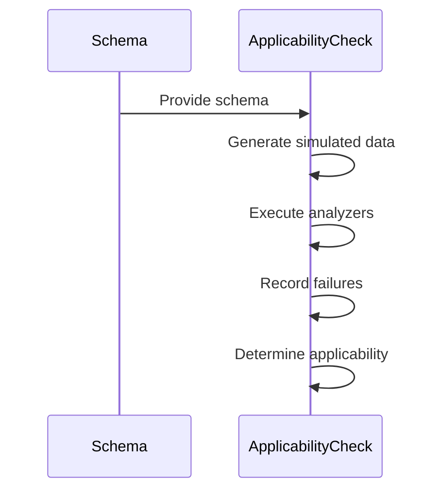
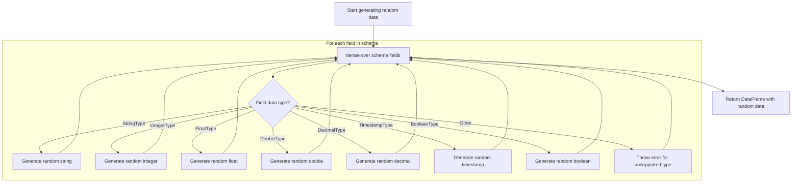
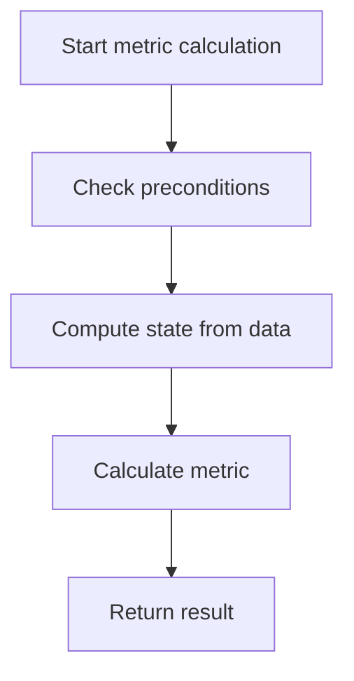

The flow of assessing analyzer applicability involves determining whether specific analyzers can be applied to a dataset based on its schema. This process is essential for ensuring that the analyzers can accurately evaluate data quality metrics. The flow begins by generating simulated data that reflects the schema's structure, followed by executing the analyzers to check for any failures during their calculations.

For instance, if the schema includes fields of type String, Integer, and Boolean, the flow will generate random data for these types and then apply the analyzers to this data to verify their applicability.



# Assessing Analyzer Applicability

<SwmSnippet path="/src/main/scala/com/amazon/deequ/analyzers/applicability/Applicability.scala" line="222" repo-id="Z2l0aHViJTNBJTNBZGVlcXUlM0ElM0Fhd3NsYWJz">

---

We start the flow by assessing the applicability of analyzers to a given schema. Next, generateRandomData is called to create a dataset that simulates real data conditions, helping test the analyzers' functionality.

```scala
  def isApplicable(
      analyzers: Seq[Analyzer[_ <: State[_], Metric[_]]],
      schema: StructType)
    : AnalyzersApplicability = {

    val data = generateRandomData(schema, 1000)

```

---

</SwmSnippet>

## Creating Simulated Data



<SwmSnippet path="/src/main/scala/com/amazon/deequ/analyzers/applicability/Applicability.scala" line="248" repo-id="Z2l0aHViJTNBJTNBZGVlcXUlM0ElM0Fhd3NsYWJz">

---

First, we iterate over the schema fields to generate random values for each data type. Next, randomString is called to generate random string values for StringType fields, ensuring the simulated data accurately reflects the schema's requirements.

```scala
  def generateRandomData(schema: StructType, numRows: Int): DataFrame = {

    val rows = (0 to numRows).map { _ =>

      val cells = schema.fields.map { field =>

        val cell: scala.Any = field.dataType match {
          case StringType => randomString(field.nullable)
```

---

</SwmSnippet>

<SwmSnippet path="/src/main/scala/com/amazon/deequ/analyzers/applicability/Applicability.scala" line="155" repo-id="Z2l0aHViJTNBJTNBZGVlcXUlM0ElM0Fhd3NsYWJz">

---

Here, random string values are generated for nullable fields using alphanumeric characters.

```scala
  def randomString(nullable: Boolean): java.lang.String = {
    if (shouldBeNull(nullable)) {
      null
    } else {
      val length = util.Random.nextInt(20) + 1
      Random.alphanumeric.take(length).mkString
    }
  }
```

---

</SwmSnippet>

<SwmSnippet path="/src/main/scala/com/amazon/deequ/analyzers/applicability/Applicability.scala" line="256" repo-id="Z2l0aHViJTNBJTNBZGVlcXUlM0ElM0Fhd3NsYWJz">

---

Back in generateRandomData, after handling string fields, we call randomDecimal for DecimalType fields to generate random decimal values, ensuring the simulated data accurately represents the schema's constraints.

```scala
          case IntegerType => randomInteger(field.nullable)
          case FloatType => randomFloat(field.nullable)
          case DoubleType => randomDouble(field.nullable)
          case ByteType => randomByte(field.nullable)
          case ShortType => randomShort(field.nullable)
          case LongType => randomLong(field.nullable)
          case decimalType: DecimalType =>
            randomDecimal(field.nullable, decimalType.precision, decimalType.scale)
```

---

</SwmSnippet>

<SwmSnippet path="/src/main/scala/com/amazon/deequ/analyzers/applicability/Applicability.scala" line="112" repo-id="Z2l0aHViJTNBJTNBZGVlcXUlM0ElM0Fhd3NsYWJz">

---

Next, random decimal values are generated for nullable fields with specified precision and scale.

```scala
  def randomDecimal(nullable: Boolean, precision: Int, scale: Int): java.math.BigDecimal = {
    if (shouldBeNull(nullable)) {
      null
    } else {

      /* Generate a string representation of the numeric value of maximal length */
      val number = new StringBuilder(precision + 1)

      /* First digit should not be zero */
      val firstDigit = Random.nextInt(NUM_DIGITS - 1) + 1
      number.append(firstDigit)

      for (_ <- 1 until precision - scale) {
        number.append(DIGITS(Random.nextInt(NUM_DIGITS)))
      }
```

---

</SwmSnippet>

<SwmSnippet path="/src/main/scala/com/amazon/deequ/analyzers/applicability/Applicability.scala" line="128" repo-id="Z2l0aHViJTNBJTNBZGVlcXUlM0ElM0Fhd3NsYWJz">

---

Next, digits are appended for the decimal part based on the scale, ensuring adherence to the specified scale.

```scala
      if (scale > 0) {
        number.append(".")

        for (_ <- 0 until scale) {
          number.append(DIGITS(Random.nextInt(NUM_DIGITS)))
        }
```

---

</SwmSnippet>

<SwmSnippet path="/src/main/scala/com/amazon/deequ/analyzers/applicability/Applicability.scala" line="136" repo-id="Z2l0aHViJTNBJTNBZGVlcXUlM0ElM0Fhd3NsYWJz">

---

Finally, a BigDecimal object is returned as the random decimal value.

```scala
      BigDecimal(number.toString()).bigDecimal
    }
  }
```

---

</SwmSnippet>

<SwmSnippet path="/src/main/scala/com/amazon/deequ/analyzers/applicability/Applicability.scala" line="264" repo-id="Z2l0aHViJTNBJTNBZGVlcXUlM0ElM0Fhd3NsYWJz">

---

Back in generateRandomData, after handling decimal fields, we call randomTimestamp for TimestampType fields to generate random timestamp values, ensuring the simulated data accurately represents the schema's constraints.

```scala
          case TimestampType => randomTimestamp(field.nullable)
          case BooleanType => randomBoolean(field.nullable)
          case _ =>
            throw new IllegalArgumentException(
              "Applicability check can only handle basic datatypes " +
                s"for columns (string, integer, float, double, decimal, boolean) " +
                s"not ${field.dataType}")
        }

        cell
      }

```

---

</SwmSnippet>

<SwmSnippet path="/src/main/scala/com/amazon/deequ/analyzers/applicability/Applicability.scala" line="140" repo-id="Z2l0aHViJTNBJTNBZGVlcXUlM0ElM0Fhd3NsYWJz">

---

Next, random timestamp values are generated for nullable fields by calculating random offsets from the current time.

```scala
  def randomTimestamp(nullable: Boolean): java.sql.Timestamp = {
    if (shouldBeNull(nullable)) {
      null
    } else {
      val Low = 100
      val High = 1500
      val Result = Random.nextInt(High - Low) + Low
      val ResultSec = Random.nextInt(High - Low) + Low
      val calendar = Calendar.getInstance()
      calendar.add(Calendar.MINUTE, - Result)
      calendar.add(Calendar.SECOND, - ResultSec)
      new Timestamp(calendar.getTimeInMillis())
    }
  }
```

---

</SwmSnippet>

<SwmSnippet path="/src/main/scala/com/amazon/deequ/analyzers/applicability/Applicability.scala" line="276" repo-id="Z2l0aHViJTNBJTNBZGVlcXUlM0ElM0Fhd3NsYWJz">

---

Finally, the generated values are assembled into a Row object, marking the end of the simulated data creation.

```scala
      Row(cells: _*)
    }

    session.createDataFrame(session.sparkContext.parallelize(rows), schema)
  }
```

---

</SwmSnippet>

## Evaluating Analyzer Results

```mermaid
flowchart TD
    node1[Start applicability check] --> subgraph loop1[For each analyzer]
        loop1 --> node2{Calculate value}
        node2 -->|Exception| node3[Record failure]
        node2 -->|No exception| node4[No failure]
    end
    loop1 --> node5{All analyzers checked}
    node5 -->|No failures| node6[Applicable]
    node5 -->|Failures present| node7[Not applicable]
```

<SwmSnippet path="/src/main/scala/com/amazon/deequ/analyzers/applicability/Applicability.scala" line="229" repo-id="Z2l0aHViJTNBJTNBZGVlcXUlM0ElM0Fhd3NsYWJz">

---

Back in isApplicable, after generating simulated data, we call calculate to execute the analyzers and gather any failures, determining their applicability based on successful execution.

```scala
    val analyzersByName = analyzers
      .map { analyzer => analyzer.toString -> analyzer }

    val failures = analyzersByName
      .flatMap { case (name, analyzer) =>
        val maybeValue = analyzer.calculate(data).value

        maybeValue match {
          // An exception occurred during analysis
          case Failure(exception: Exception) => Some(name -> exception)
          // Analysis done successfully and result metric is there
          case _ => None
        }
      }

    AnalyzersApplicability(failures.isEmpty, failures)
  }
```

---

</SwmSnippet>

# Executing Analyzer Calculations



<SwmSnippet path="/src/main/scala/com/amazon/deequ/analyzers/Analyzer.scala" line="98" repo-id="Z2l0aHViJTNBJTNBZGVlcXUlM0ElM0Fhd3NsYWJz">

---

Next, analyzer calculations are executed by performing preconditions checks and computing the state from the data. calculateMetric is called to derive the final metric from the computed state.

```scala
  def calculate(
      data: DataFrame,
      aggregateWith: Option[StateLoader] = None,
      saveStatesWith: Option[StatePersister] = None,
      filterCondition: Option[String] = None)
    : M = {

    try {
      preconditions.foreach { condition => condition(data.schema) }

      val state = computeStateFrom(data, filterCondition)

      calculateMetric(state, aggregateWith, saveStatesWith)
    } catch {
      case error: Exception => toFailureMetric(error)
    }
  }
```

---

</SwmSnippet>

# Deriving Metrics from State

<SwmSnippet path="/src/main/scala/com/amazon/deequ/analyzers/Analyzer.scala" line="118" repo-id="Z2l0aHViJTNBJTNBZGVlcXUlM0ElM0Fhd3NsYWJz">

---

Next, metrics are derived from the computed state by attempting to load any existing state and calling merge to combine states, ensuring the metric calculation considers all relevant data.

```scala
  def calculateMetric(
      state: Option[S],
      aggregateWith: Option[StateLoader] = None,
      saveStatesWith: Option[StatePersister] = None)
    : M = {

    // Try to load the state
    val loadedState: Option[S] = aggregateWith.flatMap { _.load[S](this) }

    // Potentially merge existing and loaded state
    val stateToComputeMetricFrom: Option[S] = Analyzers.merge(state, loadedState)

    // Persist the state if it is not empty and a persister was provided
```

---

</SwmSnippet>

<SwmSnippet path="/src/main/scala/com/amazon/deequ/analyzers/Analyzer.scala" line="444" repo-id="Z2l0aHViJTNBJTNBZGVlcXUlM0ElM0Fhd3NsYWJz">

---

Next, multiple states are merged by reducing the sequence and summing them where applicable.

```scala
  def merge[S <: State[_]](
      state: Option[S],
      anotherState: Option[S],
      moreStates: Option[S]*)
    : Option[S] = {

    val statesToMerge = Seq(state, anotherState) ++ moreStates

    statesToMerge.reduce { (stateA: Option[S], stateB: Option[S]) =>

      (stateA, stateB) match {
        case (Some(theStateA), Some(theStateB)) =>
          Some(theStateA.sumUntyped(theStateB).asInstanceOf[S])

        case (Some(_), None) => stateA
        case (None, Some(_)) => stateB
        case _ => None
      }
    }
  }
```

---

</SwmSnippet>

<SwmSnippet path="/src/main/scala/com/amazon/deequ/analyzers/Analyzer.scala" line="131" repo-id="Z2l0aHViJTNBJTNBZGVlcXUlM0ElM0Fhd3NsYWJz">

---

Finally, the final state is persisted if required, and the metric is computed from it, marking the completion of the metric derivation process.

```scala
    stateToComputeMetricFrom
      .foreach { state =>
        saveStatesWith.foreach {
          _.persist[S](this, state)
        }
      }

    computeMetricFrom(stateToComputeMetricFrom)
  }
```

---

</SwmSnippet>

&nbsp;

*This is an auto-generated document by Swimm 🌊 and has not yet been verified by a human*

<SwmMeta version="3.0.0"><sup>Powered by [Swimm](https://staging.swimm.cloud/)</sup></SwmMeta>
