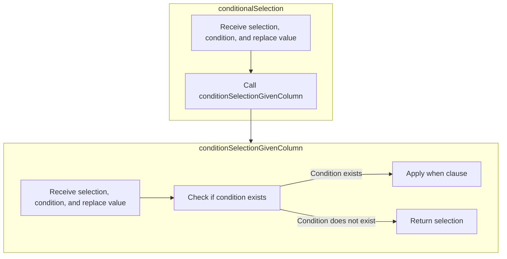

The <SwmToken path="src/main/scala/com/amazon/deequ/analyzers/Analyzer.scala" pos="98:3:3" line-data="  def calculate(">`calculate`</SwmToken> function is responsible for computing data quality metrics based on the provided data. This function ensures that the data meets necessary requirements, processes the data to derive intermediate results, and computes the final metric.

For example, if the data contains information about sales transactions, the <SwmToken path="src/main/scala/com/amazon/deequ/analyzers/Analyzer.scala" pos="98:3:3" line-data="  def calculate(">`calculate`</SwmToken> function can be used to compute metrics such as the total number of transactions or the average transaction value.


# Where is this flow used?

This flow is used multiple times in the codebase as represented in the following diagram:

(Note - these are only some of the entry points of this flow)


Here is a high level diagram of the flow, showing only the most important functions:

```mermaid
graph TD;
      subgraph srcmainscalacomamazondeequanalyzers[src/…/deequ/analyzers]
979909e10e7895e96e838a049ce95612612e46e0715b013c2ecb3e854338bf41(calculate) --> 956f0d76ac190af9e3d585854540dc2d38be134b2ba96824708738ccda662879(calculateMetric)
end

subgraph srcmainscalacomamazondeequanalyzers[src/…/deequ/analyzers]
979909e10e7895e96e838a049ce95612612e46e0715b013c2ecb3e854338bf41(calculate) --> 3a9384e8969aed85f271b1a2456ed1c62246650ed1189b08febb88dc18e2350a(computeStateFrom)
end

subgraph srcmainscalacomamazondeequanalyzers[src/…/deequ/analyzers]
979909e10e7895e96e838a049ce95612612e46e0715b013c2ecb3e854338bf41(calculate) --> 96debd75d1eccca5e15a84992ef272b386f04b32feb6abb3a0f7cf2996c2785f(toFailureMetric)
end

subgraph srcmainscalacomamazondeequanalyzers[src/…/deequ/analyzers]
956f0d76ac190af9e3d585854540dc2d38be134b2ba96824708738ccda662879(calculateMetric) --> 9b2780a430a9daf4a66e1b395ccca473341d67fd9621bc3d9a84a89b770a4185(computeMetricFrom)
end

subgraph srcmainscalacomamazondeequanalyzers[src/…/deequ/analyzers]
956f0d76ac190af9e3d585854540dc2d38be134b2ba96824708738ccda662879(calculateMetric) --> 1b4acc23ea772ea8fcc4634c44dc77c18ff0871415b8a17256b79574524838b9(merge)
end

subgraph srcmainscalacomamazondeequanalyzers[src/…/deequ/analyzers]
9b2780a430a9daf4a66e1b395ccca473341d67fd9621bc3d9a84a89b770a4185(computeMetricFrom) --> 923f4dda2869d04755a391af9baec09d30a5145b40e6a6423b54e6017b30660c(metricFromEmpty)
end

subgraph srcmainscalacomamazondeequanalyzers[src/…/deequ/analyzers]
9b2780a430a9daf4a66e1b395ccca473341d67fd9621bc3d9a84a89b770a4185(computeMetricFrom) --> 5198d07b1ed2f72a2eb0eaf12c99e97e450c77f5d7ae6b9678374fe67b845b46(metricValue)
end

subgraph srcmainscalacomamazondeequanalyzers[src/…/deequ/analyzers]
9b2780a430a9daf4a66e1b395ccca473341d67fd9621bc3d9a84a89b770a4185(computeMetricFrom) --> 818d0d42f3117ad864f0035f77ab9d89c3912051de4a8d02090bac7b88600453(metricFromValue)
end

subgraph srcmainscalacomamazondeequanalyzers[src/…/deequ/analyzers]
923f4dda2869d04755a391af9baec09d30a5145b40e6a6423b54e6017b30660c(metricFromEmpty) --> c42341de0cd8ee729caf941bbba07f37aeab202d185ceb162bd6c3dfc8d20b27(metricFromFailure)
end

subgraph srcmainscalacomamazondeequanalyzers[src/…/deequ/analyzers]
923f4dda2869d04755a391af9baec09d30a5145b40e6a6423b54e6017b30660c(metricFromEmpty) --> c609665b630ce7f923fbf96b0e97091c59cd1a34c6389e82c36190f89b458643(emptyStateException)
end

subgraph srcmainscalacomamazondeequanalyzers[src/…/deequ/analyzers]
c42341de0cd8ee729caf941bbba07f37aeab202d185ceb162bd6c3dfc8d20b27(metricFromFailure) --> 047b6f81a444b0aa97ab41bc32dd1c04c552e1af707b235c85033afe65738444(wrapIfNecessary)
end

subgraph srcmainscalacomamazondeequanalyzers[src/…/deequ/analyzers]
1b4acc23ea772ea8fcc4634c44dc77c18ff0871415b8a17256b79574524838b9(merge) --> f3a7d4fd57535c13b14c538ba4794167ae6ba6265def34b39f511039bb72a639(sumUntyped)
end

subgraph srcmainscalacomamazondeequanalyzers[src/…/deequ/analyzers]
f3a7d4fd57535c13b14c538ba4794167ae6ba6265def34b39f511039bb72a639(sumUntyped) --> f96bdeae1214370497c8eb9d4c312d40fc39a7024fa88757026e68dc647265bf(sum)
end

subgraph srcmainscalacomamazondeequanalyzers[src/…/deequ/analyzers]
3a9384e8969aed85f271b1a2456ed1c62246650ed1189b08febb88dc18e2350a(computeStateFrom) --> 8f3100f005bd7076abe437a29e95b7faadca509c3ad4d0c2c14784f3314f1032(aggregationFunctions)
end

subgraph srcmainscalacomamazondeequanalyzers[src/…/deequ/analyzers]
3a9384e8969aed85f271b1a2456ed1c62246650ed1189b08febb88dc18e2350a(computeStateFrom) --> 26a76a2a0725838d6837910b815306b3726bfbd2a68ab873597494bb6a88ae83(fromAggregationResult)
end

subgraph srcmainscalacomamazondeequanalyzers[src/…/deequ/analyzers]
8f3100f005bd7076abe437a29e95b7faadca509c3ad4d0c2c14784f3314f1032(aggregationFunctions) --> 0d0efaef27a2b857d8e066fe14367d77743376cdd4f38c2661a16e0da06956fd(count)
end

subgraph srcmainscalacomamazondeequanalyzers[src/…/deequ/analyzers]
8f3100f005bd7076abe437a29e95b7faadca509c3ad4d0c2c14784f3314f1032(aggregationFunctions) --> f28a81d73b717228828d74f02166a0a367c494bdc56c34e7abd7260fd49acf3a(conditionalSelection)
end

subgraph srcmainscalacomamazondeequanalyzers[src/…/deequ/analyzers]
0d0efaef27a2b857d8e066fe14367d77743376cdd4f38c2661a16e0da06956fd(count) --> 7e9fb0887eb1530a8dafef6579eddaab606dcf33e8a335fe9e792ce1a29eb7f7(estimateBias)
end

subgraph srcmainscalacomamazondeequanalyzers[src/…/deequ/analyzers]
7e9fb0887eb1530a8dafef6579eddaab606dcf33e8a335fe9e792ce1a29eb7f7(estimateBias) --> b6315484497f586dfc7adacb99b465902a16b7c4af6b8ef4a50a24f36991123c(distance)
end

subgraph srcmainscalacomamazondeequanalyzers[src/…/deequ/analyzers]
f28a81d73b717228828d74f02166a0a367c494bdc56c34e7abd7260fd49acf3a(conditionalSelection) --> f28a81d73b717228828d74f02166a0a367c494bdc56c34e7abd7260fd49acf3a(conditionalSelection)
end

subgraph srcmainscalacomamazondeequanalyzers[src/…/deequ/analyzers]
f28a81d73b717228828d74f02166a0a367c494bdc56c34e7abd7260fd49acf3a(conditionalSelection) --> 59e9b1fbc079548eeae3ec42621fe145863c676d93b0c6fe370754617019b52a(conditionSelectionGivenColumn)
end

subgraph srcmainscalacomamazondeequanalyzers[src/…/deequ/analyzers]
96debd75d1eccca5e15a84992ef272b386f04b32feb6abb3a0f7cf2996c2785f(toFailureMetric) --> c42341de0cd8ee729caf941bbba07f37aeab202d185ceb162bd6c3dfc8d20b27(metricFromFailure)
end


      classDef mainFlowStyle color:#000000,fill:#7CB9F4
classDef rootsStyle color:#000000,fill:#00FFF4
classDef Style1 color:#000000,fill:#00FFAA
classDef Style2 color:#000000,fill:#FFFF00
classDef Style3 color:#000000,fill:#AA7CB9

%% Swimm:
%% graph TD;
%%       subgraph srcmainscalacomamazondeequanalyzers[<SwmPath>[src/…/deequ/analyzers/](src/main/scala/com/amazon/deequ/analyzers/)</SwmPath>]
%% 979909e10e7895e96e838a049ce95612612e46e0715b013c2ecb3e854338bf41(calculate) --> 956f0d76ac190af9e3d585854540dc2d38be134b2ba96824708738ccda662879(<SwmToken path="src/main/scala/com/amazon/deequ/analyzers/Analyzer.scala" pos="110:1:1" line-data="      calculateMetric(state, aggregateWith, saveStatesWith)">`calculateMetric`</SwmToken>)
%% end
%% 
%% subgraph srcmainscalacomamazondeequanalyzers[<SwmPath>[src/…/deequ/analyzers/](src/main/scala/com/amazon/deequ/analyzers/)</SwmPath>]
%% 979909e10e7895e96e838a049ce95612612e46e0715b013c2ecb3e854338bf41(calculate) --> 3a9384e8969aed85f271b1a2456ed1c62246650ed1189b08febb88dc18e2350a(<SwmToken path="src/main/scala/com/amazon/deequ/analyzers/Analyzer.scala" pos="108:7:7" line-data="      val state = computeStateFrom(data, filterCondition)">`computeStateFrom`</SwmToken>)
%% end
%% 
%% subgraph srcmainscalacomamazondeequanalyzers[<SwmPath>[src/…/deequ/analyzers/](src/main/scala/com/amazon/deequ/analyzers/)</SwmPath>]
%% 979909e10e7895e96e838a049ce95612612e46e0715b013c2ecb3e854338bf41(calculate) --> 96debd75d1eccca5e15a84992ef272b386f04b32feb6abb3a0f7cf2996c2785f(<SwmToken path="src/main/scala/com/amazon/deequ/analyzers/Analyzer.scala" pos="112:10:10" line-data="      case error: Exception =&gt; toFailureMetric(error)">`toFailureMetric`</SwmToken>)
%% end
%% 
%% subgraph srcmainscalacomamazondeequanalyzers[<SwmPath>[src/…/deequ/analyzers/](src/main/scala/com/amazon/deequ/analyzers/)</SwmPath>]
%% 956f0d76ac190af9e3d585854540dc2d38be134b2ba96824708738ccda662879(<SwmToken path="src/main/scala/com/amazon/deequ/analyzers/Analyzer.scala" pos="110:1:1" line-data="      calculateMetric(state, aggregateWith, saveStatesWith)">`calculateMetric`</SwmToken>) --> 9b2780a430a9daf4a66e1b395ccca473341d67fd9621bc3d9a84a89b770a4185(<SwmToken path="src/main/scala/com/amazon/deequ/analyzers/Analyzer.scala" pos="138:1:1" line-data="    computeMetricFrom(stateToComputeMetricFrom)">`computeMetricFrom`</SwmToken>)
%% end
%% 
%% subgraph srcmainscalacomamazondeequanalyzers[<SwmPath>[src/…/deequ/analyzers/](src/main/scala/com/amazon/deequ/analyzers/)</SwmPath>]
%% 956f0d76ac190af9e3d585854540dc2d38be134b2ba96824708738ccda662879(<SwmToken path="src/main/scala/com/amazon/deequ/analyzers/Analyzer.scala" pos="110:1:1" line-data="      calculateMetric(state, aggregateWith, saveStatesWith)">`calculateMetric`</SwmToken>) --> 1b4acc23ea772ea8fcc4634c44dc77c18ff0871415b8a17256b79574524838b9(merge)
%% end
%% 
%% subgraph srcmainscalacomamazondeequanalyzers[<SwmPath>[src/…/deequ/analyzers/](src/main/scala/com/amazon/deequ/analyzers/)</SwmPath>]
%% 9b2780a430a9daf4a66e1b395ccca473341d67fd9621bc3d9a84a89b770a4185(<SwmToken path="src/main/scala/com/amazon/deequ/analyzers/Analyzer.scala" pos="138:1:1" line-data="    computeMetricFrom(stateToComputeMetricFrom)">`computeMetricFrom`</SwmToken>) --> 923f4dda2869d04755a391af9baec09d30a5145b40e6a6423b54e6017b30660c(<SwmToken path="src/main/scala/com/amazon/deequ/analyzers/Analyzer.scala" pos="230:1:1" line-data="        metricFromEmpty(this, name, instance, entity)">`metricFromEmpty`</SwmToken>)
%% end
%% 
%% subgraph srcmainscalacomamazondeequanalyzers[<SwmPath>[src/…/deequ/analyzers/](src/main/scala/com/amazon/deequ/analyzers/)</SwmPath>]
%% 9b2780a430a9daf4a66e1b395ccca473341d67fd9621bc3d9a84a89b770a4185(<SwmToken path="src/main/scala/com/amazon/deequ/analyzers/Analyzer.scala" pos="138:1:1" line-data="    computeMetricFrom(stateToComputeMetricFrom)">`computeMetricFrom`</SwmToken>) --> 5198d07b1ed2f72a2eb0eaf12c99e97e450c77f5d7ae6b9678374fe67b845b46(<SwmToken path="src/main/scala/com/amazon/deequ/analyzers/Analyzer.scala" pos="228:5:5" line-data="        metricFromValue(theState.metricValue(), name, instance, entity, col)">`metricValue`</SwmToken>)
%% end
%% 
%% subgraph srcmainscalacomamazondeequanalyzers[<SwmPath>[src/…/deequ/analyzers/](src/main/scala/com/amazon/deequ/analyzers/)</SwmPath>]
%% 9b2780a430a9daf4a66e1b395ccca473341d67fd9621bc3d9a84a89b770a4185(<SwmToken path="src/main/scala/com/amazon/deequ/analyzers/Analyzer.scala" pos="138:1:1" line-data="    computeMetricFrom(stateToComputeMetricFrom)">`computeMetricFrom`</SwmToken>) --> 818d0d42f3117ad864f0035f77ab9d89c3912051de4a8d02090bac7b88600453(<SwmToken path="src/main/scala/com/amazon/deequ/analyzers/Analyzer.scala" pos="228:1:1" line-data="        metricFromValue(theState.metricValue(), name, instance, entity, col)">`metricFromValue`</SwmToken>)
%% end
%% 
%% subgraph srcmainscalacomamazondeequanalyzers[<SwmPath>[src/…/deequ/analyzers/](src/main/scala/com/amazon/deequ/analyzers/)</SwmPath>]
%% 923f4dda2869d04755a391af9baec09d30a5145b40e6a6423b54e6017b30660c(<SwmToken path="src/main/scala/com/amazon/deequ/analyzers/Analyzer.scala" pos="230:1:1" line-data="        metricFromEmpty(this, name, instance, entity)">`metricFromEmpty`</SwmToken>) --> c42341de0cd8ee729caf941bbba07f37aeab202d185ceb162bd6c3dfc8d20b27(<SwmToken path="src/main/scala/com/amazon/deequ/analyzers/Analyzer.scala" pos="235:1:1" line-data="    metricFromFailure(exception, name, instance, entity)">`metricFromFailure`</SwmToken>)
%% end
%% 
%% subgraph srcmainscalacomamazondeequanalyzers[<SwmPath>[src/…/deequ/analyzers/](src/main/scala/com/amazon/deequ/analyzers/)</SwmPath>]
%% 923f4dda2869d04755a391af9baec09d30a5145b40e6a6423b54e6017b30660c(<SwmToken path="src/main/scala/com/amazon/deequ/analyzers/Analyzer.scala" pos="230:1:1" line-data="        metricFromEmpty(this, name, instance, entity)">`metricFromEmpty`</SwmToken>) --> c609665b630ce7f923fbf96b0e97091c59cd1a34c6389e82c36190f89b458643(<SwmToken path="src/main/scala/com/amazon/deequ/analyzers/Analyzer.scala" pos="572:3:3" line-data="  def emptyStateException(analyzer: Analyzer[_, _]): EmptyStateException = {">`emptyStateException`</SwmToken>)
%% end
%% 
%% subgraph srcmainscalacomamazondeequanalyzers[<SwmPath>[src/…/deequ/analyzers/](src/main/scala/com/amazon/deequ/analyzers/)</SwmPath>]
%% c42341de0cd8ee729caf941bbba07f37aeab202d185ceb162bd6c3dfc8d20b27(<SwmToken path="src/main/scala/com/amazon/deequ/analyzers/Analyzer.scala" pos="235:1:1" line-data="    metricFromFailure(exception, name, instance, entity)">`metricFromFailure`</SwmToken>) --> 047b6f81a444b0aa97ab41bc32dd1c04c552e1af707b235c85033afe65738444(<SwmToken path="src/main/scala/com/amazon/deequ/analyzers/Analyzer.scala" pos="593:3:3" line-data="      MetricCalculationException.wrapIfNecessary(exception)))">`wrapIfNecessary`</SwmToken>)
%% end
%% 
%% subgraph srcmainscalacomamazondeequanalyzers[<SwmPath>[src/…/deequ/analyzers/](src/main/scala/com/amazon/deequ/analyzers/)</SwmPath>]
%% 1b4acc23ea772ea8fcc4634c44dc77c18ff0871415b8a17256b79574524838b9(merge) --> f3a7d4fd57535c13b14c538ba4794167ae6ba6265def34b39f511039bb72a639(<SwmToken path="src/main/scala/com/amazon/deequ/analyzers/Analyzer.scala" pos="47:8:8" line-data="  private[analyzers] def sumUntyped(other: State[_]): S = {">`sumUntyped`</SwmToken>)
%% end
%% 
%% subgraph srcmainscalacomamazondeequanalyzers[<SwmPath>[src/…/deequ/analyzers/](src/main/scala/com/amazon/deequ/analyzers/)</SwmPath>]
%% f3a7d4fd57535c13b14c538ba4794167ae6ba6265def34b39f511039bb72a639(<SwmToken path="src/main/scala/com/amazon/deequ/analyzers/Analyzer.scala" pos="47:8:8" line-data="  private[analyzers] def sumUntyped(other: State[_]): S = {">`sumUntyped`</SwmToken>) --> f96bdeae1214370497c8eb9d4c312d40fc39a7024fa88757026e68dc647265bf(sum)
%% end
%% 
%% subgraph srcmainscalacomamazondeequanalyzers[<SwmPath>[src/…/deequ/analyzers/](src/main/scala/com/amazon/deequ/analyzers/)</SwmPath>]
%% 3a9384e8969aed85f271b1a2456ed1c62246650ed1189b08febb88dc18e2350a(<SwmToken path="src/main/scala/com/amazon/deequ/analyzers/Analyzer.scala" pos="108:7:7" line-data="      val state = computeStateFrom(data, filterCondition)">`computeStateFrom`</SwmToken>) --> 8f3100f005bd7076abe437a29e95b7faadca509c3ad4d0c2c14784f3314f1032(<SwmToken path="src/main/scala/com/amazon/deequ/analyzers/Analyzer.scala" pos="195:7:7" line-data="    val aggregations = aggregationFunctions()">`aggregationFunctions`</SwmToken>)
%% end
%% 
%% subgraph srcmainscalacomamazondeequanalyzers[<SwmPath>[src/…/deequ/analyzers/](src/main/scala/com/amazon/deequ/analyzers/)</SwmPath>]
%% 3a9384e8969aed85f271b1a2456ed1c62246650ed1189b08febb88dc18e2350a(<SwmToken path="src/main/scala/com/amazon/deequ/analyzers/Analyzer.scala" pos="108:7:7" line-data="      val state = computeStateFrom(data, filterCondition)">`computeStateFrom`</SwmToken>) --> 26a76a2a0725838d6837910b815306b3726bfbd2a68ab873597494bb6a88ae83(<SwmToken path="src/main/scala/com/amazon/deequ/analyzers/Analyzer.scala" pos="197:1:1" line-data="    fromAggregationResult(result, 0)">`fromAggregationResult`</SwmToken>)
%% end
%% 
%% subgraph srcmainscalacomamazondeequanalyzers[<SwmPath>[src/…/deequ/analyzers/](src/main/scala/com/amazon/deequ/analyzers/)</SwmPath>]
%% 8f3100f005bd7076abe437a29e95b7faadca509c3ad4d0c2c14784f3314f1032(<SwmToken path="src/main/scala/com/amazon/deequ/analyzers/Analyzer.scala" pos="195:7:7" line-data="    val aggregations = aggregationFunctions()">`aggregationFunctions`</SwmToken>) --> 0d0efaef27a2b857d8e066fe14367d77743376cdd4f38c2661a16e0da06956fd(count)
%% end
%% 
%% subgraph srcmainscalacomamazondeequanalyzers[<SwmPath>[src/…/deequ/analyzers/](src/main/scala/com/amazon/deequ/analyzers/)</SwmPath>]
%% 8f3100f005bd7076abe437a29e95b7faadca509c3ad4d0c2c14784f3314f1032(<SwmToken path="src/main/scala/com/amazon/deequ/analyzers/Analyzer.scala" pos="195:7:7" line-data="    val aggregations = aggregationFunctions()">`aggregationFunctions`</SwmToken>) --> f28a81d73b717228828d74f02166a0a367c494bdc56c34e7abd7260fd49acf3a(<SwmToken path="src/main/scala/com/amazon/deequ/analyzers/Analyzer.scala" pos="306:9:9" line-data="    val selection = Analyzers.conditionalSelection(predicate, where)">`conditionalSelection`</SwmToken>)
%% end
%% 
%% subgraph srcmainscalacomamazondeequanalyzers[<SwmPath>[src/…/deequ/analyzers/](src/main/scala/com/amazon/deequ/analyzers/)</SwmPath>]
%% 0d0efaef27a2b857d8e066fe14367d77743376cdd4f38c2661a16e0da06956fd(count) --> 7e9fb0887eb1530a8dafef6579eddaab606dcf33e8a335fe9e792ce1a29eb7f7(<SwmToken path="src/main/scala/com/amazon/deequ/analyzers/catalyst/StatefulHyperloglogPlus.scala" pos="241:33:33" line-data="      case e if P &lt; 19 &amp;&amp; e &lt; 5.0d * M =&gt; e - estimateBias(e)">`estimateBias`</SwmToken>)
%% end
%% 
%% subgraph srcmainscalacomamazondeequanalyzers[<SwmPath>[src/…/deequ/analyzers/](src/main/scala/com/amazon/deequ/analyzers/)</SwmPath>]
%% 7e9fb0887eb1530a8dafef6579eddaab606dcf33e8a335fe9e792ce1a29eb7f7(<SwmToken path="src/main/scala/com/amazon/deequ/analyzers/catalyst/StatefulHyperloglogPlus.scala" pos="241:33:33" line-data="      case e if P &lt; 19 &amp;&amp; e &lt; 5.0d * M =&gt; e - estimateBias(e)">`estimateBias`</SwmToken>) --> b6315484497f586dfc7adacb99b465902a16b7c4af6b8ef4a50a24f36991123c(distance)
%% end
%% 
%% subgraph srcmainscalacomamazondeequanalyzers[<SwmPath>[src/…/deequ/analyzers/](src/main/scala/com/amazon/deequ/analyzers/)</SwmPath>]
%% f28a81d73b717228828d74f02166a0a367c494bdc56c34e7abd7260fd49acf3a(<SwmToken path="src/main/scala/com/amazon/deequ/analyzers/Analyzer.scala" pos="306:9:9" line-data="    val selection = Analyzers.conditionalSelection(predicate, where)">`conditionalSelection`</SwmToken>) --> f28a81d73b717228828d74f02166a0a367c494bdc56c34e7abd7260fd49acf3a(<SwmToken path="src/main/scala/com/amazon/deequ/analyzers/Analyzer.scala" pos="306:9:9" line-data="    val selection = Analyzers.conditionalSelection(predicate, where)">`conditionalSelection`</SwmToken>)
%% end
%% 
%% subgraph srcmainscalacomamazondeequanalyzers[<SwmPath>[src/…/deequ/analyzers/](src/main/scala/com/amazon/deequ/analyzers/)</SwmPath>]
%% f28a81d73b717228828d74f02166a0a367c494bdc56c34e7abd7260fd49acf3a(<SwmToken path="src/main/scala/com/amazon/deequ/analyzers/Analyzer.scala" pos="306:9:9" line-data="    val selection = Analyzers.conditionalSelection(predicate, where)">`conditionalSelection`</SwmToken>) --> 59e9b1fbc079548eeae3ec42621fe145863c676d93b0c6fe370754617019b52a(<SwmToken path="src/main/scala/com/amazon/deequ/analyzers/Analyzer.scala" pos="490:3:3" line-data="  def conditionSelectionGivenColumn(selection: Column, condition: Option[Column], replaceWith: Double): Column = {">`conditionSelectionGivenColumn`</SwmToken>)
%% end
%% 
%% subgraph srcmainscalacomamazondeequanalyzers[<SwmPath>[src/…/deequ/analyzers/](src/main/scala/com/amazon/deequ/analyzers/)</SwmPath>]
%% 96debd75d1eccca5e15a84992ef272b386f04b32feb6abb3a0f7cf2996c2785f(<SwmToken path="src/main/scala/com/amazon/deequ/analyzers/Analyzer.scala" pos="112:10:10" line-data="      case error: Exception =&gt; toFailureMetric(error)">`toFailureMetric`</SwmToken>) --> c42341de0cd8ee729caf941bbba07f37aeab202d185ceb162bd6c3dfc8d20b27(<SwmToken path="src/main/scala/com/amazon/deequ/analyzers/Analyzer.scala" pos="235:1:1" line-data="    metricFromFailure(exception, name, instance, entity)">`metricFromFailure`</SwmToken>)
%% end
%% 
%% 
%%       classDef mainFlowStyle color:#000000,fill:#7CB9F4
%% classDef rootsStyle color:#000000,fill:#00FFF4
%% classDef Style1 color:#000000,fill:#00FFAA
%% classDef Style2 color:#000000,fill:#FFFF00
%% classDef Style3 color:#000000,fill:#AA7CB9
```

# calculate


<SwmSnippet path="/src/main/scala/com/amazon/deequ/analyzers/Analyzer.scala" line="106">

---

First, the <SwmToken path="src/main/scala/com/amazon/deequ/analyzers/Analyzer.scala" pos="98:3:3" line-data="  def calculate(">`calculate`</SwmToken> function begins by running preconditions on the data schema to ensure that the data meets the necessary requirements for analysis. This step is crucial as it validates the data before any further processing is done.

```scala
      preconditions.foreach { condition => condition(data.schema) }
```

---

</SwmSnippet>

<SwmSnippet path="/src/main/scala/com/amazon/deequ/analyzers/Analyzer.scala" line="108">

---

Next, the function computes the state from the data using the <SwmToken path="src/main/scala/com/amazon/deequ/analyzers/Analyzer.scala" pos="108:7:7" line-data="      val state = computeStateFrom(data, filterCondition)">`computeStateFrom`</SwmToken> method. This involves processing the data to derive intermediate results that will be used in the final metric calculation.

```scala
      val state = computeStateFrom(data, filterCondition)
```

---

</SwmSnippet>

<SwmSnippet path="/src/main/scala/com/amazon/deequ/analyzers/Analyzer.scala" line="110">

---

Then, the <SwmToken path="src/main/scala/com/amazon/deequ/analyzers/Analyzer.scala" pos="110:1:1" line-data="      calculateMetric(state, aggregateWith, saveStatesWith)">`calculateMetric`</SwmToken> method is called to compute the final metric based on the state and any previous states if provided. This step aggregates the results and produces the final metric that reflects the data quality.

```scala
      calculateMetric(state, aggregateWith, saveStatesWith)
```

---

</SwmSnippet>

<SwmSnippet path="/src/main/scala/com/amazon/deequ/analyzers/Analyzer.scala" line="112">

---

Finally, if any exception occurs during the process, the function catches the exception and converts it into a failure metric using the <SwmToken path="src/main/scala/com/amazon/deequ/analyzers/Analyzer.scala" pos="112:10:10" line-data="      case error: Exception =&gt; toFailureMetric(error)">`toFailureMetric`</SwmToken> method. This ensures that any errors are gracefully handled and reported as part of the metric.

```scala
      case error: Exception => toFailureMetric(error)
    }
```

---

</SwmSnippet>

# <SwmToken path="src/main/scala/com/amazon/deequ/analyzers/Analyzer.scala" pos="110:1:1" line-data="      calculateMetric(state, aggregateWith, saveStatesWith)">`calculateMetric`</SwmToken>


<SwmSnippet path="/src/main/scala/com/amazon/deequ/analyzers/Analyzer.scala" line="124">

---

First, the function attempts to load a state if an <SwmToken path="src/main/scala/com/amazon/deequ/analyzers/Analyzer.scala" pos="125:13:13" line-data="    val loadedState: Option[S] = aggregateWith.flatMap { _.load[S](this) }">`aggregateWith`</SwmToken> option is provided. This is done to potentially merge the existing state with a previously saved state, ensuring that the metric calculation considers all relevant data.

```scala
    // Try to load the state
    val loadedState: Option[S] = aggregateWith.flatMap { _.load[S](this) }
```

---

</SwmSnippet>

<SwmSnippet path="/src/main/scala/com/amazon/deequ/analyzers/Analyzer.scala" line="128">

---

Next, the function merges the existing state with the loaded state using the <SwmToken path="src/main/scala/com/amazon/deequ/analyzers/Analyzer.scala" pos="128:15:15" line-data="    val stateToComputeMetricFrom: Option[S] = Analyzers.merge(state, loadedState)">`merge`</SwmToken> function. This step is crucial as it combines the data from different states, providing a comprehensive view for metric calculation.

```scala
    val stateToComputeMetricFrom: Option[S] = Analyzers.merge(state, loadedState)
```

---

</SwmSnippet>

<SwmSnippet path="/src/main/scala/com/amazon/deequ/analyzers/Analyzer.scala" line="131">

---

Then, if the merged state is not empty and a <SwmToken path="src/main/scala/com/amazon/deequ/analyzers/Analyzer.scala" pos="133:1:1" line-data="        saveStatesWith.foreach {">`saveStatesWith`</SwmToken> option is provided, the function persists the state. This ensures that the state can be reused in future calculations, improving efficiency and consistency.

```scala
    stateToComputeMetricFrom
      .foreach { state =>
        saveStatesWith.foreach {
          _.persist[S](this, state)
        }
```

---

</SwmSnippet>

<SwmSnippet path="/src/main/scala/com/amazon/deequ/analyzers/Analyzer.scala" line="138">

---

Finally, the function computes the metric from the merged state using the <SwmToken path="src/main/scala/com/amazon/deequ/analyzers/Analyzer.scala" pos="138:1:1" line-data="    computeMetricFrom(stateToComputeMetricFrom)">`computeMetricFrom`</SwmToken> function. This step produces the final metric that reflects the quality of the data based on the combined state.

```scala
    computeMetricFrom(stateToComputeMetricFrom)
```

---

</SwmSnippet>

# <SwmToken path="src/main/scala/com/amazon/deequ/analyzers/Analyzer.scala" pos="138:1:1" line-data="    computeMetricFrom(stateToComputeMetricFrom)">`computeMetricFrom`</SwmToken> & <SwmToken path="src/main/scala/com/amazon/deequ/analyzers/Analyzer.scala" pos="228:5:5" line-data="        metricFromValue(theState.metricValue(), name, instance, entity, col)">`metricValue`</SwmToken> & <SwmToken path="src/main/scala/com/amazon/deequ/analyzers/Analyzer.scala" pos="228:1:1" line-data="        metricFromValue(theState.metricValue(), name, instance, entity, col)">`metricFromValue`</SwmToken>


<SwmSnippet path="/src/main/scala/com/amazon/deequ/analyzers/Analyzer.scala" line="221">

---

First, the <SwmToken path="src/main/scala/com/amazon/deequ/analyzers/Analyzer.scala" pos="221:5:5" line-data="  override def computeMetricFrom(state: Option[S]): DoubleMetric = {">`computeMetricFrom`</SwmToken> function is responsible for determining how to compute the metric based on the provided state. It checks if the state is defined and, if so, proceeds to compute the metric value using the <SwmToken path="src/main/scala/com/amazon/deequ/analyzers/Analyzer.scala" pos="228:5:5" line-data="        metricFromValue(theState.metricValue(), name, instance, entity, col)">`metricValue`</SwmToken> function. If the state is not defined, it calls the <SwmToken path="src/main/scala/com/amazon/deequ/analyzers/Analyzer.scala" pos="230:1:1" line-data="        metricFromEmpty(this, name, instance, entity)">`metricFromEmpty`</SwmToken> function to handle the case where no state is available.

```scala
  override def computeMetricFrom(state: Option[S]): DoubleMetric = {
    state match {
      case Some(theState) =>
        val col = theState match {
          case withColumn: FullColumn => withColumn.fullColumn
          case _ => None
        }
        metricFromValue(theState.metricValue(), name, instance, entity, col)
      case _ =>
        metricFromEmpty(this, name, instance, entity)
    }
  }
```

---

</SwmSnippet>

<SwmSnippet path="/src/main/scala/com/amazon/deequ/analyzers/Analyzer.scala" line="256">

---

Next, the <SwmToken path="src/main/scala/com/amazon/deequ/analyzers/Analyzer.scala" pos="256:5:5" line-data="  override def metricValue(): Double = {">`metricValue`</SwmToken> function calculates the metric value based on the count and number of matches. If the count is zero, it returns <SwmToken path="src/main/scala/com/amazon/deequ/analyzers/Analyzer.scala" pos="258:1:3" line-data="      Double.NaN">`Double.NaN`</SwmToken> to indicate that the metric cannot be computed. Otherwise, it returns the ratio of matches to the count, providing a meaningful metric value.

```scala
  override def metricValue(): Double = {
    if (count == 0L) {
      Double.NaN
    } else {
      numMatches.toDouble / count
    }
  }
```

---

</SwmSnippet>

<SwmSnippet path="/src/main/scala/com/amazon/deequ/analyzers/Analyzer.scala" line="561">

---

Then, the <SwmToken path="src/main/scala/com/amazon/deequ/analyzers/Analyzer.scala" pos="561:3:3" line-data="  def metricFromValue(">`metricFromValue`</SwmToken> function creates a <SwmToken path="src/main/scala/com/amazon/deequ/analyzers/Analyzer.scala" pos="567:3:3" line-data="    : DoubleMetric = {">`DoubleMetric`</SwmToken> object using the computed value, along with additional metadata such as the name, instance, and entity. This function ensures that the metric is properly encapsulated and ready for further processing or reporting.

```scala
  def metricFromValue(
      value: Double,
      name: String,
      instance: String,
      entity: Entity.Value = Entity.Column,
      fullColumn: Option[Column] = None)
    : DoubleMetric = {

    DoubleMetric(entity, name, instance, Success(value), fullColumn)
  }
```

---

</SwmSnippet>

# Handling empty state scenarios


First, the <SwmToken path="src/main/scala/com/amazon/deequ/analyzers/Analyzer.scala" pos="230:1:1" line-data="        metricFromEmpty(this, name, instance, entity)">`metricFromEmpty`</SwmToken> function is responsible for creating a metric when the data state is empty. This is crucial for ensuring that the system can gracefully handle cases where no data is available, preventing potential errors or crashes.

<SwmSnippet path="/src/main/scala/com/amazon/deequ/analyzers/Analyzer.scala" line="572">

---

Moving to the <SwmToken path="src/main/scala/com/amazon/deequ/analyzers/Analyzer.scala" pos="572:3:3" line-data="  def emptyStateException(analyzer: Analyzer[_, _]): EmptyStateException = {">`emptyStateException`</SwmToken> function, it generates a specific exception indicating that the state is empty. This exception includes a message that all input values were NULL, providing clear feedback for debugging and logging purposes.

```scala
  def emptyStateException(analyzer: Analyzer[_, _]): EmptyStateException = {
    new EmptyStateException(s"Empty state for analyzer $analyzer, all input values were NULL.")
  }
```

---

</SwmSnippet>

<SwmSnippet path="/src/main/scala/com/amazon/deequ/analyzers/Analyzer.scala" line="576">

---

Next, the <SwmToken path="src/main/scala/com/amazon/deequ/analyzers/Analyzer.scala" pos="576:3:3" line-data="  def metricFromEmpty(">`metricFromEmpty`</SwmToken> function utilizes the <SwmToken path="src/main/scala/com/amazon/deequ/analyzers/Analyzer.scala" pos="582:3:3" line-data="    metricFromFailure(emptyStateException(analyzer), name, instance, entity)">`emptyStateException`</SwmToken> to create a failure metric. This metric is then used to represent the empty state scenario in the system, ensuring that the data quality checks can proceed without interruption.

```scala
  def metricFromEmpty(
      analyzer: Analyzer[_, _],
      name: String,
      instance: String,
      entity: Entity.Value = Entity.Column)
    : DoubleMetric = {
    metricFromFailure(emptyStateException(analyzer), name, instance, entity)
  }
```

---

</SwmSnippet>

# <SwmToken path="src/main/scala/com/amazon/deequ/analyzers/Analyzer.scala" pos="235:1:1" line-data="    metricFromFailure(exception, name, instance, entity)">`metricFromFailure`</SwmToken> & <SwmToken path="src/main/scala/com/amazon/deequ/analyzers/Analyzer.scala" pos="593:3:3" line-data="      MetricCalculationException.wrapIfNecessary(exception)))">`wrapIfNecessary`</SwmToken>


<SwmSnippet path="/src/main/scala/com/amazon/deequ/analyzers/Analyzer.scala" line="585">

---

First, the <SwmToken path="src/main/scala/com/amazon/deequ/analyzers/Analyzer.scala" pos="585:3:3" line-data="  def metricFromFailure(">`metricFromFailure`</SwmToken> function is responsible for creating a <SwmToken path="src/main/scala/com/amazon/deequ/analyzers/Analyzer.scala" pos="590:3:3" line-data="    : DoubleMetric = {">`DoubleMetric`</SwmToken> object when a metric calculation fails. This function takes an exception, the name of the metric, the instance, and the entity as parameters. It then wraps the exception using the <SwmToken path="src/main/scala/com/amazon/deequ/analyzers/Analyzer.scala" pos="593:3:3" line-data="      MetricCalculationException.wrapIfNecessary(exception)))">`wrapIfNecessary`</SwmToken> function and returns a <SwmToken path="src/main/scala/com/amazon/deequ/analyzers/Analyzer.scala" pos="590:3:3" line-data="    : DoubleMetric = {">`DoubleMetric`</SwmToken> object with a failure status.

```scala
  def metricFromFailure(
      exception: Throwable,
      name: String,
      instance: String,
      entity: Entity.Value = Entity.Column)
    : DoubleMetric = {

    DoubleMetric(entity, name, instance, Failure(
      MetricCalculationException.wrapIfNecessary(exception)))
  }
```

---

</SwmSnippet>

<SwmSnippet path="/src/main/scala/com/amazon/deequ/analyzers/runners/MetricCalculationException.scala" line="69">

---

Next, the <SwmToken path="src/main/scala/com/amazon/deequ/analyzers/runners/MetricCalculationException.scala" pos="69:3:3" line-data="  def wrapIfNecessary(exception: Throwable)">`wrapIfNecessary`</SwmToken> function checks if the provided exception is already a <SwmToken path="src/main/scala/com/amazon/deequ/analyzers/runners/MetricCalculationException.scala" pos="70:3:3" line-data="    : MetricCalculationException = {">`MetricCalculationException`</SwmToken>. If it is, it returns the exception as is. If not, it wraps the exception in a <SwmToken path="src/main/scala/com/amazon/deequ/analyzers/runners/MetricCalculationException.scala" pos="74:12:12" line-data="      case error: Throwable =&gt; new MetricCalculationRuntimeException(error)">`MetricCalculationRuntimeException`</SwmToken>. This ensures that all exceptions are consistently handled as <SwmToken path="src/main/scala/com/amazon/deequ/analyzers/runners/MetricCalculationException.scala" pos="70:3:3" line-data="    : MetricCalculationException = {">`MetricCalculationException`</SwmToken> objects, which simplifies error handling in the metric calculation process.

```scala
  def wrapIfNecessary(exception: Throwable)
    : MetricCalculationException = {

    exception match {
      case error: MetricCalculationException => error
      case error: Throwable => new MetricCalculationRuntimeException(error)
    }
  }
```

---

</SwmSnippet>

# Merging States


First, the <SwmToken path="src/main/scala/com/amazon/deequ/analyzers/Analyzer.scala" pos="128:15:15" line-data="    val stateToComputeMetricFrom: Option[S] = Analyzers.merge(state, loadedState)">`merge`</SwmToken> function is responsible for combining multiple states into a single state. This is crucial for aggregating data quality metrics from different partitions or segments of a dataset.

<SwmSnippet path="/src/main/scala/com/amazon/deequ/analyzers/Analyzer.scala" line="450">

---

Moving to the implementation, the function starts by collecting all the states to be merged into a sequence. This includes the initial state, another state, and any additional states provided.

```scala
    val statesToMerge = Seq(state, anotherState) ++ moreStates

```

---

</SwmSnippet>

<SwmSnippet path="/src/main/scala/com/amazon/deequ/analyzers/Analyzer.scala" line="452">

---

Next, the function uses the <SwmToken path="src/main/scala/com/amazon/deequ/analyzers/Analyzer.scala" pos="452:3:3" line-data="    statesToMerge.reduce { (stateA: Option[S], stateB: Option[S]) =&gt;">`reduce`</SwmToken> method to combine these states. The reduction process involves iterating over pairs of states and merging them based on their presence or absence.

```scala
    statesToMerge.reduce { (stateA: Option[S], stateB: Option[S]) =>

```

---

</SwmSnippet>

<SwmSnippet path="/src/main/scala/com/amazon/deequ/analyzers/Analyzer.scala" line="454">

---

Diving into the reduction logic, the function handles different scenarios: if both states are present, it sums them using the <SwmToken path="src/main/scala/com/amazon/deequ/analyzers/Analyzer.scala" pos="456:5:5" line-data="          Some(theStateA.sumUntyped(theStateB).asInstanceOf[S])">`sumUntyped`</SwmToken> method; if only one state is present, it returns the present state; if neither state is present, it returns `None`. This ensures that the merging process is robust and can handle missing or empty states gracefully.

```scala
      (stateA, stateB) match {
        case (Some(theStateA), Some(theStateB)) =>
          Some(theStateA.sumUntyped(theStateB).asInstanceOf[S])

        case (Some(_), None) => stateA
        case (None, Some(_)) => stateB
        case _ => None
      }
```

---

</SwmSnippet>

# <SwmToken path="src/main/scala/com/amazon/deequ/analyzers/Analyzer.scala" pos="47:8:8" line-data="  private[analyzers] def sumUntyped(other: State[_]): S = {">`sumUntyped`</SwmToken> & sum


<SwmSnippet path="/src/main/scala/com/amazon/deequ/analyzers/Analyzer.scala" line="46">

---

First, the <SwmToken path="src/main/scala/com/amazon/deequ/analyzers/Analyzer.scala" pos="47:8:8" line-data="  private[analyzers] def sumUntyped(other: State[_]): S = {">`sumUntyped`</SwmToken> function is responsible for summing states that are not explicitly typed. This is necessary due to type checking issues that arise when dealing with different state types. By converting the state to a specific type using <SwmToken path="src/main/scala/com/amazon/deequ/analyzers/Analyzer.scala" pos="48:5:5" line-data="    sum(other.asInstanceOf[S])">`asInstanceOf`</SwmToken>, it ensures that the summation can proceed without type errors.

```scala
  // Unfortunately this is required due to type checking issues
  private[analyzers] def sumUntyped(other: State[_]): S = {
    sum(other.asInstanceOf[S])
  }
```

---

</SwmSnippet>

<SwmSnippet path="/src/main/scala/com/amazon/deequ/analyzers/Analyzer.scala" line="252">

---

Next, the <SwmToken path="src/main/scala/com/amazon/deequ/analyzers/Analyzer.scala" pos="252:5:5" line-data="  override def sum(other: NumMatchesAndCount): NumMatchesAndCount = {">`sum`</SwmToken> function takes over to perform the actual summation of the specific state type. It combines the <SwmToken path="src/main/scala/com/amazon/deequ/analyzers/Analyzer.scala" pos="253:3:3" line-data="    NumMatchesAndCount(numMatches + other.numMatches, count + other.count, sum(fullColumn, other.fullColumn))">`numMatches`</SwmToken> and <SwmToken path="src/main/scala/com/amazon/deequ/analyzers/Analyzer.scala" pos="253:12:12" line-data="    NumMatchesAndCount(numMatches + other.numMatches, count + other.count, sum(fullColumn, other.fullColumn))">`count`</SwmToken> from both states and sums the <SwmToken path="src/main/scala/com/amazon/deequ/analyzers/Analyzer.scala" pos="253:23:23" line-data="    NumMatchesAndCount(numMatches + other.numMatches, count + other.count, sum(fullColumn, other.fullColumn))">`fullColumn`</SwmToken> values. This ensures that all relevant metrics are aggregated correctly, providing a comprehensive result for further analysis.

```scala
  override def sum(other: NumMatchesAndCount): NumMatchesAndCount = {
    NumMatchesAndCount(numMatches + other.numMatches, count + other.count, sum(fullColumn, other.fullColumn))
  }
```

---

</SwmSnippet>

# <SwmToken path="src/main/scala/com/amazon/deequ/analyzers/Analyzer.scala" pos="108:7:7" line-data="      val state = computeStateFrom(data, filterCondition)">`computeStateFrom`</SwmToken> & <SwmToken path="src/main/scala/com/amazon/deequ/analyzers/Analyzer.scala" pos="197:1:1" line-data="    fromAggregationResult(result, 0)">`fromAggregationResult`</SwmToken>


## Running Aggregation Functions

First, the <SwmToken path="src/main/scala/com/amazon/deequ/analyzers/Analyzer.scala" pos="108:7:7" line-data="      val state = computeStateFrom(data, filterCondition)">`computeStateFrom`</SwmToken> function is responsible for running aggregation functions directly on the provided data. This function initiates by calling <SwmToken path="src/main/scala/com/amazon/deequ/analyzers/Analyzer.scala" pos="195:7:7" line-data="    val aggregations = aggregationFunctions()">`aggregationFunctions`</SwmToken> to retrieve the necessary aggregation operations.

Next, it performs the aggregations on the data using the <SwmToken path="src/main/scala/com/amazon/deequ/analyzers/Analyzer.scala" pos="196:9:9" line-data="    val result = data.agg(aggregations.head, aggregations.tail: _*).collect().head">`agg`</SwmToken> method, which applies the aggregation functions to the <SwmToken path="src/main/scala/com/amazon/deequ/analyzers/Analyzer.scala" pos="194:10:10" line-data="  override def computeStateFrom(data: DataFrame, where: Option[String] = None): Option[S] = {">`DataFrame`</SwmToken>. The results of these aggregations are collected into a single row.

## Processing Aggregation Results

Then, the <SwmToken path="src/main/scala/com/amazon/deequ/analyzers/Analyzer.scala" pos="197:1:1" line-data="    fromAggregationResult(result, 0)">`fromAggregationResult`</SwmToken> function processes the collected aggregation results. It checks if the relevant fields in the result row are null. If any of the fields are null, it returns `None`, indicating that the state could not be computed.

<SwmSnippet path="/src/main/scala/com/amazon/deequ/analyzers/Analyzer.scala" line="193">

---

If the fields are not null, it creates an instance of <SwmToken path="src/main/scala/com/amazon/deequ/analyzers/Analyzer.scala" pos="252:10:10" line-data="  override def sum(other: NumMatchesAndCount): NumMatchesAndCount = {">`NumMatchesAndCount`</SwmToken> with the values from the result row. This instance represents the computed state, which is then returned wrapped in a <SwmToken path="src/main/scala/com/amazon/deequ/analyzers/Analyzer.scala" pos="223:3:3" line-data="      case Some(theState) =&gt;">`Some`</SwmToken>.

```scala
  /** Runs aggregation functions directly, without scan sharing */
  override def computeStateFrom(data: DataFrame, where: Option[String] = None): Option[S] = {
    val aggregations = aggregationFunctions()
    val result = data.agg(aggregations.head, aggregations.tail: _*).collect().head
    fromAggregationResult(result, 0)
  }
```

---

</SwmSnippet>

<SwmSnippet path="/src/main/scala/com/amazon/deequ/analyzers/Analyzer.scala" line="294">

---

&nbsp;

```scala
  override def fromAggregationResult(result: Row, offset: Int): Option[NumMatchesAndCount] = {

    if (result.isNullAt(offset) || result.isNullAt(offset + 1)) {
      None
    } else {
      val state = NumMatchesAndCount(result.getLong(offset), result.getLong(offset + 1))
      Some(state)
    }
  }
```

---

</SwmSnippet>

# Handling Data Aggregation

```mermaid
graph TD
  subgraph aggregationFunctions
    aggregationFunctions:A["Call Analyzers.conditionalSelection() with predicate and where"] --> aggregationFunctions:B["Return a sequence containing selection and count('")]
  end

%% Swimm:
%% graph TD
%%   subgraph <SwmToken path="src/main/scala/com/amazon/deequ/analyzers/Analyzer.scala" pos="195:7:7" line-data="    val aggregations = aggregationFunctions()">`aggregationFunctions`</SwmToken>
%%     <SwmToken path="src/main/scala/com/amazon/deequ/analyzers/Analyzer.scala" pos="195:7:7" line-data="    val aggregations = aggregationFunctions()">`aggregationFunctions`</SwmToken>:A["Call Analyzers.conditionalSelection() with predicate and where"] --> <SwmToken path="src/main/scala/com/amazon/deequ/analyzers/Analyzer.scala" pos="195:7:7" line-data="    val aggregations = aggregationFunctions()">`aggregationFunctions`</SwmToken>:B["Return a sequence containing selection and count('")]
%%   end
```

First, the <SwmToken path="src/main/scala/com/amazon/deequ/analyzers/Analyzer.scala" pos="195:7:7" line-data="    val aggregations = aggregationFunctions()">`aggregationFunctions`</SwmToken> method is responsible for defining the aggregation logic that will be applied to the data. This method returns a sequence of columns that represent the aggregation operations to be performed.

<SwmSnippet path="/src/main/scala/com/amazon/deequ/analyzers/Analyzer.scala" line="306">

---

Moving to the first step within <SwmToken path="src/main/scala/com/amazon/deequ/analyzers/Analyzer.scala" pos="195:7:7" line-data="    val aggregations = aggregationFunctions()">`aggregationFunctions`</SwmToken>, the <SwmToken path="src/main/scala/com/amazon/deequ/analyzers/Analyzer.scala" pos="306:9:9" line-data="    val selection = Analyzers.conditionalSelection(predicate, where)">`conditionalSelection`</SwmToken> function is called. This function applies a condition to filter the data based on a specified predicate and where clause, ensuring that only relevant data is selected for aggregation.

```scala
    val selection = Analyzers.conditionalSelection(predicate, where)
```

---

</SwmSnippet>

<SwmSnippet path="/src/main/scala/com/amazon/deequ/analyzers/Analyzer.scala" line="308">

---

Next, the <SwmToken path="src/main/scala/com/amazon/deequ/analyzers/Analyzer.scala" pos="308:5:5" line-data="    selection :: count(&quot;*&quot;) :: Nil">`count`</SwmToken> function is used to count the number of rows that meet the specified condition. This count is crucial for understanding the volume of data that matches the criteria set by the conditional selection.

```scala
    selection :: count("*") :: Nil
```

---

</SwmSnippet>

<SwmSnippet path="/src/main/scala/com/amazon/deequ/analyzers/Analyzer.scala" line="309">

---

Finally, the method returns a list containing the conditional selection and the count operation. This list of aggregation functions is then used in subsequent steps to perform the necessary data quality checks and metrics calculations.

```scala
  }
```

---

</SwmSnippet>

# count


<SwmSnippet path="/src/main/scala/com/amazon/deequ/analyzers/catalyst/StatefulHyperloglogPlus.scala" line="214">

---

First, the function initializes variables to compute the inverse of the indicator value 'z' and count the number of zeros 'V'. This is crucial for estimating the cardinality of the dataset.

```scala
    // Compute the inverse of indicator value 'z' and count the number of zeros 'V'.
    var zInverse = 0.0d
    var V = 0.0d
```

---

</SwmSnippet>

<SwmSnippet path="/src/main/scala/com/amazon/deequ/analyzers/catalyst/StatefulHyperloglogPlus.scala" line="219">

---

Next, the function iterates through the array of words, updating the inverse indicator value and the count of zeros. This step ensures that all elements in the dataset are considered for an accurate estimate.

```scala
    while (wordOffset < words.length) {
      val word = words(wordOffset)
      var i = 0
      var shift = 0
      while (idx < M && i < REGISTERS_PER_WORD) {
        val Midx = (word >>> shift) & REGISTER_WORD_MASK
        zInverse += 1.0 / (1 << Midx)
        if (Midx == 0) {
          V += 1.0d
        }
        shift += REGISTER_SIZE
        i += 1
        idx += 1
      }
      wordOffset += 1
    }
```

---

</SwmSnippet>

<SwmSnippet path="/src/main/scala/com/amazon/deequ/analyzers/catalyst/StatefulHyperloglogPlus.scala" line="240">

---

Then, the function applies a bias correction to the estimate. This step is important to adjust the raw estimate to be more accurate, especially for smaller datasets.

```scala
    def EBiasCorrected = ALPHA_M2 / zInverse match {
      case e if P < 19 && e < 5.0d * M => e - estimateBias(e)
      case e => e
    }
```

---

</SwmSnippet>

<SwmSnippet path="/src/main/scala/com/amazon/deequ/analyzers/catalyst/StatefulHyperloglogPlus.scala" line="246">

---

Finally, the function estimates the cardinality. If the count of zeros is significant, it uses linear counting for small cardinality estimates. Otherwise, it uses the bias-corrected estimate. This dual approach ensures that the function provides accurate estimates across different dataset sizes.

```scala
    val estimate = if (V > 0) {
      // Use linear counting for small cardinality estimates.
      val H = M * Math.log(M / V)
      if (H <= THRESHOLDS(P - 4)) {
        H
      } else {
        EBiasCorrected
      }
    } else {
      EBiasCorrected
    }
```

---

</SwmSnippet>

# <SwmToken path="src/main/scala/com/amazon/deequ/analyzers/catalyst/StatefulHyperloglogPlus.scala" pos="241:33:33" line-data="      case e if P &lt; 19 &amp;&amp; e &lt; 5.0d * M =&gt; e - estimateBias(e)">`estimateBias`</SwmToken> & distance


<SwmSnippet path="/src/main/scala/com/amazon/deequ/analyzers/catalyst/StatefulHyperloglogPlus.scala" line="262">

---

First, the <SwmToken path="src/main/scala/com/amazon/deequ/analyzers/catalyst/StatefulHyperloglogPlus.scala" pos="262:3:3" line-data="  def estimateBias(e: Double): Double = {">`estimateBias`</SwmToken> function is responsible for estimating the bias in data quality measurements. It starts by retrieving the raw estimate data and determining the number of estimates available. This is crucial for understanding the distribution of estimates and preparing for the bias calculation.

```scala
  def estimateBias(e: Double): Double = {
    val estimates = RAW_ESTIMATE_DATA(P - 4)
    val numEstimates = estimates.length

```

---

</SwmSnippet>

<SwmSnippet path="/src/main/scala/com/amazon/deequ/analyzers/catalyst/StatefulHyperloglogPlus.scala" line="266">

---

Next, the function uses a binary search to find the index of the estimate closest to the current estimate. This step ensures that the bias calculation is based on the most relevant data points, improving the accuracy of the bias estimation.

```scala
    // The estimates are sorted so we can use a binary search to find the index of the
    // interpolation estimate closest to the current estimate.
    val nearestEstimateIndex = java.util.Arrays.binarySearch(estimates, 0, numEstimates, e) match {
      case ix if ix < 0 => -(ix + 1)
      case ix => ix
    }
```

---

</SwmSnippet>

<SwmSnippet path="/src/main/scala/com/amazon/deequ/analyzers/catalyst/StatefulHyperloglogPlus.scala" line="273">

---

Moving to the <SwmToken path="src/main/scala/com/amazon/deequ/analyzers/catalyst/StatefulHyperloglogPlus.scala" pos="274:7:7" line-data="    // index as distance metric.">`distance`</SwmToken> function, it calculates the square of the difference between the current estimate and the estimate at the given index. This distance metric is used to determine how close the estimates are to each other, which is essential for identifying the most accurate bias.

```scala
    // Use square of the difference between the current estimate and the estimate at the given
    // index as distance metric.
    def distance(i: Int): Double = {
      val diff = e - estimates(i)
      diff * diff
    }
```

---

</SwmSnippet>

<SwmSnippet path="/src/main/scala/com/amazon/deequ/analyzers/catalyst/StatefulHyperloglogPlus.scala" line="280">

---

Then, the <SwmToken path="src/main/scala/com/amazon/deequ/analyzers/catalyst/StatefulHyperloglogPlus.scala" pos="241:33:33" line-data="      case e if P &lt; 19 &amp;&amp; e &lt; 5.0d * M =&gt; e - estimateBias(e)">`estimateBias`</SwmToken> function adjusts the bounds to ensure that the high bound is closer to the estimate than the low bound. This iterative process helps in refining the range of estimates considered for bias calculation, leading to a more precise bias estimate.

```scala
    // Keep moving bounds as long as the (exclusive) high bound is closer to the estimate than
    // the lower (inclusive) bound.
    var low = math.max(nearestEstimateIndex - K + 1, 0)
    var high = math.min(low + K, numEstimates)
    while (high < numEstimates && distance(high) < distance(low)) {
      low += 1
      high += 1
    }
```

---

</SwmSnippet>

<SwmSnippet path="/src/main/scala/com/amazon/deequ/analyzers/catalyst/StatefulHyperloglogPlus.scala" line="289">

---

Finally, the function calculates the sum of the biases within the determined bounds and computes the average bias. This final step provides the estimated bias, which is crucial for understanding and correcting data quality measurements.

```scala
    // Calculate the sum of the biases in low-high interval.
    val biases = BIAS_DATA(P - 4)
    var i = low
    var biasSum = 0.0
    while (i < high) {
      biasSum += biases(i)
      i += 1
    }

    // Calculate the bias.
    biasSum / (high - low)
  }
```

---

</SwmSnippet>

# Handling Conditional Data Selection


The <SwmToken path="src/main/scala/com/amazon/deequ/analyzers/Analyzer.scala" pos="306:9:9" line-data="    val selection = Analyzers.conditionalSelection(predicate, where)">`conditionalSelection`</SwmToken> function is responsible for selecting data based on a given condition. This is crucial for filtering data according to specific criteria, which is essential for accurate data analysis and quality checks.

<SwmSnippet path="/src/main/scala/com/amazon/deequ/analyzers/Analyzer.scala" line="486">

---

First, the function takes a selection string and an optional condition string. It then applies the condition to the selection, ensuring that only the data meeting the specified criteria is selected. This step is vital for focusing on relevant data subsets, which improves the efficiency and accuracy of subsequent data quality measurements.

```scala
  def conditionalSelection(selection: String, condition: Option[String]): Column = {
    conditionalSelection(col(selection), condition)
  }
```

---

</SwmSnippet>

# <SwmToken path="src/main/scala/com/amazon/deequ/analyzers/Analyzer.scala" pos="306:9:9" line-data="    val selection = Analyzers.conditionalSelection(predicate, where)">`conditionalSelection`</SwmToken> & <SwmToken path="src/main/scala/com/amazon/deequ/analyzers/Analyzer.scala" pos="490:3:3" line-data="  def conditionSelectionGivenColumn(selection: Column, condition: Option[Column], replaceWith: Double): Column = {">`conditionSelectionGivenColumn`</SwmToken>



## Handling Conditional Selection

The <SwmToken path="src/main/scala/com/amazon/deequ/analyzers/Analyzer.scala" pos="306:9:9" line-data="    val selection = Analyzers.conditionalSelection(predicate, where)">`conditionalSelection`</SwmToken> function is responsible for selecting data columns based on specified conditions. It takes a column, an optional condition, and a replacement value as inputs.

<SwmSnippet path="/src/main/scala/com/amazon/deequ/analyzers/Analyzer.scala" line="508">

---

First, the <SwmToken path="src/main/scala/com/amazon/deequ/analyzers/Analyzer.scala" pos="508:3:3" line-data="  def conditionalSelection(selection: Column, condition: Option[String], replaceWith: Double): Column = {">`conditionalSelection`</SwmToken> function delegates the task to <SwmToken path="src/main/scala/com/amazon/deequ/analyzers/Analyzer.scala" pos="509:1:1" line-data="    conditionSelectionGivenColumn(selection, condition.map(expr), replaceWith)">`conditionSelectionGivenColumn`</SwmToken> by mapping the condition to an expression and passing it along with the selection and replacement value.

```scala
  def conditionalSelection(selection: Column, condition: Option[String], replaceWith: Double): Column = {
    conditionSelectionGivenColumn(selection, condition.map(expr), replaceWith)
  }
```

---

</SwmSnippet>

<SwmSnippet path="/src/main/scala/com/amazon/deequ/analyzers/Analyzer.scala" line="490">

---

Next, the <SwmToken path="src/main/scala/com/amazon/deequ/analyzers/Analyzer.scala" pos="490:3:3" line-data="  def conditionSelectionGivenColumn(selection: Column, condition: Option[Column], replaceWith: Double): Column = {">`conditionSelectionGivenColumn`</SwmToken> function applies the condition to the selection. If the condition is met, it replaces the value with the specified replacement value; otherwise, it retains the original selection.

```scala
  def conditionSelectionGivenColumn(selection: Column, condition: Option[Column], replaceWith: Double): Column = {
    condition
      .map { condition => when(condition, replaceWith).otherwise(selection) }
      .getOrElse(selection)
  }
```

---

</SwmSnippet>

### Handling Absence of Condition

If no condition is provided, the <SwmToken path="src/main/scala/com/amazon/deequ/analyzers/Analyzer.scala" pos="490:3:3" line-data="  def conditionSelectionGivenColumn(selection: Column, condition: Option[Column], replaceWith: Double): Column = {">`conditionSelectionGivenColumn`</SwmToken> function simply returns the original selection without any modifications.

# Handling Metric Failures


First, the <SwmToken path="src/main/scala/com/amazon/deequ/analyzers/Analyzer.scala" pos="112:10:10" line-data="      case error: Exception =&gt; toFailureMetric(error)">`toFailureMetric`</SwmToken> function is responsible for converting exceptions into a standardized metric format. This is crucial for ensuring that any errors encountered during metric calculations are captured and represented consistently.

<SwmSnippet path="/src/main/scala/com/amazon/deequ/analyzers/Analyzer.scala" line="234">

---

Moving to the implementation, the <SwmToken path="src/main/scala/com/amazon/deequ/analyzers/Analyzer.scala" pos="234:10:10" line-data="  override private[deequ] def toFailureMetric(exception: Exception): DoubleMetric = {">`toFailureMetric`</SwmToken> function takes an exception as an input and calls the <SwmToken path="src/main/scala/com/amazon/deequ/analyzers/Analyzer.scala" pos="235:1:1" line-data="    metricFromFailure(exception, name, instance, entity)">`metricFromFailure`</SwmToken> function. This step ensures that the exception details are encapsulated into a <SwmToken path="src/main/scala/com/amazon/deequ/analyzers/Analyzer.scala" pos="234:19:19" line-data="  override private[deequ] def toFailureMetric(exception: Exception): DoubleMetric = {">`DoubleMetric`</SwmToken> object, which can then be processed or logged uniformly.

```scala
  override private[deequ] def toFailureMetric(exception: Exception): DoubleMetric = {
    metricFromFailure(exception, name, instance, entity)
  }
```

---

</SwmSnippet>

&nbsp;

*This is an auto-generated document by Swimm 🌊 and has not yet been verified by a human*

<SwmMeta version="3.0.0" repo-id="Z2l0aHViJTNBJTNBZGVlcXUlM0ElM0Fhd3NsYWJz" repo-name="deequ"><sup>Powered by [Swimm](/)</sup></SwmMeta>
