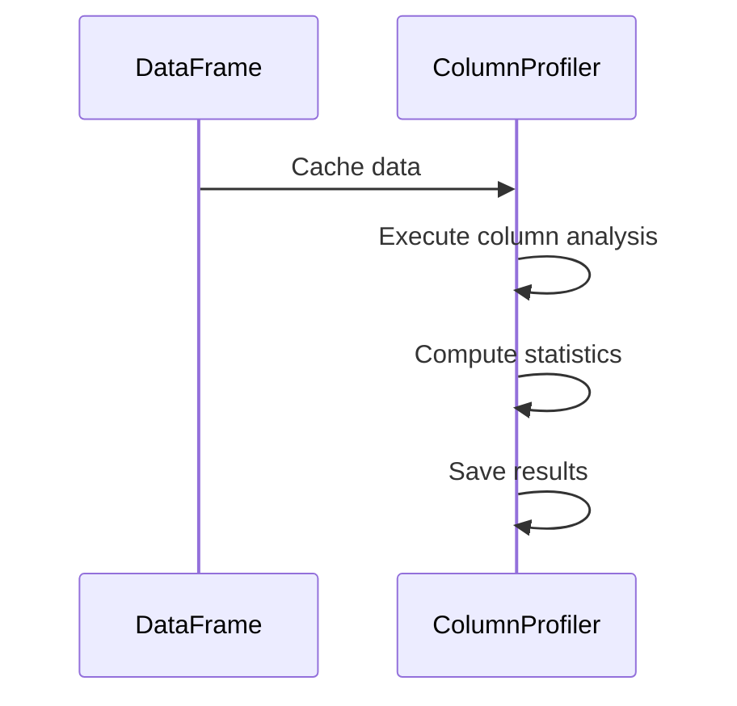
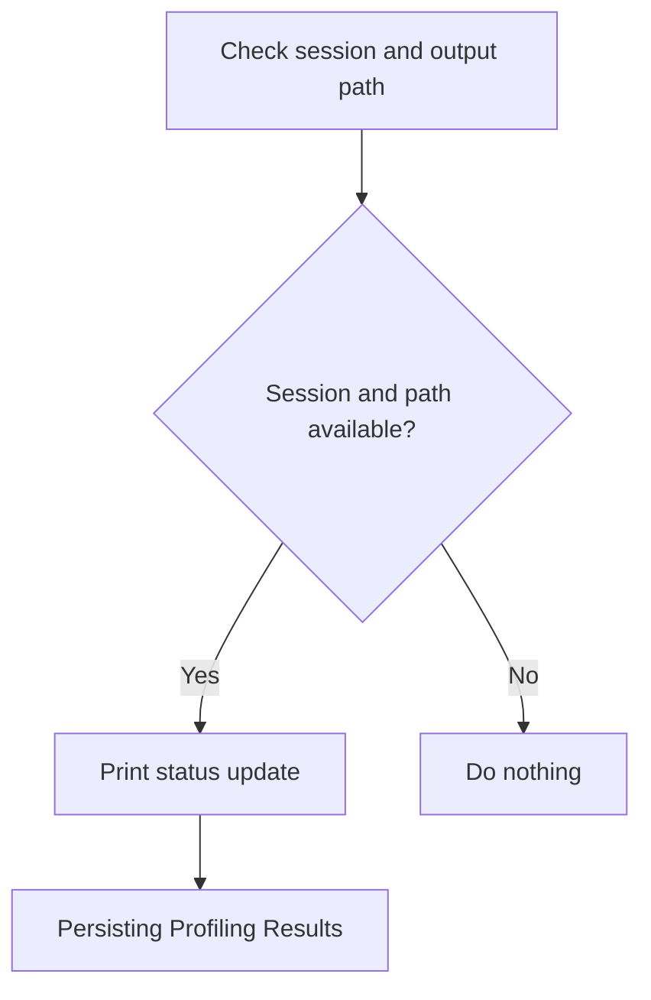

The column profiling flow is designed to analyze and generate profiles for each column in a dataset. This process is essential for understanding the data's characteristics and quality, which is crucial for data-driven decision-making. The flow involves caching data, executing column analysis in multiple passes, and optionally saving the results to the file system for persistence and future reference.

For instance, if a dataset contains columns with numeric and categorical data, the profiling flow will compute statistics such as mean, standard deviation, and histograms, providing insights into the data distribution and helping identify potential anomalies.



# Initiating Column Profiling

```mermaid
flowchart TD
    node1{Cache data?} -->|Yes| node2[Executing Column Analysis]
    node1 -->|No| node2
    node2 --> node3{Save results to file system?}
    node3 -->|Yes| node4[Save profiling results]
    node3 -->|No| node4

subgraph node2 [profile]
  sgmain_1_node1[Start profiling dataset] --> subgraph loop1[Profile each column in three passes]
  direction TB
  sgmain_1_node1 --> pass1[Compute generic statistics]
  pass1 --> pass2[Compute numeric statistics]
  pass2 --> pass3[Compute histograms for low-cardinality columns]
  end
  loop1 --> sgmain_1_node1[Return column profiles]
end
```

<SwmSnippet path="/src/main/scala/com/amazon/deequ/profiles/ColumnProfilerRunner.scala" line="43" repo-id="Z2l0aHViJTNBJTNBZGVlcXUlM0ElM0Fhd3NsYWJz">

---

We start the flow by calling profile to compute column statistics, which is necessary because it performs the actual analysis and profiling of the data columns, the main task of this function.

```scala
  private[profiles] def run(
      data: DataFrame,
      restrictToColumns: Option[Seq[String]],
      lowCardinalityHistogramThreshold: Int,
      printStatusUpdates: Boolean,
      cacheInputs: Boolean,
      fileOutputOptions: ColumnProfilerRunBuilderFileOutputOptions,
      metricsRepositoryOptions: ColumnProfilerRunBuilderMetricsRepositoryOptions,
      kllProfiling: Boolean,
      kllParameters: Option[KLLParameters],
      predefinedTypes: Map[String, DataTypeInstances.Value])
    : ColumnProfiles = {

    if (cacheInputs) {
      data.cache()
    }

    val columnProfiles = ColumnProfiler
      .profile(
        data,
        restrictToColumns,
        printStatusUpdates,
        lowCardinalityHistogramThreshold,
        metricsRepositoryOptions.metricsRepository,
        metricsRepositoryOptions.reuseExistingResultsKey,
        metricsRepositoryOptions.failIfResultsForReusingMissing,
        metricsRepositoryOptions.saveOrAppendResultsKey,
        kllProfiling,
        kllParameters,
        predefinedTypes
      )

```

---

</SwmSnippet>

## Executing Column Analysis

<SwmSnippet path="/src/main/scala/com/amazon/deequ/profiles/ColumnProfiler.scala" line="112" repo-id="Z2l0aHViJTNBJTNBZGVlcXUlM0ElM0Fhd3NsYWJz">

---

First, we call extractGenericStatistics to compute basic column statistics, which is crucial because it processes the results of the first pass analysis to derive these statistics, laying the foundation for further analysis.

```scala
  private[deequ] def profile(
      data: DataFrame,
      restrictToColumns: Option[Seq[String]] = None,
      printStatusUpdates: Boolean = false,
      lowCardinalityHistogramThreshold: Int =
        ColumnProfiler.DEFAULT_CARDINALITY_THRESHOLD,
      metricsRepository: Option[MetricsRepository] = None,
      reuseExistingResultsUsingKey: Option[ResultKey] = None,
      failIfResultsForReusingMissing: Boolean = false,
      saveInMetricsRepositoryUsingKey: Option[ResultKey] = None,
      kllProfiling: Boolean = false,
      kllParameters: Option[KLLParameters] = None,
      predefinedTypes: Map[String, DataTypeInstances.Value] = Map.empty)
    : ColumnProfiles = {

    // Ensure that all desired columns exist
    restrictToColumns.foreach { restrictToColumns =>
      restrictToColumns.foreach { columnName =>
        require(data.schema.fieldNames.contains(columnName), s"Unable to find column $columnName")
      }
    }

    // Find columns we want to profile
    val relevantColumns = getRelevantColumns(data.schema, restrictToColumns)

    // First pass
    if (printStatusUpdates) {
      println("### PROFILING: Computing generic column statistics in pass (1/3)...")
    }

    // We compute completeness, approximate number of distinct values
    // and type detection for string columns in the first pass
    val analyzersForGenericStats = getAnalyzersForGenericStats(
      data.schema,
      relevantColumns,
      predefinedTypes)

    var analysisRunnerFirstPass = AnalysisRunner
      .onData(data)
      .addAnalyzers(analyzersForGenericStats)
      .addAnalyzer(Size())

    analysisRunnerFirstPass = setMetricsRepositoryConfigurationIfNecessary(
      analysisRunnerFirstPass,
      metricsRepository,
      reuseExistingResultsUsingKey,
      failIfResultsForReusingMissing,
      saveInMetricsRepositoryUsingKey)

    val firstPassResults = analysisRunnerFirstPass.run()

    val genericStatistics = extractGenericStatistics(
      relevantColumns,
      data.schema,
      firstPassResults,
      predefinedTypes)

```

---

</SwmSnippet>

<SwmSnippet path="/src/main/scala/com/amazon/deequ/profiles/ColumnProfiler.scala" line="406" repo-id="Z2l0aHViJTNBJTNBZGVlcXUlM0ElM0Fhd3NsYWJz">

---

Here, we process first pass results to derive basic statistics, including inferred data types and completeness, providing a foundational understanding of the data essential for subsequent analysis steps.

```scala
  private[this] def extractGenericStatistics(
      columns: Seq[String],
      schema: StructType,
      results: AnalyzerContext,
      predefinedTypes: Map[String, DataTypeInstances.Value] = Map.empty)
    : GenericColumnStatistics = {

    val numRecords = results.metricMap
      .collect { case (_: Size, metric: DoubleMetric) => metric.value.get }
      .head
      .toLong

    val inferredTypes = results.metricMap
      .filterNot{
        case (analyzer: DataType, _) => predefinedTypes.contains(analyzer.column)
        case _ => true
      }
      .collect { case (analyzer: DataType, metric: HistogramMetric) =>
          val typeHistogram = metric.value.get
          analyzer.column -> DataTypeHistogram.determineType(typeHistogram)
      }

    val typeDetectionHistograms = results.metricMap
      .filterNot{
        case (analyzer: DataType, _) => predefinedTypes.contains(analyzer.column)
        case _ => true
      }
      .collect { case (analyzer: DataType, metric: HistogramMetric) =>
          val typeCounts = metric.value.get.values
            .map { case (key, distValue) => key -> distValue.absolute }
          analyzer.column -> typeCounts
      }

    val approximateNumDistincts = results.metricMap
      .collect { case (analyzer: ApproxCountDistinct, metric: DoubleMetric) =>
        analyzer.column -> metric.value.get.toLong
      }

    val completenesses = results.metricMap
      .collect { case (analyzer: Completeness, metric: DoubleMetric) =>
        analyzer.column -> metric.value.get
      }

    val knownTypes = schema.fields
      .filter { column => columns.contains(column.name) }
      .filterNot { column => predefinedTypes.contains(column.name)}
      .filter {
        _.dataType != StringType
      }
      .map { field =>
        val knownType = field.dataType match {
          case ShortType | LongType | IntegerType => Integral
          case DecimalType() | FloatType | DoubleType => Fractional
          case BooleanType => Boolean
          case TimestampType => String // TODO We should have support for dates in deequ...
          case _ =>
            println(s"Unable to map type ${field.dataType}")
            Unknown
        }

        field.name -> knownType
      }
      .toMap

    GenericColumnStatistics(numRecords, inferredTypes, knownTypes, typeDetectionHistograms,
      approximateNumDistincts, completenesses, predefinedTypes)
  }
```

---

</SwmSnippet>

<SwmSnippet path="/src/main/scala/com/amazon/deequ/profiles/ColumnProfiler.scala" line="169" repo-id="Z2l0aHViJTNBJTNBZGVlcXUlM0ElM0Fhd3NsYWJz">

---

Back in profile, after returning from extractGenericStatistics, we call extractNumericStatistics to derive numeric statistics, which is necessary because it processes the results of the second pass to derive these statistics, crucial for understanding the distribution and characteristics of numeric data.

```scala
    val stringStatistics = extractStringStatistics(firstPassResults)

    // Second pass
    if (printStatusUpdates) {
      println("### PROFILING: Computing numeric column statistics in pass (2/3)...")
    }

    // We cast all string columns that were detected as numeric
    val castedDataForSecondPass = castNumericStringColumns(relevantColumns, data,
      genericStatistics)

    // We compute mean, stddev, min, max for all numeric columns
    val analyzersForSecondPass = getAnalyzersForSecondPass(relevantColumns,
      genericStatistics, kllProfiling, kllParameters)

    var analysisRunnerSecondPass = AnalysisRunner
      .onData(castedDataForSecondPass)
      .addAnalyzers(analyzersForSecondPass)

    analysisRunnerSecondPass = setMetricsRepositoryConfigurationIfNecessary(
      analysisRunnerSecondPass,
      metricsRepository,
      reuseExistingResultsUsingKey,
      failIfResultsForReusingMissing,
      saveInMetricsRepositoryUsingKey)

    val secondPassResults = analysisRunnerSecondPass.run()

    val numericStatistics = extractNumericStatistics(secondPassResults)

    // Third pass
```

---

</SwmSnippet>

<SwmSnippet path="/src/main/scala/com/amazon/deequ/profiles/ColumnProfiler.scala" line="504" repo-id="Z2l0aHViJTNBJTNBZGVlcXUlM0ElM0Fhd3NsYWJz">

---

Next, we process second pass results to derive numeric statistics, including handling KLL sketches and percentiles, providing detailed insights into the distribution and characteristics of numeric data, essential for comprehensive data profiling.

```scala
  private[this] def extractNumericStatistics(results: AnalyzerContext): NumericColumnStatistics = {

    val means = results.metricMap
      .collect { case (analyzer: Mean, metric: DoubleMetric) =>
        metric.value match {
          case Success(metricValue) => Some(analyzer.column -> metricValue)
          case _ => None
        }
      }
      .flatten
      .toMap

    val stdDevs = results.metricMap
      .collect { case (analyzer: StandardDeviation, metric: DoubleMetric) =>
        metric.value match {
          case Success(metricValue) => Some(analyzer.column -> metricValue)
          case _ => None
        }
      }
      .flatten
      .toMap

    val maxima = results.metricMap
      .collect { case (analyzer: Maximum, metric: DoubleMetric) =>
        metric.value match {
          case Success(metricValue) => Some(analyzer.column -> metricValue)
          case _ => None
        }
      }
      .flatten
      .toMap

    val minima = results.metricMap
      .collect { case (analyzer: Minimum, metric: DoubleMetric) =>
        metric.value match {
          case Success(metricValue) => Some(analyzer.column -> metricValue)
          case _ => None
        }
      }
      .flatten
      .toMap

    val sums = results.metricMap
      .collect { case (analyzer: Sum, metric: DoubleMetric) =>
        metric.value match {
          case Success(metricValue) => Some(analyzer.column -> metricValue)
          case _ => None
        }
      }
      .flatten
      .toMap


    val kll = results.metricMap
      .collect { case (analyzer: KLLSketch, metric: KLLMetric) if metric.value.isSuccess =>
        metric.value match {
          case Success(bucketDistribution) =>
            Some(analyzer.column -> bucketDistribution)
          case _ => None
        }
      }
      .flatten
      .toMap

    val approxPercentiles = results.metricMap
      .collect {  case (analyzer: KLLSketch, metric: KLLMetric) =>
        metric.value match {
          case Success(bucketDistribution) =>

            val percentiles = bucketDistribution.computePercentiles()

            Some(analyzer.column -> percentiles.toSeq.sorted)
          case _ => None
        }
      }
      .flatten
      .toMap


    NumericColumnStatistics(means, stdDevs, minima, maxima, sums, kll, approxPercentiles)
  }
```

---

</SwmSnippet>

<SwmSnippet path="/src/main/scala/com/amazon/deequ/profiles/ColumnProfiler.scala" line="200" repo-id="Z2l0aHViJTNBJTNBZGVlcXUlM0ElM0Fhd3NsYWJz">

---

Back in profile, after returning from extractNumericStatistics, we call getHistogramsForThirdPass to calculate new histograms, which is necessary because it provides a complete view of the data distribution, especially for categorical data.

```scala
    if (printStatusUpdates) {
      println("### PROFILING: Computing histograms of low-cardinality columns in pass (3/3)...")
    }

    // We compute exact histograms for all low-cardinality string columns, find those here
    val targetColumnsForHistograms = findTargetColumnsForHistograms(data.schema, genericStatistics,
      lowCardinalityHistogramThreshold)

    // Find out, if we have values for those we can reuse
    val analyzerContextExistingValues = getAnalyzerContextWithHistogramResultsForReusingIfNecessary(
      metricsRepository,
      reuseExistingResultsUsingKey,
      targetColumnsForHistograms
    )

    // The columns we need to calculate the histograms for
    val nonExistingHistogramColumns = targetColumnsForHistograms
      .filter { column => analyzerContextExistingValues.metricMap.get(Histogram(column)).isEmpty }

    // Calculate and save/append results if necessary
    val histograms: Map[String, Distribution] = getHistogramsForThirdPass(
      data,
      nonExistingHistogramColumns,
      analyzerContextExistingValues,
      printStatusUpdates,
      failIfResultsForReusingMissing,
      metricsRepository,
      saveInMetricsRepositoryUsingKey)

```

---

</SwmSnippet>

<SwmSnippet path="/src/main/scala/com/amazon/deequ/profiles/ColumnProfiler.scala" line="664" repo-id="Z2l0aHViJTNBJTNBZGVlcXUlM0ElM0Fhd3NsYWJz">

---

Here, we calculate histograms for low-cardinality columns without existing results, ensuring all relevant columns have histograms and providing a comprehensive view of categorical data distribution.

```scala
  def getHistogramsForThirdPass(
      data: DataFrame,
      nonExistingHistogramColumns: Seq[String],
      analyzerContextExistingValues: AnalyzerContext,
      printStatusUpdates: Boolean,
      failIfResultsForReusingMissing: Boolean,
      metricsRepository: Option[MetricsRepository],
      saveInMetricsRepositoryUsingKey: Option[ResultKey])
    : Map[String, Distribution] = {

    if (nonExistingHistogramColumns.nonEmpty) {

      // Throw an error if all required metrics should have been calculated before but did not
      if (failIfResultsForReusingMissing) {
        throw new ReusingNotPossibleResultsMissingException(
          "Could not find all necessary results in the MetricsRepository, the calculation of " +
            s"the histograms for these columns would be required: " +
            s"${nonExistingHistogramColumns.mkString(", ")}")
      }

      val columnNamesAndDistribution = computeHistograms(data, nonExistingHistogramColumns)

      // Now merge these results with the results that we want to reuse and store them if specified

      val analyzerAndHistogramMetrics = convertColumnNamesAndDistributionToHistogramWithMetric(
        columnNamesAndDistribution)

      val analyzerContext = AnalyzerContext(analyzerAndHistogramMetrics) ++
        analyzerContextExistingValues

      saveOrAppendResultsIfNecessary(analyzerContext, metricsRepository,
        saveInMetricsRepositoryUsingKey)

      // Return overall results using the more simple Distribution format
      analyzerContext.metricMap
        .map { case (histogram: Histogram, metric: HistogramMetric) if metric.value.isSuccess =>
          histogram.column -> metric.value.get
        }
    } else {
      // We do not need to calculate new histograms
      if (printStatusUpdates) {
        println("### PROFILING: Skipping pass (3/3), no new histograms need to be calculated.")
      }
      analyzerContextExistingValues.metricMap
        .map { case (histogram: Histogram, metric: HistogramMetric) if metric.value.isSuccess =>
          histogram.column -> metric.value.get
        }
    }
  }
```

---

</SwmSnippet>

<SwmSnippet path="/src/main/scala/com/amazon/deequ/profiles/ColumnProfiler.scala" line="229" repo-id="Z2l0aHViJTNBJTNBZGVlcXUlM0ElM0Fhd3NsYWJz">

---

Back in profile, after returning from getHistogramsForThirdPass, we create column profiles using all gathered statistics, consolidating the results of the entire profiling process and providing a comprehensive profile for each column.

```scala
    val thirdPassResults = CategoricalColumnStatistics(histograms)

    createProfiles(relevantColumns, genericStatistics, stringStatistics, numericStatistics, thirdPassResults)
  }
```

---

</SwmSnippet>

## Finalizing Column Profiling

<SwmSnippet path="/src/main/scala/com/amazon/deequ/profiles/ColumnProfilerRunner.scala" line="75" repo-id="Z2l0aHViJTNBJTNBZGVlcXUlM0ElM0Fhd3NsYWJz">

---

Back in run, after returning from profile, we save profiles to the file system if necessary, which is crucial because it writes the profiles to a specified location, allowing for persistence and later analysis, ensuring results are stored and accessible for future reference.

```scala
    saveColumnProfilesJsonToFileSystemIfNecessary(
      fileOutputOptions,
      printStatusUpdates,
      columnProfiles
    )

    if (cacheInputs) {
      data.unpersist()
    }

    columnProfiles
  }
```

---

</SwmSnippet>

# Persisting Profiling Results



<SwmSnippet path="/src/main/scala/com/amazon/deequ/profiles/ColumnProfilerRunner.scala" line="88" repo-id="Z2l0aHViJTNBJTNBZGVlcXUlM0ElM0Fhd3NsYWJz">

---

Here, we handle the persistence of column profiles by writing them to a specified file system location. Next, we call toJson to convert profiles to JSON format, which is necessary for writing to the file system.

```scala
  private[this] def saveColumnProfilesJsonToFileSystemIfNecessary(
      fileOutputOptions: ColumnProfilerRunBuilderFileOutputOptions,
      printStatusUpdates: Boolean,
      columnProfiles: ColumnProfiles)
    : Unit = {

    fileOutputOptions.session.foreach { session =>
      fileOutputOptions.saveColumnProfilesJsonToPath.foreach { profilesOutput =>
        if (printStatusUpdates) {
          println(s"### WRITING COLUMN PROFILES TO $profilesOutput")
        }

        DfsUtils.writeToTextFileOnDfs(session, profilesOutput,
          overwrite = fileOutputOptions.overwriteResults) { writer =>
            writer.append(ColumnProfiles.toJson(columnProfiles.profiles.values.toSeq).toString)
            writer.newLine()
          }
        }
    }
  }
```

---

</SwmSnippet>

<SwmSnippet path="/src/main/scala/com/amazon/deequ/profiles/ColumnProfile.scala" line="80" repo-id="Z2l0aHViJTNBJTNBZGVlcXUlM0ElM0Fhd3NsYWJz">

---

Finally, we convert column profiles into a JSON string, adding properties like column name, data type, and statistics, including metrics for numeric profiles, which is essential for storing the profiles in a structured format that can be easily accessed and analyzed later.

```scala
  def toJson(columnProfiles: Seq[ColumnProfile]): String = {

    val json = new JsonObject()

    val columns = new JsonArray()

    columnProfiles.foreach { case profile =>

      val columnProfileJson = new JsonObject()
      columnProfileJson.addProperty("column", profile.column)
      columnProfileJson.addProperty("dataType", profile.dataType.toString)
      columnProfileJson.addProperty("isDataTypeInferred", profile.isDataTypeInferred.toString)

      if (profile.typeCounts.nonEmpty) {
        val typeCountsJson = new JsonObject()
        profile.typeCounts.foreach { case (typeName, count) =>
          typeCountsJson.addProperty(typeName, count.toString)
        }
      }

      columnProfileJson.addProperty("completeness", profile.completeness)
      columnProfileJson.addProperty("approximateNumDistinctValues",
        profile.approximateNumDistinctValues)

      if (profile.histogram.isDefined) {
        val histogram = profile.histogram.get
        val histogramJson = new JsonArray()

        histogram.values.foreach { case (name, distributionValue) =>
          val histogramEntry = new JsonObject()
          histogramEntry.addProperty("value", name)
          histogramEntry.addProperty("count", distributionValue.absolute)
          histogramEntry.addProperty("ratio", distributionValue.ratio)
          histogramJson.add(histogramEntry)
        }

        columnProfileJson.add("histogram", histogramJson)
      }

      profile match {
        case numericColumnProfile: NumericColumnProfile =>
          numericColumnProfile.mean.foreach { mean =>
            columnProfileJson.addProperty("mean", mean)
          }
          numericColumnProfile.maximum.foreach { maximum =>
            columnProfileJson.addProperty("maximum", maximum)
          }
          numericColumnProfile.minimum.foreach { minimum =>
            columnProfileJson.addProperty("minimum", minimum)
          }
          numericColumnProfile.sum.foreach { sum =>
            columnProfileJson.addProperty("sum", sum)
          }
          numericColumnProfile.stdDev.foreach { stdDev =>
            columnProfileJson.addProperty("stdDev", stdDev)
          }

          // KLL Sketch
          if (numericColumnProfile.kll.isDefined) {
            val kllSketch = numericColumnProfile.kll.get
            val kllSketchJson = new JsonObject()

            val tmp = new JsonArray()
            kllSketch.buckets.foreach{bucket =>
              val entry = new JsonObject()
              entry.addProperty("low_value", bucket.lowValue)
              entry.addProperty("high_value", bucket.highValue)
              entry.addProperty("count", bucket.count)
              tmp.add(entry)
            }

            kllSketchJson.add("buckets", tmp)
            val entry = new JsonObject()
            entry.addProperty("c", kllSketch.parameters(0))
            entry.addProperty("k", kllSketch.parameters(1))
            val store = new JsonObject()
            store.add("parameters", entry)

            val gson = new Gson()
            val dataJson = gson.toJson(kllSketch.data)

            store.addProperty("data", dataJson)

            kllSketchJson.add("sketch", store)
            columnProfileJson.add("kll", kllSketchJson)
          }

          val approxPercentilesJson = new JsonArray()
          numericColumnProfile.approxPercentiles.foreach {
            _.foreach { percentile =>
              approxPercentilesJson.add(new JsonPrimitive(percentile))
            }
          }

          columnProfileJson.add("approxPercentiles", approxPercentilesJson)

        case _ =>
      }

      columns.add(columnProfileJson)
    }

    json.add("columns", columns)

    val gson = new GsonBuilder()
      .setPrettyPrinting()
      .create()

    gson.toJson(json)
  }
```

---

</SwmSnippet>

&nbsp;

*This is an auto-generated document by Swimm 🌊 and has not yet been verified by a human*

<SwmMeta version="3.0.0"><sup>Powered by [Swimm](https://staging.swimm.cloud/)</sup></SwmMeta>
