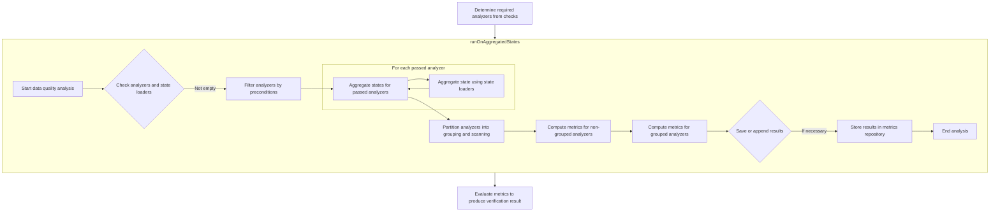
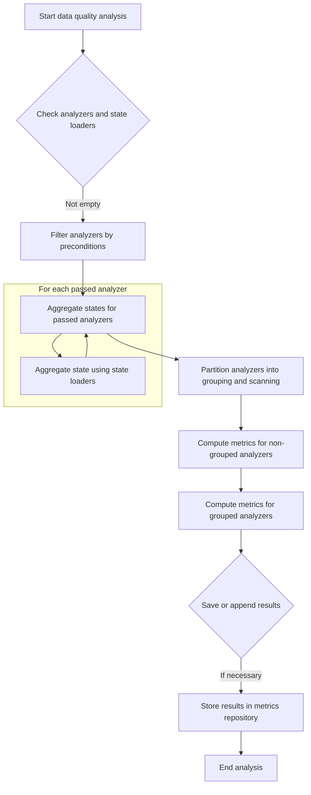

The flow of executing data quality analysis involves processing data to verify its quality based on predefined checks. This process is essential for ensuring that large datasets meet specific quality standards. The flow begins by determining the required analyzers from the checks and proceeds to execute and manage the analysis on aggregated states. The main steps include filtering analyzers by preconditions, aggregating states, computing metrics, and storing results if necessary.

For instance, if a dataset needs to be checked for null values and unique constraints, the flow will identify the necessary analyzers, execute them on the data, and store the results for further analysis.



# Initiating Verification Process


<SwmSnippet path="/src/main/scala/com/amazon/deequ/VerificationSuite.scala" line="208" repo-id="Z2l0aHViJTNBJTNBZGVlcXUlM0ElM0Fhd3NsYWJz">

---

First, we initiate the verification process by setting up the analysis with required analyzers from the checks. We need to call addAnalyzers to ensure that the analysis includes all necessary analyzers required by the checks, which is essential for accurate data verification.

```scala
  def runOnAggregatedStates(
      schema: StructType,
      checks: Seq[Check],
      stateLoaders: Seq[StateLoader],
      requiredAnalysis: Analysis = Analysis(),
      saveStatesWith: Option[StatePersister] = None,
      metricsRepository: Option[MetricsRepository] = None,
      saveOrAppendResultsWithKey: Option[ResultKey] = None)
    : VerificationResult = {

    val analysis = requiredAnalysis.addAnalyzers(checks.flatMap { _.requiredAnalyzers() })

```

---

</SwmSnippet>

<SwmSnippet path="/src/main/scala/com/amazon/deequ/analyzers/Analysis.scala" line="35" repo-id="Z2l0aHViJTNBJTNBZGVlcXUlM0ElM0Fhd3NsYWJz">

---

Next, we combine existing analyzers with new ones required by the checks to update the analysis, ensuring all necessary checks are covered in the verification process.

```scala
  def addAnalyzers(otherAnalyzers: Seq[Analyzer[_, Metric[_]]]): Analysis = {
    Analysis(analyzers ++ otherAnalyzers)
  }
```

---

</SwmSnippet>

<SwmSnippet path="/src/main/scala/com/amazon/deequ/VerificationSuite.scala" line="220" repo-id="Z2l0aHViJTNBJTNBZGVlcXUlM0ElM0Fhd3NsYWJz">

---

Back in VerificationSuite, we execute the analysis on aggregated states to process data for verification. Calling runOnAggregatedStates is necessary to execute the analysis on the data, which is essential for verifying data quality based on the checks provided.

```scala
    val analysisResults = AnalysisRunner.runOnAggregatedStates(
      schema,
      analysis,
      stateLoaders,
      saveStatesWith,
      metricsRepository = metricsRepository,
      saveOrAppendResultsWithKey = saveOrAppendResultsWithKey)

```

---

</SwmSnippet>

## Executing and Managing Analysis



<SwmSnippet path="/src/main/scala/com/amazon/deequ/analyzers/runners/AnalysisRunner.scala" line="397" repo-id="Z2l0aHViJTNBJTNBZGVlcXUlM0ElM0Fhd3NsYWJz">

---

First, we execute the analysis by filtering analyzers based on preconditions. Calling computePreconditionFailureMetrics is necessary to process analyzers that fail preconditions, ensuring the analysis proceeds only with valid analyzers.

```scala
    def runOnAggregatedStates(
      schema: StructType,
      analysis: Analysis,
      stateLoaders: Seq[StateLoader],
      saveStatesWith: Option[StatePersister] = None,
      storageLevelOfGroupedDataForMultiplePasses: StorageLevel = StorageLevel.MEMORY_AND_DISK,
      metricsRepository: Option[MetricsRepository] = None,
      saveOrAppendResultsWithKey: Option[ResultKey] = None                             )
    : AnalyzerContext = {

    if (analysis.analyzers.isEmpty || stateLoaders.isEmpty) {
      return AnalyzerContext.empty
    }

    val analyzers = analysis.analyzers.map { _.asInstanceOf[Analyzer[State[_], Metric[_]]] }

    /* Find all analyzers which violate their preconditions */
    val passedAnalyzers = analyzers
      .filter { analyzer =>
        Preconditions.findFirstFailing(schema, analyzer.preconditions).isEmpty
      }

    val failedAnalyzers = analyzers.diff(passedAnalyzers)

    /* Create the failure metrics from the precondition violations */
    val preconditionFailures = computePreconditionFailureMetrics(failedAnalyzers, schema)

```

---

</SwmSnippet>

<SwmSnippet path="/src/main/scala/com/amazon/deequ/analyzers/runners/AnalysisRunner.scala" line="255" repo-id="Z2l0aHViJTNBJTNBZGVlcXUlM0ElM0Fhd3NsYWJz">

---

Next, we create failure metrics for analyzers that violate preconditions, documenting the reasons for these failures, which is crucial for understanding and debugging the analysis process.

```scala
  private[this] def computePreconditionFailureMetrics(
      failedAnalyzers: Seq[Analyzer[State[_], Metric[_]]],
      schema: StructType)
    : AnalyzerContext = {

    val failures = failedAnalyzers.map { analyzer =>

      val firstException = Preconditions
        .findFirstFailing(schema, analyzer.preconditions).get

      analyzer -> analyzer.toFailureMetric(firstException)
    }
    .toMap[Analyzer[_, Metric[_]], Metric[_]]

    AnalyzerContext(failures)
  }
```

---

</SwmSnippet>

<SwmSnippet path="/src/main/scala/com/amazon/deequ/analyzers/runners/AnalysisRunner.scala" line="424" repo-id="Z2l0aHViJTNBJTNBZGVlcXUlM0ElM0Fhd3NsYWJz">

---

Back in AnalysisRunner, we aggregate initial states for analyzers that passed preconditions. Calling aggregateStateTo is necessary to combine states from different sources, enabling analyzers to work with a unified state for further analysis.

```scala
    val aggregatedStates = InMemoryStateProvider()

    /* Aggregate all initial states */
    passedAnalyzers.foreach { analyzer =>
      stateLoaders.foreach { stateLoader =>
        analyzer.aggregateStateTo(aggregatedStates, stateLoader, aggregatedStates)
      }
    }

    /* Identify analyzers which require us to group the data */
```

---

</SwmSnippet>

<SwmSnippet path="/src/main/scala/com/amazon/deequ/analyzers/Analyzer.scala" line="141" repo-id="Z2l0aHViJTNBJTNBZGVlcXUlM0ElM0Fhd3NsYWJz">

---

Next, we merge states from two sources into a target state, ensuring it contains comprehensive data for analysis, which is essential for accurate analysis.

```scala
  private[deequ] def aggregateStateTo(
      sourceA: StateLoader,
      sourceB: StateLoader,
      target: StatePersister)
    : Unit = {

    val maybeStateA = sourceA.load[S](this)
    val maybeStateB = sourceB.load[S](this)

    val aggregated = (maybeStateA, maybeStateB) match {
      case (Some(stateA), Some(stateB)) => Some(stateA.sumUntyped(stateB).asInstanceOf[S])
      case (Some(stateA), None) => Some(stateA)
      case (None, Some(stateB)) => Some(stateB)
      case _ => None
    }

    aggregated.foreach { state => target.persist[S](this, state) }
  }
```

---

</SwmSnippet>

<SwmSnippet path="/src/main/scala/com/amazon/deequ/analyzers/runners/AnalysisRunner.scala" line="434" repo-id="Z2l0aHViJTNBJTNBZGVlcXUlM0ElM0Fhd3NsYWJz">

---

Back in AnalysisRunner, we identify analyzers requiring data grouping and execute them on grouped data. Calling runAnalyzersForParticularGrouping is necessary for executing analyzers on grouped data, which is required for certain types of checks.

```scala
    val (groupingAnalyzers, scanningAnalyzers) =
      passedAnalyzers.partition { _.isInstanceOf[GroupingAnalyzer[State[_], Metric[_]]] }

    val nonGroupedResults = scanningAnalyzers
      .map { _.asInstanceOf[Analyzer[State[_], Metric[_]]] }
      .flatMap { analyzer =>
        val metrics = analyzer
          .loadStateAndComputeMetric(aggregatedStates)

        /* Store aggregated state if a 'saveStatesWith' has been provided */
        saveStatesWith.foreach { persister => analyzer.copyStateTo(aggregatedStates, persister) }

        metrics.map { metric => analyzer -> metric }
      }
      .toMap[Analyzer[_, Metric[_]], Metric[_]]


    val groupedResults = if (groupingAnalyzers.isEmpty) {
      AnalyzerContext.empty
    } else {
      groupingAnalyzers
        .map { _.asInstanceOf[GroupingAnalyzer[State[_], Metric[_]]] }
        .groupBy { _.groupingColumns().sorted }
        .map { case (_, analyzersForGrouping) =>

          val state = findStateForParticularGrouping(analyzersForGrouping, aggregatedStates)

          runAnalyzersForParticularGrouping(state, analyzersForGrouping, saveStatesWith,
            storageLevelOfGroupedDataForMultiplePasses)
        }
        .reduce { _ ++ _ }
    }

```

---

</SwmSnippet>

<SwmSnippet path="/src/main/scala/com/amazon/deequ/analyzers/runners/AnalysisRunner.scala" line="492" repo-id="Z2l0aHViJTNBJTNBZGVlcXUlM0ElM0Fhd3NsYWJz">

---

Next, we execute analyzers on grouped data, partitioning them and computing metrics efficiently, which is crucial for accurate analysis.

```scala
  private[this] def runAnalyzersForParticularGrouping(
      frequenciesAndNumRows: FrequenciesAndNumRows,
      analyzers: Seq[GroupingAnalyzer[State[_], Metric[_]]],
      saveStatesTo: Option[StatePersister] = None,
      storageLevelOfGroupedDataForMultiplePasses: StorageLevel = StorageLevel.MEMORY_AND_DISK)
    : AnalyzerContext = {

    val numRows = frequenciesAndNumRows.numRows

    /* Identify all shareable analyzers */
    val (shareable, others) =
      analyzers.partition { _.isInstanceOf[ScanShareableFrequencyBasedAnalyzer] }

    /* Potentially cache the grouped data if we need to make several passes,
       controllable via the storage level */
    if (others.nonEmpty) {
      frequenciesAndNumRows.frequencies.persist(storageLevelOfGroupedDataForMultiplePasses)
    }

    val shareableAnalyzers = shareable.map { _.asInstanceOf[ScanShareableFrequencyBasedAnalyzer] }

    val metricsByAnalyzer = if (shareableAnalyzers.nonEmpty) {

      try {
        val aggregations = shareableAnalyzers.flatMap { _.aggregationFunctions(numRows) }
        /* Compute offsets so that the analyzers can correctly pick their results from the row */
        val offsets = shareableAnalyzers.scanLeft(0) { case (current, analyzer) =>
          current + analyzer.aggregationFunctions(numRows).length
        }

        /* Execute aggregation on grouped data */
        val results = frequenciesAndNumRows.frequencies
          .agg(aggregations.head, aggregations.tail: _*)
          .collect()
          .head

        shareableAnalyzers.zip(offsets)
          .map { case (analyzer, offset) =>
            analyzer -> successOrFailureMetricFrom(analyzer, results, offset, frequenciesAndNumRows.fullColumn)
          }
      } catch {
        case error: Exception =>
          shareableAnalyzers
            .map { analyzer => analyzer -> analyzer.toFailureMetric(error) }
      }

    } else {
      Map.empty
    }

    /* Execute remaining analyzers on grouped data */
    val otherMetrics = try {
      others
        .map { _.asInstanceOf[FrequencyBasedAnalyzer] }
        .map { analyzer => analyzer ->
          analyzer.computeMetricFrom(Option(frequenciesAndNumRows))
        }
    } catch {
      case error: Exception =>
        others.map { analyzer => analyzer -> analyzer.toFailureMetric(error) }
    }

    /* Potentially store states */
    saveStatesTo.foreach { _.persist(analyzers.head, frequenciesAndNumRows) }

    frequenciesAndNumRows.frequencies.unpersist()

    AnalyzerContext((metricsByAnalyzer ++ otherMetrics).toMap[Analyzer[_, Metric[_]], Metric[_]])
  }
```

---

</SwmSnippet>

<SwmSnippet path="/src/main/scala/com/amazon/deequ/analyzers/runners/AnalysisRunner.scala" line="467" repo-id="Z2l0aHViJTNBJTNBZGVlcXUlM0ElM0Fhd3NsYWJz">

---

Finally, we combine results from different analysis stages and store them in a metrics repository if required. Calling saveOrAppendResultsIfNecessary is crucial for preserving analysis results for future reference or further analysis.

```scala
    val results = preconditionFailures ++ AnalyzerContext(nonGroupedResults) ++ groupedResults

    saveOrAppendResultsIfNecessary(results, metricsRepository, saveOrAppendResultsWithKey)

    results
  }
```

---

</SwmSnippet>

<SwmSnippet path="/src/main/scala/com/amazon/deequ/analyzers/runners/AnalysisRunner.scala" line="218" repo-id="Z2l0aHViJTNBJTNBZGVlcXUlM0ElM0Fhd3NsYWJz">

---

Next, we store analysis results in a metrics repository, checking if a repository and key are provided, which is crucial for preserving analysis results for future reference or further analysis.

```scala
  private[this] def saveOrAppendResultsIfNecessary(
      resultingAnalyzerContext: AnalyzerContext,
      metricsRepository: Option[MetricsRepository],
      saveOrAppendResultsWithKey: Option[ResultKey])
    : Unit = {

    metricsRepository.foreach { repository =>
      saveOrAppendResultsWithKey.foreach { key =>

        val currentValueForKey = repository.loadByKey(key).getOrElse(AnalyzerContext.empty)

        // AnalyzerContext entries on the right side of ++ will overwrite the ones on the left
        // if there are two different metric results for the same analyzer
        val valueToSave = currentValueForKey ++ resultingAnalyzerContext

        repository.save(saveOrAppendResultsWithKey.get, valueToSave)
      }
    }
  }
```

---

</SwmSnippet>

## Finalizing Verification Results

<SwmSnippet path="/src/main/scala/com/amazon/deequ/VerificationSuite.scala" line="263" repo-id="Z2l0aHViJTNBJTNBZGVlcXUlM0ElM0Fhd3NsYWJz">

---

Finally, we assess check results against the analysis context and determine the overall verification status, which is crucial for concluding the verification process.

```scala
  private[this] def evaluate(
      checks: Seq[Check],
      analysisContext: AnalyzerContext)
    : VerificationResult = {

    val checkResults = checks
      .map { check => check -> check.evaluate(analysisContext) }
      .toMap

    val verificationStatus = if (checkResults.isEmpty) {
      CheckStatus.Success
    } else {
      checkResults.values
        .map { _.status }
        .max
    }

    VerificationResult(verificationStatus, checkResults, analysisContext.metricMap)
  }
```

---

</SwmSnippet>

&nbsp;

*This is an auto-generated document by Swimm 🌊 and has not yet been verified by a human*

<SwmMeta version="3.0.0"><sup>Powered by [Swimm](https://staging.swimm.cloud/)</sup></SwmMeta>
