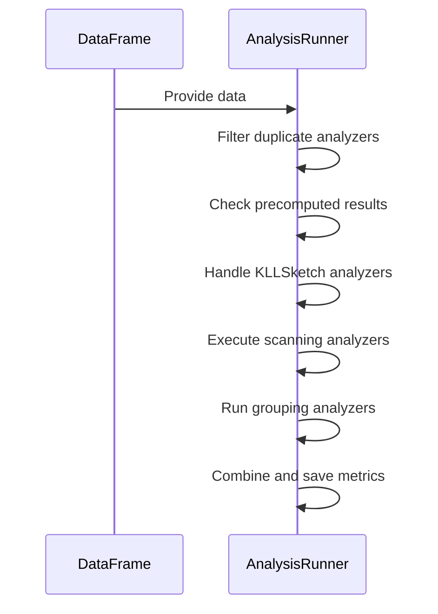
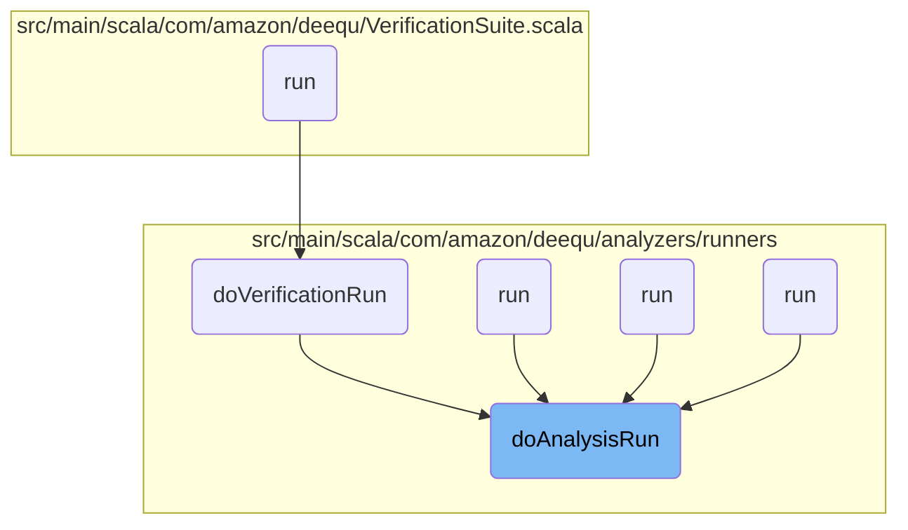
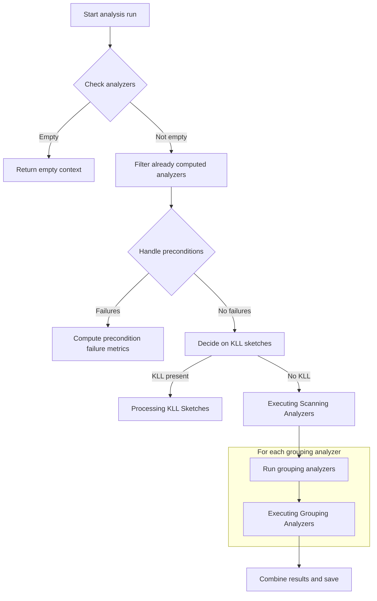
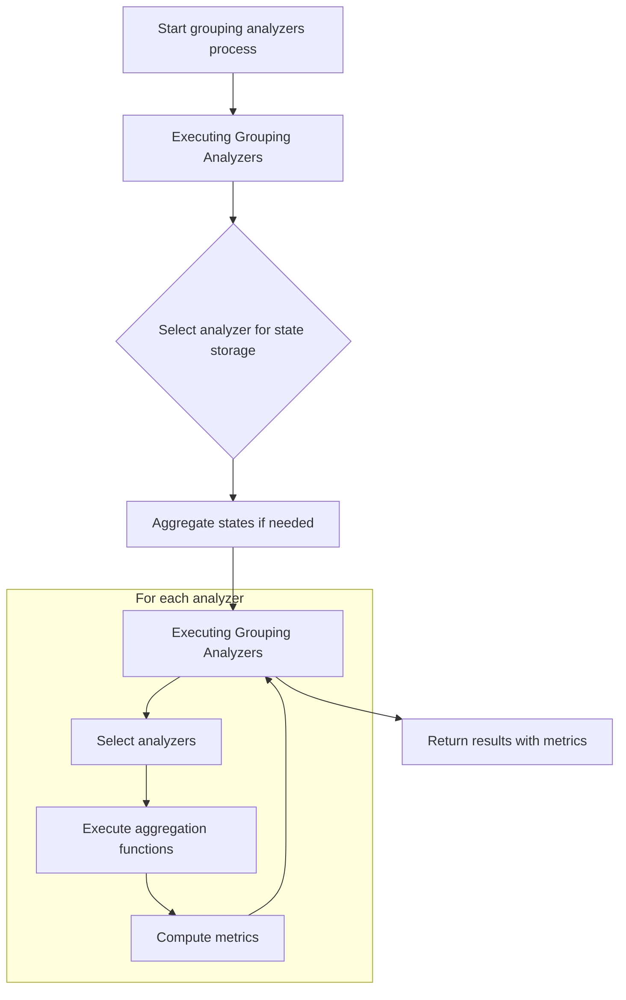
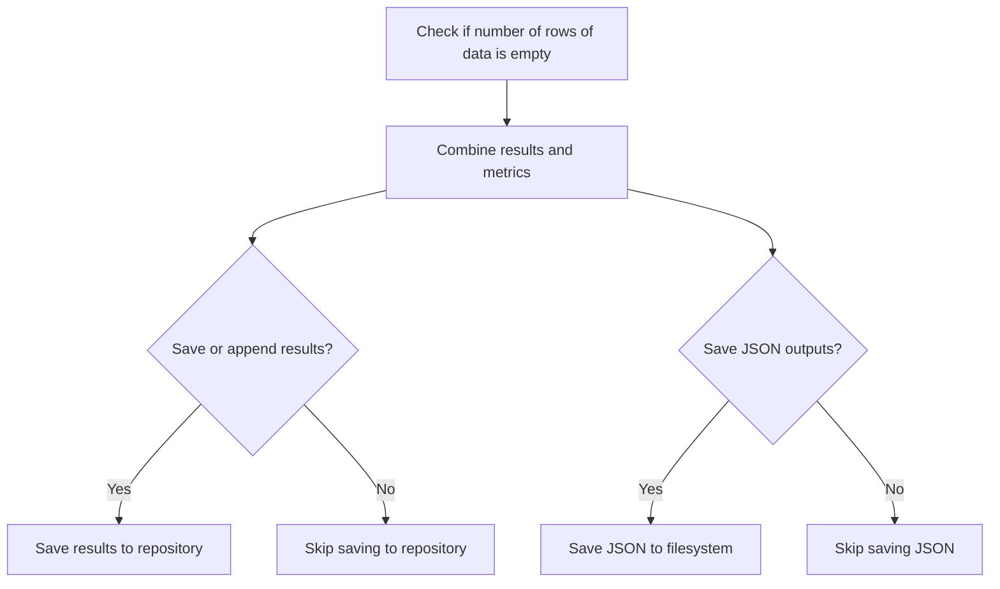
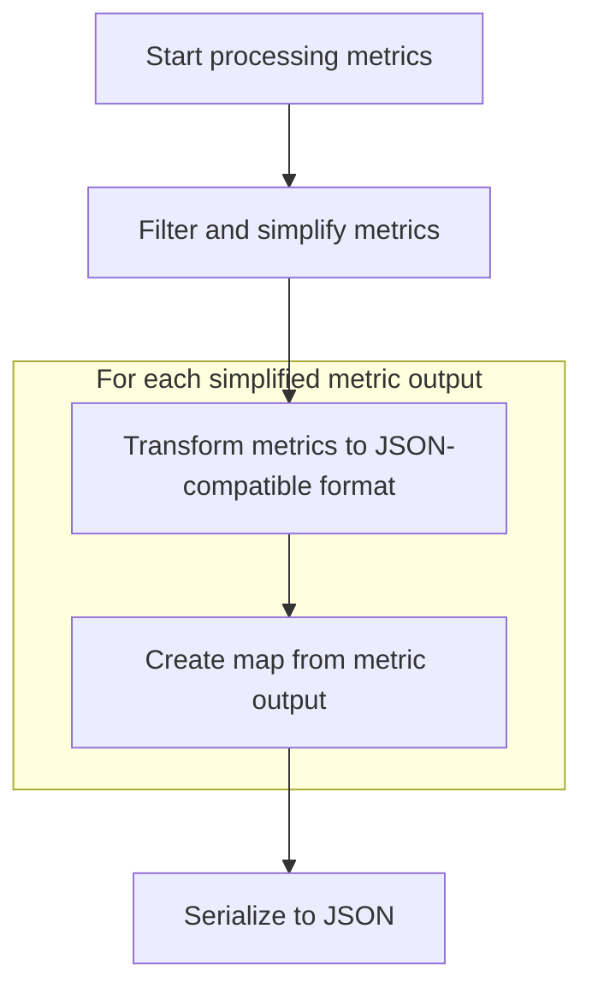

The `doAnalysisRun` flow is integral to the deequ library, facilitating comprehensive data quality analysis on large datasets using Apache Spark. This flow is designed to execute various analyzers on the provided data, ensuring that metrics are computed accurately and efficiently. The process begins by filtering duplicate analyzers and checking for precomputed results, followed by handling specific analyzers like KLLSketches separately due to their unique processing requirements. The flow then proceeds to execute scanning and grouping analyzers, compute metrics, and finally persist the results for future reference.

The main steps are:

- Filter duplicate analyzers and check for precomputed results.
- Handle KLLSketch analyzers separately.
- Execute scanning analyzers to compute metrics.
- Run grouping analyzers for grouped metrics.
- Combine all computed metrics and save results.

For instance, when analyzing a dataset for data quality, the `doAnalysisRun` flow will first check if any analyzers have already been computed to avoid redundant calculations. It will then process KLLSketch analyzers separately to compute quantile sketches, followed by executing scanning analyzers to calculate metrics like completeness or uniqueness. Finally, it will run grouping analyzers to compute metrics based on grouped data, ensuring comprehensive data quality analysis.



# Where is this flow used?

This flow is used multiple times in the codebase as represented in the following diagram:



# Initiating the Analysis Run



<SwmSnippet path="/src/main/scala/com/amazon/deequ/analyzers/runners/AnalysisRunner.scala" line="99" repo-id="Z2l0aHViJTNBJTNBZGVlcXUlM0ElM0Fhd3NsYWJz">

---

We start the flow by filtering duplicate analyzers and checking for precomputed results. Next, computeKLLSketchesInExtraPass is called to handle KLLSketch analyzers separately because they require additional processing that cannot be integrated into the main analysis flow.

```scala
  private[deequ] def doAnalysisRun(
      data: DataFrame,
      analyzers: Seq[Analyzer[_, Metric[_]]],
      aggregateWith: Option[StateLoader] = None,
      saveStatesWith: Option[StatePersister] = None,
      storageLevelOfGroupedDataForMultiplePasses: StorageLevel = StorageLevel.MEMORY_AND_DISK,
      metricsRepositoryOptions: AnalysisRunnerRepositoryOptions =
        AnalysisRunnerRepositoryOptions(),
      fileOutputOptions: AnalysisRunnerFileOutputOptions =
        AnalysisRunnerFileOutputOptions())
    : AnalyzerContext = {

    if (analyzers.isEmpty) {
      return AnalyzerContext.empty
    }

    val allAnalyzers = analyzers.map { _.asInstanceOf[Analyzer[State[_], Metric[_]]] }
    val distinctAnalyzers = allAnalyzers.distinct
    require(distinctAnalyzers.size == allAnalyzers.size,
      s"Duplicate analyzers found: ${allAnalyzers.diff(distinctAnalyzers).distinct}")

    /* We do not want to recalculate calculated metrics in the MetricsRepository */
    val resultsComputedPreviously: AnalyzerContext =
      (metricsRepositoryOptions.metricsRepository,
        metricsRepositoryOptions.reuseExistingResultsForKey)
        match {
          case (Some(metricsRepository: MetricsRepository), Some(resultKey: ResultKey)) =>
            metricsRepository.loadByKey(resultKey).getOrElse(AnalyzerContext.empty)
          case _ => AnalyzerContext.empty
        }

    val analyzersAlreadyRan = resultsComputedPreviously.metricMap.keys.toSet

    val analyzersToRun = allAnalyzers.filterNot(analyzersAlreadyRan.contains)

    /* Throw an error if all needed metrics should have gotten calculated before but did not */
    if (metricsRepositoryOptions.failIfResultsForReusingMissing && analyzersToRun.nonEmpty) {
      throw new ReusingNotPossibleResultsMissingException(
        "Could not find all necessary results in the MetricsRepository, the calculation of " +
          s"the metrics for these analyzers would be needed: ${analyzersToRun.mkString(", ")}")
    }

    /* Find all analyzers which violate their preconditions */
    val passedAnalyzers = analyzersToRun
      .filter { analyzer =>
        Preconditions.findFirstFailing(data.schema, analyzer.preconditions).isEmpty
      }

    val failedAnalyzers = analyzersToRun.diff(passedAnalyzers)

    /* Create the failure metrics from the precondition violations */
    val preconditionFailures = computePreconditionFailureMetrics(failedAnalyzers, data.schema)

    /* Identify analyzers which require us to group the data */
    val (groupingAnalyzers, allScanningAnalyzers) =
      passedAnalyzers.partition { _.isInstanceOf[GroupingAnalyzer[State[_], Metric[_]]] }


    val (kllAnalyzers, scanningAnalyzers) =
      allScanningAnalyzers.partition { _.isInstanceOf[KLLSketch] }

    val kllMetrics =
      if (kllAnalyzers.nonEmpty) {
        KLLRunner.computeKLLSketchesInExtraPass(data, kllAnalyzers, aggregateWith, saveStatesWith)
      } else {
        AnalyzerContext.empty
      }

    /* Run the analyzers which do not require grouping in a single pass over the data */
    val nonGroupedMetrics =
```

---

</SwmSnippet>

## Processing KLL Sketches

```mermaid
flowchart TD
    node1[Select KLL analyzers and map columns to parameters] --> node4[Compute sketches per column]

    subgraph loop1[For each data partition]
        node4 --> node2[Partitioning Data for Sketching]
        node2 --> node5[Combining Sketches]
        node5 --> node4
    end
    
    node4 --> node6[Calculate metrics from sketches]
    node6 --> node3[Return analyzer context]

subgraph node2 [sketchPartitions]
  sgmain_1_node1[Start sketching partitions]
  subgraph loop1[For each row in dataset]
  sgmain_1_node1 --> sgmain_1_node2{Check if column value is non-null}
  sgmain_1_node2 -->|Non-null| sgmain_1_node3[Update sketch for column]
  sgmain_1_node2 -->|Null| sgmain_1_node1
  end
  sgmain_1_node3 --> sgmain_1_node1
end

subgraph node5 [mergeUntyped]
  sgmain_2_node1[Merge two untyped quantile sketches by updating min, max, and merging sketch data]
end
```

<SwmSnippet path="/src/main/scala/com/amazon/deequ/analyzers/runners/KLLRunner.scala" line="89" repo-id="Z2l0aHViJTNBJTNBZGVlcXUlM0ElM0Fhd3NsYWJz">

---

Here, we focus on KLLSketch analyzers by extracting their parameters and preparing the data for sketching. Next, sketchPartitions is called to efficiently partition the data for sketching, ensuring that each partition is processed correctly and efficiently.

```scala
  def computeKLLSketchesInExtraPass(
      data: DataFrame,
      analyzers: Seq[Analyzer[State[_], Metric[_]]],
      aggregateWith: Option[StateLoader] = None,
      saveStatesTo: Option[StatePersister] = None)
    : AnalyzerContext = {

    val kllAnalyzers = analyzers.map { _.asInstanceOf[KLLSketch] }

    val columnsAndParameters = kllAnalyzers
      .map { analyzer => (analyzer.column, analyzer.kllParameters) }
        .toMap

    val sketching = sketchPartitions(columnsAndParameters, data.schema)_

```

---

</SwmSnippet>

### Partitioning Data for Sketching

<SwmSnippet path="/src/main/scala/com/amazon/deequ/analyzers/runners/KLLRunner.scala" line="150" repo-id="Z2l0aHViJTNBJTNBZGVlcXUlM0ElM0Fhd3NsYWJz">

---

First, we partition the data and initialize sketches for each column. Next, updateUntyped is called to process each row's data, updating the sketches with the necessary information to compute the quantiles accurately.

```scala
  private[this] def sketchPartitions(
      columnsAndParameters: Map[String, Option[KLLParameters]],
      schema: StructType)(rows: Iterator[Row])
    : Iterator[Map[String, UntypedQuantileNonSample]] = {

    val columnsAndSketches = emptySketches(columnsAndParameters, schema)

    val namesToIndexes = schema.fields
      .map { _.name }
      .zipWithIndex
      .toMap

    // Include the index to avoid a lookup per row
    val indexesAndSketches = columnsAndSketches.map { case (column, sketch) =>
      (namesToIndexes(column), sketch )
    }

    while (rows.hasNext) {
      val row = rows.next()
      indexesAndSketches.foreach { case (index, sketch) =>
        if (!row.isNullAt(index)) {
          sketch.updateUntyped(row.get(index))
        }
      }
    }
```

---

</SwmSnippet>

### Updating Sketches with Row Data

<SwmSnippet path="/src/main/scala/com/amazon/deequ/analyzers/runners/KLLRunner.scala" line="34" repo-id="Z2l0aHViJTNBJTNBZGVlcXUlM0ElM0Fhd3NsYWJz">

---

Next, we update the sketches with row data, adjusting min and max values. Then, update is called to add this data to the sketch's internal structure, allowing it to maintain an accurate representation of the data distribution.

```scala
  def updateUntyped(item: Any): Unit = {
    this.min = math.min(this.min, itemAsDouble(item))
    this.max = math.max(this.max, itemAsDouble(item))
    sketch.update(itemAsDouble(item))
  }
```

---

</SwmSnippet>

<SwmSnippet path="/src/main/scala/com/amazon/deequ/analyzers/QuantileNonSample.scala" line="87" repo-id="Z2l0aHViJTNBJTNBZGVlcXUlM0ElM0Fhd3NsYWJz">

---

Finally, data is added to the sketch's buffer, and the sketch is condensed if the buffer exceeds capacity, ensuring it can handle large datasets without excessive memory usage.

```scala
  def update(item: T): Unit = {
    compactors(0).buffer = compactors(0).buffer :+ item
    compactorActualSize = compactorActualSize + 1
    if (compactorActualSize > compactorTotalSize) {
      condense()
    }
  }
```

---

</SwmSnippet>

### Reducing and Merging Sketches

<SwmSnippet path="/src/main/scala/com/amazon/deequ/analyzers/runners/KLLRunner.scala" line="104" repo-id="Z2l0aHViJTNBJTNBZGVlcXUlM0ElM0Fhd3NsYWJz">

---

Back from sketchPartitions, we reduce sketches across partitions. Next, mergeUntyped is called to combine these sketches from different partitions, ensuring that the final sketch accurately reflects the entire dataset.

```scala
    val sketchPerColumn =
      data.rdd
        .mapPartitions(sketching, preservesPartitioning = true)
        .treeReduce { case (columnAndSketchesA, columnAndSketchesB) =>
            columnAndSketchesA.map { case (column, sketch) =>
              sketch.mergeUntyped(columnAndSketchesB(column))
              column -> sketch
            }
        }

    val metricsByAnalyzer = kllAnalyzers.map { analyzer =>
```

---

</SwmSnippet>

### Combining Sketches

<SwmSnippet path="/src/main/scala/com/amazon/deequ/analyzers/runners/KLLRunner.scala" line="40" repo-id="Z2l0aHViJTNBJTNBZGVlcXUlM0ElM0Fhd3NsYWJz">

---

Here, we combine sketches by updating min and max values and merging internal structures. Next, merge is called to integrate data from other sketches, creating a single, comprehensive sketch that represents the entire dataset.

```scala
  def mergeUntyped(other: UntypedQuantileNonSample): Unit = {
    this.min = math.min(this.min, other.min)
    this.max = math.max(this.max, other.max)
    this.sketch = this.sketch.merge(other.sketch)
  }
```

---

</SwmSnippet>

<SwmSnippet path="/src/main/scala/com/amazon/deequ/analyzers/QuantileNonSample.scala" line="215" repo-id="Z2l0aHViJTNBJTNBZGVlcXUlM0ElM0Fhd3NsYWJz">

---

First, ensure the current sketch has enough compactors by expanding its structure if necessary, preparing it for the integration of data from the other sketch.

```scala
  def merge(that: QuantileNonSample[T]) : QuantileNonSample[T] = {
    while (this.curNumOfCompactors < that.curNumOfCompactors) {
      this.expand()
    }
```

---

</SwmSnippet>

<SwmSnippet path="/src/main/scala/com/amazon/deequ/analyzers/QuantileNonSample.scala" line="220" repo-id="Z2l0aHViJTNBJTNBZGVlcXUlM0ElM0Fhd3NsYWJz">

---

Next, combine the buffers of compactors from both sketches to integrate data, maintaining the accuracy of the sketch's representation.

```scala
    for (i <- 0 until that.curNumOfCompactors) {
      this.compactors(i).buffer = this.compactors(i).buffer ++ that.compactors(i).buffer
    }
```

---

</SwmSnippet>

<SwmSnippet path="/src/main/scala/com/amazon/deequ/analyzers/QuantileNonSample.scala" line="224" repo-id="Z2l0aHViJTNBJTNBZGVlcXUlM0ElM0Fhd3NsYWJz">

---

Finally, update the actual size of compactors and condense the sketch if necessary, ensuring it remains efficient and accurate after data integration.

```scala
    compactorActualSize = getCompactorItemsCount

    while (compactorActualSize >= compactorTotalSize) {
      this.condense()
    }
```

---

</SwmSnippet>

### Finalizing KLL Sketch Computation

<SwmSnippet path="/src/main/scala/com/amazon/deequ/analyzers/runners/KLLRunner.scala" line="115" repo-id="Z2l0aHViJTNBJTNBZGVlcXUlM0ElM0Fhd3NsYWJz">

---

Back from mergeUntyped, convert merged sketches to KLL state and calculate metrics for each analyzer, transforming the sketch data into a format that can be used to derive meaningful insights about the data distribution.

```scala
      val kllState = sketchPerColumn(analyzer.column).asKLLState()
      val metric = analyzer.calculateMetric(Some(kllState), aggregateWith, saveStatesTo)

      analyzer -> metric
    }

    AnalyzerContext(metricsByAnalyzer.toMap[Analyzer[_, Metric[_]], Metric[_]])
  }
```

---

</SwmSnippet>

## Continuing Analysis After KLL Sketches

<SwmSnippet path="/src/main/scala/com/amazon/deequ/analyzers/runners/AnalysisRunner.scala" line="169" repo-id="Z2l0aHViJTNBJTNBZGVlcXUlM0ElM0Fhd3NsYWJz">

---

Back from computeKLLSketchesInExtraPass, run scanning analyzers to compute metrics without grouping, efficiently calculating metrics and ensuring all relevant data quality checks are performed.

```scala
      runScanningAnalyzers(data, scanningAnalyzers, aggregateWith, saveStatesWith)

    // TODO this can be further improved, we can get the number of rows from other metrics as well
    // TODO we could also insert an extra Size() computation if we have to scan the data anyways
    var numRowsOfData = nonGroupedMetrics.metric(Size()).collect {
      case DoubleMetric(_, _, _, Success(value: Double), None) => value.toLong
    }

```

---

</SwmSnippet>

## Executing Scanning Analyzers

```mermaid
flowchart TD
    node1[Start running scanning analyzers] --> node2{Partition analyzers}
    node2 -->|Shareable| subgraph loop1[For each shareable analyzer]
        node3[Compute aggregation functions]
        node3 --> node4[Calculate metrics]
    end
    node2 -->|Non-shareable| node5[Run non-shareable analyzers separately]
    node5 --> node6[Combine results into AnalyzerContext]
```

<SwmSnippet path="/src/main/scala/com/amazon/deequ/analyzers/runners/AnalysisRunner.scala" line="304" repo-id="Z2l0aHViJTNBJTNBZGVlcXUlM0ElM0Fhd3NsYWJz">

---

Here, execute scanning analyzers and compute aggregation functions. Next, successOrFailureMetricFrom is called to evaluate the results, ensuring that the metrics accurately reflect the data's quality.

```scala
  private[this] def runScanningAnalyzers(
      data: DataFrame,
      analyzers: Seq[Analyzer[State[_], Metric[_]]],
      aggregateWith: Option[StateLoader] = None,
      saveStatesTo: Option[StatePersister] = None)
    : AnalyzerContext = {

    /* Identify shareable analyzers */
    val (shareable, others) = analyzers.partition { _.isInstanceOf[ScanShareableAnalyzer[_, _]] }

    val shareableAnalyzers =
      shareable.map { _.asInstanceOf[ScanShareableAnalyzer[State[_], Metric[_]]] }

    /* Compute aggregation functions of shareable analyzers in a single pass over the data */
    val sharedResults = if (shareableAnalyzers.nonEmpty) {

      val metricsByAnalyzer = try {
        val aggregations = shareableAnalyzers.flatMap { _.aggregationFunctions() }

        /* Compute offsets so that the analyzers can correctly pick their results from the row */
        val offsets = shareableAnalyzers.scanLeft(0) { case (current, analyzer) =>
          current + analyzer.aggregationFunctions().length
        }
        val results = data.agg(aggregations.head, aggregations.tail: _*).collect().head
        shareableAnalyzers.zip(offsets).map { case (analyzer, offset) =>
          analyzer ->
            successOrFailureMetricFrom(analyzer, results, offset, aggregateWith, saveStatesTo)
        }

      } catch {
        case error: Exception =>
          shareableAnalyzers.map { analyzer => analyzer -> analyzer.toFailureMetric(error) }
      }
```

---

</SwmSnippet>

<SwmSnippet path="/src/main/scala/com/amazon/deequ/analyzers/runners/AnalysisRunner.scala" line="351" repo-id="Z2l0aHViJTNBJTNBZGVlcXUlM0ElM0Fhd3NsYWJz">

---

Next, evaluate aggregation results and handle exceptions to determine metric success or failure, ensuring the flow can provide meaningful feedback on data quality despite errors.

```scala
  private def successOrFailureMetricFrom(
      analyzer: ScanShareableAnalyzer[State[_], Metric[_]],
      aggregationResult: Row,
      offset: Int,
      aggregateWith: Option[StateLoader],
      saveStatesTo: Option[StatePersister])
    : Metric[_] = {

    try {
      analyzer.metricFromAggregationResult(aggregationResult, offset, aggregateWith, saveStatesTo)
    } catch {
      case error: Exception => analyzer.toFailureMetric(error)
    }
  }
```

---

</SwmSnippet>

<SwmSnippet path="/src/main/scala/com/amazon/deequ/analyzers/runners/AnalysisRunner.scala" line="337" repo-id="Z2l0aHViJTNBJTNBZGVlcXUlM0ElM0Fhd3NsYWJz">

---

Back from successOrFailureMetricFrom, run non-shareable analyzers and calculate metrics for accuracy, ensuring all necessary data quality checks are performed and results are accurate.

```scala
      AnalyzerContext(metricsByAnalyzer.toMap[Analyzer[_, Metric[_]], Metric[_]])
    } else {
      AnalyzerContext.empty
    }
    /* Run non-shareable analyzers separately */
    val otherMetrics = others
      .map { analyzer => analyzer -> analyzer.calculate(data, aggregateWith, saveStatesTo) }
      .toMap[Analyzer[_, Metric[_]], Metric[_]]

```

---

</SwmSnippet>

<SwmSnippet path="/src/main/scala/com/amazon/deequ/analyzers/Analyzer.scala" line="98" repo-id="Z2l0aHViJTNBJTNBZGVlcXUlM0ElM0Fhd3NsYWJz">

---

Finally, calculate metrics by checking preconditions and computing state from data, ensuring metrics are based on the most accurate and relevant data.

```scala
  def calculate(
      data: DataFrame,
      aggregateWith: Option[StateLoader] = None,
      saveStatesWith: Option[StatePersister] = None,
      filterCondition: Option[String] = None)
    : M = {

    try {
      preconditions.foreach { condition => condition(data.schema) }

      val state = computeStateFrom(data, filterCondition)

      calculateMetric(state, aggregateWith, saveStatesWith)
    } catch {
      case error: Exception => toFailureMetric(error)
    }
  }
```

---

</SwmSnippet>

<SwmSnippet path="/src/main/scala/com/amazon/deequ/analyzers/runners/AnalysisRunner.scala" line="346" repo-id="Z2l0aHViJTNBJTNBZGVlcXUlM0ElM0Fhd3NsYWJz">

---

Back from calculate, combine results of analyzers to include all metrics in final context, ensuring all computed metrics are included in the final analysis context.

```scala
    sharedResults ++ AnalyzerContext(otherMetrics)
  }
```

---

</SwmSnippet>

## Handling Grouping Analyzers

<SwmSnippet path="/src/main/scala/com/amazon/deequ/analyzers/runners/AnalysisRunner.scala" line="177" repo-id="Z2l0aHViJTNBJTNBZGVlcXUlM0ElM0Fhd3NsYWJz">

---

Back from runScanningAnalyzers, address grouping analyzers by calling runGroupingAnalyzers for grouped metrics, ensuring metrics are calculated based on grouped data, essential for certain data quality checks.

```scala
    var groupedMetrics = AnalyzerContext.empty

    /* Run grouping analyzers based on the columns which they need to group on */
    groupingAnalyzers
      .map { _.asInstanceOf[GroupingAnalyzer[State[_], Metric[_]]] }
      .groupBy { a => (a.groupingColumns().sorted, getFilterCondition(a)) }
      .foreach { case ((groupingColumns, filterCondition), analyzersForGrouping) =>

        val (numRows, metrics) =
          runGroupingAnalyzers(data, groupingColumns, filterCondition, analyzersForGrouping,
            aggregateWith, saveStatesWith, storageLevelOfGroupedDataForMultiplePasses,
            numRowsOfData)

        groupedMetrics = groupedMetrics ++ metrics

        /* if we don't know the size of the data yet, we know it after the first pass */
```

---

</SwmSnippet>

## Executing Grouping Analyzers



<SwmSnippet path="/src/main/scala/com/amazon/deequ/analyzers/runners/AnalysisRunner.scala" line="272" repo-id="Z2l0aHViJTNBJTNBZGVlcXUlM0ElM0Fhd3NsYWJz">

---

Here, execute grouping analyzers by computing frequencies of groups. Next, computeFrequencies is called to aggregate data by grouping columns, setting the stage for accurate metric computation.

```scala
  private[this] def runGroupingAnalyzers(
      data: DataFrame,
      groupingColumns: Seq[String],
      filterCondition: Option[String],
      analyzers: Seq[GroupingAnalyzer[State[_], Metric[_]]],
      aggregateWith: Option[StateLoader],
      saveStatesTo: Option[StatePersister],
      storageLevelOfGroupedDataForMultiplePasses: StorageLevel,
      numRowsOfData: Option[Long])
    : (Long, AnalyzerContext) = {

    /* Compute the frequencies of the request groups once */
    var frequenciesAndNumRows = FrequencyBasedAnalyzer.computeFrequencies(data, groupingColumns,
      filterCondition)

    /* Pick one analyzer to store the state for */
```

---

</SwmSnippet>

<SwmSnippet path="/src/main/scala/com/amazon/deequ/analyzers/GroupingAnalyzers.scala" line="64" repo-id="Z2l0aHViJTNBJTNBZGVlcXUlM0ElM0Fhd3NsYWJz">

---

Next, compute frequencies by aggregating data, filtering out null values, and applying conditions, ensuring frequencies are calculated accurately for reliable metric computation.

```scala
  def computeFrequencies(
      data: DataFrame,
      groupingColumns: Seq[String],
      where: Option[String] = None)
    : FrequenciesAndNumRows = {

    val columnsToGroupBy = groupingColumns.map { name => col(name) }.toArray
    val projectionColumns = columnsToGroupBy :+ col(COUNT_COL)

    val atLeastOneNonNullGroupingColumn = groupingColumns
      .foldLeft(expr(false.toString)) { case (condition, name) =>
        condition.or(col(name).isNotNull)
      }

    val frequencies = data
      .select(columnsToGroupBy: _*)
      .where(atLeastOneNonNullGroupingColumn)
      .transform(filterOptional(where))
      .groupBy(columnsToGroupBy: _*)
      .agg(count(lit(1)).alias(COUNT_COL))
      .select(projectionColumns: _*)

    val numRows = data
      .select(columnsToGroupBy: _*)
      .where(atLeastOneNonNullGroupingColumn)
      .transform(filterOptional(where))
      .count()

    // Set rows with value count 1 to true, and otherwise false
    val fullColumn: Column = {
      val window = Window.partitionBy(columnsToGroupBy: _*)
      where.map {
        condition =>
          count(when(expr(condition), UNIQUENESS_ID)).over(window)
      }.getOrElse(count(UNIQUENESS_ID).over(window))
    }

    FrequenciesAndNumRows(frequencies, numRows, Option(fullColumn))
  }
```

---

</SwmSnippet>

<SwmSnippet path="/src/main/scala/com/amazon/deequ/analyzers/runners/AnalysisRunner.scala" line="288" repo-id="Z2l0aHViJTNBJTNBZGVlcXUlM0ElM0Fhd3NsYWJz">

---

Back from computeFrequencies, aggregate states if needed and run analyzers for each grouping by calling runAnalyzersForParticularGrouping, ensuring metrics reflect the characteristics of the grouped data.

```scala
    val sampleAnalyzer = analyzers.head.asInstanceOf[Analyzer[FrequenciesAndNumRows, Metric[_]]]

    /* Potentially aggregate states */
    aggregateWith
      .foreach { _.load[FrequenciesAndNumRows](sampleAnalyzer)
        .foreach { previousFrequenciesAndNumRows =>
          frequenciesAndNumRows = frequenciesAndNumRows.sum(previousFrequenciesAndNumRows)
        }
      }

    val results = runAnalyzersForParticularGrouping(frequenciesAndNumRows, analyzers, saveStatesTo,
        storageLevelOfGroupedDataForMultiplePasses)

    frequenciesAndNumRows.numRows -> results
  }
```

---

</SwmSnippet>

<SwmSnippet path="/src/main/scala/com/amazon/deequ/analyzers/runners/AnalysisRunner.scala" line="492" repo-id="Z2l0aHViJTNBJTNBZGVlcXUlM0ElM0Fhd3NsYWJz">

---

Finally, process grouped data for metrics by identifying shareable analyzers and executing aggregations efficiently, ensuring metrics are computed optimally, leveraging shared computations.

```scala
  private[this] def runAnalyzersForParticularGrouping(
      frequenciesAndNumRows: FrequenciesAndNumRows,
      analyzers: Seq[GroupingAnalyzer[State[_], Metric[_]]],
      saveStatesTo: Option[StatePersister] = None,
      storageLevelOfGroupedDataForMultiplePasses: StorageLevel = StorageLevel.MEMORY_AND_DISK)
    : AnalyzerContext = {

    val numRows = frequenciesAndNumRows.numRows

    /* Identify all shareable analyzers */
    val (shareable, others) =
      analyzers.partition { _.isInstanceOf[ScanShareableFrequencyBasedAnalyzer] }

    /* Potentially cache the grouped data if we need to make several passes,
       controllable via the storage level */
    if (others.nonEmpty) {
      frequenciesAndNumRows.frequencies.persist(storageLevelOfGroupedDataForMultiplePasses)
    }

    val shareableAnalyzers = shareable.map { _.asInstanceOf[ScanShareableFrequencyBasedAnalyzer] }

    val metricsByAnalyzer = if (shareableAnalyzers.nonEmpty) {

      try {
        val aggregations = shareableAnalyzers.flatMap { _.aggregationFunctions(numRows) }
        /* Compute offsets so that the analyzers can correctly pick their results from the row */
        val offsets = shareableAnalyzers.scanLeft(0) { case (current, analyzer) =>
          current + analyzer.aggregationFunctions(numRows).length
        }

        /* Execute aggregation on grouped data */
        val results = frequenciesAndNumRows.frequencies
          .agg(aggregations.head, aggregations.tail: _*)
          .collect()
          .head

        shareableAnalyzers.zip(offsets)
          .map { case (analyzer, offset) =>
            analyzer -> successOrFailureMetricFrom(analyzer, results, offset, frequenciesAndNumRows.fullColumn)
          }
      } catch {
        case error: Exception =>
          shareableAnalyzers
            .map { analyzer => analyzer -> analyzer.toFailureMetric(error) }
      }

    } else {
      Map.empty
    }

    /* Execute remaining analyzers on grouped data */
    val otherMetrics = try {
      others
        .map { _.asInstanceOf[FrequencyBasedAnalyzer] }
        .map { analyzer => analyzer ->
          analyzer.computeMetricFrom(Option(frequenciesAndNumRows))
        }
    } catch {
      case error: Exception =>
        others.map { analyzer => analyzer -> analyzer.toFailureMetric(error) }
    }

    /* Potentially store states */
    saveStatesTo.foreach { _.persist(analyzers.head, frequenciesAndNumRows) }

    frequenciesAndNumRows.frequencies.unpersist()

    AnalyzerContext((metricsByAnalyzer ++ otherMetrics).toMap[Analyzer[_, Metric[_]], Metric[_]])
  }
```

---

</SwmSnippet>

## Finalizing Analysis Results



<SwmSnippet path="/src/main/scala/com/amazon/deequ/analyzers/runners/AnalysisRunner.scala" line="193" repo-id="Z2l0aHViJTNBJTNBZGVlcXUlM0ElM0Fhd3NsYWJz">

---

Back from runGroupingAnalyzers, combine all computed metrics and save results to filesystem by calling saveJsonOutputsToFilesystemIfNecessary, ensuring analysis results are persisted for future reference and reporting.

```scala
        if (numRowsOfData.isEmpty) {
          numRowsOfData = Option(numRows)
        }
      }

    val resultingAnalyzerContext = resultsComputedPreviously ++ preconditionFailures ++
      nonGroupedMetrics ++ groupedMetrics ++ kllMetrics

    saveOrAppendResultsIfNecessary(
      resultingAnalyzerContext,
      metricsRepositoryOptions.metricsRepository,
      metricsRepositoryOptions.saveOrAppendResultsWithKey)

    saveJsonOutputsToFilesystemIfNecessary(fileOutputOptions, resultingAnalyzerContext)

    resultingAnalyzerContext
  }
```

---

</SwmSnippet>

# Persisting Analysis Results

<SwmSnippet path="/src/main/scala/com/amazon/deequ/analyzers/runners/AnalysisRunner.scala" line="238" repo-id="Z2l0aHViJTNBJTNBZGVlcXUlM0ElM0Fhd3NsYWJz">

---

Here, handle persistence by checking Spark session and output path. Next, successMetricsAsJson is called to convert metrics to JSON format, ensuring results are stored in a structured and accessible manner.

```scala
  private[this] def saveJsonOutputsToFilesystemIfNecessary(
    fileOutputOptions: AnalysisRunnerFileOutputOptions,
    analyzerContext: AnalyzerContext)
  : Unit = {

    fileOutputOptions.sparkSession.foreach { session =>
      fileOutputOptions.saveSuccessMetricsJsonToPath.foreach { profilesOutput =>

        DfsUtils.writeToTextFileOnDfs(session, profilesOutput,
          overwrite = fileOutputOptions.overwriteOutputFiles) { writer =>
            writer.append(AnalyzerContext.successMetricsAsJson(analyzerContext))
            writer.newLine()
          }
        }
    }
  }
```

---

</SwmSnippet>

# Converting Metrics to JSON



<SwmSnippet path="/src/main/scala/com/amazon/deequ/analyzers/runners/AnalyzerContext.scala" line="61" repo-id="Z2l0aHViJTNBJTNBZGVlcXUlM0ElM0Fhd3NsYWJz">

---

First, begin converting metrics to JSON by obtaining simplified metrics for analyzers. Next, getSimplifiedMetricOutputForSelectedAnalyzers is called to filter and format metrics, ensuring only relevant and successful metrics are included in the final output.

```scala
  def successMetricsAsJson(analyzerContext: AnalyzerContext,
    forAnalyzers: Seq[Analyzer[_, Metric[_]]] = Seq.empty): String = {

    val metricsList = getSimplifiedMetricOutputForSelectedAnalyzers(analyzerContext, forAnalyzers)

```

---

</SwmSnippet>

<SwmSnippet path="/src/main/scala/com/amazon/deequ/analyzers/runners/AnalyzerContext.scala" line="78" repo-id="Z2l0aHViJTNBJTNBZGVlcXUlM0ElM0Fhd3NsYWJz">

---

Next, filter and format metrics by selecting successful analyzers and converting to simplified format, ensuring the final JSON output is concise and focused on relevant metrics.

```scala
  private[this] def getSimplifiedMetricOutputForSelectedAnalyzers(
      analyzerContext: AnalyzerContext,
      forAnalyzers: Seq[Analyzer[_, Metric[_]]])
    : Seq[SimpleMetricOutput] = {

    analyzerContext.metricMap
      // Get matching analyzers
      .filterKeys(analyzer => forAnalyzers.isEmpty || forAnalyzers.contains(analyzer))
      // Get analyzers with successful results
      .filter { case (_, metrics) => metrics.value.isSuccess }
      // Get metrics as Double and replace simple name with description
      .flatMap { case (analyzer, metrics) =>
        metrics.flatten().map { metric =>
          val description = describeMetric(analyzer, metric)
          renameMetric(metric, description)
        }
      }
      // Simplify metrics
      .map(SimpleMetricOutput(_))
      .toSeq
  }
```

---

</SwmSnippet>

<SwmSnippet path="/src/main/scala/com/amazon/deequ/analyzers/runners/AnalyzerContext.scala" line="66" repo-id="Z2l0aHViJTNBJTNBZGVlcXUlM0ElM0Fhd3NsYWJz">

---

Back from getSimplifiedMetricOutputForSelectedAnalyzers, serialize metrics into JSON format for structured storage, ensuring metrics are stored in a structured and accessible manner, ready for persistence or further analysis.

```scala
    val result = metricsList.map { simplifiedMetricOutput =>
      Map(
        "entity" -> simplifiedMetricOutput.entity,
        "instance" -> simplifiedMetricOutput.instance,
        "name" -> simplifiedMetricOutput.name,
        "value" -> simplifiedMetricOutput.value
      )
    }

    SimpleResultSerde.serialize(result)
  }
```

---

</SwmSnippet>

&nbsp;

*This is an auto-generated document by Swimm 🌊 and has not yet been verified by a human*

<SwmMeta version="3.0.0"><sup>Powered by [Swimm](https://staging.swimm.cloud/)</sup></SwmMeta>
