The <SwmToken path="src/main/scala/com/amazon/deequ/VerificationSuite.scala" pos="78:1:1" line-data="    doVerificationRun(">`doVerificationRun`</SwmToken> process is responsible for verifying data quality by executing a series of analyzers and checks. This process ensures that the data meets predefined quality standards and stores the results for future reference.

For instance, if the data contains a column that should not have any null values, <SwmToken path="src/main/scala/com/amazon/deequ/VerificationSuite.scala" pos="78:1:1" line-data="    doVerificationRun(">`doVerificationRun`</SwmToken> will use the appropriate analyzers to check for null values and report any violations.

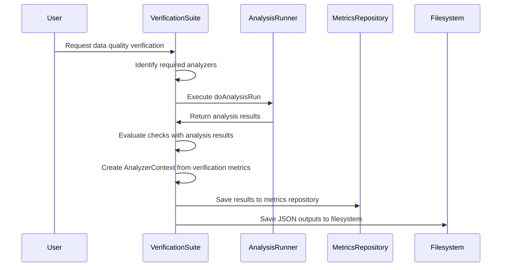

# Where is this flow used?

This flow is used multiple times in the codebase as represented in the following diagram:

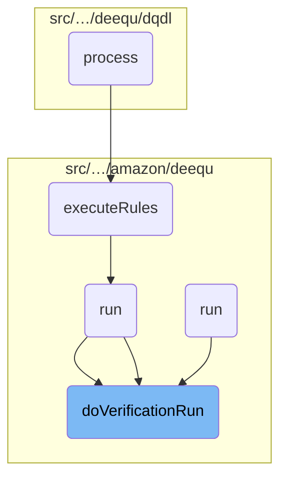

Here is a high level diagram of the flow, showing only the most important functions:

```mermaid
graph TD;
      subgraph srcmainscalacomamazondeequanalyzers[src/…/deequ/analyzers]
37019a251f21166cf5d6727a9c743dc9a5aac113185efc286bc7d74bb0772dca(doVerificationRun) --> e5752a91830d109e628d9caa4f30f131ae702841d2c1770a788cf852bdffc5c0(doAnalysisRun)
end

subgraph srcmainscalacomamazondeequanalyzers[src/…/deequ/analyzers]
e5752a91830d109e628d9caa4f30f131ae702841d2c1770a788cf852bdffc5c0(doAnalysisRun) --> 58a12ca3f86f1d2817abc3cf55906769ed495e4a8558b3167c84f62273a5d580(runScanningAnalyzers)
end

subgraph srcmainscalacomamazondeequanalyzers[src/…/deequ/analyzers]
e5752a91830d109e628d9caa4f30f131ae702841d2c1770a788cf852bdffc5c0(doAnalysisRun) --> 33733958ecd12639b20b16b3fc55c1930b2973ba070e3a0b1b3ebcc41bf61666(runGroupingAnalyzers)
end

subgraph srcmainscalacomamazondeequanalyzers[src/…/deequ/analyzers]
58a12ca3f86f1d2817abc3cf55906769ed495e4a8558b3167c84f62273a5d580(runScanningAnalyzers) --> 979909e10e7895e96e838a049ce95612612e46e0715b013c2ecb3e854338bf41(calculate)
end

subgraph srcmainscalacomamazondeequanalyzers[src/…/deequ/analyzers]
58a12ca3f86f1d2817abc3cf55906769ed495e4a8558b3167c84f62273a5d580(runScanningAnalyzers) --> 1f1c2b4c219a66cd628cf381ec2a237245ea826fdd17ff8fc151d6988e94062b(successOrFailureMetricFrom)
end

subgraph srcmainscalacomamazondeequanalyzers[src/…/deequ/analyzers]
33733958ecd12639b20b16b3fc55c1930b2973ba070e3a0b1b3ebcc41bf61666(runGroupingAnalyzers) --> 3b4b73b181b3a3f8c0d7c66219ae6e63fe8b1a3e2b3299553f8604a6954cee33(runAnalyzersForParticularGrouping)
end

subgraph srcmainscalacomamazondeequanalyzers[src/…/deequ/analyzers]
3b4b73b181b3a3f8c0d7c66219ae6e63fe8b1a3e2b3299553f8604a6954cee33(runAnalyzersForParticularGrouping) --> 1f1c2b4c219a66cd628cf381ec2a237245ea826fdd17ff8fc151d6988e94062b(successOrFailureMetricFrom)
end


      classDef mainFlowStyle color:#000000,fill:#7CB9F4
classDef rootsStyle color:#000000,fill:#00FFF4
classDef Style1 color:#000000,fill:#00FFAA
classDef Style2 color:#000000,fill:#FFFF00
classDef Style3 color:#000000,fill:#AA7CB9

%% Swimm:
%% graph TD;
%%       subgraph srcmainscalacomamazondeequanalyzers[<SwmPath>[src/…/deequ/analyzers/](src/main/scala/com/amazon/deequ/analyzers/)</SwmPath>]
%% 37019a251f21166cf5d6727a9c743dc9a5aac113185efc286bc7d74bb0772dca(<SwmToken path="src/main/scala/com/amazon/deequ/VerificationSuite.scala" pos="78:1:1" line-data="    doVerificationRun(">`doVerificationRun`</SwmToken>) --> e5752a91830d109e628d9caa4f30f131ae702841d2c1770a788cf852bdffc5c0(<SwmToken path="src/main/scala/com/amazon/deequ/VerificationSuite.scala" pos="121:9:9" line-data="    val analysisResults = AnalysisRunner.doAnalysisRun(">`doAnalysisRun`</SwmToken>)
%% end
%% 
%% subgraph srcmainscalacomamazondeequanalyzers[<SwmPath>[src/…/deequ/analyzers/](src/main/scala/com/amazon/deequ/analyzers/)</SwmPath>]
%% e5752a91830d109e628d9caa4f30f131ae702841d2c1770a788cf852bdffc5c0(<SwmToken path="src/main/scala/com/amazon/deequ/VerificationSuite.scala" pos="121:9:9" line-data="    val analysisResults = AnalysisRunner.doAnalysisRun(">`doAnalysisRun`</SwmToken>) --> 58a12ca3f86f1d2817abc3cf55906769ed495e4a8558b3167c84f62273a5d580(<SwmToken path="src/main/scala/com/amazon/deequ/analyzers/runners/AnalysisRunner.scala" pos="169:1:1" line-data="      runScanningAnalyzers(data, scanningAnalyzers, aggregateWith, saveStatesWith)">`runScanningAnalyzers`</SwmToken>)
%% end
%% 
%% subgraph srcmainscalacomamazondeequanalyzers[<SwmPath>[src/…/deequ/analyzers/](src/main/scala/com/amazon/deequ/analyzers/)</SwmPath>]
%% e5752a91830d109e628d9caa4f30f131ae702841d2c1770a788cf852bdffc5c0(<SwmToken path="src/main/scala/com/amazon/deequ/VerificationSuite.scala" pos="121:9:9" line-data="    val analysisResults = AnalysisRunner.doAnalysisRun(">`doAnalysisRun`</SwmToken>) --> 33733958ecd12639b20b16b3fc55c1930b2973ba070e3a0b1b3ebcc41bf61666(<SwmToken path="src/main/scala/com/amazon/deequ/analyzers/runners/AnalysisRunner.scala" pos="186:1:1" line-data="          runGroupingAnalyzers(data, groupingColumns, filterCondition, analyzersForGrouping,">`runGroupingAnalyzers`</SwmToken>)
%% end
%% 
%% subgraph srcmainscalacomamazondeequanalyzers[<SwmPath>[src/…/deequ/analyzers/](src/main/scala/com/amazon/deequ/analyzers/)</SwmPath>]
%% 58a12ca3f86f1d2817abc3cf55906769ed495e4a8558b3167c84f62273a5d580(<SwmToken path="src/main/scala/com/amazon/deequ/analyzers/runners/AnalysisRunner.scala" pos="169:1:1" line-data="      runScanningAnalyzers(data, scanningAnalyzers, aggregateWith, saveStatesWith)">`runScanningAnalyzers`</SwmToken>) --> 979909e10e7895e96e838a049ce95612612e46e0715b013c2ecb3e854338bf41(calculate)
%% end
%% 
%% subgraph srcmainscalacomamazondeequanalyzers[<SwmPath>[src/…/deequ/analyzers/](src/main/scala/com/amazon/deequ/analyzers/)</SwmPath>]
%% 58a12ca3f86f1d2817abc3cf55906769ed495e4a8558b3167c84f62273a5d580(<SwmToken path="src/main/scala/com/amazon/deequ/analyzers/runners/AnalysisRunner.scala" pos="169:1:1" line-data="      runScanningAnalyzers(data, scanningAnalyzers, aggregateWith, saveStatesWith)">`runScanningAnalyzers`</SwmToken>) --> 1f1c2b4c219a66cd628cf381ec2a237245ea826fdd17ff8fc151d6988e94062b(<SwmToken path="src/main/scala/com/amazon/deequ/analyzers/runners/AnalysisRunner.scala" pos="330:1:1" line-data="            successOrFailureMetricFrom(analyzer, results, offset, aggregateWith, saveStatesTo)">`successOrFailureMetricFrom`</SwmToken>)
%% end
%% 
%% subgraph srcmainscalacomamazondeequanalyzers[<SwmPath>[src/…/deequ/analyzers/](src/main/scala/com/amazon/deequ/analyzers/)</SwmPath>]
%% 33733958ecd12639b20b16b3fc55c1930b2973ba070e3a0b1b3ebcc41bf61666(<SwmToken path="src/main/scala/com/amazon/deequ/analyzers/runners/AnalysisRunner.scala" pos="186:1:1" line-data="          runGroupingAnalyzers(data, groupingColumns, filterCondition, analyzersForGrouping,">`runGroupingAnalyzers`</SwmToken>) --> 3b4b73b181b3a3f8c0d7c66219ae6e63fe8b1a3e2b3299553f8604a6954cee33(<SwmToken path="src/main/scala/com/amazon/deequ/analyzers/runners/AnalysisRunner.scala" pos="298:7:7" line-data="    val results = runAnalyzersForParticularGrouping(frequenciesAndNumRows, analyzers, saveStatesTo,">`runAnalyzersForParticularGrouping`</SwmToken>)
%% end
%% 
%% subgraph srcmainscalacomamazondeequanalyzers[<SwmPath>[src/…/deequ/analyzers/](src/main/scala/com/amazon/deequ/analyzers/)</SwmPath>]
%% 3b4b73b181b3a3f8c0d7c66219ae6e63fe8b1a3e2b3299553f8604a6954cee33(<SwmToken path="src/main/scala/com/amazon/deequ/analyzers/runners/AnalysisRunner.scala" pos="298:7:7" line-data="    val results = runAnalyzersForParticularGrouping(frequenciesAndNumRows, analyzers, saveStatesTo,">`runAnalyzersForParticularGrouping`</SwmToken>) --> 1f1c2b4c219a66cd628cf381ec2a237245ea826fdd17ff8fc151d6988e94062b(<SwmToken path="src/main/scala/com/amazon/deequ/analyzers/runners/AnalysisRunner.scala" pos="330:1:1" line-data="            successOrFailureMetricFrom(analyzer, results, offset, aggregateWith, saveStatesTo)">`successOrFailureMetricFrom`</SwmToken>)
%% end
%% 
%% 
%%       classDef mainFlowStyle color:#000000,fill:#7CB9F4
%% classDef rootsStyle color:#000000,fill:#00FFF4
%% classDef Style1 color:#000000,fill:#00FFAA
%% classDef Style2 color:#000000,fill:#FFFF00
%% classDef Style3 color:#000000,fill:#AA7CB9
```

# <SwmToken path="src/main/scala/com/amazon/deequ/VerificationSuite.scala" pos="78:1:1" line-data="    doVerificationRun(">`doVerificationRun`</SwmToken>

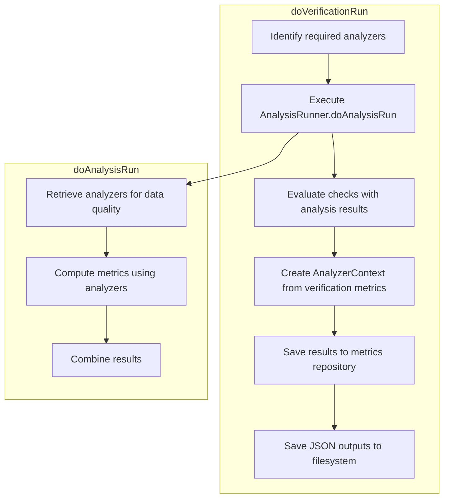

<SwmSnippet path="/src/main/scala/com/amazon/deequ/VerificationSuite.scala" line="119">

---

First, the function <SwmToken path="src/main/scala/com/amazon/deequ/VerificationSuite.scala" pos="78:1:1" line-data="    doVerificationRun(">`doVerificationRun`</SwmToken> begins by combining the required analyzers with the analyzers needed for the checks. This ensures that all necessary metrics are computed during the verification process.

```scala
    val analyzers = requiredAnalyzers ++ checks.flatMap { _.requiredAnalyzers() }

```

---

</SwmSnippet>

<SwmSnippet path="/src/main/scala/com/amazon/deequ/VerificationSuite.scala" line="121">

---

Next, the function calls <SwmToken path="src/main/scala/com/amazon/deequ/VerificationSuite.scala" pos="121:9:9" line-data="    val analysisResults = AnalysisRunner.doAnalysisRun(">`doAnalysisRun`</SwmToken> from the <SwmToken path="src/main/scala/com/amazon/deequ/VerificationSuite.scala" pos="121:7:7" line-data="    val analysisResults = AnalysisRunner.doAnalysisRun(">`AnalysisRunner`</SwmToken> to compute the metrics for data quality using the defined analyzers. This step is crucial as it aggregates the results from the analyzers, which are then used for verification.

```scala
    val analysisResults = AnalysisRunner.doAnalysisRun(
      data,
      analyzers.distinct,
      aggregateWith,
      saveStatesWith,
      metricsRepositoryOptions = AnalysisRunnerRepositoryOptions(
        metricsRepositoryOptions.metricsRepository,
        metricsRepositoryOptions.reuseExistingResultsForKey,
        metricsRepositoryOptions.failIfResultsForReusingMissing,
        saveOrAppendResultsWithKey = None))
```

---

</SwmSnippet>

<SwmSnippet path="/src/main/scala/com/amazon/deequ/VerificationSuite.scala" line="132">

---

Then, the function evaluates the checks against the analysis results. This step determines the overall status and detailed status for each constraint, providing a comprehensive verification result.

```scala
    val verificationResult = evaluate(checks, analysisResults)

```

---

</SwmSnippet>

<SwmSnippet path="/src/main/scala/com/amazon/deequ/VerificationSuite.scala" line="136">

---

Moving to the next step, the function saves or appends the results to the metrics repository if necessary. This ensures that the computed metrics are stored for future reference or further analysis.

```scala
    saveOrAppendResultsIfNecessary(
      analyzerContext,
      metricsRepositoryOptions.metricsRepository,
      metricsRepositoryOptions.saveOrAppendResultsWithKey)

```

---

</SwmSnippet>

<SwmSnippet path="/src/main/scala/com/amazon/deequ/VerificationSuite.scala" line="141">

---

Finally, the function saves the JSON outputs to the filesystem if required. This step provides a way to persist the verification results in a structured format for external use or reporting.

```scala
    saveJsonOutputsToFilesystemIfNecessary(fileOutputOptions, verificationResult)
```

---

</SwmSnippet>

# <SwmToken path="src/main/scala/com/amazon/deequ/VerificationSuite.scala" pos="121:9:9" line-data="    val analysisResults = AnalysisRunner.doAnalysisRun(">`doAnalysisRun`</SwmToken>

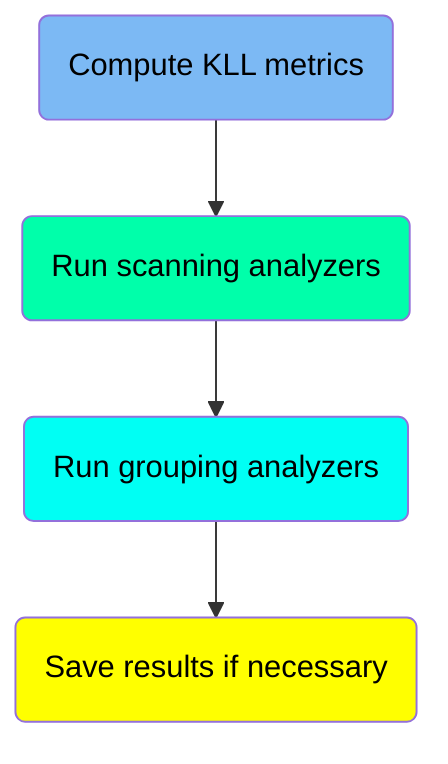

## Compute KLL metrics

Here is a diagram of this part:

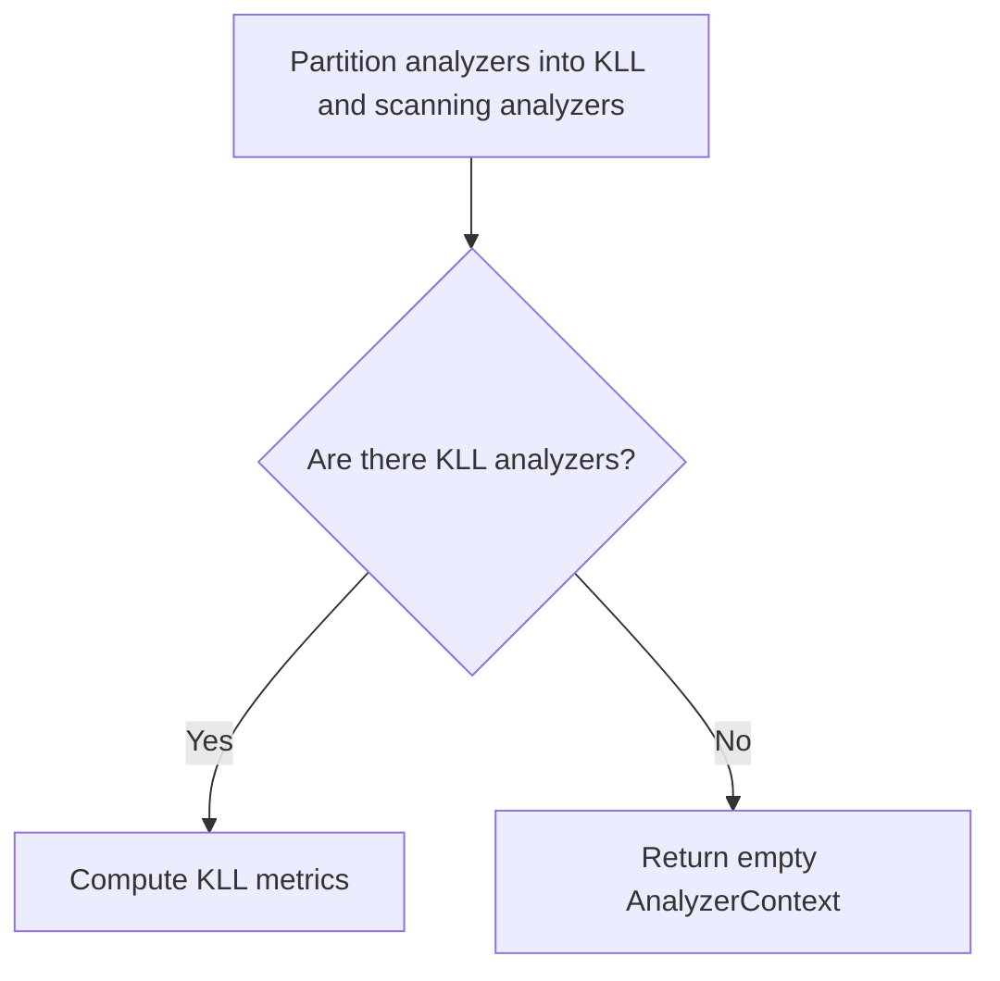

<SwmSnippet path="/src/main/scala/com/amazon/deequ/analyzers/runners/AnalysisRunner.scala" line="157">

---

The function first partitions the analyzers into two groups: <SwmToken path="src/main/scala/com/amazon/deequ/analyzers/runners/AnalysisRunner.scala" pos="157:4:4" line-data="    val (kllAnalyzers, scanningAnalyzers) =">`kllAnalyzers`</SwmToken> (those that are instances of <SwmToken path="src/main/scala/com/amazon/deequ/analyzers/runners/AnalysisRunner.scala" pos="158:11:11" line-data="      allScanningAnalyzers.partition { _.isInstanceOf[KLLSketch] }">`KLLSketch`</SwmToken>) and <SwmToken path="src/main/scala/com/amazon/deequ/analyzers/runners/AnalysisRunner.scala" pos="157:7:7" line-data="    val (kllAnalyzers, scanningAnalyzers) =">`scanningAnalyzers`</SwmToken> (all other analyzers). This is done to separate the analyzers that require a specific computation method.

```scala
    val (kllAnalyzers, scanningAnalyzers) =
      allScanningAnalyzers.partition { _.isInstanceOf[KLLSketch] }
```

---

</SwmSnippet>

<SwmSnippet path="/src/main/scala/com/amazon/deequ/analyzers/runners/AnalysisRunner.scala" line="160">

---

If there are any <SwmToken path="src/main/scala/com/amazon/deequ/analyzers/runners/AnalysisRunner.scala" pos="161:4:4" line-data="      if (kllAnalyzers.nonEmpty) {">`kllAnalyzers`</SwmToken>, the function proceeds to compute the KLL metrics by calling <SwmToken path="src/main/scala/com/amazon/deequ/analyzers/runners/AnalysisRunner.scala" pos="162:1:3" line-data="        KLLRunner.computeKLLSketchesInExtraPass(data, kllAnalyzers, aggregateWith, saveStatesWith)">`KLLRunner.computeKLLSketchesInExtraPass`</SwmToken>. This method performs an additional pass over the data to compute the required KLL sketches. If there are no <SwmToken path="src/main/scala/com/amazon/deequ/analyzers/runners/AnalysisRunner.scala" pos="161:4:4" line-data="      if (kllAnalyzers.nonEmpty) {">`kllAnalyzers`</SwmToken>, it returns an empty <SwmToken path="src/main/scala/com/amazon/deequ/analyzers/runners/AnalysisRunner.scala" pos="164:1:1" line-data="        AnalyzerContext.empty">`AnalyzerContext`</SwmToken>.

```scala
    val kllMetrics =
      if (kllAnalyzers.nonEmpty) {
        KLLRunner.computeKLLSketchesInExtraPass(data, kllAnalyzers, aggregateWith, saveStatesWith)
      } else {
        AnalyzerContext.empty
      }
```

---

</SwmSnippet>

## Run scanning analyzers

Here is a diagram of this part:

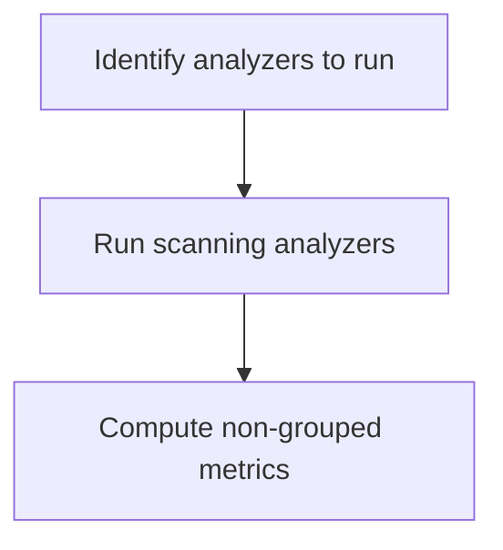

<SwmSnippet path="/src/main/scala/com/amazon/deequ/analyzers/runners/AnalysisRunner.scala" line="168">

---

The function <SwmToken path="src/main/scala/com/amazon/deequ/VerificationSuite.scala" pos="121:9:9" line-data="    val analysisResults = AnalysisRunner.doAnalysisRun(">`doAnalysisRun`</SwmToken> is responsible for computing metrics from the analyzers configured in the analysis. One of the core steps in this function is running the scanning analyzers on the provided dataset. This is achieved by calling the <SwmToken path="src/main/scala/com/amazon/deequ/analyzers/runners/AnalysisRunner.scala" pos="169:1:1" line-data="      runScanningAnalyzers(data, scanningAnalyzers, aggregateWith, saveStatesWith)">`runScanningAnalyzers`</SwmToken> function, which processes the data to compute the necessary metrics.

```scala
    val nonGroupedMetrics =
      runScanningAnalyzers(data, scanningAnalyzers, aggregateWith, saveStatesWith)
```

---

</SwmSnippet>

## Run grouping analyzers

Here is a diagram of this part:

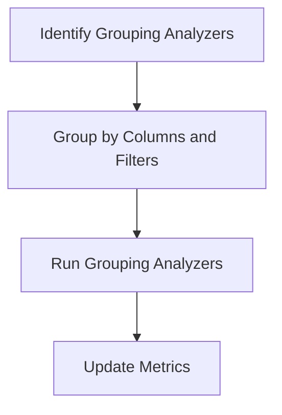

<SwmSnippet path="/src/main/scala/com/amazon/deequ/analyzers/runners/AnalysisRunner.scala" line="180">

---

The function first identifies the analyzers that require grouping by casting them to <SwmToken path="src/main/scala/com/amazon/deequ/analyzers/runners/AnalysisRunner.scala" pos="181:10:10" line-data="      .map { _.asInstanceOf[GroupingAnalyzer[State[_], Metric[_]]] }">`GroupingAnalyzer`</SwmToken> and then groups them based on their required grouping columns and filter conditions.

```scala
    groupingAnalyzers
      .map { _.asInstanceOf[GroupingAnalyzer[State[_], Metric[_]]] }
      .groupBy { a => (a.groupingColumns().sorted, getFilterCondition(a)) }
      .foreach { case ((groupingColumns, filterCondition), analyzersForGrouping) =>
```

---

</SwmSnippet>

<SwmSnippet path="/src/main/scala/com/amazon/deequ/analyzers/runners/AnalysisRunner.scala" line="184">

---

For each group of analyzers, the function runs them using the <SwmToken path="src/main/scala/com/amazon/deequ/analyzers/runners/AnalysisRunner.scala" pos="186:1:1" line-data="          runGroupingAnalyzers(data, groupingColumns, filterCondition, analyzersForGrouping,">`runGroupingAnalyzers`</SwmToken> method, which processes the data based on the specified grouping columns and filter conditions. This step computes the necessary metrics for each group of analyzers.

```scala

        val (numRows, metrics) =
          runGroupingAnalyzers(data, groupingColumns, filterCondition, analyzersForGrouping,
            aggregateWith, saveStatesWith, storageLevelOfGroupedDataForMultiplePasses,
            numRowsOfData)
```

---

</SwmSnippet>

<SwmSnippet path="/src/main/scala/com/amazon/deequ/analyzers/runners/AnalysisRunner.scala" line="189">

---

After running the grouping analyzers, the function updates the <SwmToken path="src/main/scala/com/amazon/deequ/analyzers/runners/AnalysisRunner.scala" pos="190:1:1" line-data="        groupedMetrics = groupedMetrics ++ metrics">`groupedMetrics`</SwmToken> with the newly computed metrics. If the number of rows in the data is not yet known, it is updated after the first pass of running the grouping analyzers.

```scala

        groupedMetrics = groupedMetrics ++ metrics

        /* if we don't know the size of the data yet, we know it after the first pass */
        if (numRowsOfData.isEmpty) {
          numRowsOfData = Option(numRows)
        }
      }
```

---

</SwmSnippet>

## Save results if necessary

Here is a diagram of this part:

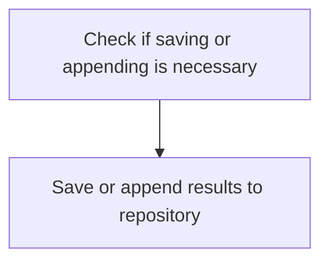

<SwmSnippet path="/src/main/scala/com/amazon/deequ/analyzers/runners/AnalysisRunner.scala" line="201">

---

The function <SwmToken path="src/main/scala/com/amazon/deequ/analyzers/runners/AnalysisRunner.scala" pos="201:1:1" line-data="    saveOrAppendResultsIfNecessary(">`saveOrAppendResultsIfNecessary`</SwmToken> is called to handle the saving or appending of the computed metrics to the metrics repository if it is required. This step ensures that the results of the analysis are persisted for future reference or further analysis.

```scala
    saveOrAppendResultsIfNecessary(
      resultingAnalyzerContext,
      metricsRepositoryOptions.metricsRepository,
      metricsRepositoryOptions.saveOrAppendResultsWithKey)

```

---

</SwmSnippet>

# <SwmToken path="src/main/scala/com/amazon/deequ/analyzers/runners/AnalysisRunner.scala" pos="169:1:1" line-data="      runScanningAnalyzers(data, scanningAnalyzers, aggregateWith, saveStatesWith)">`runScanningAnalyzers`</SwmToken> & calculate & <SwmToken path="src/main/scala/com/amazon/deequ/analyzers/runners/AnalysisRunner.scala" pos="330:1:1" line-data="            successOrFailureMetricFrom(analyzer, results, offset, aggregateWith, saveStatesTo)">`successOrFailureMetricFrom`</SwmToken>

```mermaid
graph TD
  subgraph runScanningAnalyzers
    runScanningAnalyzers:A["Identify shareable analyzers"] --> runScanningAnalyzers:B["Compute aggregation functions of shareable analyzers"]
    runScanningAnalyzers:B -->|If shareable analyzers are non-empty| runScanningAnalyzers:C["Compute offsets and aggregation results"]
    runScanningAnalyzers:C --> runScanningAnalyzers:D["Call successOrFailureMetricFrom for each analyzer"]
    runScanningAnalyzers:B -->|If no shareable analyzers| runScanningAnalyzers:E["Return empty AnalyzerContext"]
    runScanningAnalyzers:D --> runScanningAnalyzers:F["Return sharedResults"]
    runScanningAnalyzers:F --> runScanningAnalyzers:G["Run non-shareable analyzers"]
    runScanningAnalyzers:G --> runScanningAnalyzers:H["Call calculate for each analyzer"]
    runScanningAnalyzers:H --> runScanningAnalyzers:I["Combine sharedResults and otherMetrics and return"]
  end
  subgraph calculate
    calculate:A["Run preconditions"] --> calculate:B["Compute state from data"]
    calculate:B --> calculate:C["Calculate metric from state"]
    calculate:C --> calculate:D["Return metric"]
  end
  subgraph successOrFailureMetricFrom
    successOrFailureMetricFrom:A["Produce metric from aggregation result"] --> successOrFailureMetricFrom:B["Return metric"]
    successOrFailureMetricFrom:A -->|In case of exception| successOrFailureMetricFrom:C["Return failure metric"]
  end
  runScanningAnalyzers:D --> successOrFailureMetricFrom
  runScanningAnalyzers:H --> calculate

%% Swimm:
%% graph TD
%%   subgraph <SwmToken path="src/main/scala/com/amazon/deequ/analyzers/runners/AnalysisRunner.scala" pos="169:1:1" line-data="      runScanningAnalyzers(data, scanningAnalyzers, aggregateWith, saveStatesWith)">`runScanningAnalyzers`</SwmToken>
%%     <SwmToken path="src/main/scala/com/amazon/deequ/analyzers/runners/AnalysisRunner.scala" pos="169:1:1" line-data="      runScanningAnalyzers(data, scanningAnalyzers, aggregateWith, saveStatesWith)">`runScanningAnalyzers`</SwmToken>:A["Identify shareable analyzers"] --> <SwmToken path="src/main/scala/com/amazon/deequ/analyzers/runners/AnalysisRunner.scala" pos="169:1:1" line-data="      runScanningAnalyzers(data, scanningAnalyzers, aggregateWith, saveStatesWith)">`runScanningAnalyzers`</SwmToken>:B["Compute aggregation functions of shareable analyzers"]
%%     <SwmToken path="src/main/scala/com/amazon/deequ/analyzers/runners/AnalysisRunner.scala" pos="169:1:1" line-data="      runScanningAnalyzers(data, scanningAnalyzers, aggregateWith, saveStatesWith)">`runScanningAnalyzers`</SwmToken>:B -->|If shareable analyzers are non-empty| <SwmToken path="src/main/scala/com/amazon/deequ/analyzers/runners/AnalysisRunner.scala" pos="169:1:1" line-data="      runScanningAnalyzers(data, scanningAnalyzers, aggregateWith, saveStatesWith)">`runScanningAnalyzers`</SwmToken>:C["Compute offsets and aggregation results"]
%%     <SwmToken path="src/main/scala/com/amazon/deequ/analyzers/runners/AnalysisRunner.scala" pos="169:1:1" line-data="      runScanningAnalyzers(data, scanningAnalyzers, aggregateWith, saveStatesWith)">`runScanningAnalyzers`</SwmToken>:C --> <SwmToken path="src/main/scala/com/amazon/deequ/analyzers/runners/AnalysisRunner.scala" pos="169:1:1" line-data="      runScanningAnalyzers(data, scanningAnalyzers, aggregateWith, saveStatesWith)">`runScanningAnalyzers`</SwmToken>:D["Call <SwmToken path="src/main/scala/com/amazon/deequ/analyzers/runners/AnalysisRunner.scala" pos="330:1:1" line-data="            successOrFailureMetricFrom(analyzer, results, offset, aggregateWith, saveStatesTo)">`successOrFailureMetricFrom`</SwmToken> for each analyzer"]
%%     <SwmToken path="src/main/scala/com/amazon/deequ/analyzers/runners/AnalysisRunner.scala" pos="169:1:1" line-data="      runScanningAnalyzers(data, scanningAnalyzers, aggregateWith, saveStatesWith)">`runScanningAnalyzers`</SwmToken>:B -->|If no shareable analyzers| <SwmToken path="src/main/scala/com/amazon/deequ/analyzers/runners/AnalysisRunner.scala" pos="169:1:1" line-data="      runScanningAnalyzers(data, scanningAnalyzers, aggregateWith, saveStatesWith)">`runScanningAnalyzers`</SwmToken>:E["Return empty <SwmToken path="src/main/scala/com/amazon/deequ/analyzers/runners/AnalysisRunner.scala" pos="164:1:1" line-data="        AnalyzerContext.empty">`AnalyzerContext`</SwmToken>"]
%%     <SwmToken path="src/main/scala/com/amazon/deequ/analyzers/runners/AnalysisRunner.scala" pos="169:1:1" line-data="      runScanningAnalyzers(data, scanningAnalyzers, aggregateWith, saveStatesWith)">`runScanningAnalyzers`</SwmToken>:D --> <SwmToken path="src/main/scala/com/amazon/deequ/analyzers/runners/AnalysisRunner.scala" pos="169:1:1" line-data="      runScanningAnalyzers(data, scanningAnalyzers, aggregateWith, saveStatesWith)">`runScanningAnalyzers`</SwmToken>:F["Return <SwmToken path="src/main/scala/com/amazon/deequ/analyzers/runners/AnalysisRunner.scala" pos="318:3:3" line-data="    val sharedResults = if (shareableAnalyzers.nonEmpty) {">`sharedResults`</SwmToken>"]
%%     <SwmToken path="src/main/scala/com/amazon/deequ/analyzers/runners/AnalysisRunner.scala" pos="169:1:1" line-data="      runScanningAnalyzers(data, scanningAnalyzers, aggregateWith, saveStatesWith)">`runScanningAnalyzers`</SwmToken>:F --> <SwmToken path="src/main/scala/com/amazon/deequ/analyzers/runners/AnalysisRunner.scala" pos="169:1:1" line-data="      runScanningAnalyzers(data, scanningAnalyzers, aggregateWith, saveStatesWith)">`runScanningAnalyzers`</SwmToken>:G["Run <SwmToken path="src/main/scala/com/amazon/deequ/analyzers/runners/AnalysisRunner.scala" pos="341:5:7" line-data="    /* Run non-shareable analyzers separately */">`non-shareable`</SwmToken> analyzers"]
%%     <SwmToken path="src/main/scala/com/amazon/deequ/analyzers/runners/AnalysisRunner.scala" pos="169:1:1" line-data="      runScanningAnalyzers(data, scanningAnalyzers, aggregateWith, saveStatesWith)">`runScanningAnalyzers`</SwmToken>:G --> <SwmToken path="src/main/scala/com/amazon/deequ/analyzers/runners/AnalysisRunner.scala" pos="169:1:1" line-data="      runScanningAnalyzers(data, scanningAnalyzers, aggregateWith, saveStatesWith)">`runScanningAnalyzers`</SwmToken>:H["Call calculate for each analyzer"]
%%     <SwmToken path="src/main/scala/com/amazon/deequ/analyzers/runners/AnalysisRunner.scala" pos="169:1:1" line-data="      runScanningAnalyzers(data, scanningAnalyzers, aggregateWith, saveStatesWith)">`runScanningAnalyzers`</SwmToken>:H --> <SwmToken path="src/main/scala/com/amazon/deequ/analyzers/runners/AnalysisRunner.scala" pos="169:1:1" line-data="      runScanningAnalyzers(data, scanningAnalyzers, aggregateWith, saveStatesWith)">`runScanningAnalyzers`</SwmToken>:I["Combine <SwmToken path="src/main/scala/com/amazon/deequ/analyzers/runners/AnalysisRunner.scala" pos="318:3:3" line-data="    val sharedResults = if (shareableAnalyzers.nonEmpty) {">`sharedResults`</SwmToken> and <SwmToken path="src/main/scala/com/amazon/deequ/analyzers/runners/AnalysisRunner.scala" pos="342:3:3" line-data="    val otherMetrics = others">`otherMetrics`</SwmToken> and return"]
%%   end
%%   subgraph calculate
%%     calculate:A["Run preconditions"] --> calculate:B["Compute state from data"]
%%     calculate:B --> calculate:C["Calculate metric from state"]
%%     calculate:C --> calculate:D["Return metric"]
%%   end
%%   subgraph <SwmToken path="src/main/scala/com/amazon/deequ/analyzers/runners/AnalysisRunner.scala" pos="330:1:1" line-data="            successOrFailureMetricFrom(analyzer, results, offset, aggregateWith, saveStatesTo)">`successOrFailureMetricFrom`</SwmToken>
%%     <SwmToken path="src/main/scala/com/amazon/deequ/analyzers/runners/AnalysisRunner.scala" pos="330:1:1" line-data="            successOrFailureMetricFrom(analyzer, results, offset, aggregateWith, saveStatesTo)">`successOrFailureMetricFrom`</SwmToken>:A["Produce metric from aggregation result"] --> <SwmToken path="src/main/scala/com/amazon/deequ/analyzers/runners/AnalysisRunner.scala" pos="330:1:1" line-data="            successOrFailureMetricFrom(analyzer, results, offset, aggregateWith, saveStatesTo)">`successOrFailureMetricFrom`</SwmToken>:B["Return metric"]
%%     <SwmToken path="src/main/scala/com/amazon/deequ/analyzers/runners/AnalysisRunner.scala" pos="330:1:1" line-data="            successOrFailureMetricFrom(analyzer, results, offset, aggregateWith, saveStatesTo)">`successOrFailureMetricFrom`</SwmToken>:A -->|In case of exception| <SwmToken path="src/main/scala/com/amazon/deequ/analyzers/runners/AnalysisRunner.scala" pos="330:1:1" line-data="            successOrFailureMetricFrom(analyzer, results, offset, aggregateWith, saveStatesTo)">`successOrFailureMetricFrom`</SwmToken>:C["Return failure metric"]
%%   end
%%   <SwmToken path="src/main/scala/com/amazon/deequ/analyzers/runners/AnalysisRunner.scala" pos="169:1:1" line-data="      runScanningAnalyzers(data, scanningAnalyzers, aggregateWith, saveStatesWith)">`runScanningAnalyzers`</SwmToken>:D --> <SwmToken path="src/main/scala/com/amazon/deequ/analyzers/runners/AnalysisRunner.scala" pos="330:1:1" line-data="            successOrFailureMetricFrom(analyzer, results, offset, aggregateWith, saveStatesTo)">`successOrFailureMetricFrom`</SwmToken>
%%   <SwmToken path="src/main/scala/com/amazon/deequ/analyzers/runners/AnalysisRunner.scala" pos="169:1:1" line-data="      runScanningAnalyzers(data, scanningAnalyzers, aggregateWith, saveStatesWith)">`runScanningAnalyzers`</SwmToken>:H --> calculate
```

<SwmSnippet path="/src/main/scala/com/amazon/deequ/analyzers/runners/AnalysisRunner.scala" line="311">

---

First, the <SwmToken path="src/main/scala/com/amazon/deequ/analyzers/runners/AnalysisRunner.scala" pos="169:1:1" line-data="      runScanningAnalyzers(data, scanningAnalyzers, aggregateWith, saveStatesWith)">`runScanningAnalyzers`</SwmToken> function identifies which analyzers are shareable by partitioning the provided analyzers into shareable and <SwmToken path="src/main/scala/com/amazon/deequ/analyzers/runners/AnalysisRunner.scala" pos="341:5:7" line-data="    /* Run non-shareable analyzers separately */">`non-shareable`</SwmToken> groups. Shareable analyzers are those that can be computed in a single pass over the data, which optimizes performance by reducing the number of data scans required.

```scala
    /* Identify shareable analyzers */
    val (shareable, others) = analyzers.partition { _.isInstanceOf[ScanShareableAnalyzer[_, _]] }

    val shareableAnalyzers =
      shareable.map { _.asInstanceOf[ScanShareableAnalyzer[State[_], Metric[_]]] }
```

---

</SwmSnippet>

<SwmSnippet path="/src/main/scala/com/amazon/deequ/analyzers/runners/AnalysisRunner.scala" line="318">

---

Next, for the shareable analyzers, the function computes the necessary aggregation functions in a single pass over the data. This step is crucial for efficiency, as it minimizes the computational overhead by aggregating results in one go.

```scala
    val sharedResults = if (shareableAnalyzers.nonEmpty) {

      val metricsByAnalyzer = try {
        val aggregations = shareableAnalyzers.flatMap { _.aggregationFunctions() }

```

---

</SwmSnippet>

<SwmSnippet path="/src/main/scala/com/amazon/deequ/analyzers/runners/AnalysisRunner.scala" line="328">

---

Then, the function processes the aggregation results. It calculates the metrics for each shareable analyzer by mapping the results to either a success or failure metric, depending on whether any exceptions occur during the computation. This ensures that any issues are captured and reported accurately.

```scala
        shareableAnalyzers.zip(offsets).map { case (analyzer, offset) =>
          analyzer ->
            successOrFailureMetricFrom(analyzer, results, offset, aggregateWith, saveStatesTo)
        }
```

---

</SwmSnippet>

<SwmSnippet path="/src/main/scala/com/amazon/deequ/analyzers/runners/AnalysisRunner.scala" line="342">

---

Moving to the <SwmToken path="src/main/scala/com/amazon/deequ/analyzers/runners/AnalysisRunner.scala" pos="341:5:7" line-data="    /* Run non-shareable analyzers separately */">`non-shareable`</SwmToken> analyzers, the function runs these separately. Each <SwmToken path="src/main/scala/com/amazon/deequ/analyzers/runners/AnalysisRunner.scala" pos="341:5:7" line-data="    /* Run non-shareable analyzers separately */">`non-shareable`</SwmToken> analyzer calculates its metric individually, ensuring that all necessary data quality checks are performed comprehensively.

```scala
    val otherMetrics = others
      .map { analyzer => analyzer -> analyzer.calculate(data, aggregateWith, saveStatesTo) }
      .toMap[Analyzer[_, Metric[_]], Metric[_]]
```

---

</SwmSnippet>

<SwmSnippet path="/src/main/scala/com/amazon/deequ/analyzers/Analyzer.scala" line="98">

---

The <SwmToken path="src/main/scala/com/amazon/deequ/analyzers/Analyzer.scala" pos="98:3:3" line-data="  def calculate(">`calculate`</SwmToken> function is responsible for running preconditions and then calculating and returning the metric from the data. Preconditions ensure that the data schema meets the necessary requirements before any computation is performed.

```scala
  def calculate(
      data: DataFrame,
      aggregateWith: Option[StateLoader] = None,
      saveStatesWith: Option[StatePersister] = None,
      filterCondition: Option[String] = None)
    : M = {

    try {
      preconditions.foreach { condition => condition(data.schema) }

```

---

</SwmSnippet>

<SwmSnippet path="/src/main/scala/com/amazon/deequ/analyzers/runners/AnalysisRunner.scala" line="351">

---

Finally, the <SwmToken path="src/main/scala/com/amazon/deequ/analyzers/runners/AnalysisRunner.scala" pos="351:5:5" line-data="  private def successOrFailureMetricFrom(">`successOrFailureMetricFrom`</SwmToken> function maps the computation result to a success or failure metric. This mapping is essential for capturing the outcome of the analysis, whether it succeeded or encountered an error.

```scala
  private def successOrFailureMetricFrom(
      analyzer: ScanShareableAnalyzer[State[_], Metric[_]],
      aggregationResult: Row,
      offset: Int,
      aggregateWith: Option[StateLoader],
      saveStatesTo: Option[StatePersister])
    : Metric[_] = {

    try {
      analyzer.metricFromAggregationResult(aggregationResult, offset, aggregateWith, saveStatesTo)
    } catch {
```

---

</SwmSnippet>

# <SwmToken path="src/main/scala/com/amazon/deequ/analyzers/runners/AnalysisRunner.scala" pos="186:1:1" line-data="          runGroupingAnalyzers(data, groupingColumns, filterCondition, analyzersForGrouping,">`runGroupingAnalyzers`</SwmToken>

```mermaid
graph TD
  subgraph runGroupingAnalyzers
    runGroupingAnalyzers:A["Compute the frequencies of the requested groups"] --> runGroupingAnalyzers:B["Pick one analyzer to store the state for"]
    runGroupingAnalyzers:B --> runGroupingAnalyzers:C["Potentially aggregate states"]
    runGroupingAnalyzers:C --> runGroupingAnalyzers:D["Execute analyzers for particular grouping"]
    runGroupingAnalyzers:D --> runGroupingAnalyzers:E["Return number of rows and results"]
  end

%% Swimm:
%% graph TD
%%   subgraph <SwmToken path="src/main/scala/com/amazon/deequ/analyzers/runners/AnalysisRunner.scala" pos="186:1:1" line-data="          runGroupingAnalyzers(data, groupingColumns, filterCondition, analyzersForGrouping,">`runGroupingAnalyzers`</SwmToken>
%%     <SwmToken path="src/main/scala/com/amazon/deequ/analyzers/runners/AnalysisRunner.scala" pos="186:1:1" line-data="          runGroupingAnalyzers(data, groupingColumns, filterCondition, analyzersForGrouping,">`runGroupingAnalyzers`</SwmToken>:A["Compute the frequencies of the requested groups"] --> <SwmToken path="src/main/scala/com/amazon/deequ/analyzers/runners/AnalysisRunner.scala" pos="186:1:1" line-data="          runGroupingAnalyzers(data, groupingColumns, filterCondition, analyzersForGrouping,">`runGroupingAnalyzers`</SwmToken>:B["Pick one analyzer to store the state for"]
%%     <SwmToken path="src/main/scala/com/amazon/deequ/analyzers/runners/AnalysisRunner.scala" pos="186:1:1" line-data="          runGroupingAnalyzers(data, groupingColumns, filterCondition, analyzersForGrouping,">`runGroupingAnalyzers`</SwmToken>:B --> <SwmToken path="src/main/scala/com/amazon/deequ/analyzers/runners/AnalysisRunner.scala" pos="186:1:1" line-data="          runGroupingAnalyzers(data, groupingColumns, filterCondition, analyzersForGrouping,">`runGroupingAnalyzers`</SwmToken>:C["Potentially aggregate states"]
%%     <SwmToken path="src/main/scala/com/amazon/deequ/analyzers/runners/AnalysisRunner.scala" pos="186:1:1" line-data="          runGroupingAnalyzers(data, groupingColumns, filterCondition, analyzersForGrouping,">`runGroupingAnalyzers`</SwmToken>:C --> <SwmToken path="src/main/scala/com/amazon/deequ/analyzers/runners/AnalysisRunner.scala" pos="186:1:1" line-data="          runGroupingAnalyzers(data, groupingColumns, filterCondition, analyzersForGrouping,">`runGroupingAnalyzers`</SwmToken>:D["Execute analyzers for particular grouping"]
%%     <SwmToken path="src/main/scala/com/amazon/deequ/analyzers/runners/AnalysisRunner.scala" pos="186:1:1" line-data="          runGroupingAnalyzers(data, groupingColumns, filterCondition, analyzersForGrouping,">`runGroupingAnalyzers`</SwmToken>:D --> <SwmToken path="src/main/scala/com/amazon/deequ/analyzers/runners/AnalysisRunner.scala" pos="186:1:1" line-data="          runGroupingAnalyzers(data, groupingColumns, filterCondition, analyzersForGrouping,">`runGroupingAnalyzers`</SwmToken>:E["Return number of rows and results"]
%%   end
```

<SwmSnippet path="/src/main/scala/com/amazon/deequ/analyzers/runners/AnalysisRunner.scala" line="283">

---

First, the function computes the frequencies of the requested groups using the <SwmToken path="src/main/scala/com/amazon/deequ/analyzers/runners/AnalysisRunner.scala" pos="284:9:9" line-data="    var frequenciesAndNumRows = FrequencyBasedAnalyzer.computeFrequencies(data, groupingColumns,">`computeFrequencies`</SwmToken> method. This step is crucial as it prepares the data by grouping it based on specified columns and applying any filter conditions. This grouped data is essential for the subsequent analysis steps.

```scala
    /* Compute the frequencies of the request groups once */
    var frequenciesAndNumRows = FrequencyBasedAnalyzer.computeFrequencies(data, groupingColumns,
      filterCondition)
```

---

</SwmSnippet>

<SwmSnippet path="/src/main/scala/com/amazon/deequ/analyzers/runners/AnalysisRunner.scala" line="291">

---

Next, the function checks if there is a need to aggregate states from previous runs. If an aggregation is required, it loads the previous states and sums them with the current frequencies. This ensures that the analysis considers historical data, providing a more comprehensive view of data quality over time.

```scala
    aggregateWith
      .foreach { _.load[FrequenciesAndNumRows](sampleAnalyzer)
        .foreach { previousFrequenciesAndNumRows =>
          frequenciesAndNumRows = frequenciesAndNumRows.sum(previousFrequenciesAndNumRows)
        }
```

---

</SwmSnippet>

<SwmSnippet path="/src/main/scala/com/amazon/deequ/analyzers/runners/AnalysisRunner.scala" line="298">

---

Then, the function calls <SwmToken path="src/main/scala/com/amazon/deequ/analyzers/runners/AnalysisRunner.scala" pos="298:7:7" line-data="    val results = runAnalyzersForParticularGrouping(frequenciesAndNumRows, analyzers, saveStatesTo,">`runAnalyzersForParticularGrouping`</SwmToken> to execute the analyzers on the grouped data. This step is where the actual data quality measurements are performed, using the analyzers specified. The results from these analyzers provide insights into the quality of the data within each group.

```scala
    val results = runAnalyzersForParticularGrouping(frequenciesAndNumRows, analyzers, saveStatesTo,
        storageLevelOfGroupedDataForMultiplePasses)
```

---

</SwmSnippet>

<SwmSnippet path="/src/main/scala/com/amazon/deequ/analyzers/runners/AnalysisRunner.scala" line="301">

---

Finally, the function returns the number of rows in the grouped data along with the results from the analyzers. This output is used to understand the data quality metrics and make informed decisions based on the analysis.

```scala
    frequenciesAndNumRows.numRows -> results
```

---

</SwmSnippet>

# <SwmToken path="src/main/scala/com/amazon/deequ/analyzers/runners/AnalysisRunner.scala" pos="298:7:7" line-data="    val results = runAnalyzersForParticularGrouping(frequenciesAndNumRows, analyzers, saveStatesTo,">`runAnalyzersForParticularGrouping`</SwmToken>

```mermaid
graph TD
  subgraph runAnalyzersForParticularGrouping
    runAnalyzersForParticularGrouping:A["Identify shareable analyzers"] --> runAnalyzersForParticularGrouping:B["Cache grouped data if needed"] --> runAnalyzersForParticularGrouping:C["Map shareable analyzers"]
    runAnalyzersForParticularGrouping:C --> runAnalyzersForParticularGrouping:D["Execute aggregation if shareable analyzers exist"]
    runAnalyzersForParticularGrouping:D --> runAnalyzersForParticularGrouping:E["Collect results"]
    runAnalyzersForParticularGrouping:E --> runAnalyzersForParticularGrouping:F["Map computation result to success or failure"]
    runAnalyzersForParticularGrouping --> runAnalyzersForParticularGrouping:G["Execute remaining analyzers on grouped data"]
    runAnalyzersForParticularGrouping --> runAnalyzersForParticularGrouping:H["Store states if needed"]
    runAnalyzersForParticularGrouping --> runAnalyzersForParticularGrouping:I["Unpersist grouped data"]
    runAnalyzersForParticularGrouping --> runAnalyzersForParticularGrouping:J["Combine metrics"]
  end

%% Swimm:
%% graph TD
%%   subgraph <SwmToken path="src/main/scala/com/amazon/deequ/analyzers/runners/AnalysisRunner.scala" pos="298:7:7" line-data="    val results = runAnalyzersForParticularGrouping(frequenciesAndNumRows, analyzers, saveStatesTo,">`runAnalyzersForParticularGrouping`</SwmToken>
%%     <SwmToken path="src/main/scala/com/amazon/deequ/analyzers/runners/AnalysisRunner.scala" pos="298:7:7" line-data="    val results = runAnalyzersForParticularGrouping(frequenciesAndNumRows, analyzers, saveStatesTo,">`runAnalyzersForParticularGrouping`</SwmToken>:A["Identify shareable analyzers"] --> <SwmToken path="src/main/scala/com/amazon/deequ/analyzers/runners/AnalysisRunner.scala" pos="298:7:7" line-data="    val results = runAnalyzersForParticularGrouping(frequenciesAndNumRows, analyzers, saveStatesTo,">`runAnalyzersForParticularGrouping`</SwmToken>:B["Cache grouped data if needed"] --> <SwmToken path="src/main/scala/com/amazon/deequ/analyzers/runners/AnalysisRunner.scala" pos="298:7:7" line-data="    val results = runAnalyzersForParticularGrouping(frequenciesAndNumRows, analyzers, saveStatesTo,">`runAnalyzersForParticularGrouping`</SwmToken>:C["Map shareable analyzers"]
%%     <SwmToken path="src/main/scala/com/amazon/deequ/analyzers/runners/AnalysisRunner.scala" pos="298:7:7" line-data="    val results = runAnalyzersForParticularGrouping(frequenciesAndNumRows, analyzers, saveStatesTo,">`runAnalyzersForParticularGrouping`</SwmToken>:C --> <SwmToken path="src/main/scala/com/amazon/deequ/analyzers/runners/AnalysisRunner.scala" pos="298:7:7" line-data="    val results = runAnalyzersForParticularGrouping(frequenciesAndNumRows, analyzers, saveStatesTo,">`runAnalyzersForParticularGrouping`</SwmToken>:D["Execute aggregation if shareable analyzers exist"]
%%     <SwmToken path="src/main/scala/com/amazon/deequ/analyzers/runners/AnalysisRunner.scala" pos="298:7:7" line-data="    val results = runAnalyzersForParticularGrouping(frequenciesAndNumRows, analyzers, saveStatesTo,">`runAnalyzersForParticularGrouping`</SwmToken>:D --> <SwmToken path="src/main/scala/com/amazon/deequ/analyzers/runners/AnalysisRunner.scala" pos="298:7:7" line-data="    val results = runAnalyzersForParticularGrouping(frequenciesAndNumRows, analyzers, saveStatesTo,">`runAnalyzersForParticularGrouping`</SwmToken>:E["Collect results"]
%%     <SwmToken path="src/main/scala/com/amazon/deequ/analyzers/runners/AnalysisRunner.scala" pos="298:7:7" line-data="    val results = runAnalyzersForParticularGrouping(frequenciesAndNumRows, analyzers, saveStatesTo,">`runAnalyzersForParticularGrouping`</SwmToken>:E --> <SwmToken path="src/main/scala/com/amazon/deequ/analyzers/runners/AnalysisRunner.scala" pos="298:7:7" line-data="    val results = runAnalyzersForParticularGrouping(frequenciesAndNumRows, analyzers, saveStatesTo,">`runAnalyzersForParticularGrouping`</SwmToken>:F["Map computation result to success or failure"]
%%     <SwmToken path="src/main/scala/com/amazon/deequ/analyzers/runners/AnalysisRunner.scala" pos="298:7:7" line-data="    val results = runAnalyzersForParticularGrouping(frequenciesAndNumRows, analyzers, saveStatesTo,">`runAnalyzersForParticularGrouping`</SwmToken> --> <SwmToken path="src/main/scala/com/amazon/deequ/analyzers/runners/AnalysisRunner.scala" pos="298:7:7" line-data="    val results = runAnalyzersForParticularGrouping(frequenciesAndNumRows, analyzers, saveStatesTo,">`runAnalyzersForParticularGrouping`</SwmToken>:G["Execute remaining analyzers on grouped data"]
%%     <SwmToken path="src/main/scala/com/amazon/deequ/analyzers/runners/AnalysisRunner.scala" pos="298:7:7" line-data="    val results = runAnalyzersForParticularGrouping(frequenciesAndNumRows, analyzers, saveStatesTo,">`runAnalyzersForParticularGrouping`</SwmToken> --> <SwmToken path="src/main/scala/com/amazon/deequ/analyzers/runners/AnalysisRunner.scala" pos="298:7:7" line-data="    val results = runAnalyzersForParticularGrouping(frequenciesAndNumRows, analyzers, saveStatesTo,">`runAnalyzersForParticularGrouping`</SwmToken>:H["Store states if needed"]
%%     <SwmToken path="src/main/scala/com/amazon/deequ/analyzers/runners/AnalysisRunner.scala" pos="298:7:7" line-data="    val results = runAnalyzersForParticularGrouping(frequenciesAndNumRows, analyzers, saveStatesTo,">`runAnalyzersForParticularGrouping`</SwmToken> --> <SwmToken path="src/main/scala/com/amazon/deequ/analyzers/runners/AnalysisRunner.scala" pos="298:7:7" line-data="    val results = runAnalyzersForParticularGrouping(frequenciesAndNumRows, analyzers, saveStatesTo,">`runAnalyzersForParticularGrouping`</SwmToken>:I["Unpersist grouped data"]
%%     <SwmToken path="src/main/scala/com/amazon/deequ/analyzers/runners/AnalysisRunner.scala" pos="298:7:7" line-data="    val results = runAnalyzersForParticularGrouping(frequenciesAndNumRows, analyzers, saveStatesTo,">`runAnalyzersForParticularGrouping`</SwmToken> --> <SwmToken path="src/main/scala/com/amazon/deequ/analyzers/runners/AnalysisRunner.scala" pos="298:7:7" line-data="    val results = runAnalyzersForParticularGrouping(frequenciesAndNumRows, analyzers, saveStatesTo,">`runAnalyzersForParticularGrouping`</SwmToken>:J["Combine metrics"]
%%   end
```

<SwmSnippet path="/src/main/scala/com/amazon/deequ/analyzers/runners/AnalysisRunner.scala" line="490">

---

The function <SwmToken path="src/main/scala/com/amazon/deequ/analyzers/runners/AnalysisRunner.scala" pos="298:7:7" line-data="    val results = runAnalyzersForParticularGrouping(frequenciesAndNumRows, analyzers, saveStatesTo,">`runAnalyzersForParticularGrouping`</SwmToken> is designed to efficiently execute analyzers for a specific grouping of data. It applies <SwmToken path="src/main/scala/com/amazon/deequ/analyzers/runners/AnalysisRunner.scala" pos="491:5:7" line-data="    * applying scan-sharing where possible */">`scan-sharing`</SwmToken> where possible to optimize performance.

```scala
  /** Efficiently executes the analyzers for a particular grouping,
    * applying scan-sharing where possible */
```

---

</SwmSnippet>

<SwmSnippet path="/src/main/scala/com/amazon/deequ/analyzers/runners/AnalysisRunner.scala" line="502">

---

First, the function identifies all shareable analyzers by partitioning the analyzers into shareable and <SwmToken path="src/main/scala/com/amazon/deequ/analyzers/runners/AnalysisRunner.scala" pos="341:5:7" line-data="    /* Run non-shareable analyzers separately */">`non-shareable`</SwmToken> categories. Shareable analyzers are those that can benefit from <SwmToken path="src/main/scala/com/amazon/deequ/analyzers/runners/AnalysisRunner.scala" pos="491:5:7" line-data="    * applying scan-sharing where possible */">`scan-sharing`</SwmToken>.

```scala
    val (shareable, others) =
      analyzers.partition { _.isInstanceOf[ScanShareableFrequencyBasedAnalyzer] }
```

---

</SwmSnippet>

<SwmSnippet path="/src/main/scala/com/amazon/deequ/analyzers/runners/AnalysisRunner.scala" line="507">

---

Next, if there are <SwmToken path="src/main/scala/com/amazon/deequ/analyzers/runners/AnalysisRunner.scala" pos="341:5:7" line-data="    /* Run non-shareable analyzers separately */">`non-shareable`</SwmToken> analyzers, the function caches the grouped data to allow multiple passes over it. This is controlled via the storage level parameter.

```scala
    if (others.nonEmpty) {
      frequenciesAndNumRows.frequencies.persist(storageLevelOfGroupedDataForMultiplePasses)
    }
```

---

</SwmSnippet>

<SwmSnippet path="/src/main/scala/com/amazon/deequ/analyzers/runners/AnalysisRunner.scala" line="513">

---

Then, the function executes the shareable analyzers by aggregating their functions and computing offsets to correctly pick their results from the row. The results are then mapped to success or failure metrics.

```scala
    val metricsByAnalyzer = if (shareableAnalyzers.nonEmpty) {

      try {
        val aggregations = shareableAnalyzers.flatMap { _.aggregationFunctions(numRows) }
        /* Compute offsets so that the analyzers can correctly pick their results from the row */
        val offsets = shareableAnalyzers.scanLeft(0) { case (current, analyzer) =>
          current + analyzer.aggregationFunctions(numRows).length
        }

        /* Execute aggregation on grouped data */
        val results = frequenciesAndNumRows.frequencies
          .agg(aggregations.head, aggregations.tail: _*)
          .collect()
          .head

        shareableAnalyzers.zip(offsets)
          .map { case (analyzer, offset) =>
            analyzer -> successOrFailureMetricFrom(analyzer, results, offset, frequenciesAndNumRows.fullColumn)
          }
```

---

</SwmSnippet>

<SwmSnippet path="/src/main/scala/com/amazon/deequ/analyzers/runners/AnalysisRunner.scala" line="533">

---

If an exception occurs during the execution of shareable analyzers, the function maps the analyzers to failure metrics.

```scala
        case error: Exception =>
          shareableAnalyzers
            .map { analyzer => analyzer -> analyzer.toFailureMetric(error) }
      }
```

---

</SwmSnippet>

<SwmSnippet path="/src/main/scala/com/amazon/deequ/analyzers/runners/AnalysisRunner.scala" line="543">

---

The function then executes the remaining <SwmToken path="src/main/scala/com/amazon/deequ/analyzers/runners/AnalysisRunner.scala" pos="341:5:7" line-data="    /* Run non-shareable analyzers separately */">`non-shareable`</SwmToken> analyzers on the grouped data and maps their results to metrics.

```scala
    val otherMetrics = try {
      others
        .map { _.asInstanceOf[FrequencyBasedAnalyzer] }
        .map { analyzer => analyzer ->
          analyzer.computeMetricFrom(Option(frequenciesAndNumRows))
        }
```

---

</SwmSnippet>

<SwmSnippet path="/src/main/scala/com/amazon/deequ/analyzers/runners/AnalysisRunner.scala" line="555">

---

Finally, the function potentially stores the states of the analyzers and unpersists the grouped data to free up resources.

```scala
    saveStatesTo.foreach { _.persist(analyzers.head, frequenciesAndNumRows) }

    frequenciesAndNumRows.frequencies.unpersist()
```

---

</SwmSnippet>

&nbsp;

*This is an auto-generated document by Swimm 🌊 and has not yet been verified by a human*

<SwmMeta version="3.0.0" repo-id="Z2l0aHViJTNBJTNBZGVlcXUlM0ElM0Fhd3NsYWJz" repo-name="deequ"><sup>Powered by [Swimm](/)</sup></SwmMeta>
