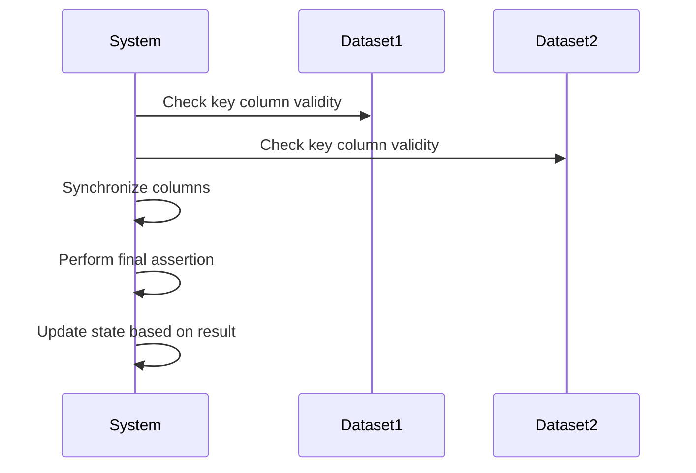
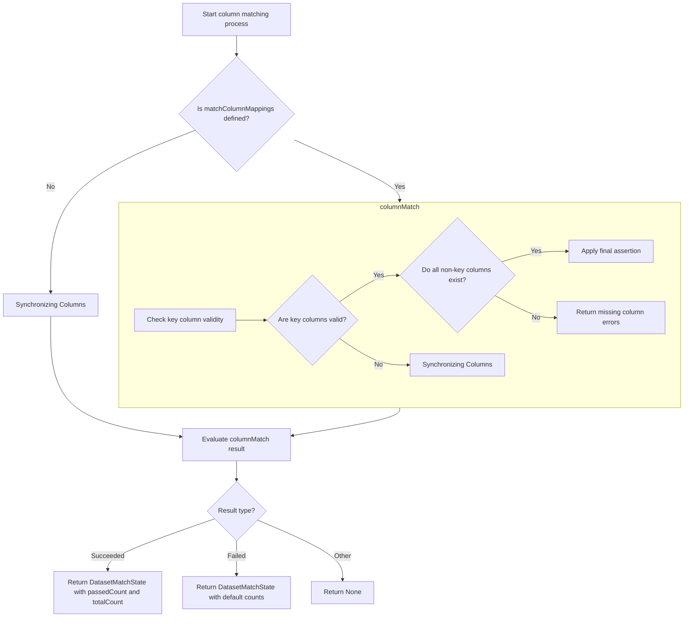
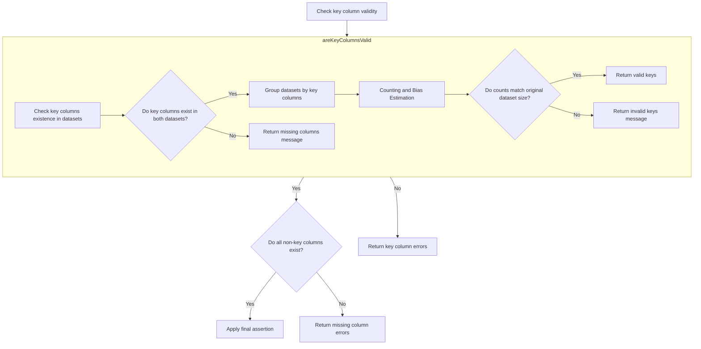
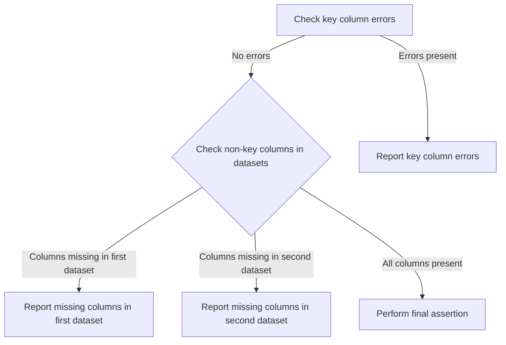

The flow of computing state from a dataset comparison involves synchronizing and validating columns between datasets to ensure accurate comparison. This process is essential in data quality checks where datasets need to be compared for consistency and correctness. The flow receives two datasets as input and outputs a state that reflects the comparison result. The main steps are:

- Determine the need for column synchronization.
- Validate key columns between datasets.
- Synchronize non-key columns.
- Perform a final assertion based on synchronized columns.
- Update the state based on the comparison result.

For instance, if two datasets are being compared to ensure they have matching columns, this flow will validate the presence of key columns, synchronize non-key columns, and perform assertions to determine if the datasets are comparable.



# Initiating State Computation



<SwmSnippet path="/src/main/scala/com/amazon/deequ/analyzers/DatasetMatchAnalyzer.scala" line="72" repo-id="Z2l0aHViJTNBJTNBZGVlcXUlM0ElM0Fhd3NsYWJz">

---

We start the flow by determining the need for column synchronization, which is necessary for accurate comparison. Calling columnMatch next ensures the columns are synchronized and validated.

```scala
  override def computeStateFrom(data: DataFrame, filterCondition: Option[String] = None): Option[DatasetMatchState] = {

    val result = if (matchColumnMappings.isDefined) {
      DataSynchronization.columnMatch(data, dfToCompare, columnMappings, matchColumnMappings.get, assertion)
    } else {
```

---

</SwmSnippet>

## Synchronizing Columns



<SwmSnippet path="/src/main/scala/com/amazon/deequ/comparison/DataSynchronization.scala" line="130" repo-id="Z2l0aHViJTNBJTNBZGVlcXUlM0ElM0Fhd3NsYWJz">

---

Next, we begin validating key columns between datasets, which is crucial for comparison. Calling areKeyColumnsValid ensures these columns exist and are correctly mapped.

```scala
  def columnMatch(ds1: DataFrame,
                  ds2: DataFrame,
                  colKeyMap: Map[String, String],
                  compCols: Map[String, String],
                  assertion: Double => Boolean): ComparisonResult = {
    val keyColumnErrors = areKeyColumnsValid(ds1, ds2, colKeyMap)
```

---

</SwmSnippet>

### Validating Key Columns

```mermaid
flowchart TD
    node1[Check key columns existence in datasets] --> node2{Do key columns exist in both datasets?}
    node2 -->|Yes| node3[Group datasets by key columns]
    node2 -->|No| node4[Return missing columns message]
    node3 --> node5[Counting and Bias Estimation]
    node5 --> node6{Do counts match original dataset size?}
    node6 -->|Yes| node7[Return valid keys]
    node6 -->|No| node8[Return invalid keys message]

subgraph node5 [count]
  sgmain_1_node1[Start cardinality estimation] --> loop1
  subgraph loop1[For each word in words]
  loop1 --> sgmain_1_node2[Compute zInverse and count zeros V]
  end
  loop1 --> sgmain_1_node3{V > 0?}
  sgmain_1_node3 -->|Yes| sgmain_1_node4[Use linear counting]
  sgmain_1_node3 -->|No| sgmain_1_node5[Counting and Bias Estimation]
  sgmain_1_node4 --> sgmain_1_node6[Round to nearest long]
  sgmain_1_node5 --> sgmain_1_node6
  sgmain_1_node6 --> sgmain_1_node7[Return estimated cardinality]
end
```

<SwmSnippet path="/src/main/scala/com/amazon/deequ/comparison/DataSynchronization.scala" line="209" repo-id="Z2l0aHViJTNBJTNBZGVlcXUlM0ElM0Fhd3NsYWJz">

---

First, we check the presence of key columns in both datasets, which is necessary for valid keys. Calling count next verifies their uniqueness.

```scala
  private def areKeyColumnsValid(ds1: DataFrame,
                                 ds2: DataFrame,
                                 colKeyMap: Map[String, String]): Option[String] = {
    val ds1Cols = colKeyMap.keys.toSeq
    val ds2Cols = colKeyMap.values.toSeq

    val ds1ColsNotInDataset = ds1Cols.filterNot(columnExists(ds1, _))
    val ds2ColsNotInDataset = ds2Cols.filterNot(columnExists(ds2, _))

    if (ds1ColsNotInDataset.nonEmpty) {
      Some(s"The following key columns were not found in the first dataset: ${ds1ColsNotInDataset.mkString(", ")}")
    } else if (ds2ColsNotInDataset.nonEmpty) {
      Some(s"The following key columns were not found in the second dataset: ${ds2ColsNotInDataset.mkString(", ")}")
    } else {
      // We verify that the key columns provided form a valid primary/composite key.
      // To achieve this, we group the dataframes and compare their count with the original count.
      // If the key columns provided are valid, then the two counts should match.
      val ds1Unique = ds1.groupBy(ds1Cols.map(col): _*).count()
      val ds2Unique = ds2.groupBy(ds2Cols.map(col): _*).count()

      val ds1Count = ds1.count()
```

---

</SwmSnippet>

#### Counting and Bias Estimation

```mermaid
flowchart TD
    node1[Start cardinality estimation] --> loop1

    subgraph loop1[For each word in words]
        loop1 --> node2[Compute zInverse and count zeros V]
    end

    loop1 --> node3{V > 0?}
    node3 -->|Yes| node4[Use linear counting]
    node3 -->|No| node5[Use bias-corrected estimation]
    node4 --> node6[Round to nearest long]
    node5 --> node6
    node6 --> node7[Return estimated cardinality]
```

<SwmSnippet path="/src/main/scala/com/amazon/deequ/analyzers/catalyst/StatefulHyperloglogPlus.scala" line="213" repo-id="Z2l0aHViJTNBJTNBZGVlcXUlM0ElM0Fhd3NsYWJz">

---

Here, we compute the inverse of 'z' and count zeros 'V', which are fundamental for estimating dataset cardinality.

```scala
  def count(words: Array[Long]): Double = {
    // Compute the inverse of indicator value 'z' and count the number of zeros 'V'.
    var zInverse = 0.0d
    var V = 0.0d
    var idx = 0
    var wordOffset = 0
    while (wordOffset < words.length) {
      val word = words(wordOffset)
      var i = 0
      var shift = 0
      while (idx < M && i < REGISTERS_PER_WORD) {
        val Midx = (word >>> shift) & REGISTER_WORD_MASK
        zInverse += 1.0 / (1 << Midx)
        if (Midx == 0) {
          V += 1.0d
        }
        shift += REGISTER_SIZE
        i += 1
        idx += 1
      }
      wordOffset += 1
    }
```

---

</SwmSnippet>

<SwmSnippet path="/src/main/scala/com/amazon/deequ/analyzers/catalyst/StatefulHyperloglogPlus.scala" line="239" repo-id="Z2l0aHViJTNBJTNBZGVlcXUlM0ElM0Fhd3NsYWJz">

---

Next, we define EBiasCorrected to adjust the cardinality estimate. Calling estimateBias refines this estimate by accounting for systematic errors, enhancing accuracy.

```scala
    @inline
    def EBiasCorrected = ALPHA_M2 / zInverse match {
      case e if P < 19 && e < 5.0d * M => e - estimateBias(e)
      case e => e
    }

    // Estimate the cardinality.
```

---

</SwmSnippet>

<SwmSnippet path="/src/main/scala/com/amazon/deequ/analyzers/catalyst/StatefulHyperloglogPlus.scala" line="262" repo-id="Z2l0aHViJTNBJTNBZGVlcXUlM0ElM0Fhd3NsYWJz">

---

First, we use binary search to find the nearest interpolation estimate, which is crucial for determining bias correction.

```scala
  def estimateBias(e: Double): Double = {
    val estimates = RAW_ESTIMATE_DATA(P - 4)
    val numEstimates = estimates.length

    // The estimates are sorted so we can use a binary search to find the index of the
    // interpolation estimate closest to the current estimate.
    val nearestEstimateIndex = java.util.Arrays.binarySearch(estimates, 0, numEstimates, e) match {
      case ix if ix < 0 => -(ix + 1)
      case ix => ix
    }

    // Use square of the difference between the current estimate and the estimate at the given
    // index as distance metric.
    def distance(i: Int): Double = {
      val diff = e - estimates(i)
      diff * diff
    }

    // Keep moving bounds as long as the (exclusive) high bound is closer to the estimate than
    // the lower (inclusive) bound.
    var low = math.max(nearestEstimateIndex - K + 1, 0)
    var high = math.min(low + K, numEstimates)
    while (high < numEstimates && distance(high) < distance(low)) {
      low += 1
      high += 1
    }
```

---

</SwmSnippet>

<SwmSnippet path="/src/main/scala/com/amazon/deequ/analyzers/catalyst/StatefulHyperloglogPlus.scala" line="290" repo-id="Z2l0aHViJTNBJTNBZGVlcXUlM0ElM0Fhd3NsYWJz">

---

Next, we calculate the sum of biases within bounds, following the binary search and preceding final bias calculation, contributing to bias correction.

```scala
    val biases = BIAS_DATA(P - 4)
    var i = low
    var biasSum = 0.0
    while (i < high) {
      biasSum += biases(i)
      i += 1
    }
```

---

</SwmSnippet>

<SwmSnippet path="/src/main/scala/com/amazon/deequ/analyzers/catalyst/StatefulHyperloglogPlus.scala" line="299" repo-id="Z2l0aHViJTNBJTNBZGVlcXUlM0ElM0Fhd3NsYWJz">

---

Finally, we return the average bias, which is used to correct the cardinality estimate, ensuring accurate analysis.

```scala
    biasSum / (high - low)
  }
```

---

</SwmSnippet>

<SwmSnippet path="/src/main/scala/com/amazon/deequ/analyzers/catalyst/StatefulHyperloglogPlus.scala" line="246" repo-id="Z2l0aHViJTNBJTNBZGVlcXUlM0ElM0Fhd3NsYWJz">

---

Back in count, we use the corrected cardinality estimate from estimateBias to determine the final estimate value, ensuring accurate dataset measure, essential for subsequent operations.

```scala
    val estimate = if (V > 0) {
      // Use linear counting for small cardinality estimates.
      val H = M * Math.log(M / V)
      if (H <= THRESHOLDS(P - 4)) {
        H
      } else {
        EBiasCorrected
      }
    } else {
      EBiasCorrected
    }

    // Round to the nearest long value.
    Math.round(estimate)
  }
```

---

</SwmSnippet>

#### Post-Validation Logic

#### Post-Validation Logic

#### Post-Validation Logic

<SwmSnippet path="/src/main/scala/com/amazon/deequ/comparison/DataSynchronization.scala" line="232" repo-id="Z2l0aHViJTNBJTNBZGVlcXUlM0ElM0Fhd3NsYWJz">

---

Back in areKeyColumnsValid, we compare unique counts to original counts, confirming key column validity. Calling count again ensures accurate comparison.

```scala
      val ds2UniqueCount = ds2Unique.count()

```

---

</SwmSnippet>

#### Post-Validation Logic

<SwmSnippet path="/src/main/scala/com/amazon/deequ/comparison/DataSynchronization.scala" line="234" repo-id="Z2l0aHViJTNBJTNBZGVlcXUlM0ElM0Fhd3NsYWJz">

---

Back in areKeyColumnsValid, we finalize key column validation by checking count matches, impacting subsequent flow.

```scala
      if (ds1UniqueCount == ds1Count && ds2UniqueCount == ds2Count) {
        None
      } else {
        val combo1 = ds1Cols.mkString(", ")
        val combo2 = ds2Cols.mkString(", ")
        Some(s"The selected columns are not comparable due to duplicates present in the dataset." +
          s"Comparison keys must be unique, but " +
          s"in Dataframe 1, there are $ds1UniqueCount unique records and $ds1Count rows," +
          s" and " +
          s"in Dataframe 2, there are $ds2UniqueCount unique records and $ds2Count rows, " +
          s"based on the combination of keys {$combo1} in Dataframe 1 and {$combo2} in Dataframe 2")
      }
    }
  }
```

---

</SwmSnippet>

### Finalizing Column Synchronization



<SwmSnippet path="/src/main/scala/com/amazon/deequ/comparison/DataSynchronization.scala" line="136" repo-id="Z2l0aHViJTNBJTNBZGVlcXUlM0ElM0Fhd3NsYWJz">

---

Back in columnMatch, we check non-key columns and finalize synchronization. Calling finalAssertion performs the comparison based on synchronized columns, achieving the function's goal.

```scala
    if (keyColumnErrors.isEmpty) {
      val nonKeyColumns1NotInDataset = compCols.keys.filterNot(columnExists(ds1, _))
      val nonKeyColumns2NotInDataset = compCols.values.filterNot(columnExists(ds2, _))

      if (nonKeyColumns1NotInDataset.nonEmpty) {
        DatasetMatchFailed(s"The following columns were not found in the first dataset: " +
          s"${nonKeyColumns1NotInDataset.mkString(", ")}")
      } else if (nonKeyColumns2NotInDataset.nonEmpty) {
        DatasetMatchFailed(s"The following columns were not found in the second dataset: " +
          s"${nonKeyColumns2NotInDataset.mkString(", ")}")
      } else {
        val mergedMaps = colKeyMap ++ compCols
        finalAssertion(ds1, ds2, mergedMaps, assertion)
      }
    } else {
      DatasetMatchFailed(keyColumnErrors.get)
    }
  }
```

---

</SwmSnippet>

## Performing Final Assertion

<SwmSnippet path="/src/main/scala/com/amazon/deequ/comparison/DataSynchronization.scala" line="249" repo-id="Z2l0aHViJTNBJTNBZGVlcXUlM0ElM0Fhd3NsYWJz">

---

First, we begin dataset comparison based on synchronized columns. Calling count verifies row counts, essential for meeting assertion criteria.

```scala
  private def finalAssertion(ds1: DataFrame,
                             ds2: DataFrame,
                             mergedMaps: Map[String, String],
                             assertion: Double => Boolean): ComparisonResult = {

    val ds1Count = ds1.count()
```

---

</SwmSnippet>

<SwmSnippet path="/src/main/scala/com/amazon/deequ/comparison/DataSynchronization.scala" line="255" repo-id="Z2l0aHViJTNBJTNBZGVlcXUlM0ElM0Fhd3NsYWJz">

---

Back in finalAssertion, we verify row count match for comparability. Calling count confirms matching rows, impacting assertion outcome.

```scala
    val ds2Count = ds2.count()

```

---

</SwmSnippet>

<SwmSnippet path="/src/main/scala/com/amazon/deequ/comparison/DataSynchronization.scala" line="257" repo-id="Z2l0aHViJTNBJTNBZGVlcXUlM0ElM0Fhd3NsYWJz">

---

Back in finalAssertion, we perform join operation to calculate matching row ratio, crucial for final assertion check.

```scala
    if (ds1Count != ds2Count) {
      DatasetMatchFailed(s"The row counts of the two data frames do not match.")
    } else {
      val joinExpression: Column = mergedMaps
        .map { case (col1, col2) => ds1(col1) === ds2(col2)}
        .reduce((e1, e2) => e1 && e2)

      val joined = ds1.join(ds2, joinExpression, "inner")
      val passedCount = joined.count()
```

---

</SwmSnippet>

<SwmSnippet path="/src/main/scala/com/amazon/deequ/comparison/DataSynchronization.scala" line="266" repo-id="Z2l0aHViJTNBJTNBZGVlcXUlM0ElM0Fhd3NsYWJz">

---

Back in finalAssertion, we finalize assertion by checking ratio criteria, determining the success or failure of the dataset comparison.

```scala
      val totalCount = ds1Count
      val ratio = passedCount.toDouble / totalCount.toDouble

      if (assertion(ratio)) {
        DatasetMatchSucceeded(passedCount, totalCount)
      } else {
        DatasetMatchFailed(s"Data Synchronization Comparison Metric Value: $ratio does not meet the constraint" +
          s"requirement.", Some(passedCount), Some(totalCount))
      }
    }
  }
```

---

</SwmSnippet>

## Completing State Computation

<SwmSnippet path="/src/main/scala/com/amazon/deequ/analyzers/DatasetMatchAnalyzer.scala" line="77" repo-id="Z2l0aHViJTNBJTNBZGVlcXUlM0ElM0Fhd3NsYWJz">

---

Back in computeStateFrom, we handle comparison result to update state, achieving the function's goal.

```scala
      DataSynchronization.columnMatch(data, dfToCompare, columnMappings, assertion)
    }

```

---

</SwmSnippet>

## Synchronizing Columns

<SwmSnippet path="/src/main/scala/com/amazon/deequ/comparison/DataSynchronization.scala" line="94" repo-id="Z2l0aHViJTNBJTNBZGVlcXUlM0ElM0Fhd3NsYWJz">

---

Next, we begin validating key columns between datasets, which is crucial for comparison. Calling areKeyColumnsValid ensures these columns exist and are correctly mapped.

```scala
  def columnMatch(ds1: DataFrame,
                  ds2: DataFrame,
                  colKeyMap: Map[String, String],
                  assertion: Double => Boolean): ComparisonResult = {
    val columnErrors = areKeyColumnsValid(ds1, ds2, colKeyMap)
```

---

</SwmSnippet>

<SwmSnippet path="/src/main/scala/com/amazon/deequ/comparison/DataSynchronization.scala" line="99" repo-id="Z2l0aHViJTNBJTNBZGVlcXUlM0ElM0Fhd3NsYWJz">

---

Back in columnMatch, we check non-key columns and finalize synchronization. Calling finalAssertion performs the comparison based on synchronized columns, achieving the function's goal.

```scala
    if (columnErrors.isEmpty) {
      // Get all the non-key columns from DS1 and verify that they are present in DS2
      val colsDS1 = ds1.columns.filterNot(x => colKeyMap.keys.toSeq.contains(x)).sorted
      val nonKeyColsMatch = colsDS1.forall(columnExists(ds2, _))

      if (!nonKeyColsMatch) {
        DatasetMatchFailed("Non key columns in the given data frames do not match.")
      } else {
        val mergedMaps = colKeyMap ++ colsDS1.map(x => x -> x).toMap
        finalAssertion(ds1, ds2, mergedMaps, assertion)
      }
    } else {
      DatasetMatchFailed(columnErrors.get)
    }
  }
```

---

</SwmSnippet>

## Completing State Computation

<SwmSnippet path="/src/main/scala/com/amazon/deequ/analyzers/DatasetMatchAnalyzer.scala" line="80" repo-id="Z2l0aHViJTNBJTNBZGVlcXUlM0ElM0Fhd3NsYWJz">

---

Back in computeStateFrom, we finalize state computation by updating state based on comparison result, determining the final outcome.

```scala
    result match {
      case succeeded: DatasetMatchSucceeded =>
        Some(DatasetMatchState(succeeded.passedCount, succeeded.totalCount))
      case failed: DatasetMatchFailed =>
        Some(DatasetMatchState(failed.passedCount.getOrElse(0), failed.totalCount.getOrElse(0)))
      case _ => None
    }
  }
```

---

</SwmSnippet>

&nbsp;

*This is an auto-generated document by Swimm 🌊 and has not yet been verified by a human*

<SwmMeta version="3.0.0"><sup>Powered by [Swimm](https://staging.swimm.cloud/)</sup></SwmMeta>
