This document explains the process of generating random data for testing and validating data quality checks. The <SwmToken path="src/main/scala/com/amazon/deequ/analyzers/applicability/Applicability.scala" pos="182:7:7" line-data="    val data = generateRandomData(schema, 1000)">`generateRandomData`</SwmToken> function is responsible for creating a <SwmToken path="src/main/scala/com/amazon/deequ/analyzers/applicability/Applicability.scala" pos="27:11:11" line-data="import org.apache.spark.sql.{DataFrame, Row, SparkSession}">`DataFrame`</SwmToken> with random data based on a given schema and number of rows.

For example, if you need to test a data quality check on a dataset with 100 rows and a schema that includes string, integer, and float fields, the <SwmToken path="src/main/scala/com/amazon/deequ/analyzers/applicability/Applicability.scala" pos="182:7:7" line-data="    val data = generateRandomData(schema, 1000)">`generateRandomData`</SwmToken> function will generate a <SwmToken path="src/main/scala/com/amazon/deequ/analyzers/applicability/Applicability.scala" pos="27:11:11" line-data="import org.apache.spark.sql.{DataFrame, Row, SparkSession}">`DataFrame`</SwmToken> with 100 rows of random data conforming to the specified schema.


# Where is this flow used?

This flow is used multiple times in the codebase as represented in the following diagram:

```mermaid
graph TD;
      subgraph srcmainscalacomamazondeequ[src/…/amazon/deequ]
f7efdf1b6af1303a954ddc9af0d027e2ea353a874b7a9a2dfd962f54efb29c81(isApplicable) --> 7ec139a9bc6b6f96b87f930e78c6b6e8f82cdaf149deb01455c7448d1d61a343(generateRandomData):::mainFlowStyle
end

subgraph srcmainscalacomamazondeequ[src/…/amazon/deequ]
bed03d3a3d4cf5af73a3459025a3ba94f9f3a0d938457e1e864167f4f1250a65(isCheckApplicableToData) --> f7efdf1b6af1303a954ddc9af0d027e2ea353a874b7a9a2dfd962f54efb29c81(isApplicable)
end

subgraph srcmainscalacomamazondeequ[src/…/amazon/deequ]
018d985088c67e94a6b852cd22f1bf80d45f9cef2dde291185e00b42e8b3e68a(areAnalyzersApplicableToData) --> f7efdf1b6af1303a954ddc9af0d027e2ea353a874b7a9a2dfd962f54efb29c81(isApplicable)
end

subgraph srcmainscalacomamazondeequ[src/…/amazon/deequ]
f7efdf1b6af1303a954ddc9af0d027e2ea353a874b7a9a2dfd962f54efb29c81(isApplicable) --> 7ec139a9bc6b6f96b87f930e78c6b6e8f82cdaf149deb01455c7448d1d61a343(generateRandomData):::mainFlowStyle
end


      classDef mainFlowStyle color:#000000,fill:#7CB9F4
classDef rootsStyle color:#000000,fill:#00FFF4
classDef Style1 color:#000000,fill:#00FFAA
classDef Style2 color:#000000,fill:#FFFF00
classDef Style3 color:#000000,fill:#AA7CB9

%% Swimm:
%% graph TD;
%%       subgraph srcmainscalacomamazondeequ[<SwmPath>[src/…/amazon/deequ/](src/main/scala/com/amazon/deequ/)</SwmPath>]
%% f7efdf1b6af1303a954ddc9af0d027e2ea353a874b7a9a2dfd962f54efb29c81(<SwmToken path="src/main/scala/com/amazon/deequ/analyzers/applicability/Applicability.scala" pos="32:3:3" line-data="  def isApplicable: Boolean">`isApplicable`</SwmToken>) --> 7ec139a9bc6b6f96b87f930e78c6b6e8f82cdaf149deb01455c7448d1d61a343(<SwmToken path="src/main/scala/com/amazon/deequ/analyzers/applicability/Applicability.scala" pos="182:7:7" line-data="    val data = generateRandomData(schema, 1000)">`generateRandomData`</SwmToken>):::mainFlowStyle
%% end
%% 
%% subgraph srcmainscalacomamazondeequ[<SwmPath>[src/…/amazon/deequ/](src/main/scala/com/amazon/deequ/)</SwmPath>]
%% bed03d3a3d4cf5af73a3459025a3ba94f9f3a0d938457e1e864167f4f1250a65(isCheckApplicableToData) --> f7efdf1b6af1303a954ddc9af0d027e2ea353a874b7a9a2dfd962f54efb29c81(<SwmToken path="src/main/scala/com/amazon/deequ/analyzers/applicability/Applicability.scala" pos="32:3:3" line-data="  def isApplicable: Boolean">`isApplicable`</SwmToken>)
%% end
%% 
%% subgraph srcmainscalacomamazondeequ[<SwmPath>[src/…/amazon/deequ/](src/main/scala/com/amazon/deequ/)</SwmPath>]
%% 018d985088c67e94a6b852cd22f1bf80d45f9cef2dde291185e00b42e8b3e68a(areAnalyzersApplicableToData) --> f7efdf1b6af1303a954ddc9af0d027e2ea353a874b7a9a2dfd962f54efb29c81(<SwmToken path="src/main/scala/com/amazon/deequ/analyzers/applicability/Applicability.scala" pos="32:3:3" line-data="  def isApplicable: Boolean">`isApplicable`</SwmToken>)
%% end
%% 
%% subgraph srcmainscalacomamazondeequ[<SwmPath>[src/…/amazon/deequ/](src/main/scala/com/amazon/deequ/)</SwmPath>]
%% f7efdf1b6af1303a954ddc9af0d027e2ea353a874b7a9a2dfd962f54efb29c81(<SwmToken path="src/main/scala/com/amazon/deequ/analyzers/applicability/Applicability.scala" pos="32:3:3" line-data="  def isApplicable: Boolean">`isApplicable`</SwmToken>) --> 7ec139a9bc6b6f96b87f930e78c6b6e8f82cdaf149deb01455c7448d1d61a343(<SwmToken path="src/main/scala/com/amazon/deequ/analyzers/applicability/Applicability.scala" pos="182:7:7" line-data="    val data = generateRandomData(schema, 1000)">`generateRandomData`</SwmToken>):::mainFlowStyle
%% end
%% 
%% 
%%       classDef mainFlowStyle color:#000000,fill:#7CB9F4
%% classDef rootsStyle color:#000000,fill:#00FFF4
%% classDef Style1 color:#000000,fill:#00FFAA
%% classDef Style2 color:#000000,fill:#FFFF00
%% classDef Style3 color:#000000,fill:#AA7CB9
```



Here is a high level diagram of the flow, showing only the most important functions:

```mermaid
graph TD;
      subgraph srcmainscalacomamazondeequanalyzersapplicabilityApplicabilityscala[src/…/applicability/Applicability.scala]
7ec139a9bc6b6f96b87f930e78c6b6e8f82cdaf149deb01455c7448d1d61a343(generateRandomData) --> 1e8a6defcc87f2c4d7693758cea98260852b433bb362a0ce682243412a58d13e(randomDecimal)
end

subgraph srcmainscalacomamazondeequanalyzersapplicabilityApplicabilityscala[src/…/applicability/Applicability.scala]
7ec139a9bc6b6f96b87f930e78c6b6e8f82cdaf149deb01455c7448d1d61a343(generateRandomData) --> ad3a0af26393aacaa2692fde9060f0331e0f9c0f89c1150f59f9b75d098afa0c(randomString)
end

subgraph srcmainscalacomamazondeequanalyzersapplicabilityApplicabilityscala[src/…/applicability/Applicability.scala]
7ec139a9bc6b6f96b87f930e78c6b6e8f82cdaf149deb01455c7448d1d61a343(generateRandomData) --> e87982a062f7eca371cd7d191ecb7a75c153124fe29c87dc14abc34f218971ac(randomInteger)
end

subgraph srcmainscalacomamazondeequanalyzersapplicabilityApplicabilityscala[src/…/applicability/Applicability.scala]
7ec139a9bc6b6f96b87f930e78c6b6e8f82cdaf149deb01455c7448d1d61a343(generateRandomData) --> 2d672bcec577178bb02938ee0e29656fb0e0c09e07a0ba567729d2d67efd0c96(randomFloat)
end

subgraph srcmainscalacomamazondeequanalyzersapplicabilityApplicabilityscala[src/…/applicability/Applicability.scala]
1e8a6defcc87f2c4d7693758cea98260852b433bb362a0ce682243412a58d13e(randomDecimal) --> b39b1fa30fd6d9c6f6cacb3f0d54be3675e28b4f9d6d0f085a486470553a48f6(shouldBeNull)
end

subgraph srcmainscalacomamazondeequanalyzersapplicabilityApplicabilityscala[src/…/applicability/Applicability.scala]
ad3a0af26393aacaa2692fde9060f0331e0f9c0f89c1150f59f9b75d098afa0c(randomString) --> b39b1fa30fd6d9c6f6cacb3f0d54be3675e28b4f9d6d0f085a486470553a48f6(shouldBeNull)
end

subgraph srcmainscalacomamazondeequanalyzersapplicabilityApplicabilityscala[src/…/applicability/Applicability.scala]
e87982a062f7eca371cd7d191ecb7a75c153124fe29c87dc14abc34f218971ac(randomInteger) --> b39b1fa30fd6d9c6f6cacb3f0d54be3675e28b4f9d6d0f085a486470553a48f6(shouldBeNull)
end

subgraph srcmainscalacomamazondeequanalyzersapplicabilityApplicabilityscala[src/…/applicability/Applicability.scala]
2d672bcec577178bb02938ee0e29656fb0e0c09e07a0ba567729d2d67efd0c96(randomFloat) --> b39b1fa30fd6d9c6f6cacb3f0d54be3675e28b4f9d6d0f085a486470553a48f6(shouldBeNull)
end


      classDef mainFlowStyle color:#000000,fill:#7CB9F4
classDef rootsStyle color:#000000,fill:#00FFF4
classDef Style1 color:#000000,fill:#00FFAA
classDef Style2 color:#000000,fill:#FFFF00
classDef Style3 color:#000000,fill:#AA7CB9

%% Swimm:
%% graph TD;
%%       subgraph srcmainscalacomamazondeequanalyzersapplicabilityApplicabilityscala[<SwmPath>[src/…/applicability/Applicability.scala](src/main/scala/com/amazon/deequ/analyzers/applicability/Applicability.scala)</SwmPath>]
%% 7ec139a9bc6b6f96b87f930e78c6b6e8f82cdaf149deb01455c7448d1d61a343(<SwmToken path="src/main/scala/com/amazon/deequ/analyzers/applicability/Applicability.scala" pos="182:7:7" line-data="    val data = generateRandomData(schema, 1000)">`generateRandomData`</SwmToken>) --> 1e8a6defcc87f2c4d7693758cea98260852b433bb362a0ce682243412a58d13e(<SwmToken path="src/main/scala/com/amazon/deequ/analyzers/applicability/Applicability.scala" pos="112:3:3" line-data="  def randomDecimal(nullable: Boolean, precision: Int, scale: Int): java.math.BigDecimal = {">`randomDecimal`</SwmToken>)
%% end
%% 
%% subgraph srcmainscalacomamazondeequanalyzersapplicabilityApplicabilityscala[<SwmPath>[src/…/applicability/Applicability.scala](src/main/scala/com/amazon/deequ/analyzers/applicability/Applicability.scala)</SwmPath>]
%% 7ec139a9bc6b6f96b87f930e78c6b6e8f82cdaf149deb01455c7448d1d61a343(<SwmToken path="src/main/scala/com/amazon/deequ/analyzers/applicability/Applicability.scala" pos="182:7:7" line-data="    val data = generateRandomData(schema, 1000)">`generateRandomData`</SwmToken>) --> ad3a0af26393aacaa2692fde9060f0331e0f9c0f89c1150f59f9b75d098afa0c(<SwmToken path="src/main/scala/com/amazon/deequ/analyzers/applicability/Applicability.scala" pos="155:3:3" line-data="  def randomString(nullable: Boolean): java.lang.String = {">`randomString`</SwmToken>)
%% end
%% 
%% subgraph srcmainscalacomamazondeequanalyzersapplicabilityApplicabilityscala[<SwmPath>[src/…/applicability/Applicability.scala](src/main/scala/com/amazon/deequ/analyzers/applicability/Applicability.scala)</SwmPath>]
%% 7ec139a9bc6b6f96b87f930e78c6b6e8f82cdaf149deb01455c7448d1d61a343(<SwmToken path="src/main/scala/com/amazon/deequ/analyzers/applicability/Applicability.scala" pos="182:7:7" line-data="    val data = generateRandomData(schema, 1000)">`generateRandomData`</SwmToken>) --> e87982a062f7eca371cd7d191ecb7a75c153124fe29c87dc14abc34f218971ac(<SwmToken path="src/main/scala/com/amazon/deequ/analyzers/applicability/Applicability.scala" pos="64:3:3" line-data="  def randomInteger(nullable: Boolean): java.lang.Integer = {">`randomInteger`</SwmToken>)
%% end
%% 
%% subgraph srcmainscalacomamazondeequanalyzersapplicabilityApplicabilityscala[<SwmPath>[src/…/applicability/Applicability.scala](src/main/scala/com/amazon/deequ/analyzers/applicability/Applicability.scala)</SwmPath>]
%% 7ec139a9bc6b6f96b87f930e78c6b6e8f82cdaf149deb01455c7448d1d61a343(<SwmToken path="src/main/scala/com/amazon/deequ/analyzers/applicability/Applicability.scala" pos="182:7:7" line-data="    val data = generateRandomData(schema, 1000)">`generateRandomData`</SwmToken>) --> 2d672bcec577178bb02938ee0e29656fb0e0c09e07a0ba567729d2d67efd0c96(<SwmToken path="src/main/scala/com/amazon/deequ/analyzers/applicability/Applicability.scala" pos="72:3:3" line-data="  def randomFloat(nullable: Boolean): java.lang.Float = {">`randomFloat`</SwmToken>)
%% end
%% 
%% subgraph srcmainscalacomamazondeequanalyzersapplicabilityApplicabilityscala[<SwmPath>[src/…/applicability/Applicability.scala](src/main/scala/com/amazon/deequ/analyzers/applicability/Applicability.scala)</SwmPath>]
%% 1e8a6defcc87f2c4d7693758cea98260852b433bb362a0ce682243412a58d13e(<SwmToken path="src/main/scala/com/amazon/deequ/analyzers/applicability/Applicability.scala" pos="112:3:3" line-data="  def randomDecimal(nullable: Boolean, precision: Int, scale: Int): java.math.BigDecimal = {">`randomDecimal`</SwmToken>) --> b39b1fa30fd6d9c6f6cacb3f0d54be3675e28b4f9d6d0f085a486470553a48f6(<SwmToken path="src/main/scala/com/amazon/deequ/analyzers/applicability/Applicability.scala" pos="52:5:5" line-data="  private def shouldBeNull(nullable: Boolean): Boolean = {">`shouldBeNull`</SwmToken>)
%% end
%% 
%% subgraph srcmainscalacomamazondeequanalyzersapplicabilityApplicabilityscala[<SwmPath>[src/…/applicability/Applicability.scala](src/main/scala/com/amazon/deequ/analyzers/applicability/Applicability.scala)</SwmPath>]
%% ad3a0af26393aacaa2692fde9060f0331e0f9c0f89c1150f59f9b75d098afa0c(<SwmToken path="src/main/scala/com/amazon/deequ/analyzers/applicability/Applicability.scala" pos="155:3:3" line-data="  def randomString(nullable: Boolean): java.lang.String = {">`randomString`</SwmToken>) --> b39b1fa30fd6d9c6f6cacb3f0d54be3675e28b4f9d6d0f085a486470553a48f6(<SwmToken path="src/main/scala/com/amazon/deequ/analyzers/applicability/Applicability.scala" pos="52:5:5" line-data="  private def shouldBeNull(nullable: Boolean): Boolean = {">`shouldBeNull`</SwmToken>)
%% end
%% 
%% subgraph srcmainscalacomamazondeequanalyzersapplicabilityApplicabilityscala[<SwmPath>[src/…/applicability/Applicability.scala](src/main/scala/com/amazon/deequ/analyzers/applicability/Applicability.scala)</SwmPath>]
%% e87982a062f7eca371cd7d191ecb7a75c153124fe29c87dc14abc34f218971ac(<SwmToken path="src/main/scala/com/amazon/deequ/analyzers/applicability/Applicability.scala" pos="64:3:3" line-data="  def randomInteger(nullable: Boolean): java.lang.Integer = {">`randomInteger`</SwmToken>) --> b39b1fa30fd6d9c6f6cacb3f0d54be3675e28b4f9d6d0f085a486470553a48f6(<SwmToken path="src/main/scala/com/amazon/deequ/analyzers/applicability/Applicability.scala" pos="52:5:5" line-data="  private def shouldBeNull(nullable: Boolean): Boolean = {">`shouldBeNull`</SwmToken>)
%% end
%% 
%% subgraph srcmainscalacomamazondeequanalyzersapplicabilityApplicabilityscala[<SwmPath>[src/…/applicability/Applicability.scala](src/main/scala/com/amazon/deequ/analyzers/applicability/Applicability.scala)</SwmPath>]
%% 2d672bcec577178bb02938ee0e29656fb0e0c09e07a0ba567729d2d67efd0c96(<SwmToken path="src/main/scala/com/amazon/deequ/analyzers/applicability/Applicability.scala" pos="72:3:3" line-data="  def randomFloat(nullable: Boolean): java.lang.Float = {">`randomFloat`</SwmToken>) --> b39b1fa30fd6d9c6f6cacb3f0d54be3675e28b4f9d6d0f085a486470553a48f6(<SwmToken path="src/main/scala/com/amazon/deequ/analyzers/applicability/Applicability.scala" pos="52:5:5" line-data="  private def shouldBeNull(nullable: Boolean): Boolean = {">`shouldBeNull`</SwmToken>)
%% end
%% 
%% 
%%       classDef mainFlowStyle color:#000000,fill:#7CB9F4
%% classDef rootsStyle color:#000000,fill:#00FFF4
%% classDef Style1 color:#000000,fill:#00FFAA
%% classDef Style2 color:#000000,fill:#FFFF00
%% classDef Style3 color:#000000,fill:#AA7CB9
```



# Generating Random Data


The <SwmToken path="src/main/scala/com/amazon/deequ/analyzers/applicability/Applicability.scala" pos="182:7:7" line-data="    val data = generateRandomData(schema, 1000)">`generateRandomData`</SwmToken> function is responsible for creating a <SwmToken path="src/main/scala/com/amazon/deequ/analyzers/applicability/Applicability.scala" pos="27:11:11" line-data="import org.apache.spark.sql.{DataFrame, Row, SparkSession}">`DataFrame`</SwmToken> with random data based on a given schema and number of rows. This is particularly useful for testing and validating data quality checks.

<SwmSnippet path="/src/main/scala/com/amazon/deequ/analyzers/applicability/Applicability.scala" line="250">

---

First, the function iterates over the specified number of rows to generate the required amount of data. This ensures that the resulting <SwmToken path="src/main/scala/com/amazon/deequ/analyzers/applicability/Applicability.scala" pos="27:11:11" line-data="import org.apache.spark.sql.{DataFrame, Row, SparkSession}">`DataFrame`</SwmToken> has the correct number of entries.

```scala
    val rows = (0 to numRows).map { _ =>

```

---

</SwmSnippet>

<SwmSnippet path="/src/main/scala/com/amazon/deequ/analyzers/applicability/Applicability.scala" line="252">

---

Next, for each row, the function iterates over the fields defined in the schema. It generates random data for each field based on its data type. This step ensures that the data conforms to the specified schema.

```scala
      val cells = schema.fields.map { field =>

        val cell: scala.Any = field.dataType match {
```

---

</SwmSnippet>

<SwmSnippet path="/src/main/scala/com/amazon/deequ/analyzers/applicability/Applicability.scala" line="255">

---

The function then matches the data type of each field and calls the appropriate random data generation function. For example, it calls <SwmToken path="src/main/scala/com/amazon/deequ/analyzers/applicability/Applicability.scala" pos="255:7:7" line-data="          case StringType =&gt; randomString(field.nullable)">`randomString`</SwmToken> for string fields, <SwmToken path="src/main/scala/com/amazon/deequ/analyzers/applicability/Applicability.scala" pos="256:7:7" line-data="          case IntegerType =&gt; randomInteger(field.nullable)">`randomInteger`</SwmToken> for integer fields, and so on. This ensures that the generated data is appropriate for each field's data type.

```scala
          case StringType => randomString(field.nullable)
          case IntegerType => randomInteger(field.nullable)
          case FloatType => randomFloat(field.nullable)
          case DoubleType => randomDouble(field.nullable)
          case ByteType => randomByte(field.nullable)
          case ShortType => randomShort(field.nullable)
          case LongType => randomLong(field.nullable)
          case decimalType: DecimalType =>
            randomDecimal(field.nullable, decimalType.precision, decimalType.scale)
          case TimestampType => randomTimestamp(field.nullable)
          case BooleanType => randomBoolean(field.nullable)
```

---

</SwmSnippet>

<SwmSnippet path="/src/main/scala/com/amazon/deequ/analyzers/applicability/Applicability.scala" line="266">

---

If the field's data type is not supported, the function throws an <SwmToken path="src/main/scala/com/amazon/deequ/analyzers/applicability/Applicability.scala" pos="267:5:5" line-data="            throw new IllegalArgumentException(">`IllegalArgumentException`</SwmToken>. This ensures that only supported data types are used, maintaining the integrity of the generated data.

```scala
          case _ =>
            throw new IllegalArgumentException(
              "Applicability check can only handle basic datatypes " +
                s"for columns (string, integer, float, double, decimal, boolean) " +
                s"not ${field.dataType}")
        }
```

---

</SwmSnippet>

<SwmSnippet path="/src/main/scala/com/amazon/deequ/analyzers/applicability/Applicability.scala" line="276">

---

Finally, the generated cells for each row are combined into a <SwmToken path="src/main/scala/com/amazon/deequ/analyzers/applicability/Applicability.scala" pos="276:1:1" line-data="      Row(cells: _*)">`Row`</SwmToken> object, and all rows are used to create a <SwmToken path="src/main/scala/com/amazon/deequ/analyzers/applicability/Applicability.scala" pos="27:11:11" line-data="import org.apache.spark.sql.{DataFrame, Row, SparkSession}">`DataFrame`</SwmToken>. This <SwmToken path="src/main/scala/com/amazon/deequ/analyzers/applicability/Applicability.scala" pos="27:11:11" line-data="import org.apache.spark.sql.{DataFrame, Row, SparkSession}">`DataFrame`</SwmToken> is then returned, providing a complete dataset with random data.

```scala
      Row(cells: _*)
    }

    session.createDataFrame(session.sparkContext.parallelize(rows), schema)
```

---

</SwmSnippet>

# Generating Random Decimal Values


First, the <SwmToken path="src/main/scala/com/amazon/deequ/analyzers/applicability/Applicability.scala" pos="112:3:3" line-data="  def randomDecimal(nullable: Boolean, precision: Int, scale: Int): java.math.BigDecimal = {">`randomDecimal`</SwmToken> function is responsible for generating random decimal values. This function takes parameters to determine if the value can be null, the precision, and the scale of the decimal.

<SwmSnippet path="/src/main/scala/com/amazon/deequ/analyzers/applicability/Applicability.scala" line="52">

---

Next, the function checks if the generated value should be null by calling the <SwmToken path="src/main/scala/com/amazon/deequ/analyzers/applicability/Applicability.scala" pos="52:5:5" line-data="  private def shouldBeNull(nullable: Boolean): Boolean = {">`shouldBeNull`</SwmToken> function. This function returns true if the value can be null and a random condition is met.

```scala
  private def shouldBeNull(nullable: Boolean): Boolean = {
    nullable && math.random < 0.01
  }
```

---

</SwmSnippet>

<SwmSnippet path="/src/main/scala/com/amazon/deequ/analyzers/applicability/Applicability.scala" line="112">

---

If the value should not be null, the function proceeds to generate a string representation of the numeric value. The first digit is ensured to be non-zero, and subsequent digits are randomly generated based on the specified precision and scale.

```scala
  def randomDecimal(nullable: Boolean, precision: Int, scale: Int): java.math.BigDecimal = {
    if (shouldBeNull(nullable)) {
      null
    } else {

      /* Generate a string representation of the numeric value of maximal length */
      val number = new StringBuilder(precision + 1)

      /* First digit should not be zero */
      val firstDigit = Random.nextInt(NUM_DIGITS - 1) + 1
      number.append(firstDigit)

      for (_ <- 1 until precision - scale) {
        number.append(DIGITS(Random.nextInt(NUM_DIGITS)))
      }

      if (scale > 0) {
        number.append(".")

        for (_ <- 0 until scale) {
          number.append(DIGITS(Random.nextInt(NUM_DIGITS)))
        }
      }

      BigDecimal(number.toString()).bigDecimal
    }
```

---

</SwmSnippet>

<SwmSnippet path="/src/main/scala/com/amazon/deequ/analyzers/applicability/Applicability.scala" line="136">

---

Finally, the generated string is converted into a <SwmToken path="src/main/scala/com/amazon/deequ/analyzers/applicability/Applicability.scala" pos="136:1:1" line-data="      BigDecimal(number.toString()).bigDecimal">`BigDecimal`</SwmToken> object, which is then returned by the function.

```scala
      BigDecimal(number.toString()).bigDecimal
    }
```

---

</SwmSnippet>

# <SwmToken path="src/main/scala/com/amazon/deequ/analyzers/applicability/Applicability.scala" pos="155:3:3" line-data="  def randomString(nullable: Boolean): java.lang.String = {">`randomString`</SwmToken>


<SwmSnippet path="/src/main/scala/com/amazon/deequ/analyzers/applicability/Applicability.scala" line="155">

---

First, the <SwmToken path="src/main/scala/com/amazon/deequ/analyzers/applicability/Applicability.scala" pos="155:3:3" line-data="  def randomString(nullable: Boolean): java.lang.String = {">`randomString`</SwmToken> function is responsible for generating a random string which can be used in data quality tests. This function helps in creating diverse test data by producing strings of random lengths and characters.

```scala
  def randomString(nullable: Boolean): java.lang.String = {
    if (shouldBeNull(nullable)) {
      null
    } else {
      val length = util.Random.nextInt(20) + 1
      Random.alphanumeric.take(length).mkString
    }
  }
```

---

</SwmSnippet>

<SwmSnippet path="/src/main/scala/com/amazon/deequ/analyzers/applicability/Applicability.scala" line="156">

---

Next, the function checks if the generated string should be null by calling the <SwmToken path="src/main/scala/com/amazon/deequ/analyzers/applicability/Applicability.scala" pos="156:4:4" line-data="    if (shouldBeNull(nullable)) {">`shouldBeNull`</SwmToken> function. If the <SwmToken path="src/main/scala/com/amazon/deequ/analyzers/applicability/Applicability.scala" pos="156:6:6" line-data="    if (shouldBeNull(nullable)) {">`nullable`</SwmToken> parameter is true and the <SwmToken path="src/main/scala/com/amazon/deequ/analyzers/applicability/Applicability.scala" pos="156:4:4" line-data="    if (shouldBeNull(nullable)) {">`shouldBeNull`</SwmToken> function returns true, the function returns null. This step ensures that the generated data can include null values, which is important for testing scenarios where nullability is a factor.

```scala
    if (shouldBeNull(nullable)) {
      null
```

---

</SwmSnippet>

<SwmSnippet path="/src/main/scala/com/amazon/deequ/analyzers/applicability/Applicability.scala" line="159">

---

Then, if the string should not be null, the function generates a random length for the string between 1 and 20 characters. This variability in length adds to the randomness and diversity of the test data.

```scala
      val length = util.Random.nextInt(20) + 1
```

---

</SwmSnippet>

<SwmSnippet path="/src/main/scala/com/amazon/deequ/analyzers/applicability/Applicability.scala" line="160">

---

Finally, the function creates the random string by selecting random alphanumeric characters up to the determined length and concatenating them into a single string. This step completes the generation of a random string that can be used in various data quality tests.

```scala
      Random.alphanumeric.take(length).mkString
    }
```

---

</SwmSnippet>

# <SwmToken path="src/main/scala/com/amazon/deequ/analyzers/applicability/Applicability.scala" pos="64:3:3" line-data="  def randomInteger(nullable: Boolean): java.lang.Integer = {">`randomInteger`</SwmToken>


<SwmSnippet path="/src/main/scala/com/amazon/deequ/analyzers/applicability/Applicability.scala" line="64">

---

First, the <SwmToken path="src/main/scala/com/amazon/deequ/analyzers/applicability/Applicability.scala" pos="64:3:3" line-data="  def randomInteger(nullable: Boolean): java.lang.Integer = {">`randomInteger`</SwmToken> function is responsible for generating a random integer value. This function takes a boolean parameter <SwmToken path="src/main/scala/com/amazon/deequ/analyzers/applicability/Applicability.scala" pos="64:5:5" line-data="  def randomInteger(nullable: Boolean): java.lang.Integer = {">`nullable`</SwmToken> which determines if the generated integer can be null.

```scala
  def randomInteger(nullable: Boolean): java.lang.Integer = {
    if (shouldBeNull(nullable)) {
      null
    } else {
      Random.nextInt()
    }
  }
```

---

</SwmSnippet>

<SwmSnippet path="/src/main/scala/com/amazon/deequ/analyzers/applicability/Applicability.scala" line="65">

---

Next, the function checks if the integer should be null by calling the <SwmToken path="src/main/scala/com/amazon/deequ/analyzers/applicability/Applicability.scala" pos="65:4:4" line-data="    if (shouldBeNull(nullable)) {">`shouldBeNull`</SwmToken> function with the <SwmToken path="src/main/scala/com/amazon/deequ/analyzers/applicability/Applicability.scala" pos="65:6:6" line-data="    if (shouldBeNull(nullable)) {">`nullable`</SwmToken> parameter. If <SwmToken path="src/main/scala/com/amazon/deequ/analyzers/applicability/Applicability.scala" pos="65:4:4" line-data="    if (shouldBeNull(nullable)) {">`shouldBeNull`</SwmToken> returns true, the function returns null.

```scala
    if (shouldBeNull(nullable)) {
      null
```

---

</SwmSnippet>

<SwmSnippet path="/src/main/scala/com/amazon/deequ/analyzers/applicability/Applicability.scala" line="68">

---

Then, if the integer should not be null, the function generates a random integer using <SwmToken path="src/main/scala/com/amazon/deequ/analyzers/applicability/Applicability.scala" pos="68:1:5" line-data="      Random.nextInt()">`Random.nextInt()`</SwmToken> and returns it. This ensures that the generated data can include both null and non-null values, depending on the <SwmToken path="src/main/scala/com/amazon/deequ/analyzers/applicability/Applicability.scala" pos="52:7:7" line-data="  private def shouldBeNull(nullable: Boolean): Boolean = {">`nullable`</SwmToken> parameter.

```scala
      Random.nextInt()
    }
```

---

</SwmSnippet>

# Generating Random Float Values


The <SwmToken path="src/main/scala/com/amazon/deequ/analyzers/applicability/Applicability.scala" pos="72:3:3" line-data="  def randomFloat(nullable: Boolean): java.lang.Float = {">`randomFloat`</SwmToken> function is responsible for generating random float values, which are used in data quality tests to simulate various data scenarios.

<SwmSnippet path="/src/main/scala/com/amazon/deequ/analyzers/applicability/Applicability.scala" line="72">

---

First, the function checks if the generated float value should be null by calling the <SwmToken path="src/main/scala/com/amazon/deequ/analyzers/applicability/Applicability.scala" pos="73:4:4" line-data="    if (shouldBeNull(nullable)) {">`shouldBeNull`</SwmToken> function with the <SwmToken path="src/main/scala/com/amazon/deequ/analyzers/applicability/Applicability.scala" pos="72:5:5" line-data="  def randomFloat(nullable: Boolean): java.lang.Float = {">`nullable`</SwmToken> parameter. This ensures that the generated data can include null values when required.

```scala
  def randomFloat(nullable: Boolean): java.lang.Float = {
    if (shouldBeNull(nullable)) {
      null
    } else {
```

---

</SwmSnippet>

<SwmSnippet path="/src/main/scala/com/amazon/deequ/analyzers/applicability/Applicability.scala" line="76">

---

If the value should not be null, the function generates a random float using <SwmToken path="src/main/scala/com/amazon/deequ/analyzers/applicability/Applicability.scala" pos="76:1:5" line-data="      Random.nextFloat()">`Random.nextFloat()`</SwmToken>. This helps in creating diverse datasets with varying float values for comprehensive data quality testing.

```scala
      Random.nextFloat()
    }
  }
```

---

</SwmSnippet>

&nbsp;

*This is an auto-generated document by Swimm 🌊 and has not yet been verified by a human*

<SwmMeta version="3.0.0" repo-id="Z2l0aHViJTNBJTNBZGVlcXUlM0ElM0Fhd3NsYWJz" repo-name="deequ"><sup>Powered by [Swimm](/)</sup></SwmMeta>
