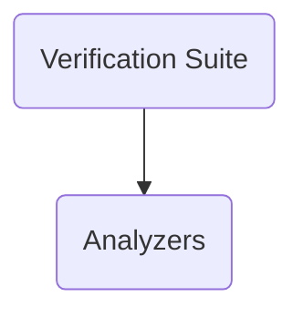

The deequ repository is a library designed to define unit tests for data to measure data quality in large datasets using Apache Spark.

# Main Components

## Top Level Components

### Verification Suite (<SwmPath>[src/…/deequ/VerificationSuite.scala](src/main/scala/com/amazon/deequ/VerificationSuite.scala)</SwmPath>)

Verification Suite is used to execute a series of checks on a dataset, returning a comprehensive verification result that includes the overall status, detailed status for each constraint, and all computed metrics.

- **Classes**
  - <SwmLink doc-title="The VerificationSuite class">[The VerificationSuite class](/.swm/the-verificationsuite-class.wdm8h.sw.md)</SwmLink>

## Other Components

### Profiles (<SwmPath>[src/…/deequ/profiles/](src/main/scala/com/amazon/deequ/profiles/)</SwmPath>)

Profiles are detailed statistical summaries of columns in a dataset, capturing metrics like completeness, data type, distinct values, and histograms, essential for understanding data distribution and quality.

- **Column profile**
  - **Classes**
    - <SwmLink doc-title="The ColumnProfiles class">[The ColumnProfiles class](/.swm/the-columnprofiles-class.5ya32.sw.md)</SwmLink>
- **Column profiler runner**
  - **Classes**
    - <SwmLink doc-title="The ColumnProfilerRunner class">[The ColumnProfilerRunner class](/.swm/the-columnprofilerrunner-class.txsg4.sw.md)</SwmLink>

### Comparison (<SwmPath>[src/…/deequ/comparison/](src/main/scala/com/amazon/deequ/comparison/)</SwmPath>)

Comparison involves checking the extent to which a set of columns from one dataset is a subset of another set of columns from a different dataset, and it returns a result indicating whether the comparison succeeded or failed.

- **Data synchronization**
  - **Classes**
    - <SwmLink doc-title="The DataSynchronization class">[The DataSynchronization class](/.swm/the-datasynchronization-class.dtyfg.sw.md)</SwmLink>
- **Referential integrity**
  - **Classes**
    - <SwmLink doc-title="The ReferentialIntegrity class">[The ReferentialIntegrity class](/.swm/the-referentialintegrity-class.f6cet.sw.md)</SwmLink>

### Checks (<SwmPath>[src/…/deequ/checks/](src/main/scala/com/amazon/deequ/checks/)</SwmPath>)

Checks are used to define and enforce data quality constraints on datasets. They allow users to specify conditions that the data must meet, such as completeness, uniqueness, or compliance with specific patterns. By applying these checks, users can ensure that their data adheres to the desired quality standards and identify any anomalies or issues that need to be addressed.

- **Column condition**
  - **Classes**
    - <SwmLink doc-title="The ColumnCondition class">[The ColumnCondition class](/.swm/the-columncondition-class.v4gpc.sw.md)</SwmLink>
- **Check**
  - **Classes**
    - <SwmLink doc-title="The Check class">[The Check class](/.swm/the-check-class.rvion.sw.md)</SwmLink>
- **Check with last constraint filterable**
  - **Classes**
    - <SwmLink doc-title="The CheckWithLastConstraintFilterable class">[The CheckWithLastConstraintFilterable class](/.swm/the-checkwithlastconstraintfilterable-class.10qdn.sw.md)</SwmLink>

### DQDL (<SwmPath>[src/…/deequ/dqdl/](src/main/scala/com/amazon/deequ/dqdl/)</SwmPath>)

DQDL allows users to specify data quality rules which can then be translated into executable checks using the DQDLRuleTranslator. This enables automated validation and monitoring of data quality in large datasets.

- **Execution**
  - **Dqdl executor**
    - **Classes**
      - <SwmLink doc-title="The DQDLExecutor class">[The DQDLExecutor class](/.swm/the-dqdlexecutor-class.hsap9.sw.md)</SwmLink>

### Metrics (<SwmPath>[src/…/deequ/metrics/](src/main/scala/com/amazon/deequ/metrics/)</SwmPath>)

Metrics represent some metric associated with the data that changes over time.

- **Histogram metric**
  - <SwmLink doc-title="Histogram Metric Class Definitions">[Histogram Metric Class Definitions](/.swm/histogram-metric-class-definitions.1dv1435i.sw.md)</SwmLink>

### Repository (<SwmPath>[src/…/deequ/repository/](src/main/scala/com/amazon/deequ/repository/)</SwmPath>)

The repository is a central component for storing and retrieving analysis results and verification results.

- **Analysis result**
  - **Classes**
    - <SwmLink doc-title="The AnalysisResult class">[The AnalysisResult class](/.swm/the-analysisresult-class.rolav.sw.md)</SwmLink>
- **Analysis result serde**
  - **Classes**
    - <SwmLink doc-title="The AnalyzerDeserializer class">[The AnalyzerDeserializer class](/.swm/the-analyzerdeserializer-class.pm9l5.sw.md)</SwmLink>

### Analyzers (<SwmPath>[src/…/deequ/analyzers/](src/main/scala/com/amazon/deequ/analyzers/)</SwmPath>)

Analyzers are a core component responsible for computing metrics that assess data quality.

- **Analyzer Utilities**
  - <SwmLink doc-title="Getting Started with Analyzer Utilities in Analyzers">[Getting Started with Analyzer Utilities in Analyzers](/.swm/getting-started-with-analyzer-utilities-in-analyzers.0jmza3jx.sw.md)</SwmLink>
  - **State provider**
    - **Classes**
      - <SwmLink doc-title="The StateLoader interface">[The StateLoader interface](/.swm/the-stateloader-interface.mdk21.sw.md)</SwmLink>
  - **Data type**
    - **Classes**
      - <SwmLink doc-title="The DataTypeHistogram class">[The DataTypeHistogram class](/.swm/the-datatypehistogram-class.4yenq.sw.md)</SwmLink>
- **Runners**
  - **Analyzer context**
    - **Classes**
      - <SwmLink doc-title="The AnalyzerContext class">[The AnalyzerContext class](/.swm/the-analyzercontext-class.udbpc.sw.md)</SwmLink>
  - **Kll runner**
    - **Classes**
      - <SwmLink doc-title="The KLLRunner class">[The KLLRunner class](/.swm/the-kllrunner-class.31grx.sw.md)</SwmLink>
  - **Analysis runner**
    - **Flows**
      - <SwmLink doc-title="Running Analyzers for Data Grouping">[Running Analyzers for Data Grouping](/.swm/running-analyzers-for-data-grouping.7s993mxq.sw.md)</SwmLink>
      - <SwmLink doc-title="Performing an Analysis Run">[Performing an Analysis Run](/.swm/performing-an-analysis-run.v9p03rc9.sw.md)</SwmLink>
      - <SwmLink doc-title="Data quality verification process">[Data quality verification process](/.swm/data-quality-verification-process.mh3hskpz.sw.md)</SwmLink>
      - <SwmLink doc-title="Aggregating States and Executing Analyzers">[Aggregating States and Executing Analyzers](/.swm/aggregating-states-and-executing-analyzers.596dr2rz.sw.md)</SwmLink>
- **Histogram**
  - **Classes**
    - <SwmLink doc-title="The Histogram class">[The Histogram class](/.swm/the-histogram-class.kkw9f.sw.md)</SwmLink>
- **Distance**
  - **Classes**
    - <SwmLink doc-title="The CategoricalDistanceMethod interface">[The CategoricalDistanceMethod interface](/.swm/the-categoricaldistancemethod-interface.js259.sw.md)</SwmLink>
- **Flows**
  - <SwmLink doc-title="Calculating Data Quality Metrics">[Calculating Data Quality Metrics](/.swm/calculating-data-quality-metrics.4s8txkyx.sw.md)</SwmLink>
  - <SwmLink doc-title="Generating Random Data for Testing">[Generating Random Data for Testing](/.swm/generating-random-data-for-testing.79hcbqkx.sw.md)</SwmLink>
  - <SwmLink doc-title="Data Quality Analysis Execution Flow">[Data Quality Analysis Execution Flow](/.swm/data-quality-analysis-execution-flow.hi0qxzlq.sw.md)</SwmLink>
  - <SwmLink doc-title="Data Quality Analysis Flow">[Data Quality Analysis Flow](/.swm/data-quality-analysis-flow.nz6c1281.sw.md)</SwmLink>
  - <SwmLink doc-title="Data Quality Verification Process">[Data Quality Verification Process](/.swm/data-quality-verification-process.mh3hskpz.sw.md)</SwmLink>
  - <SwmLink doc-title="Dataset Comparison and State Computation Flow">[Dataset Comparison and State Computation Flow](/.swm/dataset-comparison-and-state-computation-flow.l011o365.sw.md)</SwmLink>
  - <SwmLink doc-title="Column Profiling Flow">[Column Profiling Flow](/.swm/column-profiling-flow.26dpwl8c.sw.md)</SwmLink>
  - <SwmLink doc-title="State Persistence Flow">[State Persistence Flow](/.swm/state-persistence-flow.v4b4r5um.sw.md)</SwmLink>
  - <SwmLink doc-title="Profiling and Constraint Suggestion Flow">[Profiling and Constraint Suggestion Flow](/.swm/profiling-and-constraint-suggestion-flow.a00leyzg.sw.md)</SwmLink>
  - <SwmLink doc-title="Assessing Analyzer Applicability">[Assessing Analyzer Applicability](/.swm/assessing-analyzer-applicability.0760syy4.sw.md)</SwmLink>

&nbsp;

*This is an auto-generated document by Swimm 🌊 and has not yet been verified by a human*

<SwmMeta version="3.0.0" repo-id="Z2l0aHViJTNBJTNBZGVlcXUlM0ElM0Fhd3NsYWJz" repo-name="deequ">Powered by [Swimm](https://app.swimm.io/)</SwmMeta>
