This document explains the flow of performing an analysis run, which is a key part of measuring data quality in large datasets using Apache Spark. The process involves filtering analyzers, checking preconditions, identifying grouping analyzers, computing KLL sketches, and combining all metrics to produce the final analysis results.

For example, during an analysis run, the system might filter out analyzers that have already been executed, check the preconditions for the remaining analyzers, and then compute the necessary metrics for both grouped and non-grouped data.

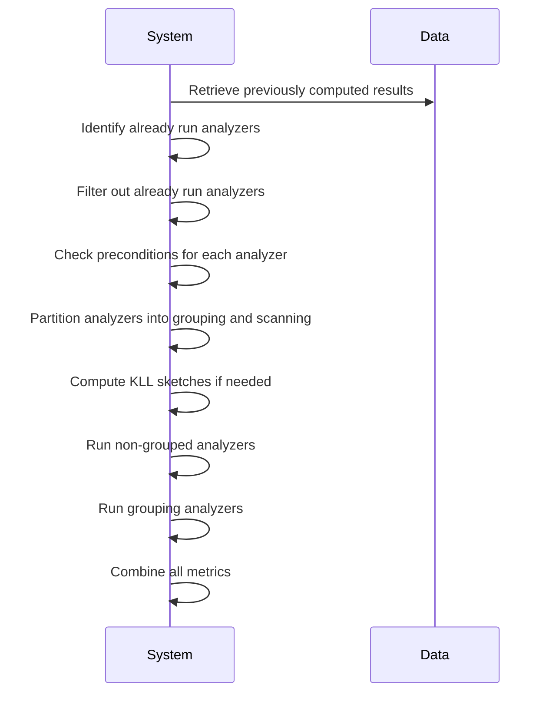

# Where is this flow used?

This flow is used multiple times in the codebase as represented in the following diagram:

(Note - these are only some of the entry points of this flow)

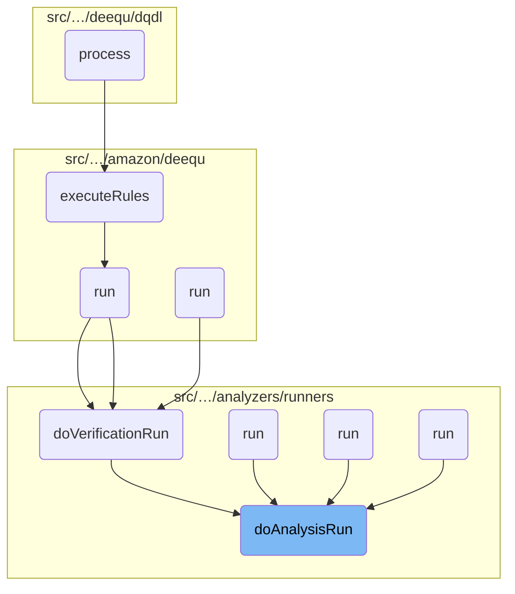

Here is a high level diagram of the flow, showing only the most important functions:

```mermaid
graph TD;
      subgraph srcmainscalacomamazondeequanalyzers[src/…/deequ/analyzers]
e5752a91830d109e628d9caa4f30f131ae702841d2c1770a788cf852bdffc5c0(doAnalysisRun) --> 58a12ca3f86f1d2817abc3cf55906769ed495e4a8558b3167c84f62273a5d580(runScanningAnalyzers)
end

subgraph srcmainscalacomamazondeequanalyzers[src/…/deequ/analyzers]
e5752a91830d109e628d9caa4f30f131ae702841d2c1770a788cf852bdffc5c0(doAnalysisRun) --> 33733958ecd12639b20b16b3fc55c1930b2973ba070e3a0b1b3ebcc41bf61666(runGroupingAnalyzers)
end

subgraph srcmainscalacomamazondeequanalyzers[src/…/deequ/analyzers]
58a12ca3f86f1d2817abc3cf55906769ed495e4a8558b3167c84f62273a5d580(runScanningAnalyzers) --> 979909e10e7895e96e838a049ce95612612e46e0715b013c2ecb3e854338bf41(calculate)
end

subgraph srcmainscalacomamazondeequanalyzers[src/…/deequ/analyzers]
58a12ca3f86f1d2817abc3cf55906769ed495e4a8558b3167c84f62273a5d580(runScanningAnalyzers) --> 1f1c2b4c219a66cd628cf381ec2a237245ea826fdd17ff8fc151d6988e94062b(successOrFailureMetricFrom)
end

subgraph srcmainscalacomamazondeequanalyzers[src/…/deequ/analyzers]
33733958ecd12639b20b16b3fc55c1930b2973ba070e3a0b1b3ebcc41bf61666(runGroupingAnalyzers) --> 3b4b73b181b3a3f8c0d7c66219ae6e63fe8b1a3e2b3299553f8604a6954cee33(runAnalyzersForParticularGrouping)
end

subgraph srcmainscalacomamazondeequanalyzers[src/…/deequ/analyzers]
3b4b73b181b3a3f8c0d7c66219ae6e63fe8b1a3e2b3299553f8604a6954cee33(runAnalyzersForParticularGrouping) --> 1f1c2b4c219a66cd628cf381ec2a237245ea826fdd17ff8fc151d6988e94062b(successOrFailureMetricFrom)
end


      classDef mainFlowStyle color:#000000,fill:#7CB9F4
classDef rootsStyle color:#000000,fill:#00FFF4
classDef Style1 color:#000000,fill:#00FFAA
classDef Style2 color:#000000,fill:#FFFF00
classDef Style3 color:#000000,fill:#AA7CB9

%% Swimm:
%% graph TD;
%%       subgraph srcmainscalacomamazondeequanalyzers[<SwmPath>[src/…/deequ/analyzers/](src/main/scala/com/amazon/deequ/analyzers/)</SwmPath>]
%% e5752a91830d109e628d9caa4f30f131ae702841d2c1770a788cf852bdffc5c0(<SwmToken path="src/main/scala/com/amazon/deequ/analyzers/runners/AnalysisRunner.scala" pos="79:1:1" line-data="    doAnalysisRun(data, analysis.analyzers, aggregateWith, saveStatesWith,">`doAnalysisRun`</SwmToken>) --> 58a12ca3f86f1d2817abc3cf55906769ed495e4a8558b3167c84f62273a5d580(<SwmToken path="src/main/scala/com/amazon/deequ/analyzers/runners/AnalysisRunner.scala" pos="169:1:1" line-data="      runScanningAnalyzers(data, scanningAnalyzers, aggregateWith, saveStatesWith)">`runScanningAnalyzers`</SwmToken>)
%% end
%% 
%% subgraph srcmainscalacomamazondeequanalyzers[<SwmPath>[src/…/deequ/analyzers/](src/main/scala/com/amazon/deequ/analyzers/)</SwmPath>]
%% e5752a91830d109e628d9caa4f30f131ae702841d2c1770a788cf852bdffc5c0(<SwmToken path="src/main/scala/com/amazon/deequ/analyzers/runners/AnalysisRunner.scala" pos="79:1:1" line-data="    doAnalysisRun(data, analysis.analyzers, aggregateWith, saveStatesWith,">`doAnalysisRun`</SwmToken>) --> 33733958ecd12639b20b16b3fc55c1930b2973ba070e3a0b1b3ebcc41bf61666(<SwmToken path="src/main/scala/com/amazon/deequ/analyzers/runners/AnalysisRunner.scala" pos="186:1:1" line-data="          runGroupingAnalyzers(data, groupingColumns, filterCondition, analyzersForGrouping,">`runGroupingAnalyzers`</SwmToken>)
%% end
%% 
%% subgraph srcmainscalacomamazondeequanalyzers[<SwmPath>[src/…/deequ/analyzers/](src/main/scala/com/amazon/deequ/analyzers/)</SwmPath>]
%% 58a12ca3f86f1d2817abc3cf55906769ed495e4a8558b3167c84f62273a5d580(<SwmToken path="src/main/scala/com/amazon/deequ/analyzers/runners/AnalysisRunner.scala" pos="169:1:1" line-data="      runScanningAnalyzers(data, scanningAnalyzers, aggregateWith, saveStatesWith)">`runScanningAnalyzers`</SwmToken>) --> 979909e10e7895e96e838a049ce95612612e46e0715b013c2ecb3e854338bf41(calculate)
%% end
%% 
%% subgraph srcmainscalacomamazondeequanalyzers[<SwmPath>[src/…/deequ/analyzers/](src/main/scala/com/amazon/deequ/analyzers/)</SwmPath>]
%% 58a12ca3f86f1d2817abc3cf55906769ed495e4a8558b3167c84f62273a5d580(<SwmToken path="src/main/scala/com/amazon/deequ/analyzers/runners/AnalysisRunner.scala" pos="169:1:1" line-data="      runScanningAnalyzers(data, scanningAnalyzers, aggregateWith, saveStatesWith)">`runScanningAnalyzers`</SwmToken>) --> 1f1c2b4c219a66cd628cf381ec2a237245ea826fdd17ff8fc151d6988e94062b(<SwmToken path="src/main/scala/com/amazon/deequ/analyzers/runners/AnalysisRunner.scala" pos="351:5:5" line-data="  private def successOrFailureMetricFrom(">`successOrFailureMetricFrom`</SwmToken>)
%% end
%% 
%% subgraph srcmainscalacomamazondeequanalyzers[<SwmPath>[src/…/deequ/analyzers/](src/main/scala/com/amazon/deequ/analyzers/)</SwmPath>]
%% 33733958ecd12639b20b16b3fc55c1930b2973ba070e3a0b1b3ebcc41bf61666(<SwmToken path="src/main/scala/com/amazon/deequ/analyzers/runners/AnalysisRunner.scala" pos="186:1:1" line-data="          runGroupingAnalyzers(data, groupingColumns, filterCondition, analyzersForGrouping,">`runGroupingAnalyzers`</SwmToken>) --> 3b4b73b181b3a3f8c0d7c66219ae6e63fe8b1a3e2b3299553f8604a6954cee33(<SwmToken path="src/main/scala/com/amazon/deequ/analyzers/runners/AnalysisRunner.scala" pos="298:7:7" line-data="    val results = runAnalyzersForParticularGrouping(frequenciesAndNumRows, analyzers, saveStatesTo,">`runAnalyzersForParticularGrouping`</SwmToken>)
%% end
%% 
%% subgraph srcmainscalacomamazondeequanalyzers[<SwmPath>[src/…/deequ/analyzers/](src/main/scala/com/amazon/deequ/analyzers/)</SwmPath>]
%% 3b4b73b181b3a3f8c0d7c66219ae6e63fe8b1a3e2b3299553f8604a6954cee33(<SwmToken path="src/main/scala/com/amazon/deequ/analyzers/runners/AnalysisRunner.scala" pos="298:7:7" line-data="    val results = runAnalyzersForParticularGrouping(frequenciesAndNumRows, analyzers, saveStatesTo,">`runAnalyzersForParticularGrouping`</SwmToken>) --> 1f1c2b4c219a66cd628cf381ec2a237245ea826fdd17ff8fc151d6988e94062b(<SwmToken path="src/main/scala/com/amazon/deequ/analyzers/runners/AnalysisRunner.scala" pos="351:5:5" line-data="  private def successOrFailureMetricFrom(">`successOrFailureMetricFrom`</SwmToken>)
%% end
%% 
%% 
%%       classDef mainFlowStyle color:#000000,fill:#7CB9F4
%% classDef rootsStyle color:#000000,fill:#00FFF4
%% classDef Style1 color:#000000,fill:#00FFAA
%% classDef Style2 color:#000000,fill:#FFFF00
%% classDef Style3 color:#000000,fill:#AA7CB9
```

# <SwmToken path="src/main/scala/com/amazon/deequ/analyzers/runners/AnalysisRunner.scala" pos="79:1:1" line-data="    doAnalysisRun(data, analysis.analyzers, aggregateWith, saveStatesWith,">`doAnalysisRun`</SwmToken>

```mermaid
graph TD
classDef a3dec7b7c color:#000000,fill:#7CB9F4
classDef a842c15d0 color:#000000,fill:#00FFAA
classDef ab8b3c2fc color:#000000,fill:#00FFF4
classDef a3d029db4 color:#000000,fill:#FFFF00
classDef a51db3fae color:#000000,fill:#AA7CB9
classDef aa46cc73f color:#000000,fill:#00FFF4
classDef a55edee69 color:#000000,fill:#f5a10a
```

## Filter analyzers to run

Here is a diagram of this part:

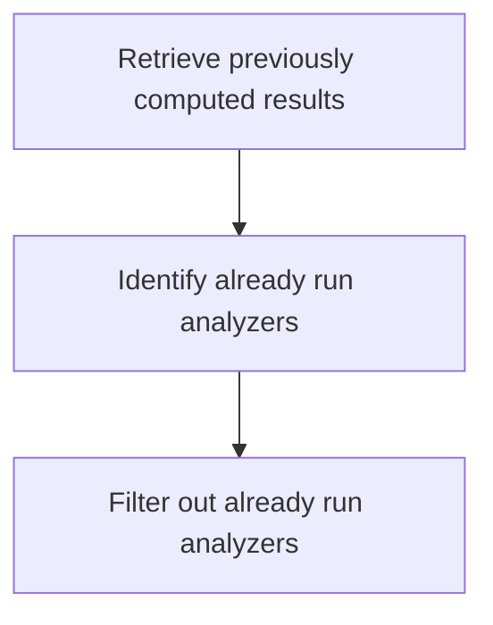

<SwmSnippet path="/src/main/scala/com/amazon/deequ/analyzers/runners/AnalysisRunner.scala" line="130">

---

The function <SwmToken path="src/main/scala/com/amazon/deequ/analyzers/runners/AnalysisRunner.scala" pos="79:1:1" line-data="    doAnalysisRun(data, analysis.analyzers, aggregateWith, saveStatesWith,">`doAnalysisRun`</SwmToken> filters out analyzers that have already been run to avoid redundant calculations. This is achieved by first identifying the analyzers that have already been executed and their results stored in the <SwmToken path="src/main/scala/com/amazon/deequ/analyzers/runners/AnalysisRunner.scala" pos="130:7:7" line-data="    val analyzersAlreadyRan = resultsComputedPreviously.metricMap.keys.toSet">`resultsComputedPreviously`</SwmToken> context. The set of these analyzers is stored in <SwmToken path="src/main/scala/com/amazon/deequ/analyzers/runners/AnalysisRunner.scala" pos="130:3:3" line-data="    val analyzersAlreadyRan = resultsComputedPreviously.metricMap.keys.toSet">`analyzersAlreadyRan`</SwmToken>.

```scala
    val analyzersAlreadyRan = resultsComputedPreviously.metricMap.keys.toSet
```

---

</SwmSnippet>

<SwmSnippet path="/src/main/scala/com/amazon/deequ/analyzers/runners/AnalysisRunner.scala" line="131">

---

Next, the function filters out these already executed analyzers from the list of all analyzers. This results in a new list, <SwmToken path="src/main/scala/com/amazon/deequ/analyzers/runners/AnalysisRunner.scala" pos="132:3:3" line-data="    val analyzersToRun = allAnalyzers.filterNot(analyzersAlreadyRan.contains)">`analyzersToRun`</SwmToken>, which contains only the analyzers that need to be run. This step ensures that only the necessary analyzers are executed, optimizing the performance and avoiding redundant computations.

```scala

    val analyzersToRun = allAnalyzers.filterNot(analyzersAlreadyRan.contains)
```

---

</SwmSnippet>

## Find analyzers violating preconditions

Here is a diagram of this part:

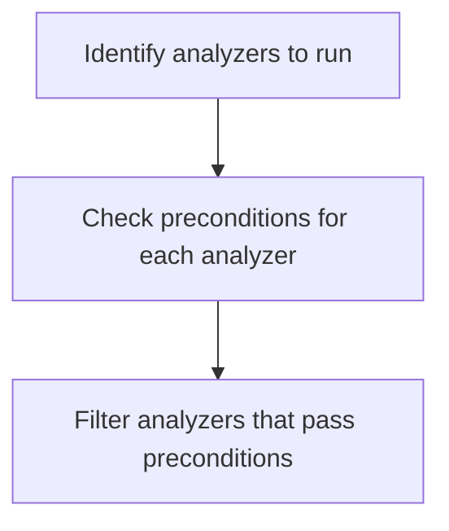

<SwmSnippet path="/src/main/scala/com/amazon/deequ/analyzers/runners/AnalysisRunner.scala" line="142">

---

The function filters the analyzers that meet the preconditions defined for the data schema. This is crucial to ensure that only valid analyzers are run on the dataset, avoiding potential errors or invalid results.

```scala
    val passedAnalyzers = analyzersToRun
      .filter { analyzer =>
        Preconditions.findFirstFailing(data.schema, analyzer.preconditions).isEmpty
      }
```

---

</SwmSnippet>

## Identify grouping analyzers

Here is a diagram of this part:

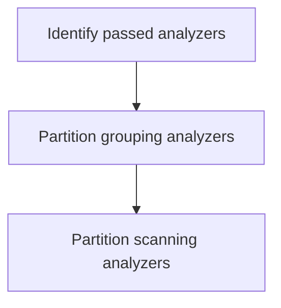

<SwmSnippet path="/src/main/scala/com/amazon/deequ/analyzers/runners/AnalysisRunner.scala" line="153">

---

The function identifies which analyzers from the <SwmToken path="src/main/scala/com/amazon/deequ/analyzers/runners/AnalysisRunner.scala" pos="154:1:1" line-data="      passedAnalyzers.partition { _.isInstanceOf[GroupingAnalyzer[State[_], Metric[_]]] }">`passedAnalyzers`</SwmToken> require data grouping. This is done by partitioning the <SwmToken path="src/main/scala/com/amazon/deequ/analyzers/runners/AnalysisRunner.scala" pos="154:1:1" line-data="      passedAnalyzers.partition { _.isInstanceOf[GroupingAnalyzer[State[_], Metric[_]]] }">`passedAnalyzers`</SwmToken> into <SwmToken path="src/main/scala/com/amazon/deequ/analyzers/runners/AnalysisRunner.scala" pos="153:4:4" line-data="    val (groupingAnalyzers, allScanningAnalyzers) =">`groupingAnalyzers`</SwmToken> and <SwmToken path="src/main/scala/com/amazon/deequ/analyzers/runners/AnalysisRunner.scala" pos="153:7:7" line-data="    val (groupingAnalyzers, allScanningAnalyzers) =">`allScanningAnalyzers`</SwmToken> based on whether they are instances of <SwmToken path="src/main/scala/com/amazon/deequ/analyzers/runners/AnalysisRunner.scala" pos="154:11:11" line-data="      passedAnalyzers.partition { _.isInstanceOf[GroupingAnalyzer[State[_], Metric[_]]] }">`GroupingAnalyzer`</SwmToken>.

```scala
    val (groupingAnalyzers, allScanningAnalyzers) =
      passedAnalyzers.partition { _.isInstanceOf[GroupingAnalyzer[State[_], Metric[_]]] }

```

---

</SwmSnippet>

## Compute KLL Sketches in extra pass

Here is a diagram of this part:

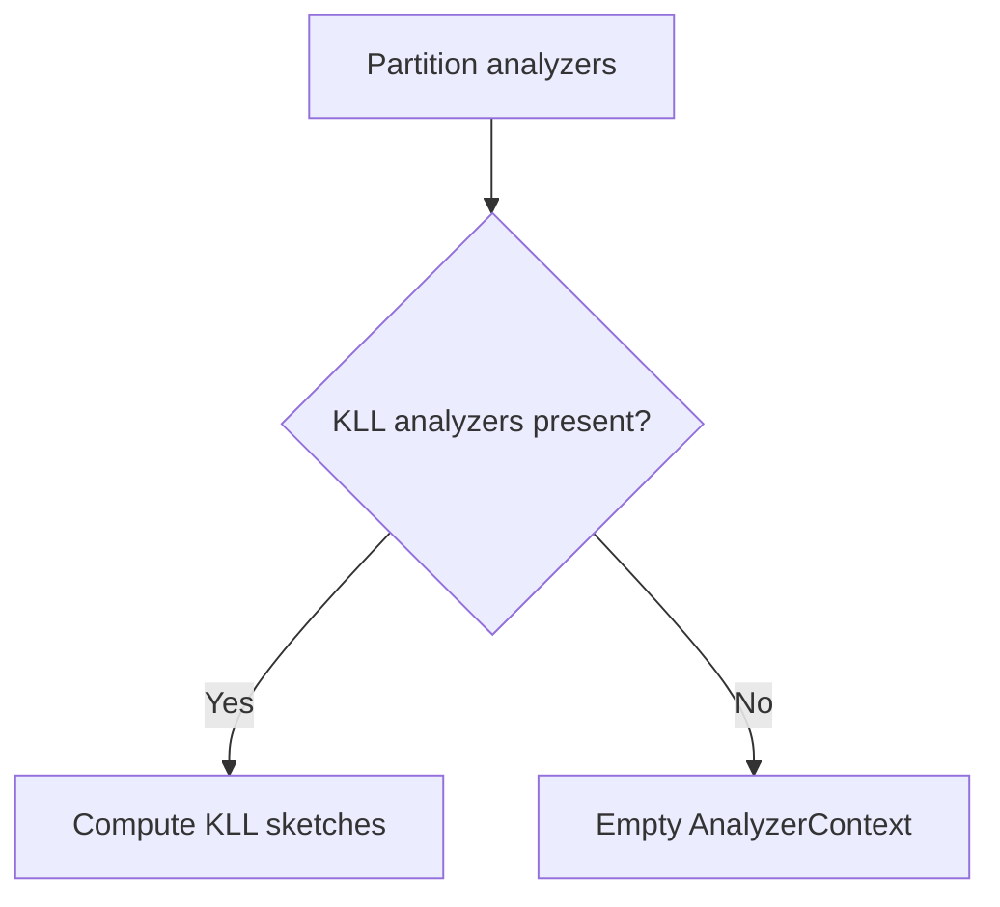

<SwmSnippet path="/src/main/scala/com/amazon/deequ/analyzers/runners/AnalysisRunner.scala" line="157">

---

The function first partitions the analyzers into <SwmToken path="src/main/scala/com/amazon/deequ/analyzers/runners/AnalysisRunner.scala" pos="157:4:4" line-data="    val (kllAnalyzers, scanningAnalyzers) =">`kllAnalyzers`</SwmToken> (those that are instances of <SwmToken path="src/main/scala/com/amazon/deequ/analyzers/runners/AnalysisRunner.scala" pos="158:11:11" line-data="      allScanningAnalyzers.partition { _.isInstanceOf[KLLSketch] }">`KLLSketch`</SwmToken>) and <SwmToken path="src/main/scala/com/amazon/deequ/analyzers/runners/AnalysisRunner.scala" pos="157:7:7" line-data="    val (kllAnalyzers, scanningAnalyzers) =">`scanningAnalyzers`</SwmToken> (the remaining analyzers). This is done to separate the analyzers that require a different processing approach.

```scala
    val (kllAnalyzers, scanningAnalyzers) =
      allScanningAnalyzers.partition { _.isInstanceOf[KLLSketch] }
```

---

</SwmSnippet>

<SwmSnippet path="/src/main/scala/com/amazon/deequ/analyzers/runners/AnalysisRunner.scala" line="160">

---

If there are any <SwmToken path="src/main/scala/com/amazon/deequ/analyzers/runners/AnalysisRunner.scala" pos="161:4:4" line-data="      if (kllAnalyzers.nonEmpty) {">`kllAnalyzers`</SwmToken>, the function proceeds to compute the KLL sketches by calling <SwmToken path="src/main/scala/com/amazon/deequ/analyzers/runners/AnalysisRunner.scala" pos="162:1:3" line-data="        KLLRunner.computeKLLSketchesInExtraPass(data, kllAnalyzers, aggregateWith, saveStatesWith)">`KLLRunner.computeKLLSketchesInExtraPass`</SwmToken>. This method processes the data specifically for KLL analyzers, potentially aggregating and saving the states if the respective options are provided.

```scala
    val kllMetrics =
      if (kllAnalyzers.nonEmpty) {
        KLLRunner.computeKLLSketchesInExtraPass(data, kllAnalyzers, aggregateWith, saveStatesWith)
      } else {
```

---

</SwmSnippet>

<SwmSnippet path="/src/main/scala/com/amazon/deequ/analyzers/runners/AnalysisRunner.scala" line="164">

---

If there are no <SwmToken path="src/main/scala/com/amazon/deequ/analyzers/runners/AnalysisRunner.scala" pos="157:4:4" line-data="    val (kllAnalyzers, scanningAnalyzers) =">`kllAnalyzers`</SwmToken>, the function simply returns an empty <SwmToken path="src/main/scala/com/amazon/deequ/analyzers/runners/AnalysisRunner.scala" pos="164:1:1" line-data="        AnalyzerContext.empty">`AnalyzerContext`</SwmToken>. This ensures that the subsequent steps in the analysis run can proceed without any KLL-specific metrics.

```scala
        AnalyzerContext.empty
      }
```

---

</SwmSnippet>

## Compute non-grouped metrics

Here is a diagram of this part:

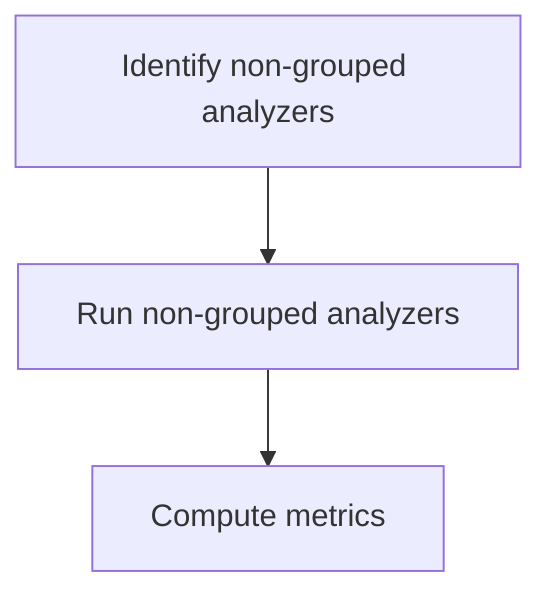

<SwmSnippet path="/src/main/scala/com/amazon/deequ/analyzers/runners/AnalysisRunner.scala" line="167">

---

The function runs analyzers that do not require grouping in a single pass over the data. This is achieved by calling the <SwmToken path="src/main/scala/com/amazon/deequ/analyzers/runners/AnalysisRunner.scala" pos="169:1:1" line-data="      runScanningAnalyzers(data, scanningAnalyzers, aggregateWith, saveStatesWith)">`runScanningAnalyzers`</SwmToken> function with the data and the list of analyzers that do not need grouping.

```scala
    /* Run the analyzers which do not require grouping in a single pass over the data */
    val nonGroupedMetrics =
      runScanningAnalyzers(data, scanningAnalyzers, aggregateWith, saveStatesWith)
```

---

</SwmSnippet>

## Run grouping analyzers

Here is a diagram of this part:

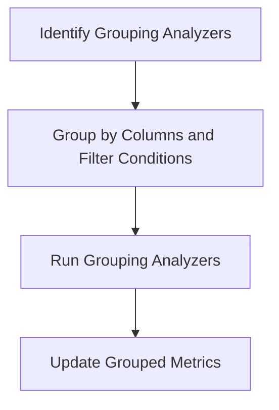

### Identify Grouping Analyzers

The function first identifies the analyzers that require grouping by mapping and filtering the <SwmToken path="src/main/scala/com/amazon/deequ/analyzers/runners/AnalysisRunner.scala" pos="153:4:4" line-data="    val (groupingAnalyzers, allScanningAnalyzers) =">`groupingAnalyzers`</SwmToken> to instances of <SwmToken path="src/main/scala/com/amazon/deequ/analyzers/runners/AnalysisRunner.scala" pos="154:11:11" line-data="      passedAnalyzers.partition { _.isInstanceOf[GroupingAnalyzer[State[_], Metric[_]]] }">`GroupingAnalyzer`</SwmToken>.

<SwmSnippet path="/src/main/scala/com/amazon/deequ/analyzers/runners/AnalysisRunner.scala" line="180">

---

Next, the function groups these analyzers based on their grouping columns and filter conditions. This is done using the <SwmToken path="src/main/scala/com/amazon/deequ/analyzers/runners/AnalysisRunner.scala" pos="182:2:2" line-data="      .groupBy { a =&gt; (a.groupingColumns().sorted, getFilterCondition(a)) }">`groupBy`</SwmToken> method, which creates groups of analyzers that share the same grouping columns and filter conditions.

```scala
    groupingAnalyzers
      .map { _.asInstanceOf[GroupingAnalyzer[State[_], Metric[_]]] }
      .groupBy { a => (a.groupingColumns().sorted, getFilterCondition(a)) }
      .foreach { case ((groupingColumns, filterCondition), analyzersForGrouping) =>
```

---

</SwmSnippet>

<SwmSnippet path="/src/main/scala/com/amazon/deequ/analyzers/runners/AnalysisRunner.scala" line="184">

---

For each group of analyzers, the function runs the <SwmToken path="src/main/scala/com/amazon/deequ/analyzers/runners/AnalysisRunner.scala" pos="186:1:1" line-data="          runGroupingAnalyzers(data, groupingColumns, filterCondition, analyzersForGrouping,">`runGroupingAnalyzers`</SwmToken> method. This method computes the metrics for the grouped data, taking into account the specified grouping columns and filter conditions.

```scala

        val (numRows, metrics) =
          runGroupingAnalyzers(data, groupingColumns, filterCondition, analyzersForGrouping,
            aggregateWith, saveStatesWith, storageLevelOfGroupedDataForMultiplePasses,
            numRowsOfData)
```

---

</SwmSnippet>

### Update Grouped Metrics

Finally, the function updates the <SwmToken path="src/main/scala/com/amazon/deequ/analyzers/runners/AnalysisRunner.scala" pos="199:5:5" line-data="      nonGroupedMetrics ++ groupedMetrics ++ kllMetrics">`groupedMetrics`</SwmToken> with the metrics computed by the <SwmToken path="src/main/scala/com/amazon/deequ/analyzers/runners/AnalysisRunner.scala" pos="186:1:1" line-data="          runGroupingAnalyzers(data, groupingColumns, filterCondition, analyzersForGrouping,">`runGroupingAnalyzers`</SwmToken> method. This ensures that the results of the grouping analyzers are included in the final analysis context.

## Combine all metrics

Here is a diagram of this part:

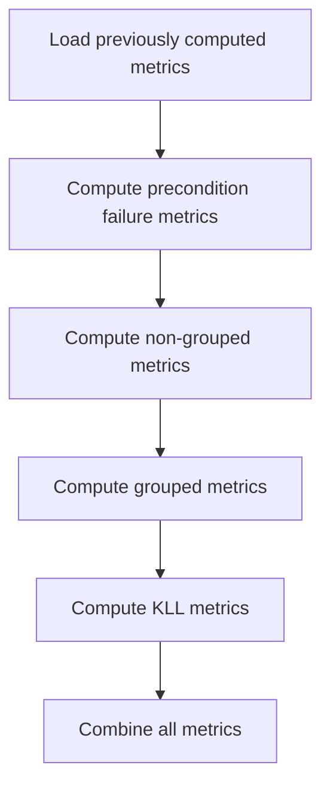

### Combining all metrics

The function <SwmToken path="src/main/scala/com/amazon/deequ/analyzers/runners/AnalysisRunner.scala" pos="79:1:1" line-data="    doAnalysisRun(data, analysis.analyzers, aggregateWith, saveStatesWith,">`doAnalysisRun`</SwmToken> combines previously computed metrics with newly computed ones, ensuring all relevant metrics are included in the final result. This is achieved by merging the results from different stages of the analysis process.

<SwmSnippet path="/src/main/scala/com/amazon/deequ/analyzers/runners/AnalysisRunner.scala" line="198">

---

The variable <SwmToken path="src/main/scala/com/amazon/deequ/analyzers/runners/AnalysisRunner.scala" pos="198:3:3" line-data="    val resultingAnalyzerContext = resultsComputedPreviously ++ preconditionFailures ++">`resultingAnalyzerContext`</SwmToken> is created by combining <SwmToken path="src/main/scala/com/amazon/deequ/analyzers/runners/AnalysisRunner.scala" pos="198:7:7" line-data="    val resultingAnalyzerContext = resultsComputedPreviously ++ preconditionFailures ++">`resultsComputedPreviously`</SwmToken>, <SwmToken path="src/main/scala/com/amazon/deequ/analyzers/runners/AnalysisRunner.scala" pos="198:11:11" line-data="    val resultingAnalyzerContext = resultsComputedPreviously ++ preconditionFailures ++">`preconditionFailures`</SwmToken>, <SwmToken path="src/main/scala/com/amazon/deequ/analyzers/runners/AnalysisRunner.scala" pos="199:1:1" line-data="      nonGroupedMetrics ++ groupedMetrics ++ kllMetrics">`nonGroupedMetrics`</SwmToken>, <SwmToken path="src/main/scala/com/amazon/deequ/analyzers/runners/AnalysisRunner.scala" pos="199:5:5" line-data="      nonGroupedMetrics ++ groupedMetrics ++ kllMetrics">`groupedMetrics`</SwmToken>, and <SwmToken path="src/main/scala/com/amazon/deequ/analyzers/runners/AnalysisRunner.scala" pos="199:9:9" line-data="      nonGroupedMetrics ++ groupedMetrics ++ kllMetrics">`kllMetrics`</SwmToken>. This ensures that all metrics, whether computed in the current run or previously, are included in the final context.

```scala
    val resultingAnalyzerContext = resultsComputedPreviously ++ preconditionFailures ++
      nonGroupedMetrics ++ groupedMetrics ++ kllMetrics
```

---

</SwmSnippet>

# Identifying Shareable Analyzers

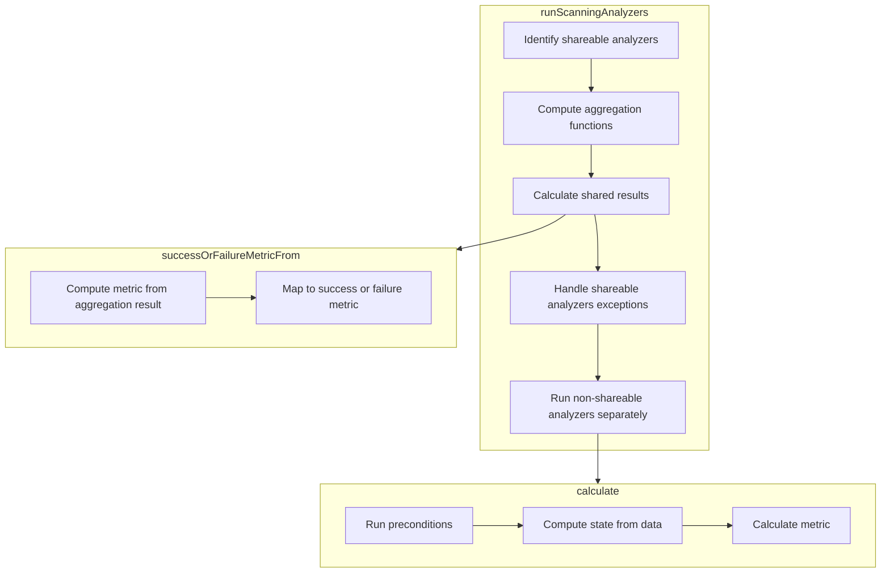

First, the <SwmToken path="src/main/scala/com/amazon/deequ/analyzers/runners/AnalysisRunner.scala" pos="169:1:1" line-data="      runScanningAnalyzers(data, scanningAnalyzers, aggregateWith, saveStatesWith)">`runScanningAnalyzers`</SwmToken> function identifies which analyzers can share their computations. This is done by partitioning the analyzers into shareable and <SwmToken path="src/main/scala/com/amazon/deequ/analyzers/runners/AnalysisRunner.scala" pos="341:5:7" line-data="    /* Run non-shareable analyzers separately */">`non-shareable`</SwmToken> groups. Shareable analyzers are those that can perform their computations in a single pass over the data, which optimizes performance.

<SwmSnippet path="/src/main/scala/com/amazon/deequ/analyzers/runners/AnalysisRunner.scala" line="318">

---

Next, for the shareable analyzers, the function computes the necessary aggregation functions in a single pass over the data. This involves calculating offsets to correctly map the results back to the respective analyzers.

```scala
    val sharedResults = if (shareableAnalyzers.nonEmpty) {

      val metricsByAnalyzer = try {
        val aggregations = shareableAnalyzers.flatMap { _.aggregationFunctions() }

        /* Compute offsets so that the analyzers can correctly pick their results from the row */
        val offsets = shareableAnalyzers.scanLeft(0) { case (current, analyzer) =>
          current + analyzer.aggregationFunctions().length
        }
```

---

</SwmSnippet>

<SwmSnippet path="/src/main/scala/com/amazon/deequ/analyzers/runners/AnalysisRunner.scala" line="349">

---

Then, the function maps the results of these computations to either success or failure metrics. This is done using the <SwmToken path="src/main/scala/com/amazon/deequ/analyzers/runners/AnalysisRunner.scala" pos="351:5:5" line-data="  private def successOrFailureMetricFrom(">`successOrFailureMetricFrom`</SwmToken> function, which handles any exceptions that occur during the mapping process.

```scala
  /** Compute scan-shareable analyzer metric from aggregation result, mapping generic exceptions
    * to a failure metric */
  private def successOrFailureMetricFrom(
      analyzer: ScanShareableAnalyzer[State[_], Metric[_]],
      aggregationResult: Row,
      offset: Int,
      aggregateWith: Option[StateLoader],
      saveStatesTo: Option[StatePersister])
    : Metric[_] = {

    try {
      analyzer.metricFromAggregationResult(aggregationResult, offset, aggregateWith, saveStatesTo)
    } catch {
      case error: Exception => analyzer.toFailureMetric(error)
    }
  }
```

---

</SwmSnippet>

<SwmSnippet path="/src/main/scala/com/amazon/deequ/analyzers/Analyzer.scala" line="98">

---

Finally, the function runs the <SwmToken path="src/main/scala/com/amazon/deequ/analyzers/runners/AnalysisRunner.scala" pos="341:5:7" line-data="    /* Run non-shareable analyzers separately */">`non-shareable`</SwmToken> analyzers separately. Each of these analyzers calculates its metric individually by running preconditions and computing the state from the data.

```scala
  def calculate(
      data: DataFrame,
      aggregateWith: Option[StateLoader] = None,
      saveStatesWith: Option[StatePersister] = None,
      filterCondition: Option[String] = None)
    : M = {

    try {
      preconditions.foreach { condition => condition(data.schema) }

      val state = computeStateFrom(data, filterCondition)

      calculateMetric(state, aggregateWith, saveStatesWith)
    } catch {
      case error: Exception => toFailureMetric(error)
    }
  }
```

---

</SwmSnippet>

# <SwmToken path="src/main/scala/com/amazon/deequ/analyzers/runners/AnalysisRunner.scala" pos="186:1:1" line-data="          runGroupingAnalyzers(data, groupingColumns, filterCondition, analyzersForGrouping,">`runGroupingAnalyzers`</SwmToken>

```mermaid
graph TD
subgraph runGroupingAnalyzers
runGroupingAnalyzers:A["Compute group frequencies"] --> runGroupingAnalyzers:B["Select sample analyzer"]
runGroupingAnalyzers:B --> runGroupingAnalyzers:C["Check if aggregation required"]
runGroupingAnalyzers:C --Yes--> runGroupingAnalyzers:D["Aggregate states"]
runGroupingAnalyzers:C --No--> runGroupingAnalyzers:E["Run analyzers for particular grouping"]
runGroupingAnalyzers:D --> runGroupingAnalyzers:E["Run analyzers for particular grouping"]
runGroupingAnalyzers:E --> runGroupingAnalyzers:F["Return number of rows and results"]
end

%% Swimm:
%% graph TD
%% subgraph <SwmToken path="src/main/scala/com/amazon/deequ/analyzers/runners/AnalysisRunner.scala" pos="186:1:1" line-data="          runGroupingAnalyzers(data, groupingColumns, filterCondition, analyzersForGrouping,">`runGroupingAnalyzers`</SwmToken>
%% <SwmToken path="src/main/scala/com/amazon/deequ/analyzers/runners/AnalysisRunner.scala" pos="186:1:1" line-data="          runGroupingAnalyzers(data, groupingColumns, filterCondition, analyzersForGrouping,">`runGroupingAnalyzers`</SwmToken>:A["Compute group frequencies"] --> <SwmToken path="src/main/scala/com/amazon/deequ/analyzers/runners/AnalysisRunner.scala" pos="186:1:1" line-data="          runGroupingAnalyzers(data, groupingColumns, filterCondition, analyzersForGrouping,">`runGroupingAnalyzers`</SwmToken>:B["Select sample analyzer"]
%% <SwmToken path="src/main/scala/com/amazon/deequ/analyzers/runners/AnalysisRunner.scala" pos="186:1:1" line-data="          runGroupingAnalyzers(data, groupingColumns, filterCondition, analyzersForGrouping,">`runGroupingAnalyzers`</SwmToken>:B --> <SwmToken path="src/main/scala/com/amazon/deequ/analyzers/runners/AnalysisRunner.scala" pos="186:1:1" line-data="          runGroupingAnalyzers(data, groupingColumns, filterCondition, analyzersForGrouping,">`runGroupingAnalyzers`</SwmToken>:C["Check if aggregation required"]
%% <SwmToken path="src/main/scala/com/amazon/deequ/analyzers/runners/AnalysisRunner.scala" pos="186:1:1" line-data="          runGroupingAnalyzers(data, groupingColumns, filterCondition, analyzersForGrouping,">`runGroupingAnalyzers`</SwmToken>:C --Yes--> <SwmToken path="src/main/scala/com/amazon/deequ/analyzers/runners/AnalysisRunner.scala" pos="186:1:1" line-data="          runGroupingAnalyzers(data, groupingColumns, filterCondition, analyzersForGrouping,">`runGroupingAnalyzers`</SwmToken>:D["Aggregate states"]
%% <SwmToken path="src/main/scala/com/amazon/deequ/analyzers/runners/AnalysisRunner.scala" pos="186:1:1" line-data="          runGroupingAnalyzers(data, groupingColumns, filterCondition, analyzersForGrouping,">`runGroupingAnalyzers`</SwmToken>:C --No--> <SwmToken path="src/main/scala/com/amazon/deequ/analyzers/runners/AnalysisRunner.scala" pos="186:1:1" line-data="          runGroupingAnalyzers(data, groupingColumns, filterCondition, analyzersForGrouping,">`runGroupingAnalyzers`</SwmToken>:E["Run analyzers for particular grouping"]
%% <SwmToken path="src/main/scala/com/amazon/deequ/analyzers/runners/AnalysisRunner.scala" pos="186:1:1" line-data="          runGroupingAnalyzers(data, groupingColumns, filterCondition, analyzersForGrouping,">`runGroupingAnalyzers`</SwmToken>:D --> <SwmToken path="src/main/scala/com/amazon/deequ/analyzers/runners/AnalysisRunner.scala" pos="186:1:1" line-data="          runGroupingAnalyzers(data, groupingColumns, filterCondition, analyzersForGrouping,">`runGroupingAnalyzers`</SwmToken>:E["Run analyzers for particular grouping"]
%% <SwmToken path="src/main/scala/com/amazon/deequ/analyzers/runners/AnalysisRunner.scala" pos="186:1:1" line-data="          runGroupingAnalyzers(data, groupingColumns, filterCondition, analyzersForGrouping,">`runGroupingAnalyzers`</SwmToken>:E --> <SwmToken path="src/main/scala/com/amazon/deequ/analyzers/runners/AnalysisRunner.scala" pos="186:1:1" line-data="          runGroupingAnalyzers(data, groupingColumns, filterCondition, analyzersForGrouping,">`runGroupingAnalyzers`</SwmToken>:F["Return number of rows and results"]
%% end
```

<SwmSnippet path="/src/main/scala/com/amazon/deequ/analyzers/runners/AnalysisRunner.scala" line="283">

---

First, the function <SwmToken path="src/main/scala/com/amazon/deequ/analyzers/runners/AnalysisRunner.scala" pos="186:1:1" line-data="          runGroupingAnalyzers(data, groupingColumns, filterCondition, analyzersForGrouping,">`runGroupingAnalyzers`</SwmToken> computes the frequencies of the requested groups using the <SwmToken path="src/main/scala/com/amazon/deequ/analyzers/runners/AnalysisRunner.scala" pos="284:9:9" line-data="    var frequenciesAndNumRows = FrequencyBasedAnalyzer.computeFrequencies(data, groupingColumns,">`computeFrequencies`</SwmToken> method. This step is crucial as it aggregates the data based on the specified grouping columns and applies any filter conditions provided.

```scala
    /* Compute the frequencies of the request groups once */
    var frequenciesAndNumRows = FrequencyBasedAnalyzer.computeFrequencies(data, groupingColumns,
      filterCondition)
```

---

</SwmSnippet>

<SwmSnippet path="/src/main/scala/com/amazon/deequ/analyzers/runners/AnalysisRunner.scala" line="288">

---

Next, a sample analyzer is selected from the list of analyzers to store the state for the grouped data. This is done to ensure that the state of the data is maintained and can be used for further analysis.

```scala
    val sampleAnalyzer = analyzers.head.asInstanceOf[Analyzer[FrequenciesAndNumRows, Metric[_]]]
```

---

</SwmSnippet>

<SwmSnippet path="/src/main/scala/com/amazon/deequ/analyzers/runners/AnalysisRunner.scala" line="291">

---

Then, if there is an existing state to aggregate with, it is loaded and summed with the current frequencies. This step ensures that any previous states are considered in the current analysis, providing a more comprehensive view of the data.

```scala
    aggregateWith
      .foreach { _.load[FrequenciesAndNumRows](sampleAnalyzer)
        .foreach { previousFrequenciesAndNumRows =>
          frequenciesAndNumRows = frequenciesAndNumRows.sum(previousFrequenciesAndNumRows)
        }
```

---

</SwmSnippet>

<SwmSnippet path="/src/main/scala/com/amazon/deequ/analyzers/runners/AnalysisRunner.scala" line="298">

---

Finally, the function <SwmToken path="src/main/scala/com/amazon/deequ/analyzers/runners/AnalysisRunner.scala" pos="298:7:7" line-data="    val results = runAnalyzersForParticularGrouping(frequenciesAndNumRows, analyzers, saveStatesTo,">`runAnalyzersForParticularGrouping`</SwmToken> is called to execute the analyzers on the grouped data. This step performs the actual data quality measurements based on the specified analyzers, and the results are returned along with the number of rows in the grouped data.

```scala
    val results = runAnalyzersForParticularGrouping(frequenciesAndNumRows, analyzers, saveStatesTo,
        storageLevelOfGroupedDataForMultiplePasses)

    frequenciesAndNumRows.numRows -> results
```

---

</SwmSnippet>

# <SwmToken path="src/main/scala/com/amazon/deequ/analyzers/runners/AnalysisRunner.scala" pos="298:7:7" line-data="    val results = runAnalyzersForParticularGrouping(frequenciesAndNumRows, analyzers, saveStatesTo,">`runAnalyzersForParticularGrouping`</SwmToken>

```mermaid
graph TD
  subgraph runAnalyzersForParticularGrouping
    runAnalyzersForParticularGrouping:A["Identify all shareable analyzers"] --> runAnalyzersForParticularGrouping:B["Partition shareable and others"]
    runAnalyzersForParticularGrouping:B --> runAnalyzersForParticularGrouping:C["Check if there are non-shareable analyzers"]
    runAnalyzersForParticularGrouping:C -->|Yes| runAnalyzersForParticularGrouping:D["Cache the grouped data"]
    runAnalyzersForParticularGrouping:C -->|No| runAnalyzersForParticularGrouping:E["Map shareable analyzers"]
    runAnalyzersForParticularGrouping:D --> runAnalyzersForParticularGrouping:E["Map shareable analyzers"]
    runAnalyzersForParticularGrouping:E --> runAnalyzersForParticularGrouping:F["Aggregate functions of shareable analyzers"]
    runAnalyzersForParticularGrouping:F --> runAnalyzersForParticularGrouping:G["Execute aggregation on grouped data and collect"]
    runAnalyzersForParticularGrouping:G --> runAnalyzersForParticularGrouping:H["Map computation result to metrics"]
   
   
    runAnalyzersForParticularGrouping:H --> runAnalyzersForParticularGrouping:I["Execute remaining analyzers on grouped data"]
    runAnalyzersForParticularGrouping:I --> runAnalyzersForParticularGrouping:J["Map results to metrics"]
    runAnalyzersForParticularGrouping:J --> runAnalyzersForParticularGrouping:K["Store states if required"]
    runAnalyzersForParticularGrouping:K --> runAnalyzersForParticularGrouping:L["Unpersist grouped data"]
    runAnalyzersForParticularGrouping:L --> runAnalyzersForParticularGrouping:M["Return AnalyzerContext"]
  end

%% Swimm:
%% graph TD
%%   subgraph <SwmToken path="src/main/scala/com/amazon/deequ/analyzers/runners/AnalysisRunner.scala" pos="298:7:7" line-data="    val results = runAnalyzersForParticularGrouping(frequenciesAndNumRows, analyzers, saveStatesTo,">`runAnalyzersForParticularGrouping`</SwmToken>
%%     <SwmToken path="src/main/scala/com/amazon/deequ/analyzers/runners/AnalysisRunner.scala" pos="298:7:7" line-data="    val results = runAnalyzersForParticularGrouping(frequenciesAndNumRows, analyzers, saveStatesTo,">`runAnalyzersForParticularGrouping`</SwmToken>:A["Identify all shareable analyzers"] --> <SwmToken path="src/main/scala/com/amazon/deequ/analyzers/runners/AnalysisRunner.scala" pos="298:7:7" line-data="    val results = runAnalyzersForParticularGrouping(frequenciesAndNumRows, analyzers, saveStatesTo,">`runAnalyzersForParticularGrouping`</SwmToken>:B["Partition shareable and others"]
%%     <SwmToken path="src/main/scala/com/amazon/deequ/analyzers/runners/AnalysisRunner.scala" pos="298:7:7" line-data="    val results = runAnalyzersForParticularGrouping(frequenciesAndNumRows, analyzers, saveStatesTo,">`runAnalyzersForParticularGrouping`</SwmToken>:B --> <SwmToken path="src/main/scala/com/amazon/deequ/analyzers/runners/AnalysisRunner.scala" pos="298:7:7" line-data="    val results = runAnalyzersForParticularGrouping(frequenciesAndNumRows, analyzers, saveStatesTo,">`runAnalyzersForParticularGrouping`</SwmToken>:C["Check if there are <SwmToken path="src/main/scala/com/amazon/deequ/analyzers/runners/AnalysisRunner.scala" pos="341:5:7" line-data="    /* Run non-shareable analyzers separately */">`non-shareable`</SwmToken> analyzers"]
%%     <SwmToken path="src/main/scala/com/amazon/deequ/analyzers/runners/AnalysisRunner.scala" pos="298:7:7" line-data="    val results = runAnalyzersForParticularGrouping(frequenciesAndNumRows, analyzers, saveStatesTo,">`runAnalyzersForParticularGrouping`</SwmToken>:C -->|Yes| <SwmToken path="src/main/scala/com/amazon/deequ/analyzers/runners/AnalysisRunner.scala" pos="298:7:7" line-data="    val results = runAnalyzersForParticularGrouping(frequenciesAndNumRows, analyzers, saveStatesTo,">`runAnalyzersForParticularGrouping`</SwmToken>:D["Cache the grouped data"]
%%     <SwmToken path="src/main/scala/com/amazon/deequ/analyzers/runners/AnalysisRunner.scala" pos="298:7:7" line-data="    val results = runAnalyzersForParticularGrouping(frequenciesAndNumRows, analyzers, saveStatesTo,">`runAnalyzersForParticularGrouping`</SwmToken>:C -->|No| <SwmToken path="src/main/scala/com/amazon/deequ/analyzers/runners/AnalysisRunner.scala" pos="298:7:7" line-data="    val results = runAnalyzersForParticularGrouping(frequenciesAndNumRows, analyzers, saveStatesTo,">`runAnalyzersForParticularGrouping`</SwmToken>:E["Map shareable analyzers"]
%%     <SwmToken path="src/main/scala/com/amazon/deequ/analyzers/runners/AnalysisRunner.scala" pos="298:7:7" line-data="    val results = runAnalyzersForParticularGrouping(frequenciesAndNumRows, analyzers, saveStatesTo,">`runAnalyzersForParticularGrouping`</SwmToken>:D --> <SwmToken path="src/main/scala/com/amazon/deequ/analyzers/runners/AnalysisRunner.scala" pos="298:7:7" line-data="    val results = runAnalyzersForParticularGrouping(frequenciesAndNumRows, analyzers, saveStatesTo,">`runAnalyzersForParticularGrouping`</SwmToken>:E["Map shareable analyzers"]
%%     <SwmToken path="src/main/scala/com/amazon/deequ/analyzers/runners/AnalysisRunner.scala" pos="298:7:7" line-data="    val results = runAnalyzersForParticularGrouping(frequenciesAndNumRows, analyzers, saveStatesTo,">`runAnalyzersForParticularGrouping`</SwmToken>:E --> <SwmToken path="src/main/scala/com/amazon/deequ/analyzers/runners/AnalysisRunner.scala" pos="298:7:7" line-data="    val results = runAnalyzersForParticularGrouping(frequenciesAndNumRows, analyzers, saveStatesTo,">`runAnalyzersForParticularGrouping`</SwmToken>:F["Aggregate functions of shareable analyzers"]
%%     <SwmToken path="src/main/scala/com/amazon/deequ/analyzers/runners/AnalysisRunner.scala" pos="298:7:7" line-data="    val results = runAnalyzersForParticularGrouping(frequenciesAndNumRows, analyzers, saveStatesTo,">`runAnalyzersForParticularGrouping`</SwmToken>:F --> <SwmToken path="src/main/scala/com/amazon/deequ/analyzers/runners/AnalysisRunner.scala" pos="298:7:7" line-data="    val results = runAnalyzersForParticularGrouping(frequenciesAndNumRows, analyzers, saveStatesTo,">`runAnalyzersForParticularGrouping`</SwmToken>:G["Execute aggregation on grouped data and collect"]
%%     <SwmToken path="src/main/scala/com/amazon/deequ/analyzers/runners/AnalysisRunner.scala" pos="298:7:7" line-data="    val results = runAnalyzersForParticularGrouping(frequenciesAndNumRows, analyzers, saveStatesTo,">`runAnalyzersForParticularGrouping`</SwmToken>:G --> <SwmToken path="src/main/scala/com/amazon/deequ/analyzers/runners/AnalysisRunner.scala" pos="298:7:7" line-data="    val results = runAnalyzersForParticularGrouping(frequenciesAndNumRows, analyzers, saveStatesTo,">`runAnalyzersForParticularGrouping`</SwmToken>:H["Map computation result to metrics"]
%%    
%%    
%%     <SwmToken path="src/main/scala/com/amazon/deequ/analyzers/runners/AnalysisRunner.scala" pos="298:7:7" line-data="    val results = runAnalyzersForParticularGrouping(frequenciesAndNumRows, analyzers, saveStatesTo,">`runAnalyzersForParticularGrouping`</SwmToken>:H --> <SwmToken path="src/main/scala/com/amazon/deequ/analyzers/runners/AnalysisRunner.scala" pos="298:7:7" line-data="    val results = runAnalyzersForParticularGrouping(frequenciesAndNumRows, analyzers, saveStatesTo,">`runAnalyzersForParticularGrouping`</SwmToken>:I["Execute remaining analyzers on grouped data"]
%%     <SwmToken path="src/main/scala/com/amazon/deequ/analyzers/runners/AnalysisRunner.scala" pos="298:7:7" line-data="    val results = runAnalyzersForParticularGrouping(frequenciesAndNumRows, analyzers, saveStatesTo,">`runAnalyzersForParticularGrouping`</SwmToken>:I --> <SwmToken path="src/main/scala/com/amazon/deequ/analyzers/runners/AnalysisRunner.scala" pos="298:7:7" line-data="    val results = runAnalyzersForParticularGrouping(frequenciesAndNumRows, analyzers, saveStatesTo,">`runAnalyzersForParticularGrouping`</SwmToken>:J["Map results to metrics"]
%%     <SwmToken path="src/main/scala/com/amazon/deequ/analyzers/runners/AnalysisRunner.scala" pos="298:7:7" line-data="    val results = runAnalyzersForParticularGrouping(frequenciesAndNumRows, analyzers, saveStatesTo,">`runAnalyzersForParticularGrouping`</SwmToken>:J --> <SwmToken path="src/main/scala/com/amazon/deequ/analyzers/runners/AnalysisRunner.scala" pos="298:7:7" line-data="    val results = runAnalyzersForParticularGrouping(frequenciesAndNumRows, analyzers, saveStatesTo,">`runAnalyzersForParticularGrouping`</SwmToken>:K["Store states if required"]
%%     <SwmToken path="src/main/scala/com/amazon/deequ/analyzers/runners/AnalysisRunner.scala" pos="298:7:7" line-data="    val results = runAnalyzersForParticularGrouping(frequenciesAndNumRows, analyzers, saveStatesTo,">`runAnalyzersForParticularGrouping`</SwmToken>:K --> <SwmToken path="src/main/scala/com/amazon/deequ/analyzers/runners/AnalysisRunner.scala" pos="298:7:7" line-data="    val results = runAnalyzersForParticularGrouping(frequenciesAndNumRows, analyzers, saveStatesTo,">`runAnalyzersForParticularGrouping`</SwmToken>:L["Unpersist grouped data"]
%%     <SwmToken path="src/main/scala/com/amazon/deequ/analyzers/runners/AnalysisRunner.scala" pos="298:7:7" line-data="    val results = runAnalyzersForParticularGrouping(frequenciesAndNumRows, analyzers, saveStatesTo,">`runAnalyzersForParticularGrouping`</SwmToken>:L --> <SwmToken path="src/main/scala/com/amazon/deequ/analyzers/runners/AnalysisRunner.scala" pos="298:7:7" line-data="    val results = runAnalyzersForParticularGrouping(frequenciesAndNumRows, analyzers, saveStatesTo,">`runAnalyzersForParticularGrouping`</SwmToken>:M["Return <SwmToken path="src/main/scala/com/amazon/deequ/analyzers/runners/AnalysisRunner.scala" pos="164:1:1" line-data="        AnalyzerContext.empty">`AnalyzerContext`</SwmToken>"]
%%   end
```

<SwmSnippet path="/src/main/scala/com/amazon/deequ/analyzers/runners/AnalysisRunner.scala" line="502">

---

First, the function identifies all shareable analyzers by partitioning the provided analyzers into shareable and <SwmToken path="src/main/scala/com/amazon/deequ/analyzers/runners/AnalysisRunner.scala" pos="341:5:7" line-data="    /* Run non-shareable analyzers separately */">`non-shareable`</SwmToken> categories. This step ensures that analyzers which can share scan results are grouped together, optimizing the execution process.

```scala
    val (shareable, others) =
      analyzers.partition { _.isInstanceOf[ScanShareableFrequencyBasedAnalyzer] }
```

---

</SwmSnippet>

<SwmSnippet path="/src/main/scala/com/amazon/deequ/analyzers/runners/AnalysisRunner.scala" line="507">

---

Next, if there are <SwmToken path="src/main/scala/com/amazon/deequ/analyzers/runners/AnalysisRunner.scala" pos="341:5:7" line-data="    /* Run non-shareable analyzers separately */">`non-shareable`</SwmToken> analyzers, the grouped data is potentially cached to avoid multiple passes over the data. This caching is controlled via the storage level parameter, which can be adjusted based on the available memory and disk space.

```scala
    if (others.nonEmpty) {
      frequenciesAndNumRows.frequencies.persist(storageLevelOfGroupedDataForMultiplePasses)
    }
```

---

</SwmSnippet>

<SwmSnippet path="/src/main/scala/com/amazon/deequ/analyzers/runners/AnalysisRunner.scala" line="516">

---

Moving to the shareable analyzers, the function computes the necessary aggregation functions and executes them on the grouped data. This step involves calculating offsets to correctly pick results from the aggregated data, ensuring accurate metric computation.

```scala
        val aggregations = shareableAnalyzers.flatMap { _.aggregationFunctions(numRows) }
        /* Compute offsets so that the analyzers can correctly pick their results from the row */
        val offsets = shareableAnalyzers.scanLeft(0) { case (current, analyzer) =>
          current + analyzer.aggregationFunctions(numRows).length
        }

        /* Execute aggregation on grouped data */
        val results = frequenciesAndNumRows.frequencies
          .agg(aggregations.head, aggregations.tail: _*)
          .collect()
          .head
```

---

</SwmSnippet>

<SwmSnippet path="/src/main/scala/com/amazon/deequ/analyzers/runners/AnalysisRunner.scala" line="528">

---

Then, the function maps the computation results to success or failure metrics. This mapping is crucial as it determines whether the analysis was successful or if any errors occurred during the process.

```scala
        shareableAnalyzers.zip(offsets)
          .map { case (analyzer, offset) =>
            analyzer -> successOrFailureMetricFrom(analyzer, results, offset, frequenciesAndNumRows.fullColumn)
          }
```

---

</SwmSnippet>

<SwmSnippet path="/src/main/scala/com/amazon/deequ/analyzers/runners/AnalysisRunner.scala" line="543">

---

For the remaining <SwmToken path="src/main/scala/com/amazon/deequ/analyzers/runners/AnalysisRunner.scala" pos="341:5:7" line-data="    /* Run non-shareable analyzers separately */">`non-shareable`</SwmToken> analyzers, the function executes them on the grouped data and computes their respective metrics. This ensures that all analyzers, regardless of their shareability, are executed and their metrics are computed.

```scala
    val otherMetrics = try {
      others
        .map { _.asInstanceOf[FrequencyBasedAnalyzer] }
        .map { analyzer => analyzer ->
          analyzer.computeMetricFrom(Option(frequenciesAndNumRows))
        }
```

---

</SwmSnippet>

<SwmSnippet path="/src/main/scala/com/amazon/deequ/analyzers/runners/AnalysisRunner.scala" line="555">

---

Finally, the function potentially stores the states of the analyzers if a state persister is provided. This step is important for persisting the analysis results for future reference or further processing.

```scala
    saveStatesTo.foreach { _.persist(analyzers.head, frequenciesAndNumRows) }

```

---

</SwmSnippet>

&nbsp;

*This is an auto-generated document by Swimm 🌊 and has not yet been verified by a human*

<SwmMeta version="3.0.0" repo-id="Z2l0aHViJTNBJTNBZGVlcXUlM0ElM0Fhd3NsYWJz" repo-name="deequ"><sup>Powered by [Swimm](/)</sup></SwmMeta>
