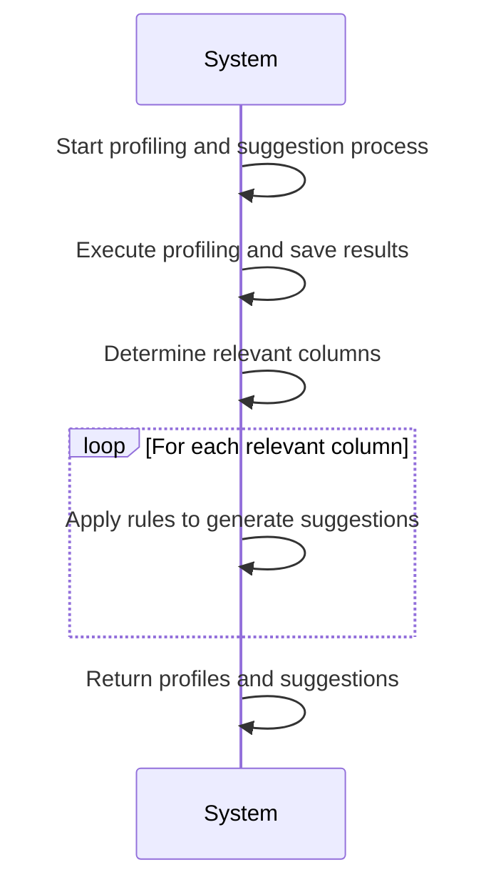
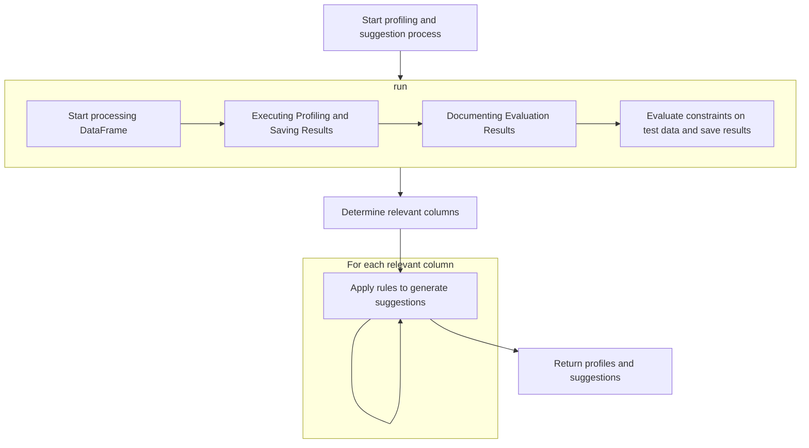
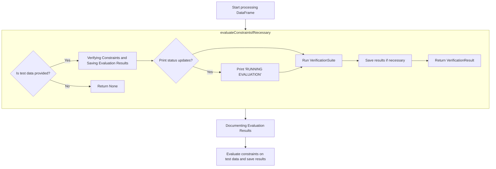
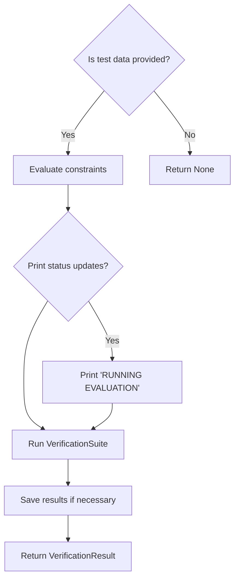
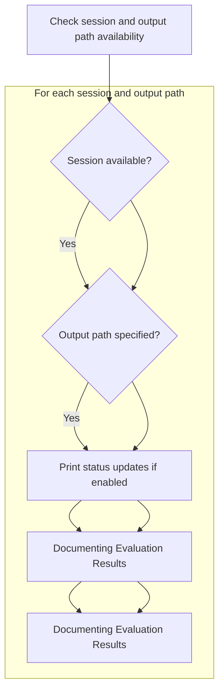

The flow of profiling and suggesting constraints is designed to enhance data quality by analyzing column profiles and generating actionable suggestions. This process involves examining data columns to identify relevant characteristics and applying rules to propose constraints that ensure data integrity. The main steps are:

- Start the profiling and suggestion process.
- Execute profiling and save results.
- Determine relevant columns for analysis.
- Apply rules to generate constraint suggestions.
- Return profiles and suggestions for further use.

For instance, if a dataset contains a column with categorical data, the process might suggest constraints like ensuring all values belong to a predefined set.



# Initiating Column Profiling and Constraint Suggestion



<SwmSnippet path="/src/main/scala/com/amazon/deequ/suggestions/ConstraintSuggestionRunner.scala" line="171" repo-id="Z2l0aHViJTNBJTNBZGVlcXUlM0ElM0Fhd3NsYWJz">

---

First, we set up the column profiler runner. Calling run next is necessary to execute profiling and suggestion logic, which generates column profiles and constraint suggestions.

```scala
  private[suggestions] def profileAndSuggest(
      trainingData: DataFrame,
      constraintRules: Seq[ConstraintRule[ColumnProfile]],
      restrictToColumns: Option[Seq[String]],
      lowCardinalityHistogramThreshold: Int,
      printStatusUpdates: Boolean,
      metricsRepositoryOptions: ConstraintSuggestionMetricsRepositoryOptions,
      kllParameters: Option[KLLParameters],
      predefinedTypes: Map[String, DataTypeInstances.Value])
    : (ColumnProfiles, Seq[ConstraintSuggestion]) = {

    var columnProfilerRunner = ColumnProfilerRunner()
      .onData(trainingData)
      .printStatusUpdates(printStatusUpdates)
      .withLowCardinalityHistogramThreshold(lowCardinalityHistogramThreshold)

    restrictToColumns.foreach { restrictToColumns =>
      columnProfilerRunner = columnProfilerRunner.restrictToColumns(restrictToColumns)
    }

    columnProfilerRunner = columnProfilerRunner.setKLLParameters(kllParameters)

    columnProfilerRunner =
      columnProfilerRunner.setPredefinedTypes(predefinedTypes)

    metricsRepositoryOptions.metricsRepository.foreach { metricsRepository =>
      var columnProfilerRunnerWithRepository = columnProfilerRunner.useRepository(metricsRepository)

      metricsRepositoryOptions.reuseExistingResultsKey.foreach { reuseExistingResultsKey =>
        columnProfilerRunnerWithRepository = columnProfilerRunnerWithRepository
          .reuseExistingResultsForKey(reuseExistingResultsKey,
            metricsRepositoryOptions.failIfResultsForReusingMissing)
      }

      metricsRepositoryOptions.saveOrAppendResultsKey.foreach { saveOrAppendResultsKey =>
        columnProfilerRunnerWithRepository = columnProfilerRunnerWithRepository
          .saveOrAppendResult(saveOrAppendResultsKey)
      }

      columnProfilerRunner = columnProfilerRunnerWithRepository
    }

    val profiles = columnProfilerRunner.run()

```

---

</SwmSnippet>

## Executing Profiling and Saving Results



<SwmSnippet path="/src/main/scala/com/amazon/deequ/suggestions/ConstraintSuggestionRunner.scala" line="73" repo-id="Z2l0aHViJTNBJTNBZGVlcXUlM0ElM0Fhd3NsYWJz">

---

Next, we generate profiles and suggestions. Calling saveColumnProfilesJsonToFileSystemIfNecessary is necessary to save column profiles to the filesystem, ensuring their persistence for further analysis.

```scala
  private[suggestions] def run(
      data: DataFrame,
      constraintRules: Seq[ConstraintRule[ColumnProfile]],
      restrictToColumns: Option[Seq[String]],
      lowCardinalityHistogramThreshold: Int,
      printStatusUpdates: Boolean,
      testsetWrapper: (Option[Double], Option[Long]),
      cacheInputs: Boolean,
      fileOutputOptions: ConstraintSuggestionFileOutputOptions,
      metricsRepositoryOptions: ConstraintSuggestionMetricsRepositoryOptions,
      kllWrapper: (Option[KLLParameters], Map[String, DataTypeInstances.Value]))
    : ConstraintSuggestionResult = {

    // get testset related data from wrapper
    val testsetRatio: Option[Double] = testsetWrapper._1
    val testsetSplitRandomSeed: Option[Long] = testsetWrapper._2

    val kllParameters: Option[KLLParameters] = kllWrapper._1
    val predefinedTypes: Map[String, DataTypeInstances.Value] = kllWrapper._2

    testsetRatio.foreach { testsetRatio =>
      require(testsetRatio > 0 && testsetRatio < 1.0, "Testset ratio must be in ]0, 1[")
    }

    val (trainingData, testData) = splitTrainTestSets(data, testsetRatio, testsetSplitRandomSeed)

    if (cacheInputs) {
      trainingData.cache()
      testData.foreach { _.cache() }
    }

    val (columnProfiles, constraintSuggestions) = ConstraintSuggestionRunner().profileAndSuggest(
      trainingData,
      constraintRules,
      restrictToColumns,
      lowCardinalityHistogramThreshold,
      printStatusUpdates,
      metricsRepositoryOptions,
      kllParameters,
      predefinedTypes
    )

    saveColumnProfilesJsonToFileSystemIfNecessary(
      fileOutputOptions,
      printStatusUpdates,
      columnProfiles
    )

```

---

</SwmSnippet>

<SwmSnippet path="/src/main/scala/com/amazon/deequ/suggestions/ConstraintSuggestionRunner.scala" line="249" repo-id="Z2l0aHViJTNBJTNBZGVlcXUlM0ElM0Fhd3NsYWJz">

---

Here, we write column profiles to the filesystem using DfsUtils, which is necessary for storing results for future reference.

```scala
  private[this] def saveColumnProfilesJsonToFileSystemIfNecessary(
      fileOutputOptions: ConstraintSuggestionFileOutputOptions,
      printStatusUpdates: Boolean,
      columnProfiles: ColumnProfiles)
    : Unit = {

    fileOutputOptions.session.foreach { session =>
      fileOutputOptions.saveColumnProfilesJsonToPath.foreach { profilesOutput =>
        if (printStatusUpdates) {
          println(s"### WRITING COLUMN PROFILES TO $profilesOutput")
        }

        DfsUtils.writeToTextFileOnDfs(session, profilesOutput,
          overwrite = fileOutputOptions.overwriteResults) { writer =>
            writer.append(ColumnProfiles.toJson(columnProfiles.profiles.values.toSeq).toString)
            writer.newLine()
          }
        }
    }
  }
```

---

</SwmSnippet>

<SwmSnippet path="/src/main/scala/com/amazon/deequ/suggestions/ConstraintSuggestionRunner.scala" line="121" repo-id="Z2l0aHViJTNBJTNBZGVlcXUlM0ElM0Fhd3NsYWJz">

---

Back from saving column profiles, we save constraint suggestions to the filesystem, which is necessary for preserving the suggestions generated during profiling for further use or analysis.

```scala
    if (cacheInputs) {
      trainingData.unpersist()
    }

    saveConstraintSuggestionJsonToFileSystemIfNecessary(
      fileOutputOptions,
      printStatusUpdates,
      constraintSuggestions
    )

```

---

</SwmSnippet>

<SwmSnippet path="/src/main/scala/com/amazon/deequ/suggestions/ConstraintSuggestionRunner.scala" line="270" repo-id="Z2l0aHViJTNBJTNBZGVlcXUlM0ElM0Fhd3NsYWJz">

---

Here, we write constraint suggestions to the filesystem using DfsUtils, which is necessary for storing suggestions for future reference.

```scala
  private[this] def saveConstraintSuggestionJsonToFileSystemIfNecessary(
      fileOutputOptions: ConstraintSuggestionFileOutputOptions,
      printStatusUpdates: Boolean,
      constraintSuggestions: Seq[ConstraintSuggestion])
    : Unit = {

    fileOutputOptions.session.foreach { session =>
      fileOutputOptions.saveConstraintSuggestionsJsonToPath.foreach { constraintsOutput =>
        if (printStatusUpdates) {
          println(s"### WRITING CONSTRAINTS TO $constraintsOutput")
        }
        DfsUtils.writeToTextFileOnDfs(session, constraintsOutput,
          overwrite = fileOutputOptions.overwriteResults) { writer =>
            writer.append(ConstraintSuggestions.toJson(constraintSuggestions).toString)
            writer.newLine()
          }
      }
    }
  }
```

---

</SwmSnippet>

<SwmSnippet path="/src/main/scala/com/amazon/deequ/suggestions/ConstraintSuggestionRunner.scala" line="131" repo-id="Z2l0aHViJTNBJTNBZGVlcXUlM0ElM0Fhd3NsYWJz">

---

Back from saving constraint suggestions, we evaluate constraints on test data, which is necessary for verifying the effectiveness of the generated suggestions and ensuring they meet expected standards.

```scala
    val verificationResult = evaluateConstraintsIfNecessary(
      testData,
      printStatusUpdates,
      constraintSuggestions,
      fileOutputOptions
    )

```

---

</SwmSnippet>

### Verifying Constraints and Saving Evaluation Results



<SwmSnippet path="/src/main/scala/com/amazon/deequ/suggestions/ConstraintSuggestionRunner.scala" line="312" repo-id="Z2l0aHViJTNBJTNBZGVlcXUlM0ElM0Fhd3NsYWJz">

---

Next, we run constraint evaluation. Calling saveEvaluationResultJsonToFileSystemIfNecessary is necessary to save evaluation results to the filesystem, documenting the performance of the constraints and providing insights into their effectiveness.

```scala
  private[this] def evaluateConstraintsIfNecessary(
     testData: Option[DataFrame],
     printStatusUpdates: Boolean,
     constraintSuggestions: Seq[ConstraintSuggestion],
     fileOutputOptions: ConstraintSuggestionFileOutputOptions)
    : Option[VerificationResult] = {

    if (testData.isDefined) {
      if (printStatusUpdates) {
        println("### RUNNING EVALUATION")
      }
      val constraints = constraintSuggestions.map { constraintSuggestion =>
        constraintSuggestion.constraint }
      val generatedCheck = Check(CheckLevel.Warning, "generated constraints", constraints)

      val verificationResult = VerificationSuite()
        .onData(testData.get)
        .addCheck(generatedCheck)
        .run()

      saveEvaluationResultJsonToFileSystemIfNecessary(
        fileOutputOptions,
        printStatusUpdates,
        constraintSuggestions,
        verificationResult)

      Option(verificationResult)
    } else {
      None
    }
  }
```

---

</SwmSnippet>

### Documenting Evaluation Results



<SwmSnippet path="/src/main/scala/com/amazon/deequ/suggestions/ConstraintSuggestionRunner.scala" line="290" repo-id="Z2l0aHViJTNBJTNBZGVlcXUlM0ElM0Fhd3NsYWJz">

---

Next, we write evaluation results to the filesystem using DfsUtils. Calling evaluationResultsToJson is necessary to convert results to JSON, structuring them in a readable and analyzable format.

```scala
  private[this] def saveEvaluationResultJsonToFileSystemIfNecessary(
      fileOutputOptions: ConstraintSuggestionFileOutputOptions,
      printStatusUpdates: Boolean,
      constraintSuggestions: Seq[ConstraintSuggestion],
      verificationResult: VerificationResult)
    : Unit = {

    fileOutputOptions.session.foreach { session =>
        fileOutputOptions.saveEvaluationResultsJsonToPath.foreach { evaluationsOutput =>
          if (printStatusUpdates) {
            println(s"### WRITING EVALUATION RESULTS TO $evaluationsOutput")
          }
          DfsUtils.writeToTextFileOnDfs(session, evaluationsOutput,
            overwrite = fileOutputOptions.overwriteResults) { writer =>
            writer.append(ConstraintSuggestions
              .evaluationResultsToJson(constraintSuggestions, verificationResult))
            writer.newLine()
          }
        }
      }
  }
```

---

</SwmSnippet>

<SwmSnippet path="/src/main/scala/com/amazon/deequ/suggestions/ConstraintSuggestion.scala" line="80" repo-id="Z2l0aHViJTNBJTNBZGVlcXUlM0ElM0Fhd3NsYWJz">

---

Here, we convert evaluation results to JSON format, mapping constraint results to statuses, which is necessary for readability and analysis.

```scala
  private[suggestions] def evaluationResultsToJson(
      constraintSuggestions: Seq[ConstraintSuggestion],
      result: VerificationResult)
    : String = {

    val constraintResults = result.checkResults
      .map { case (_, checkResult) => checkResult }
      .headOption.map { checkResult =>
        checkResult.constraintResults
      }
      .getOrElse(Seq.empty)

    val json = new JsonObject()

    val constraintEvaluations = new JsonArray()

    val constraintResultsOnTestSet = constraintResults.map { checkResult =>
      checkResult.status.toString
    }

    constraintSuggestions.zipAll(constraintResultsOnTestSet, null, "Unknown")
      .foreach { case (constraintSuggestion, constraintResult) =>

        val constraintEvaluation = new JsonObject()
        addSharedProperties(constraintEvaluation, constraintSuggestion)

        constraintEvaluation.addProperty("constraint_result_on_test_set",
          constraintResult)

        constraintEvaluations.add(constraintEvaluation)
      }

    json.add(CONSTRAINT_SUGGESTIONS_FIELD, constraintEvaluations)

    val gson = new GsonBuilder()
      .setPrettyPrinting()
      .create()

    gson.toJson(json)
  }
```

---

</SwmSnippet>

### Finalizing Constraint Suggestions

<SwmSnippet path="/src/main/scala/com/amazon/deequ/suggestions/ConstraintSuggestionRunner.scala" line="138" repo-id="Z2l0aHViJTNBJTNBZGVlcXUlM0ElM0Fhd3NsYWJz">

---

Back from evaluating constraints, we group suggestions by column names and create ConstraintSuggestionResult, which is necessary for providing a comprehensive overview of the profiling and suggestion process.

```scala
    val columnsWithSuggestions = constraintSuggestions
      .map(suggestion => suggestion.columnName -> suggestion)
      .groupBy { case (columnName, _) => columnName }
      .mapValues { groupedSuggestionsWithColumnNames =>
        groupedSuggestionsWithColumnNames.map { case (_, suggestion) => suggestion } }

    ConstraintSuggestionResult(columnProfiles.profiles, columnProfiles.numRecords,
      columnsWithSuggestions, verificationResult)
  }
```

---

</SwmSnippet>

## Applying Rules to Profiled Columns

<SwmSnippet path="/src/main/scala/com/amazon/deequ/suggestions/ConstraintSuggestionRunner.scala" line="238" repo-id="Z2l0aHViJTNBJTNBZGVlcXUlM0ElM0Fhd3NsYWJz">

---

Here, we filter columns based on schema, ensuring relevance for rule application by mapping to escaped names.

```scala
  private[this] def getRelevantColumns(
      schema: StructType,
      restrictToColumns: Option[Seq[String]])
    : Seq[String] = {

    schema.fields
      .filter { field => restrictToColumns.isEmpty || restrictToColumns.get.contains(field.name) }
      .map { field => {escapeColumn(field.name) }
      }
  }
```

---

</SwmSnippet>

## Generating Constraint Suggestions

<SwmSnippet path="/src/main/scala/com/amazon/deequ/suggestions/ConstraintSuggestionRunner.scala" line="216" repo-id="Z2l0aHViJTNBJTNBZGVlcXUlM0ElM0Fhd3NsYWJz">

---

Back from filtering relevant columns, we generate constraint suggestions, which is necessary for deriving actionable insights from the profiled data and ensuring constraints are suggested for columns that meet the criteria.

```scala
    val suggestions = applyRules(constraintRules, profiles, relevantColumns)

    (profiles, suggestions)
  }
```

---

</SwmSnippet>

<SwmSnippet path="/src/main/scala/com/amazon/deequ/suggestions/ConstraintSuggestionRunner.scala" line="221" repo-id="Z2l0aHViJTNBJTNBZGVlcXUlM0ElM0Fhd3NsYWJz">

---

Here, we iterate over relevant columns and apply constraint rules, filtering for applicability, which is necessary to generate suitable suggestions.

```scala
  private[this] def applyRules(
      constraintRules: Seq[ConstraintRule[ColumnProfile]],
      profiles: ColumnProfiles,
      columns: Seq[String])
    : Seq[ConstraintSuggestion] = {

    columns
      .flatMap { column =>

        val profile = profiles.profiles(column)

        constraintRules
          .filter { _.shouldBeApplied(profile, profiles.numRecords) }
          .map { _.candidate(profile, profiles.numRecords) }
      }
  }
```

---

</SwmSnippet>

&nbsp;

*This is an auto-generated document by Swimm 🌊 and has not yet been verified by a human*

<SwmMeta version="3.0.0"><sup>Powered by [Swimm](https://staging.swimm.cloud/)</sup></SwmMeta>
