This document describes the process of running analyzers for a specific data grouping. This flow is used to measure data quality by executing various analyzers on grouped data, ensuring efficient and accurate computation of metrics.

For instance, if we have a dataset grouped by a specific column, this flow will execute the relevant analyzers on each group, cache the data if necessary, and return the computed metrics.


# Where is this flow used?

This flow is used multiple times in the codebase as represented in the following diagram:

(Note - these are only some of the entry points of this flow)


Here is a high level diagram of the flow, showing only the most important functions:

```mermaid
graph TD;
      subgraph srcmainscalacomamazondeequanalyzers[src/…/deequ/analyzers]
3b4b73b181b3a3f8c0d7c66219ae6e63fe8b1a3e2b3299553f8604a6954cee33(runAnalyzersForParticularGrouping) --> 1f1c2b4c219a66cd628cf381ec2a237245ea826fdd17ff8fc151d6988e94062b(successOrFailureMetricFrom)
end

subgraph srcmainscalacomamazondeequanalyzers[src/…/deequ/analyzers]
1f1c2b4c219a66cd628cf381ec2a237245ea826fdd17ff8fc151d6988e94062b(successOrFailureMetricFrom) --> 45121cda4cf293170f79ab9e47e537de5b62406e05a3f9ba84769129370e5d3d(metricFromAggregationResult)
end


      classDef mainFlowStyle color:#000000,fill:#7CB9F4
classDef rootsStyle color:#000000,fill:#00FFF4
classDef Style1 color:#000000,fill:#00FFAA
classDef Style2 color:#000000,fill:#FFFF00
classDef Style3 color:#000000,fill:#AA7CB9

%% Swimm:
%% graph TD;
%%       subgraph srcmainscalacomamazondeequanalyzers[<SwmPath>[src/…/deequ/analyzers/](src/main/scala/com/amazon/deequ/analyzers/)</SwmPath>]
%% 3b4b73b181b3a3f8c0d7c66219ae6e63fe8b1a3e2b3299553f8604a6954cee33(<SwmToken path="src/main/scala/com/amazon/deequ/analyzers/runners/AnalysisRunner.scala" pos="298:7:7" line-data="    val results = runAnalyzersForParticularGrouping(frequenciesAndNumRows, analyzers, saveStatesTo,">`runAnalyzersForParticularGrouping`</SwmToken>) --> 1f1c2b4c219a66cd628cf381ec2a237245ea826fdd17ff8fc151d6988e94062b(<SwmToken path="src/main/scala/com/amazon/deequ/analyzers/runners/AnalysisRunner.scala" pos="330:1:1" line-data="            successOrFailureMetricFrom(analyzer, results, offset, aggregateWith, saveStatesTo)">`successOrFailureMetricFrom`</SwmToken>)
%% end
%% 
%% subgraph srcmainscalacomamazondeequanalyzers[<SwmPath>[src/…/deequ/analyzers/](src/main/scala/com/amazon/deequ/analyzers/)</SwmPath>]
%% 1f1c2b4c219a66cd628cf381ec2a237245ea826fdd17ff8fc151d6988e94062b(<SwmToken path="src/main/scala/com/amazon/deequ/analyzers/runners/AnalysisRunner.scala" pos="330:1:1" line-data="            successOrFailureMetricFrom(analyzer, results, offset, aggregateWith, saveStatesTo)">`successOrFailureMetricFrom`</SwmToken>) --> 45121cda4cf293170f79ab9e47e537de5b62406e05a3f9ba84769129370e5d3d(<SwmToken path="src/main/scala/com/amazon/deequ/analyzers/runners/AnalysisRunner.scala" pos="360:3:3" line-data="      analyzer.metricFromAggregationResult(aggregationResult, offset, aggregateWith, saveStatesTo)">`metricFromAggregationResult`</SwmToken>)
%% end
%% 
%% 
%%       classDef mainFlowStyle color:#000000,fill:#7CB9F4
%% classDef rootsStyle color:#000000,fill:#00FFF4
%% classDef Style1 color:#000000,fill:#00FFAA
%% classDef Style2 color:#000000,fill:#FFFF00
%% classDef Style3 color:#000000,fill:#AA7CB9
```



# <SwmToken path="src/main/scala/com/amazon/deequ/analyzers/runners/AnalysisRunner.scala" pos="298:7:7" line-data="    val results = runAnalyzersForParticularGrouping(frequenciesAndNumRows, analyzers, saveStatesTo,">`runAnalyzersForParticularGrouping`</SwmToken>


## Identifying Shareable Analyzers

First, the function identifies all shareable analyzers by partitioning the provided analyzers into shareable and <SwmToken path="src/main/scala/com/amazon/deequ/analyzers/runners/AnalysisRunner.scala" pos="341:5:7" line-data="    /* Run non-shareable analyzers separately */">`non-shareable`</SwmToken> categories. Shareable analyzers are those that can benefit from <SwmToken path="src/main/scala/com/amazon/deequ/analyzers/runners/AnalysisRunner.scala" pos="491:5:7" line-data="    * applying scan-sharing where possible */">`scan-sharing`</SwmToken>, which means they can be executed more efficiently by sharing the same data scan.

## Caching Grouped Data

Next, if there are any <SwmToken path="src/main/scala/com/amazon/deequ/analyzers/runners/AnalysisRunner.scala" pos="341:5:7" line-data="    /* Run non-shareable analyzers separately */">`non-shareable`</SwmToken> analyzers, the grouped data is cached to optimize performance for multiple passes. This is controlled via the storage level parameter, ensuring that the data is readily available for subsequent operations.

## Executing Shareable Analyzers

Moving to the execution of shareable analyzers, the function aggregates the necessary data and computes offsets to correctly map the results back to the analyzers. This step ensures that each analyzer can accurately pick its results from the aggregated data.

<SwmSnippet path="/src/main/scala/com/amazon/deequ/analyzers/runners/AnalysisRunner.scala" line="532">

---

Then, the function handles any exceptions that occur during the execution of shareable analyzers by mapping the computation results to either success or failure metrics. This ensures that any errors are captured and reported appropriately.

```scala
      } catch {
        case error: Exception =>
          shareableAnalyzers
            .map { analyzer => analyzer -> analyzer.toFailureMetric(error) }
      }
```

---

</SwmSnippet>

## Executing Non-Shareable Analyzers

Next, the function executes the remaining <SwmToken path="src/main/scala/com/amazon/deequ/analyzers/runners/AnalysisRunner.scala" pos="341:5:7" line-data="    /* Run non-shareable analyzers separately */">`non-shareable`</SwmToken> analyzers on the grouped data. Each analyzer computes its metric from the provided data, ensuring that all analyzers, regardless of their shareability, are executed.

## Storing States

Finally, the function optionally stores the states of the analyzers if a state persister is provided. This allows for the persistence of intermediate states, which can be useful for future computations or debugging purposes.

## Unpersisting Data

The function then unpersists the grouped data to free up memory resources, ensuring that the system remains efficient and does not hold onto unnecessary data.

## Returning Results

The function concludes by returning an <SwmToken path="src/main/scala/com/amazon/deequ/analyzers/runners/AnalysisRunner.scala" pos="69:6:6" line-data="    * @return AnalyzerContext holding the requested metrics per analyzer">`AnalyzerContext`</SwmToken> that contains the combined results of both shareable and <SwmToken path="src/main/scala/com/amazon/deequ/analyzers/runners/AnalysisRunner.scala" pos="341:5:7" line-data="    /* Run non-shareable analyzers separately */">`non-shareable`</SwmToken> analyzers. This context provides a comprehensive view of the data quality metrics computed for the specific data grouping.

# Handling the computation of metrics


First, the function <SwmToken path="src/main/scala/com/amazon/deequ/analyzers/runners/AnalysisRunner.scala" pos="330:1:1" line-data="            successOrFailureMetricFrom(analyzer, results, offset, aggregateWith, saveStatesTo)">`successOrFailureMetricFrom`</SwmToken> is responsible for computing a metric from an aggregation result. It takes several parameters including an analyzer, the aggregation result, an offset, and optional state loaders and persisters. The primary role of this function is to attempt to compute the metric using the provided analyzer and aggregation result.

<SwmSnippet path="/src/main/scala/com/amazon/deequ/analyzers/runners/AnalysisRunner.scala" line="359">

---

Next, within <SwmToken path="src/main/scala/com/amazon/deequ/analyzers/runners/AnalysisRunner.scala" pos="330:1:1" line-data="            successOrFailureMetricFrom(analyzer, results, offset, aggregateWith, saveStatesTo)">`successOrFailureMetricFrom`</SwmToken>, the function <SwmToken path="src/main/scala/com/amazon/deequ/analyzers/runners/AnalysisRunner.scala" pos="360:3:3" line-data="      analyzer.metricFromAggregationResult(aggregationResult, offset, aggregateWith, saveStatesTo)">`metricFromAggregationResult`</SwmToken> is called to produce the metric. This function processes the aggregation result, considering optional state loading and persisting. If an exception occurs during this process, <SwmToken path="src/main/scala/com/amazon/deequ/analyzers/runners/AnalysisRunner.scala" pos="330:1:1" line-data="            successOrFailureMetricFrom(analyzer, results, offset, aggregateWith, saveStatesTo)">`successOrFailureMetricFrom`</SwmToken> catches the exception and converts it into a failure metric using the analyzer's <SwmToken path="src/main/scala/com/amazon/deequ/analyzers/runners/AnalysisRunner.scala" pos="362:12:12" line-data="      case error: Exception =&gt; analyzer.toFailureMetric(error)">`toFailureMetric`</SwmToken> method.

```scala
    try {
      analyzer.metricFromAggregationResult(aggregationResult, offset, aggregateWith, saveStatesTo)
    } catch {
      case error: Exception => analyzer.toFailureMetric(error)
    }
```

---

</SwmSnippet>

<SwmSnippet path="/src/main/scala/com/amazon/deequ/analyzers/Analyzer.scala" line="208">

---

Diving into <SwmToken path="src/main/scala/com/amazon/deequ/analyzers/runners/AnalysisRunner.scala" pos="360:3:3" line-data="      analyzer.metricFromAggregationResult(aggregationResult, offset, aggregateWith, saveStatesTo)">`metricFromAggregationResult`</SwmToken>, this function first derives the state from the aggregation result and offset. It then calculates the metric based on this state, optionally using provided state loaders and persisters. This ensures that the metric computation is flexible and can incorporate additional state information if available.

```scala
    val state = fromAggregationResult(result, offset)

    calculateMetric(state, aggregateWith, saveStatesWith)
```

---

</SwmSnippet>

&nbsp;

*This is an auto-generated document by Swimm 🌊 and has not yet been verified by a human*

<SwmMeta version="3.0.0" repo-id="Z2l0aHViJTNBJTNBZGVlcXUlM0ElM0Fhd3NsYWJz" repo-name="deequ"><sup>Powered by [Swimm](/)</sup></SwmMeta>
