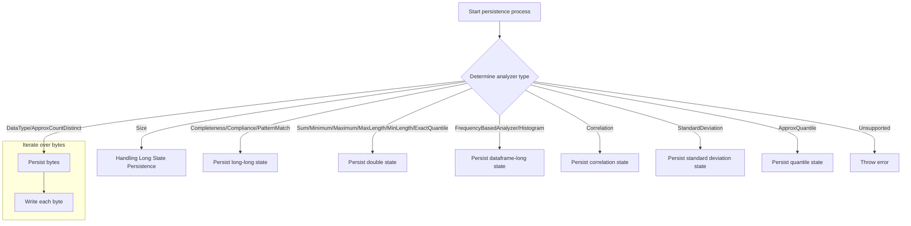
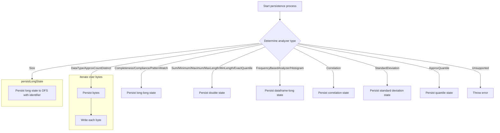
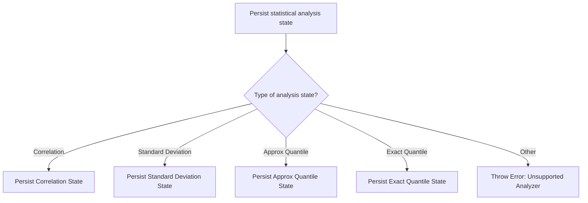

The persistence flow is responsible for saving the state of various data quality analyzers to a distributed file system. This ensures that the results of data quality checks can be stored and retrieved for future analysis. The flow involves determining the type of analyzer and then persisting the state accordingly. The main steps include: determining the analyzer type, handling long state persistence, persisting double state, and managing byte-level state persistence.

For instance, when dealing with a 'Size' analyzer, the flow will persist a single long value, ensuring it is serialized and saved for future use.



# Initiating State Persistence



<SwmSnippet path="/src/main/scala/com/amazon/deequ/analyzers/StateProvider.scala" line="86" repo-id="Z2l0aHViJTNBJTNBZGVlcXUlM0ElM0Fhd3NsYWJz">

---

We start the flow by using pattern matching to decide which persistence function to call. For the Size analyzer, we call persistLongState because it deals with a single long value that needs to be serialized and saved for future use.

```scala
  override def persist[S <: State[_]](analyzer: Analyzer[S, _], state: S): Unit = {

    val identifier = toIdentifier(analyzer)

    analyzer match {
      case _: Size =>
        persistLongState(state.asInstanceOf[NumMatches].numMatches, identifier)

      case _ : Completeness | _ : Compliance | _ : PatternMatch =>
```

---

</SwmSnippet>

## Handling Long State Persistence

<SwmSnippet path="/src/main/scala/com/amazon/deequ/analyzers/StateProvider.scala" line="192" repo-id="Z2l0aHViJTNBJTNBZGVlcXUlM0ElM0Fhd3NsYWJz">

---

Here, we handle the persistence of a long state value by writing it to a distributed file system. We call writeToFileOnDfs to abstract the file system interaction, ensuring the state is stored durably and can be retrieved for future use.

```scala
  private[this] def persistLongState(state: Long, identifier: String) {
    writeToFileOnDfs(session, s"$locationPrefix-$identifier.bin", allowOverwrite) {
      _.writeLong(state)
    }
  }
```

---

</SwmSnippet>

<SwmSnippet path="/src/main/scala/com/amazon/deequ/io/DfsUtils.scala" line="43" repo-id="Z2l0aHViJTNBJTNBZGVlcXUlM0ElM0Fhd3NsYWJz">

---

Next, we write data to the distributed file system by creating the file with the correct settings and using the provided write function. The function also handles closing the file stream to prevent resource leaks.

```scala
  def writeToFileOnDfs(session: SparkSession, path: String, overwrite: Boolean = false)
    (writeFunc: FSDataOutputStream => Unit): Unit = {

    val (fs, qualifiedPath) = asQualifiedPath(session, path)
    val output = fs.create(qualifiedPath, overwrite)

    try {
      writeFunc(output)
    } finally {
      if (output != null) {
        output.close()
      }
    }
  }
```

---

</SwmSnippet>

## Continuing State Persistence Logic

<SwmSnippet path="/src/main/scala/com/amazon/deequ/analyzers/StateProvider.scala" line="95" repo-id="Z2l0aHViJTNBJTNBZGVlcXUlM0ElM0Fhd3NsYWJz">

---

Back in persist, we handle analyzers with two long values by calling persistLongLongState. This ensures both values are stored in a structured manner, maintaining the integrity of the analysis results.

```scala
        persistLongLongState(state.asInstanceOf[NumMatchesAndCount], identifier)

      case _: Sum =>
```

---

</SwmSnippet>

<SwmSnippet path="/src/main/scala/com/amazon/deequ/analyzers/StateProvider.scala" line="204" repo-id="Z2l0aHViJTNBJTNBZGVlcXUlM0ElM0Fhd3NsYWJz">

---

Here, we handle the persistence of two long values by writing them to a distributed file system. We call writeToFileOnDfs to ensure both values are written reliably, preserving the complete state for future use.

```scala
  private[this] def persistLongLongState(state: NumMatchesAndCount, identifier: String) {
    writeToFileOnDfs(session, s"$locationPrefix-$identifier.bin", allowOverwrite) { out =>
      out.writeLong(state.numMatches)
      out.writeLong(state.count)
    }
  }
```

---

</SwmSnippet>

## Advancing State Persistence Strategy

<SwmSnippet path="/src/main/scala/com/amazon/deequ/analyzers/StateProvider.scala" line="98" repo-id="Z2l0aHViJTNBJTNBZGVlcXUlM0ElM0Fhd3NsYWJz">

---

Back in persist, we handle analyzers with a DataFrame and a long value by calling persistDataframeLongState. This ensures both the DataFrame and the long value are stored in a structured manner, maintaining the integrity of the analysis results.

```scala
        persistDoubleState(state.asInstanceOf[SumState].sum, identifier)

      case _: Mean =>
        persistDoubleLongState(state.asInstanceOf[MeanState], identifier)

      case _: Minimum =>
        persistDoubleState(state.asInstanceOf[MinState].minValue, identifier)

      case _: Maximum =>
        persistDoubleState(state.asInstanceOf[MaxState].maxValue, identifier)

      case _: MaxLength =>
        persistDoubleState(state.asInstanceOf[MaxState].maxValue, identifier)

      case _: MinLength =>
        persistDoubleState(state.asInstanceOf[MinState].minValue, identifier)

      case _ : FrequencyBasedAnalyzer | _ : Histogram =>
        persistDataframeLongState(state.asInstanceOf[FrequenciesAndNumRows], identifier)

      case _: DataType =>
```

---

</SwmSnippet>

<SwmSnippet path="/src/main/scala/com/amazon/deequ/analyzers/StateProvider.scala" line="227" repo-id="Z2l0aHViJTNBJTNBZGVlcXUlM0ElM0Fhd3NsYWJz">

---

Here, we handle the persistence of a DataFrame and a long value by writing the DataFrame to a Parquet file and the long value to a separate file. We call writeToFileOnDfs to ensure the long value is written reliably, preserving the complete state for future use.

```scala
  private[this] def persistDataframeLongState(
      state: FrequenciesAndNumRows,
      identifier: String)
    : Unit = {

    val saveMode = if (allowOverwrite) {
      SaveMode.Overwrite
    } else {
      SaveMode.ErrorIfExists
    }

    state.frequencies
      .coalesce(numPartitionsForHistogram)
      .write.mode(saveMode).parquet(s"$locationPrefix-$identifier-frequencies.pqt")

    writeToFileOnDfs(session, s"$locationPrefix-$identifier-num_rows.bin", allowOverwrite) {
      _.writeLong(state.numRows)
    }
  }
```

---

</SwmSnippet>

## Refining State Persistence Approach

<SwmSnippet path="/src/main/scala/com/amazon/deequ/analyzers/StateProvider.scala" line="119" repo-id="Z2l0aHViJTNBJTNBZGVlcXUlM0ElM0Fhd3NsYWJz">

---

Back in persist, we handle analyzers with byte-level state by calling persistBytes. This ensures the serialized byte array is stored in a structured manner, maintaining the integrity of the analysis results.

```scala
        val histogram = state.asInstanceOf[DataTypeHistogram]
        persistBytes(DataTypeHistogram.toBytes(histogram.numNull, histogram.numFractional,
          histogram.numIntegral, histogram.numBoolean, histogram.numString), identifier)

      case _: ApproxCountDistinct =>
```

---

</SwmSnippet>

<SwmSnippet path="/src/main/scala/com/amazon/deequ/analyzers/StateProvider.scala" line="218" repo-id="Z2l0aHViJTNBJTNBZGVlcXUlM0ElM0Fhd3NsYWJz">

---

Here, we handle the persistence of byte arrays by writing them to a distributed file system. We call writeToFileOnDfs to abstract the file system interaction, ensuring the byte array is stored durably and can be retrieved for future use.

```scala
  private[this] def persistBytes(bytes: Array[Byte], identifier: String) {
    writeToFileOnDfs(session, s"$locationPrefix-$identifier.bin", allowOverwrite) { out =>
      out.writeInt(bytes.length)
      for (index <- bytes.indices) {
        out.writeByte(bytes(index))
      }
```

---

</SwmSnippet>

## Finalizing State Persistence

<SwmSnippet path="/src/main/scala/com/amazon/deequ/analyzers/StateProvider.scala" line="124" repo-id="Z2l0aHViJTNBJTNBZGVlcXUlM0ElM0Fhd3NsYWJz">

---

Back in persist, we handle additional byte-level state by calling persistBytes again. This ensures the serialized byte array is stored in a structured manner, maintaining the integrity of the analysis results.

```scala
        val counters = state.asInstanceOf[ApproxCountDistinctState]
        persistBytes(DeequHyperLogLogPlusPlusUtils.wordsToBytes(counters.words), identifier)

      case _ : Correlation =>
```

---

</SwmSnippet>

## Completing State Persistence



<SwmSnippet path="/src/main/scala/com/amazon/deequ/analyzers/StateProvider.scala" line="128" repo-id="Z2l0aHViJTNBJTNBZGVlcXUlM0ElM0Fhd3NsYWJz">

---

Back in persist, we handle the final byte-level state by calling persistBytes. This ensures the serialized byte array is stored in a structured manner, maintaining the integrity of the analysis results.

```scala
        persistCorrelationState(state.asInstanceOf[CorrelationState], identifier)

      case _ : StandardDeviation =>
        persistStandardDeviationState(state.asInstanceOf[StandardDeviationState], identifier)

      case _: ApproxQuantile =>
        val percentileDigest = state.asInstanceOf[ApproxQuantileState].percentileDigest
        val serializedDigest = ApproximatePercentile.serializer.serialize(percentileDigest)
        persistBytes(serializedDigest, identifier)

      case _: ExactQuantile =>
        persistDoubleState(state.asInstanceOf[ExactQuantileState].exactQuantile, identifier)

      case _ =>
        throw new IllegalArgumentException(s"Unable to persist state for analyzer $analyzer.")
    }
  }
```

---

</SwmSnippet>

&nbsp;

*This is an auto-generated document by Swimm 🌊 and has not yet been verified by a human*

<SwmMeta version="3.0.0"><sup>Powered by [Swimm](https://staging.swimm.cloud/)</sup></SwmMeta>
